# Admin and Tenant Management

Tenant administration diagrams for Microsoft 365 admins. This file contains 20 topics covering tenant operations, service health, admin roles, governance, migration and platform management.

## Contents

- [Admin Activity Audit](#admin-activity-audit)
- [Admin Center Navigation Map](#admin-center-navigation-map)
- [Admin Role Hierarchy](#admin-role-hierarchy)
- [Adoption Score Metrics](#adoption-score-metrics)
- [Domain Management and Verification](#domain-management-and-verification)
- [Message Center Management](#message-center-management)
- [Microsoft 365 Backup and Recovery Strategy](#microsoft-365-backup-and-recovery-strategy)
- [Microsoft 365 Roadmap Integration](#microsoft-365-roadmap-integration)
- [Microsoft 365 Service Dependency Map](#microsoft-365-service-dependency-map)
- [Microsoft 365 Tenant Architecture](#microsoft-365-tenant-architecture)
- [Microsoft Graph API Integration](#microsoft-graph-api-integration)
- [Migration Project Timeline](#migration-project-timeline)
- [Multi-Tenant Architecture](#multi-tenant-architecture)
- [PowerShell Administration](#powershell-administration)
- [Service Health Monitoring](#service-health-monitoring)
- [Support Request Workflow](#support-request-workflow)
- [Tenant Configuration Backup](#tenant-configuration-backup)
- [Tenant Security Baseline](#tenant-security-baseline)
- [Tenant-to-Tenant Migration](#tenant-to-tenant-migration)
- [User Lifecycle Management](#user-lifecycle-management)

---

## Admin Activity Audit

Shows the main components, decisions, and operational flow for admin activity audit in Microsoft 365 admin and tenant management work.

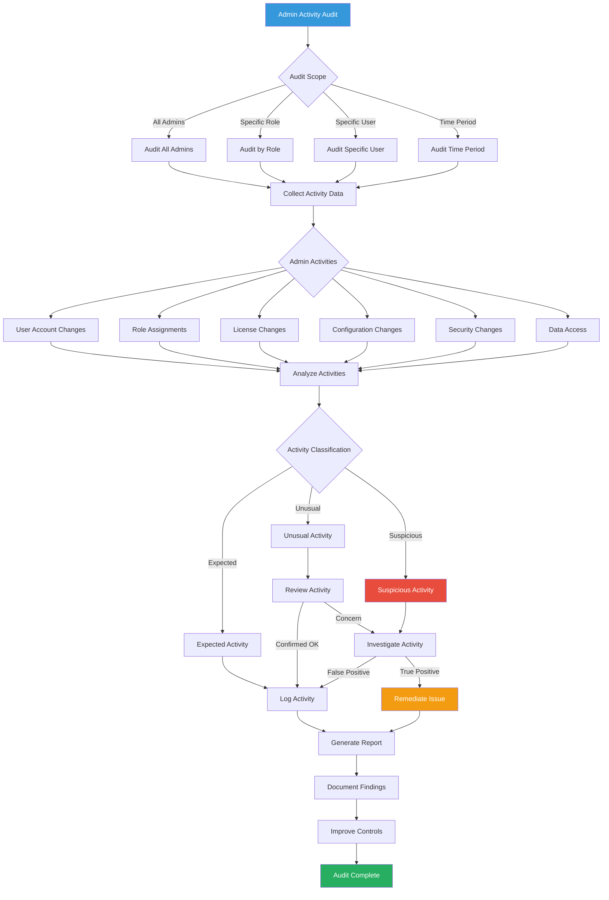
```mermaid
flowchart TB
    Start[Admin Activity Audit] --> Scope{Audit Scope}

    Scope -->|All Admins| AllAdmins[Audit All Admins]
    Scope -->|Specific Role| SpecificRole[Audit by Role]
    Scope -->|Specific User| SpecificUser[Audit Specific User]
    Scope -->|Time Period| TimePeriod[Audit Time Period]

    AllAdmins --> CollectData[Collect Activity Data]
    SpecificRole --> CollectData
    SpecificUser --> CollectData
    TimePeriod --> CollectData

    CollectData --> Activities{Admin Activities}

    Activities --> UserChanges[User Account Changes]
    Activities --> RoleChanges[Role Assignments]
    Activities --> LicenseChanges[License Changes]
    Activities --> ConfigChanges[Configuration Changes]
    Activities --> SecurityChanges[Security Changes]
    Activities --> DataAccess[Data Access]

    UserChanges --> Analyze[Analyze Activities]
    RoleChanges --> Analyze
    LicenseChanges --> Analyze
    ConfigChanges --> Analyze
    SecurityChanges --> Analyze
    DataAccess --> Analyze

    Analyze --> Normal{Activity Classification}

    Normal -->|Expected| Expected[Expected Activity]
    Normal -->|Unusual| Unusual[Unusual Activity]
    Normal -->|Suspicious| Suspicious[Suspicious Activity]

    Expected --> Log[Log Activity]
    Unusual --> Review[Review Activity]
    Suspicious --> Investigate[Investigate Activity]

    Review -->|Confirmed OK| Log
    Review -->|Concern| Investigate

    Investigate -->|False Positive| Log
    Investigate -->|True Positive| Remediate[Remediate Issue]

    Remediate --> Report[Generate Report]
    Log --> Report

    Report --> Document[Document Findings]
    Document --> Improve[Improve Controls]
    Improve --> Complete[Audit Complete]

    style Start fill:#3498db,color:#fff
    style Suspicious fill:#e74c3c,color:#fff
    style Remediate fill:#f39c12,color:#fff
    style Complete fill:#27ae60,color:#fff
```

---

## Admin Center Navigation Map

Shows the main components, decisions, and operational flow for admin center navigation map in Microsoft 365 admin and tenant management work.

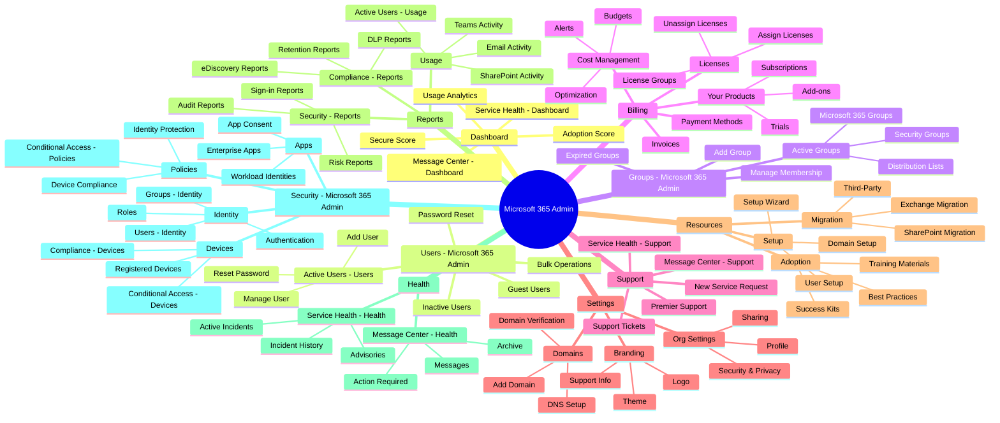
```mermaid
mindmap
  root((Microsoft 365 Admin))
    Dashboard
      Service Health - Dashboard
      Message Center - Dashboard
      Secure Score
      Adoption Score
      Usage Analytics
    Users - Microsoft 365 Admin
      Active Users - Users
        Add User
        Manage User
        Reset Password
      Inactive Users
      Guest Users
      Bulk Operations
      Password Reset
    Groups - Microsoft 365 Admin
      Active Groups
        Security Groups
        Microsoft 365 Groups
        Distribution Lists
      Expired Groups
      Add Group
      Manage Membership
    Billing
      Your Products
        Subscriptions
        Trials
        Add-ons
      Invoices
      Payment Methods
      Licenses
        Assign Licenses
        Unassign Licenses
        License Groups
      Cost Management
        Budgets
        Alerts
        Optimization
    Support
      New Service Request
      Service Health - Support
      Message Center - Support
      Support Tickets
      Premier Support
    Settings
      Org Settings
        Profile
        Sharing
        Security & Privacy
      Domains
        Add Domain
        DNS Setup
        Domain Verification
      Branding
        Logo
        Theme
        Support Info
    Resources
      Setup
        Setup Wizard
        Domain Setup
        User Setup
      Migration
        Exchange Migration
        SharePoint Migration
        Third-Party
      Adoption
        Training Materials
        Best Practices
        Success Kits
    Reports
      Usage
        Active Users - Usage
        Email Activity
        Teams Activity
        SharePoint Activity
      Security - Reports
        Sign-in Reports
        Risk Reports
        Audit Reports
      Compliance - Reports
        DLP Reports
        Retention Reports
        eDiscovery Reports
    Health
      Service Health - Health
        Active Incidents
        Incident History
        Advisories
      Message Center - Health
        Messages
        Action Required
        Archive
    Security - Microsoft 365 Admin
      Identity
        Users - Identity
        Groups - Identity
        Roles
        Authentication
      Devices
        Registered Devices
        Compliance - Devices
        Conditional Access - Devices
      Apps
        Enterprise Apps
        App Consent
        Workload Identities
      Policies
        Conditional Access - Policies
        Identity Protection
        Device Compliance
```

---

## Admin Role Hierarchy

Shows the main components, decisions, and operational flow for admin role hierarchy in Microsoft 365 admin and tenant management work.

```mermaid
flowchart TB
    subgraph Global["Global Administrator"]
        GA[Global Admin - Full Access]
    end

    subgraph Privileged["Privileged Roles"]
        PA[Privileged Role Admin]
        SA[Security Administrator]
        CA[Compliance Administrator]
        EA[Exchange Administrator]
    end

    subgraph Workload["Workload Administrators"]
        TA[Teams Administrator]
        SA2[SharePoint Administrator]
        UA[User Administrator]
        IA[Intune Administrator]
        AA[Microsoft Entra ID Administrator]
        BA[Billing Administrator]
    end

    subgraph Specialty["Specialty Roles"]
        HA[Helpdesk Administrator]
        RA[Reports Administrator]
        LA[License Administrator]
        OA[Office Apps Administrator]
        VA[Voice Administrator]
    end

    subgraph ReadOnly["Read-Only Roles"]
        GR[Global Reader]
        SR[Security Reader]
        CR[Compliance Reader]
    end

    GA --> PA
    GA --> SA
    GA --> CA
    GA --> EA
    GA --> TA
    GA --> SA2
    GA --> UA
    GA --> IA
    GA --> AA
    GA --> BA

    PA --> HA
    PA --> RA
    PA --> LA
    PA --> OA
    PA --> VA

    SA --> SR
    CA --> CR
    EA --> GR
    TA --> GR
    SA2 --> GR

    style GA fill:#e74c3c,color:#fff
    style Privileged fill:#e67e22,color:#fff
    style Workload fill:#3498db,color:#fff
    style Specialty fill:#27ae60,color:#fff
    style ReadOnly fill:#95a5a6,color:#fff
```

---

## Adoption Score Metrics

Use Adoption Score as an operational signal rather than a vanity metric. This flow shows how admins translate workload signals into targeted change actions.

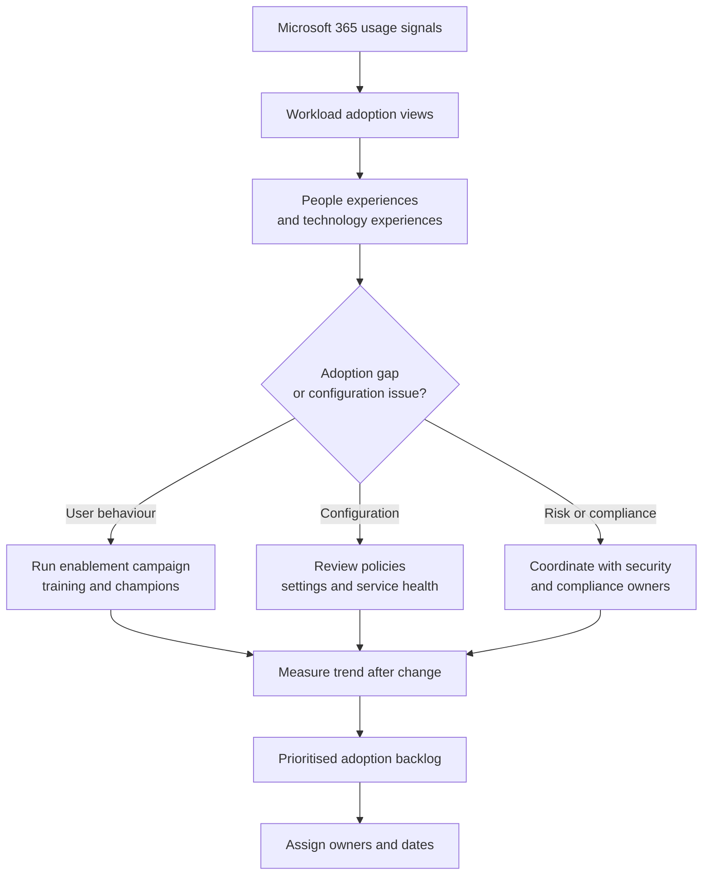
```mermaid
flowchart TB
    ASM_Signals["Microsoft 365 usage signals"] --> ASM_Workloads["Workload adoption views"]
    ASM_Workloads --> ASM_Practices["People experiences<br/>and technology experiences"]
    ASM_Practices --> ASM_Gaps{"Adoption gap<br/>or configuration issue?"}
    ASM_Gaps -->|"User behaviour"| ASM_Change["Run enablement campaign<br/>training and champions"]
    ASM_Gaps -->|"Configuration"| ASM_Admin["Review policies<br/>settings and service health"]
    ASM_Gaps -->|"Risk or compliance"| ASM_Governance["Coordinate with security<br/>and compliance owners"]
    ASM_Change --> ASM_Measure["Measure trend after change"]
    ASM_Admin --> ASM_Measure
    ASM_Governance --> ASM_Measure
    ASM_Measure --> ASM_Backlog["Prioritised adoption backlog"]
    ASM_Backlog --> ASM_Owners["Assign owners and dates"]
```

### Notes

- Treat Adoption Score as an input to service improvement. Do not use it as an individual employee performance measure.

---

## Domain Management and Verification

Shows the main components, decisions, and operational flow for domain management and verification in Microsoft 365 admin and tenant management work.

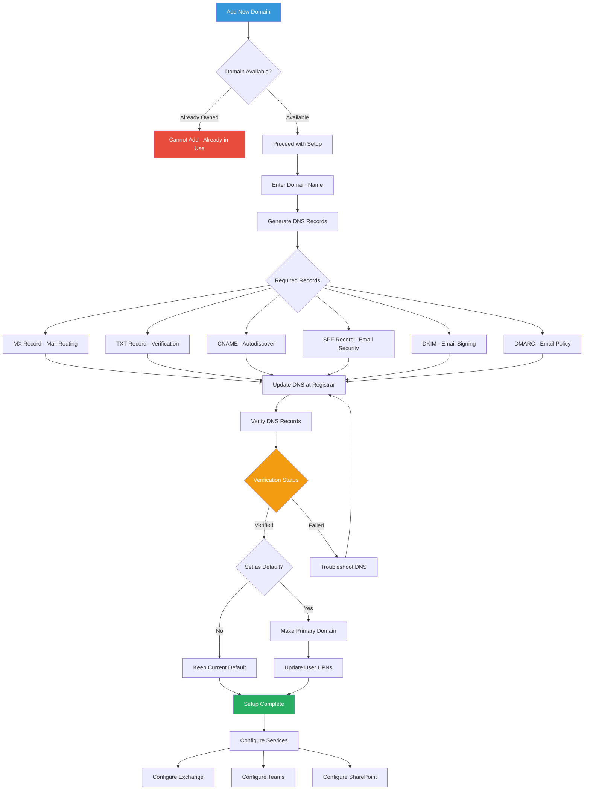
```mermaid
flowchart TB
    Start[Add New Domain] --> CheckAvailability{Domain Available?}

    CheckAvailability -->|Already Owned| CannotAdd[Cannot Add - Already in Use]
    CheckAvailability -->|Available| Proceed[Proceed with Setup]

    Proceed --> EnterDomain[Enter Domain Name]
    EnterDomain --> GenerateDNS[Generate DNS Records]

    GenerateDNS --> Records{Required Records}

    Records --> MX[MX Record - Mail Routing]
    Records --> TXT[TXT Record - Verification]
    Records --> CNAME[CNAME - Autodiscover]
    Records --> SPF[SPF Record - Email Security]
    Records --> DKIM[DKIM - Email Signing]
    Records --> DMARC[DMARC - Email Policy]

    MX --> UpdateDNS[Update DNS at Registrar]
    TXT --> UpdateDNS
    CNAME --> UpdateDNS
    SPF --> UpdateDNS
    DKIM --> UpdateDNS
    DMARC --> UpdateDNS

    UpdateDNS --> VerifyDNS[Verify DNS Records]
    VerifyDNS --> Status{Verification Status}

    Status -->|Verified| SetDefault{Set as Default?}
    Status -->|Failed| Troubleshoot[Troubleshoot DNS]

    Troubleshoot --> UpdateDNS

    SetDefault -->|Yes| MakeDefault[Make Primary Domain]
    SetDefault -->|No| KeepCurrent[Keep Current Default]

    MakeDefault --> UpdateUPN[Update User UPNs]
    KeepCurrent --> Complete[Setup Complete]

    UpdateUPN --> Complete

    Complete --> ConfigureServices[Configure Services]
    ConfigureServices --> Exchange[Configure Exchange]
    ConfigureServices --> Teams[Configure Teams]
    ConfigureServices --> SharePoint[Configure SharePoint]

    style Start fill:#3498db,color:#fff
    style CannotAdd fill:#e74c3c,color:#fff
    style Status fill:#f39c12,color:#fff
    style Complete fill:#27ae60,color:#fff
```

---

## Message Center Management

Shows the main components, decisions, and operational flow for message center management in Microsoft 365 admin and tenant management work.

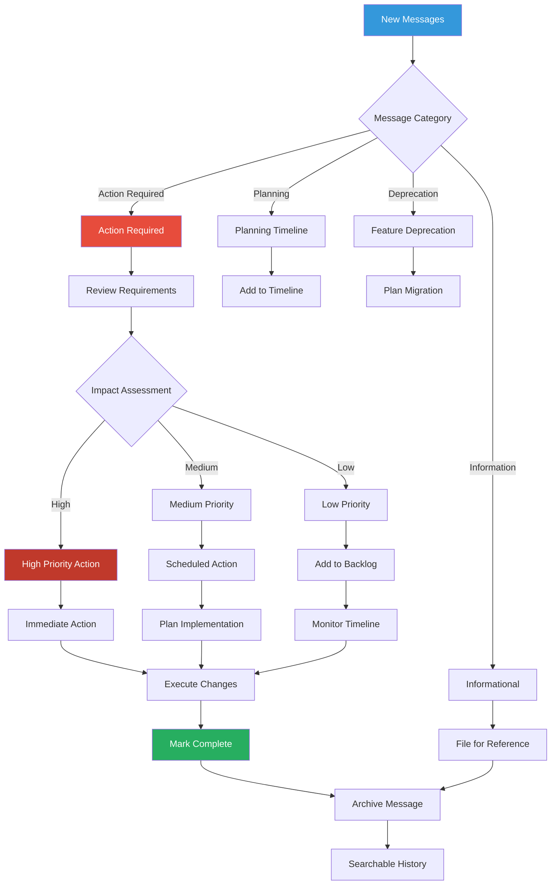
```mermaid
flowchart TD
    Messages[New Messages] --> Categorize{Message Category}

    Categorize -->|Action Required| ActionRequired[Action Required]
    Categorize -->|Information| Information[Informational]
    Categorize -->|Planning| Planning[Planning Timeline]
    Categorize -->|Deprecation| Deprecation[Feature Deprecation]

    ActionRequired --> Review[Review Requirements]
    Information --> File[File for Reference]
    Planning --> Timeline[Add to Timeline]
    Deprecation --> Migrate[Plan Migration]

    Review --> Impact{Impact Assessment}

    Impact -->|High| HighPriority[High Priority Action]
    Impact -->|Medium| MedPriority[Medium Priority]
    Impact -->|Low| LowPriority[Low Priority]

    HighPriority --> Immediate[Immediate Action]
    MedPriority --> Scheduled[Scheduled Action]
    LowPriority --> Backlog[Add to Backlog]

    Immediate --> Execute[Execute Changes]
    Scheduled --> Plan[Plan Implementation]
    Backlog --> Monitor[Monitor Timeline]

    Execute --> Complete[Mark Complete]
    Plan --> Execute
    Monitor --> Execute

    Complete --> Archive[Archive Message]
    File --> Archive
    Archive --> Searchable[Searchable History]

    style Messages fill:#3498db,color:#fff
    style ActionRequired fill:#e74c3c,color:#fff
    style HighPriority fill:#c0392b,color:#fff
    style Complete fill:#27ae60,color:#fff
```

---

## Microsoft 365 Backup and Recovery Strategy

Shows the main components, decisions, and operational flow for microsoft 365 backup and recovery strategy in Microsoft 365 admin and tenant management work.

```mermaid
flowchart TB
    subgraph DataSources["Data Sources"]
        Exchange[Exchange Online Mailboxes]
        OneDrive[OneDrive Data]
        SharePoint[SharePoint Sites]
        Teams[Teams Data]
        AAD[Microsoft Entra ID Objects]
    end

    subgraph NativeProtection["Native Microsoft 365 Protection"]
        DR[Deleted Items Recovery]
        SPR[Second-Stage Recycle Bin]
        VHS[Version History]
        LIT[Litigation Hold]
        GRS[Geo-Redundant Storage]
    end

    subgraph Backup["Backup Solutions"]
        Native[Microsoft 365 Native Tools]
        ThirdParty[Third-Party Backup]
        Scripts[PowerShell Scripts]
        API[Graph API Exports]
    end

    subgraph Recovery["Recovery Options"]
        SelfService[User Self-Service]
        Admin[Admin Recovery]
        Restore[Point-in-Time Restore]
        Migrate[Cross-Tenant Migrate]
    end

    subgraph RPO["RPO/RTO Targets"]
        RPO1[RPO: 1-24 hours]
        RTO1[RTO: 1-4 hours]
        RPO2[RPO: 24-72 hours]
        RTO2[RTO: 4-24 hours]
    end

    Exchange --> DR
    Exchange --> LIT
    OneDrive --> DR
    OneDrive --> VHS
    SharePoint --> SPR
    SharePoint --> VHS
    Teams --> DR
    AAD --> Native

    Native --> SelfService
    ThirdParty --> Admin
    Scripts --> Restore
    API --> Migrate

    Native --> RPO1
    ThirdParty --> RPO2
    Scripts --> RTO1
    ThirdParty --> RTO2

    style DataSources fill:#3498db,color:#fff
    style NativeProtection fill:#27ae60,color:#fff
    style Backup fill:#f39c12,color:#fff
    style Recovery fill:#9b59b6,color:#fff
    style RPO fill:#e74c3c,color:#fff
```

---

## Microsoft 365 Roadmap Integration

Shows the main components, decisions, and operational flow for microsoft 365 roadmap integration in Microsoft 365 admin and tenant management work.

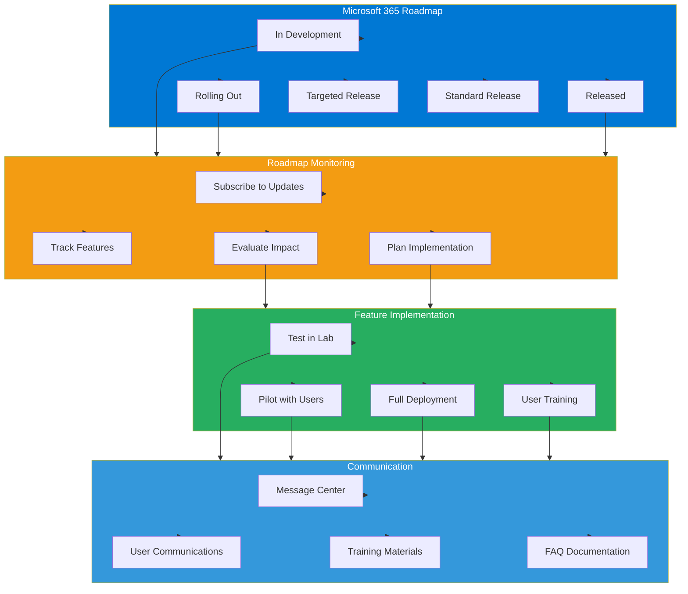
```mermaid
flowchart TB
    subgraph Roadmap["Microsoft 365 Roadmap"]
        InDevelopment[In Development]
        RollingOut[Rolling Out]
        Released[Released]
        TargetedRelease[Targeted Release]
        StandardRelease[Standard Release]
    end

    subgraph Monitoring["Roadmap Monitoring"]
        Subscribe[Subscribe to Updates]
        Track[Track Features]
        Evaluate[Evaluate Impact]
        Plan[Plan Implementation]
    end

    subgraph Implementation["Feature Implementation"]
        Test[Test in Lab]
        Pilot[Pilot with Users]
        Deploy[Full Deployment]
        Train[User Training]
    end

    subgraph Communication["Communication"]
        MessageCenter[Message Center]
        UserComms[User Communications]
        Training[Training Materials]
        FAQ[FAQ Documentation]
    end

    Roadmap --> InDevelopment
    Roadmap --> RollingOut
    Roadmap --> Released
    Roadmap --> TargetedRelease
    Roadmap --> StandardRelease

    InDevelopment --> Monitoring
    RollingOut --> Monitoring
    Released --> Monitoring

    Monitoring --> Subscribe
    Monitoring --> Track
    Monitoring --> Evaluate
    Monitoring --> Plan

    Evaluate --> Implementation
    Plan --> Implementation

    Implementation --> Test
    Implementation --> Pilot
    Implementation --> Deploy
    Implementation --> Train

    Test --> Communication
    Pilot --> Communication
    Deploy --> Communication
    Train --> Communication

    Communication --> MessageCenter
    Communication --> UserComms
    Communication --> Training
    Communication --> FAQ

    style Roadmap fill:#0078d4,color:#fff
    style Monitoring fill:#f39c12,color:#fff
    style Implementation fill:#27ae60,color:#fff
    style Communication fill:#3498db,color:#fff
```

---

## Microsoft 365 Service Dependency Map

Shows the main components, decisions, and operational flow for microsoft 365 service dependency map in Microsoft 365 admin and tenant management work.

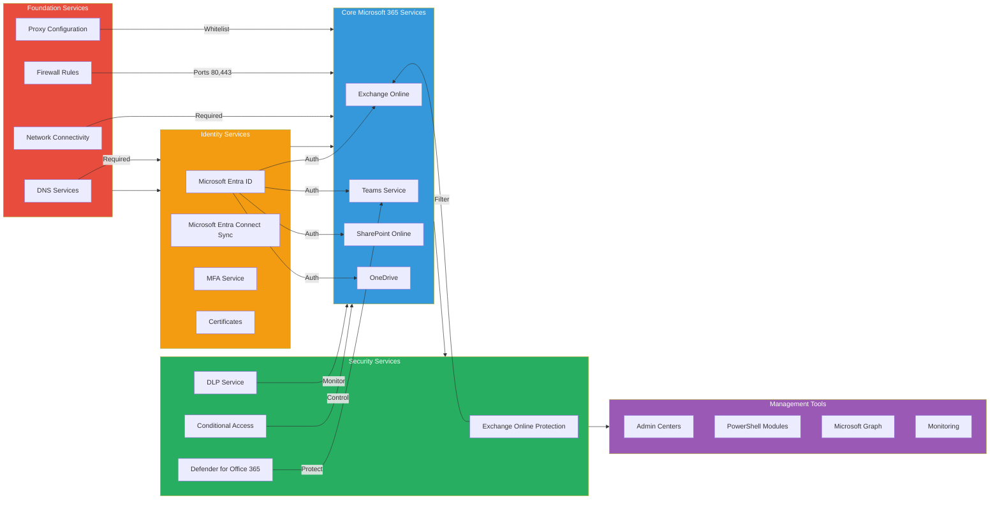
```mermaid
flowchart LR
    subgraph Foundation["Foundation Services"]
        DNS[DNS Services]
        Network[Network Connectivity]
        Firewall[Firewall Rules]
        Proxy[Proxy Configuration]
    end

    subgraph Identity["Identity Services"]
        AAD[Microsoft Entra ID]
        ADConnect[Microsoft Entra Connect Sync]
        MFA[MFA Service]
        Certs[Certificates]
    end

    subgraph Core["Core Microsoft 365 Services"]
        Exchange[Exchange Online]
        Teams[Teams Service]
        SPO[SharePoint Online]
        ODB[OneDrive]
    end

    subgraph Security["Security Services"]
        EOP[Exchange Online Protection]
        Defender[Defender for Office 365]
        CAS[Conditional Access]
        DLP[DLP Service]
    end

    subgraph Management["Management Tools"]
        Admin[Admin Centers]
        PowerShell[PowerShell Modules]
        Graph[Microsoft Graph]
        Monitor[Monitoring]
    end

    Foundation --> Identity
    Identity --> Core
    Core --> Security
    Security --> Management

    DNS -->|Required| Identity
    Network -->|Required| Core
    Firewall -->|Ports 80,443| Core
    Proxy -->|Whitelist| Core

    AAD -->|Auth| Exchange
    AAD -->|Auth| Teams
    AAD -->|Auth| SPO
    AAD -->|Auth| ODB

    EOP -->|Filter| Exchange
    Defender -->|Protect| Teams
    CAS -->|Control| Core
    DLP -->|Monitor| Core

    style Foundation fill:#e74c3c,color:#fff
    style Identity fill:#f39c12,color:#fff
    style Core fill:#3498db,color:#fff
    style Security fill:#27ae60,color:#fff
    style Management fill:#9b59b6,color:#fff
```

---

## Microsoft 365 Tenant Architecture

Shows the main components, decisions, and operational flow for microsoft 365 tenant architecture in Microsoft 365 admin and tenant management work.

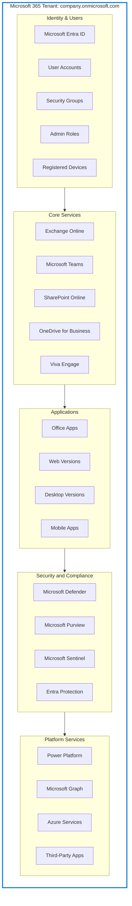
```mermaid
flowchart TB
    subgraph Tenant["Microsoft 365 Tenant: company.onmicrosoft.com"]
        direction TB

        subgraph Identity["Identity & Users"]
            EntraID[Microsoft Entra ID]
            Users[User Accounts]
            Groups[Security Groups]
            Roles[Admin Roles]
            Devices[Registered Devices]
        end

        subgraph Core["Core Services"]
            Exchange[Exchange Online]
            Teams[Microsoft Teams]
            SharePoint[SharePoint Online]
            OneDrive[OneDrive for Business]
            VivaEngage[Viva Engage]
        end

        subgraph Apps["Applications"]
            Office[Office Apps]
            WebApps[Web Versions]
            DesktopApps[Desktop Versions]
            MobileApps[Mobile Apps]
        end

        subgraph Security["Security and Compliance"]
            Defender[Microsoft Defender]
            Purview[Microsoft Purview]
            Sentinel[Microsoft Sentinel]
            Entra[Entra Protection]
        end

        subgraph Platform["Platform Services"]
            PowerPlatform[Power Platform]
            Graph[Microsoft Graph]
            Azure[Azure Services]
            ThirdParty[Third-Party Apps]
        end
    end

    Identity --> Core
    Core --> Apps
    Apps --> Security
    Security --> Platform

    style Tenant fill:transparent,stroke:#0078d4,stroke-width:3px
```

---

## Microsoft Graph API Integration

Shows how custom applications use Microsoft Graph with Entra app registration, permissions, tokens, workload endpoints, paging, batching, and asynchronous operations.

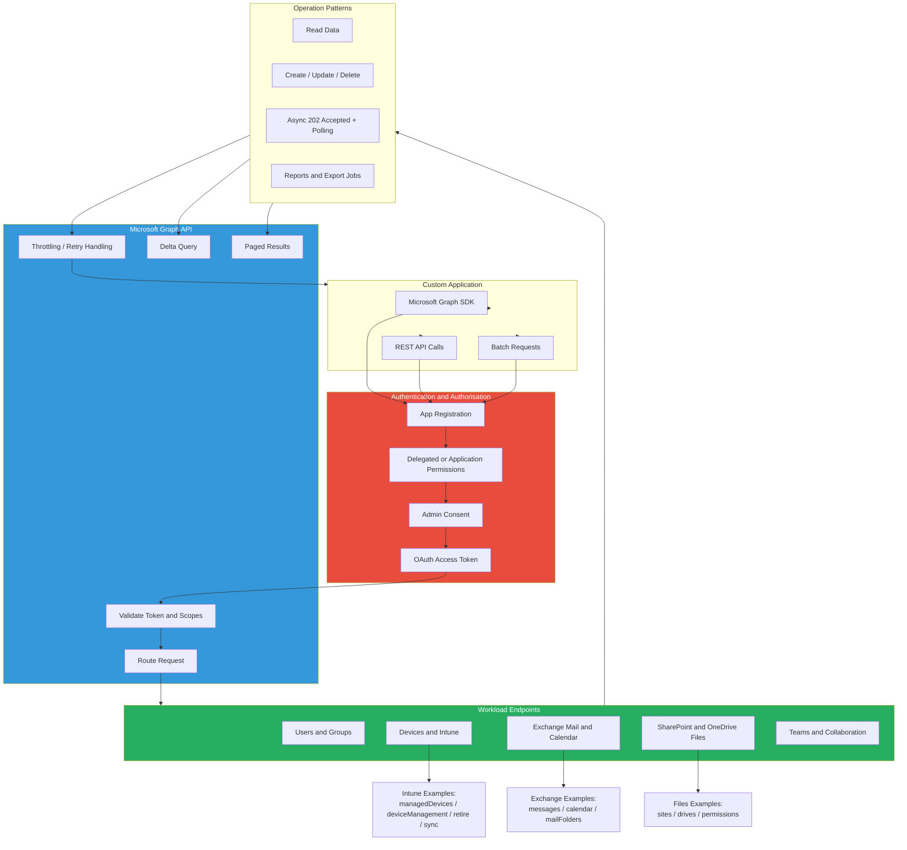
```mermaid
flowchart TB
    subgraph App["Custom Application"]
        SDK[Microsoft Graph SDK]
        REST[REST API Calls]
        Batch[Batch Requests]
    end

    subgraph Auth["Authentication and Authorisation"]
        Register[App Registration]
        Permissions[Delegated or Application Permissions]
        Consent[Admin Consent]
        Token[OAuth Access Token]
    end

    subgraph Graph["Microsoft Graph API"]
        Validate[Validate Token and Scopes]
        Route[Route Request]
        Throttle[Throttling / Retry Handling]
        Delta[Delta Query]
        Paging[Paged Results]
    end

    subgraph Workloads["Workload Endpoints"]
        Users[Users and Groups]
        Devices[Devices and Intune]
        Mail[Exchange Mail and Calendar]
        Files[SharePoint and OneDrive Files]
        Teams[Teams and Collaboration]
    end

    subgraph Operations["Operation Patterns"]
        Read[Read Data]
        Write[Create / Update / Delete]
        Async[Async 202 Accepted + Polling]
        Reports[Reports and Export Jobs]
    end

    App --> SDK
    App --> REST
    App --> Batch
    SDK & REST & Batch --> Register
    Register --> Permissions --> Consent --> Token
    Token --> Validate --> Route
    Route --> Workloads
    Workloads --> Operations
    Operations --> Delta
    Operations --> Paging
    Operations --> Throttle
    Throttle --> App

    Devices --> IntuneExamples["Intune Examples:<br/>managedDevices / deviceManagement / retire / sync"]
    Mail --> MailExamples["Exchange Examples:<br/>messages / calendar / mailFolders"]
    Files --> FileExamples["Files Examples:<br/>sites / drives / permissions"]

    style Auth fill:#e74c3c,color:#fff
    style Graph fill:#3498db,color:#fff
    style Workloads fill:#27ae60,color:#fff
```

### Notes
This consolidated diagram replaces the separate generic Graph and Intune Graph diagrams. Intune is one workload behind Microsoft Graph; the same app registration, consent, token validation, throttling, paging, and batching patterns apply across Microsoft 365 workloads.

---

## Migration Project Timeline

Shows the main components, decisions, and operational flow for migration project timeline in Microsoft 365 admin and tenant management work.

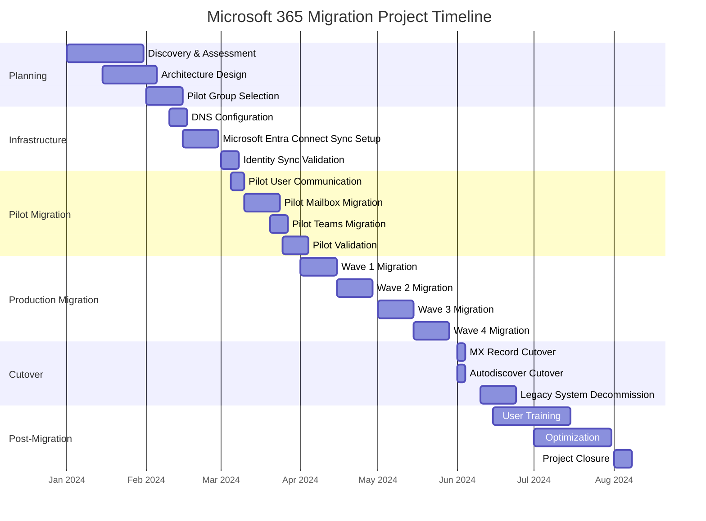
```mermaid
gantt
    title Microsoft 365 Migration Project Timeline
    dateFormat  YYYY-MM-DD
    axisFormat  %b %Y

    section Planning
    Discovery & Assessment     :2024-01-01, 30d
    Architecture Design        :2024-01-15, 21d
    Pilot Group Selection      :2024-02-01, 14d

    section Infrastructure
    DNS Configuration          :2024-02-10, 7d
    Microsoft Entra Connect Sync Setup           :2024-02-15, 14d
    Identity Sync Validation   :2024-03-01, 7d

    section Pilot Migration
    Pilot User Communication   :2024-03-05, 5d
    Pilot Mailbox Migration    :2024-03-10, 14d
    Pilot Teams Migration      :2024-03-20, 7d
    Pilot Validation           :2024-03-25, 10d

    section Production Migration
    Wave 1 Migration           :2024-04-01, 14d
    Wave 2 Migration           :2024-04-15, 14d
    Wave 3 Migration           :2024-05-01, 14d
    Wave 4 Migration           :2024-05-15, 14d

    section Cutover
    MX Record Cutover          :2024-06-01, 3d
    Autodiscover Cutover       :2024-06-01, 3d
    Legacy System Decommission :2024-06-10, 14d

    section Post-Migration
    User Training              :2024-06-15, 30d
    Optimization               :2024-07-01, 30d
    Project Closure            :2024-08-01, 7d
```

---

## Multi-Tenant Architecture

Shows the main components, decisions, and operational flow for multi-tenant architecture in Microsoft 365 admin and tenant management work.

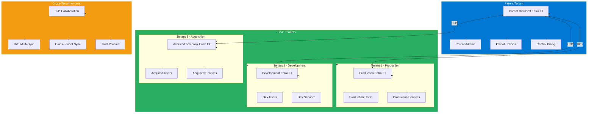
```mermaid
flowchart TB
    subgraph Parent["Parent Tenant"]
        ParentAAD[Parent Microsoft Entra ID]
        ParentAdmin[Parent Admins]
        ParentPolicies[Global Policies]
        ParentBilling[Central Billing]
    end

    subgraph Children["Child Tenants"]
        subgraph Tenant1["Tenant 1 - Production"]
            ProdAAD[Production Entra ID]
            ProdUsers[Production Users]
            ProdServices[Production Services]
        end

        subgraph Tenant2["Tenant 2 - Development"]
            DevAAD[Development Entra ID]
            DevUsers[Dev Users]
            DevServices[Dev Services]
        end

        subgraph Tenant3["Tenant 3 - Acquisition"]
            AcqAAD[Acquired company Entra ID]
            AcqUsers[Acquired Users]
            AcqServices[Acquired Services]
        end
    end

    subgraph CrossTenant["Cross-Tenant Access"]
        B2B[B2B Collaboration]
        B2BMS[B2B Multi-Sync]
        CrossTenantSync[Cross-Tenant Sync]
        TrustPolicy[Trust Policies]
    end

    Parent --> ParentAAD
    Parent --> ParentAdmin
    Parent --> ParentPolicies
    Parent --> ParentBilling

    Children --> Tenant1
    Children --> Tenant2
    Children --> Tenant3

    Tenant1 --> ProdAAD
    Tenant1 --> ProdUsers
    Tenant1 --> ProdServices

    Tenant2 --> DevAAD
    Tenant2 --> DevUsers
    Tenant2 --> DevServices

    Tenant3 --> AcqAAD
    Tenant3 --> AcqUsers
    Tenant3 --> AcqServices

    ParentAAD <-->|B2B| ProdAAD
    ParentAAD <-->|B2B| DevAAD
    ParentAAD <-->|B2B| AcqAAD

    CrossTenant --> B2B
    CrossTenant --> B2BMS
    CrossTenant --> CrossTenantSync
    CrossTenant --> TrustPolicy

    style Parent fill:#0078d4,color:#fff
    style Children fill:#27ae60,color:#fff
    style CrossTenant fill:#f39c12,color:#fff
```

---

## PowerShell Administration

Shows the main components, decisions, and operational flow for powershell administration in Microsoft 365 admin and tenant management work.

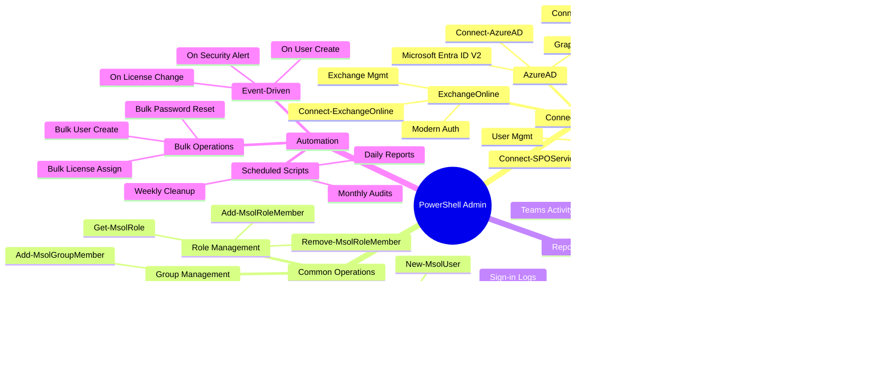
```mermaid
mindmap
  root((PowerShell Admin))
    Connection Modules
      MSOnline
        Connect-MsolService
        Legacy Module
        Basic Operations
      AzureAD
        Connect-AzureAD
        Microsoft Entra ID V2
        Graph Migration
      ExchangeOnline
        Connect-ExchangeOnline
        Exchange Mgmt
        Modern Auth
      MicrosoftTeams
        Connect-MicrosoftTeams
        Teams Mgmt
        Calling Config
      SharePointOnline
        Connect-SPOService
        Site Mgmt
        User Mgmt
      Intune
        Connect-IntuneAccount
        Device Mgmt
        App Mgmt
    Common Operations
      User Management
        Get-MsolUser
        New-MsolUser
        Set-MsolUser
        Remove-MsolUser
      License Management
        Get-MsolAccountSku
        Set-MsolUserLicense
        Add-MsolAccountSku
      Group Management
        Get-MsolGroup
        New-MsolGroup
        Add-MsolGroupMember
      Role Management
        Get-MsolRole
        Add-MsolRoleMember
        Remove-MsolRoleMember
    Reporting
      User Reports
        User Activity
        License Usage
        Admin Activity
      Security Reports
        Sign-in Logs
        Audit Logs
        Risk Events
      Service Reports
        Email Activity
        Teams Activity
        SharePoint Usage
    Automation
      Scheduled Scripts
        Daily Reports
        Weekly Cleanup
        Monthly Audits
      Event-Driven
        On User Create
        On License Change
        On Security Alert
      Bulk Operations
        Bulk User Create
        Bulk License Assign
        Bulk Password Reset
```

---

## Service Health Monitoring

Shows the main components, decisions, and operational flow for service health monitoring in Microsoft 365 admin and tenant management work.

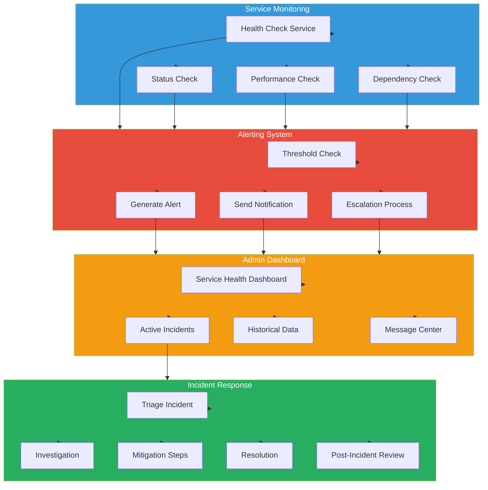
```mermaid
flowchart TB
    subgraph Monitoring["Service Monitoring"]
        HealthCheck[Health Check Service]
        StatusCheck[Status Check]
        PerformanceCheck[Performance Check]
        DependencyCheck[Dependency Check]
    end

    subgraph Alerting["Alerting System"]
        ThresholdCheck[Threshold Check]
        AlertGeneration[Generate Alert]
        Notification[Send Notification]
        Escalation[Escalation Process]
    end

    subgraph Dashboard["Admin Dashboard"]
        ServiceHealth[Service Health Dashboard]
        IncidentList[Active Incidents]
        HistoricalData[Historical Data]
        MessageCenter[Message Center]
    end

    subgraph Response["Incident Response"]
        Triage[Triage Incident]
        Investigation[Investigation]
        Mitigation[Mitigation Steps]
        Resolution[Resolution]
        PostMortem[Post-Incident Review]
    end

    Monitoring --> HealthCheck
    Monitoring --> StatusCheck
    Monitoring --> PerformanceCheck
    Monitoring --> DependencyCheck

    HealthCheck --> Alerting
    StatusCheck --> Alerting
    PerformanceCheck --> Alerting
    DependencyCheck --> Alerting

    Alerting --> ThresholdCheck
    Alerting --> AlertGeneration
    Alerting --> Notification
    Alerting --> Escalation

    AlertGeneration --> Dashboard
    Notification --> Dashboard
    Escalation --> Dashboard

    Dashboard --> ServiceHealth
    Dashboard --> IncidentList
    Dashboard --> HistoricalData
    Dashboard --> MessageCenter

    IncidentList --> Response
    Response --> Triage
    Response --> Investigation
    Response --> Mitigation
    Response --> Resolution
    Response --> PostMortem

    style Monitoring fill:#3498db,color:#fff
    style Alerting fill:#e74c3c,color:#fff
    style Dashboard fill:#f39c12,color:#fff
    style Response fill:#27ae60,color:#fff
```

---

## Support Request Workflow

Shows the main components, decisions, and operational flow for support request workflow in Microsoft 365 admin and tenant management work.

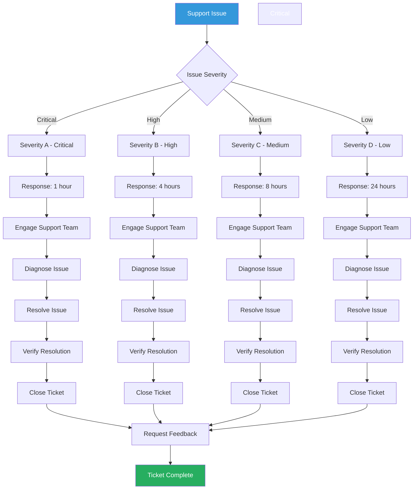
```mermaid
flowchart TD
    Issue[Support Issue] --> Severity{Issue Severity}

    Severity -->|Critical| CriticalSev[Severity A - Critical]
    Severity -->|High| HighSev[Severity B - High]
    Severity -->|Medium| MedSev[Severity C - Medium]
    Severity -->|Low| LowSev[Severity D - Low]

    CriticalSev --> Response1[Response: 1 hour]
    HighSev --> Response2[Response: 4 hours]
    MedSev --> Response3[Response: 8 hours]
    LowSev --> Response4[Response: 24 hours]

    Response1 --> Engage1[Engage Support Team]
    Response2 --> Engage2[Engage Support Team]
    Response3 --> Engage3[Engage Support Team]
    Response4 --> Engage4[Engage Support Team]

    Engage1 --> Diagnose1[Diagnose Issue]
    Engage2 --> Diagnose2[Diagnose Issue]
    Engage3 --> Diagnose3[Diagnose Issue]
    Engage4 --> Diagnose4[Diagnose Issue]

    Diagnose1 --> Resolve1[Resolve Issue]
    Diagnose2 --> Resolve2[Resolve Issue]
    Diagnose3 --> Resolve3[Resolve Issue]
    Diagnose4 --> Resolve4[Resolve Issue]

    Resolve1 --> Verify1[Verify Resolution]
    Resolve2 --> Verify2[Verify Resolution]
    Resolve3 --> Verify3[Verify Resolution]
    Resolve4 --> Verify4[Verify Resolution]

    Verify1 --> Close1[Close Ticket]
    Verify2 --> Close2[Close Ticket]
    Verify3 --> Close3[Close Ticket]
    Verify4 --> Close4[Close Ticket]

    Close1 --> Feedback[Request Feedback]
    Close2 --> Feedback
    Close3 --> Feedback
    Close4 --> Feedback

    Feedback --> Complete[Ticket Complete]

    style Issue fill:#3498db,color:#fff
    style Critical Sev fill:#e74c3c,color:#fff
    style Complete fill:#27ae60,color:#fff
```

---

## Tenant Configuration Backup

Shows the main components, decisions, and operational flow for tenant configuration backup in Microsoft 365 admin and tenant management work.

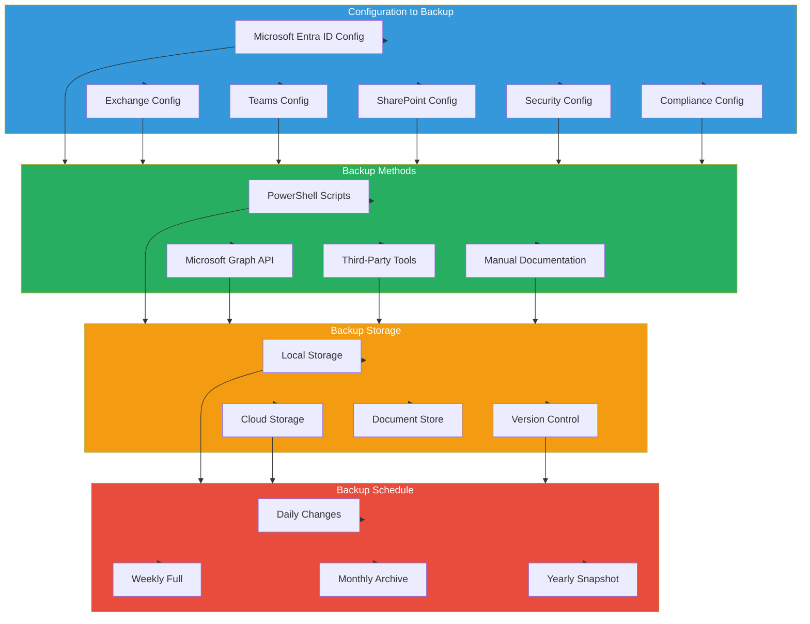
```mermaid
flowchart TB
    subgraph ConfigTypes["Configuration to Backup"]
        AADConfig[Microsoft Entra ID Config]
        ExchangeConfig[Exchange Config]
        TeamsConfig[Teams Config]
        SharePointConfig[SharePoint Config]
        SecurityConfig[Security Config]
        ComplianceConfig[Compliance Config]
    end

    subgraph BackupMethods["Backup Methods"]
        PowerShell[PowerShell Scripts]
        GraphAPI[Microsoft Graph API]
        ThirdParty[Third-Party Tools]
        Manual[Manual Documentation]
    end

    subgraph Storage["Backup Storage"]
        Local[Local Storage]
        Cloud[Cloud Storage]
        VersionControl[Version Control]
        DocumentStore[Document Store]
    end

    subgraph Schedule["Backup Schedule"]
        Daily[Daily Changes]
        Weekly[Weekly Full]
        Monthly[Monthly Archive]
        Yearly[Yearly Snapshot]
    end

    ConfigTypes --> AADConfig
    ConfigTypes --> ExchangeConfig
    ConfigTypes --> TeamsConfig
    ConfigTypes --> SharePointConfig
    ConfigTypes --> SecurityConfig
    ConfigTypes --> ComplianceConfig

    AADConfig --> BackupMethods
    ExchangeConfig --> BackupMethods
    TeamsConfig --> BackupMethods
    SharePointConfig --> BackupMethods
    SecurityConfig --> BackupMethods
    ComplianceConfig --> BackupMethods

    BackupMethods --> PowerShell
    BackupMethods --> GraphAPI
    BackupMethods --> ThirdParty
    BackupMethods --> Manual

    PowerShell --> Storage
    GraphAPI --> Storage
    ThirdParty --> Storage
    Manual --> Storage

    Storage --> Local
    Storage --> Cloud
    Storage --> VersionControl
    Storage --> DocumentStore

    Local --> Schedule
    Cloud --> Schedule
    VersionControl --> Schedule

    Schedule --> Daily
    Schedule --> Weekly
    Schedule --> Monthly
    Schedule --> Yearly

    style ConfigTypes fill:#3498db,color:#fff
    style BackupMethods fill:#27ae60,color:#fff
    style Storage fill:#f39c12,color:#fff
    style Schedule fill:#e74c3c,color:#fff
```

---

## Tenant Security Baseline

Shows the main components, decisions, and operational flow for tenant security baseline in Microsoft 365 admin and tenant management work.

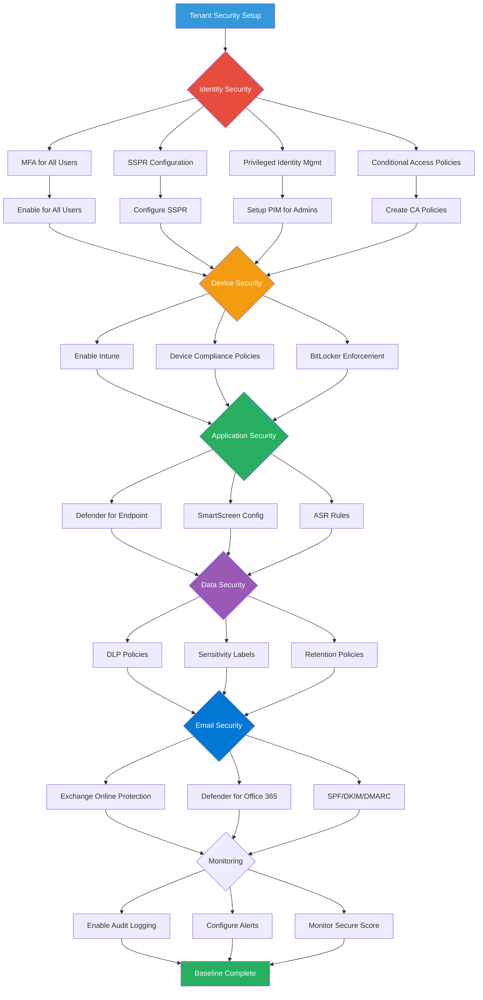
```mermaid
flowchart TB
    Start[Tenant Security Setup] --> Identity{Identity Security}

    Identity --> MFA[MFA for All Users]
    Identity --> SSPR[SSPR Configuration]
    Identity --> PIM[Privileged Identity Mgmt]
    Identity --> CAP[Conditional Access Policies]

    MFA --> EnableMFAAll[Enable for All Users]
    SSPR --> ConfigureSSPR[Configure SSPR]
    PIM --> SetupPIM[Setup PIM for Admins]
    CAP --> CreatePolicies[Create CA Policies]

    EnableMFAAll --> Devices{Device Security}
    ConfigureSSPR --> Devices
    SetupPIM --> Devices
    CreatePolicies --> Devices

    Devices --> Intune[Enable Intune]
    Devices --> Compliance[Device Compliance Policies]
    Devices --> BitLocker[BitLocker Enforcement]

    Intune --> Apps{Application Security}
    Compliance --> Apps
    BitLocker --> Apps

    Apps --> DefenderATP[Defender for Endpoint]
    Apps --> SmartScreen[SmartScreen Config]
    Apps --> ASR[ASR Rules]

    DefenderATP --> Data{Data Security}
    SmartScreen --> Data
    ASR --> Data

    Data --> DLP[DLP Policies]
    Data --> Labels[Sensitivity Labels]
    Data --> Retention[Retention Policies]

    DLP --> Email{Email Security}
    Labels --> Email
    Retention --> Email

    Email --> EOP[Exchange Online Protection]
    Email --> ATP[Defender for Office 365]
    Email --> SPF[SPF/DKIM/DMARC]

    EOP --> Monitoring{Monitoring}
    ATP --> Monitoring
    SPF --> Monitoring

    Monitoring --> Audit[Enable Audit Logging]
    Monitoring --> Alerts[Configure Alerts]
    Monitoring --> SecureScore[Monitor Secure Score]

    Audit --> Complete[Baseline Complete]
    Alerts --> Complete
    SecureScore --> Complete

    style Start fill:#3498db,color:#fff
    style Identity fill:#e74c3c,color:#fff
    style Devices fill:#f39c12,color:#fff
    style Apps fill:#27ae60,color:#fff
    style Data fill:#9b59b6,color:#fff
    style Email fill:#0078d4,color:#fff
    style Complete fill:#27ae60,color:#fff
```

---

## Tenant-to-Tenant Migration

Shows the main components, decisions, and operational flow for tenant-to-tenant migration in Microsoft 365 admin and tenant management work.

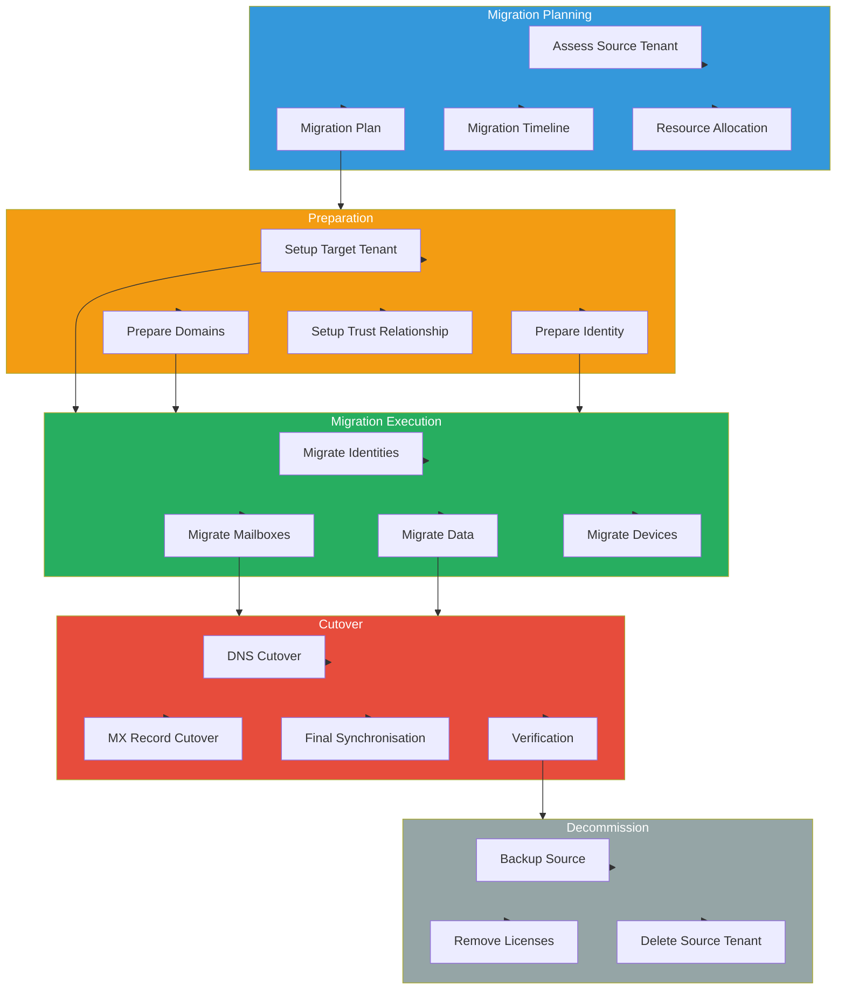
```mermaid
flowchart TB
    subgraph Planning["Migration Planning"]
        Assess[Assess Source Tenant]
        Plan[Migration Plan]
        Timeline[Migration Timeline]
        Resources[Resource Allocation]
    end

    subgraph Prep["Preparation"]
        TargetSetup[Setup Target Tenant]
        DomainPrep[Prepare Domains]
        IdentityPrep[Prepare Identity]
        TrustSetup[Setup Trust Relationship]
    end

    subgraph Migration["Migration Execution"]
        IdentityMigrate[Migrate Identities]
        MailboxMigrate[Migrate Mailboxes]
        DataMigrate[Migrate Data]
        DeviceMigrate[Migrate Devices]
    end

    subgraph Cutover["Cutover"]
        DNSCutover[DNS Cutover]
        MXCutover[MX Record Cutover]
        FinalSync[Final Synchronisation]
        Verification[Verification]
    end

    subgraph Decommission["Decommission"]
        SourceBackup[Backup Source]
        LicenseRemove[Remove Licenses]
        TenantDelete[Delete Source Tenant]
    end

    Planning --> Assess
    Planning --> Plan
    Planning --> Timeline
    Planning --> Resources

    Plan --> Prep
    Prep --> TargetSetup
    Prep --> DomainPrep
    Prep --> IdentityPrep
    Prep --> TrustSetup

    TargetSetup --> Migration
    DomainPrep --> Migration
    IdentityPrep --> Migration

    Migration --> IdentityMigrate
    Migration --> MailboxMigrate
    Migration --> DataMigrate
    Migration --> DeviceMigrate

    MailboxMigrate --> Cutover
    DataMigrate --> Cutover

    Cutover --> DNSCutover
    Cutover --> MXCutover
    Cutover --> FinalSync
    Cutover --> Verification

    Verification --> Decommission
    Decommission --> SourceBackup
    Decommission --> LicenseRemove
    Decommission --> TenantDelete

    style Planning fill:#3498db,color:#fff
    style Prep fill:#f39c12,color:#fff
    style Migration fill:#27ae60,color:#fff
    style Cutover fill:#e74c3c,color:#fff
    style Decommission fill:#95a5a6,color:#fff
```

---

## User Lifecycle Management

Shows the main components, decisions, and operational flow for user lifecycle management in Microsoft 365 admin and tenant management work.

```mermaid
flowchart TB
    subgraph Onboarding["Onboarding"]
        Hire[New Hire Notification]
        CreateAccount[Create User Account]
        AssignLicense[Assign License]
        AddToGroups[Add to Groups]
        ConfigureMail[Configure Mailbox]
        SetupDevices[Setup Devices]
        WelcomeEmail[Send Welcome Email]
    end

    subgraph Active["Active Employment"]
        Ongoing[Ongoing Access Mgmt]
        RoleChanges[Role Changes]
        DepartmentChanges[Department Changes]
        LicenseChanges[License Changes]
        AccessReviews[Access Reviews]
    end

    subgraph Changes["Employment Changes"]
        Promotion[Promotion]
        Transfer[Department Transfer]
        LocationChange[Location Change]
        ManagerChange[Manager Change]
    end

    subgraph Offboarding["Offboarding"]
        Termination[Employment Ended]
        DisableAccount[Disable Account]
        RevokeSessions[Revoke Sessions]
        ConvertMailbox[Convert to Shared]
        ReassignData[Reassign Data]
        RemoveLicenses[Remove Licenses]
        DeleteAccount[Delete Account]
    end

    Onboarding --> Hire
    Onboarding --> CreateAccount
    Onboarding --> AssignLicense
    Onboarding --> AddToGroups
    Onboarding --> ConfigureMail
    Onboarding --> SetupDevices
    Onboarding --> WelcomeEmail

    Active --> Ongoing
    Active --> RoleChanges
    Active --> AccessReviews

    Changes --> Promotion
    Changes --> Transfer
    Changes --> LocationChange
    Changes --> ManagerChange

    Offboarding --> Termination
    Offboarding --> DisableAccount
    Offboarding --> RevokeSessions
    Offboarding --> ConvertMailbox
    Offboarding --> ReassignData
    Offboarding --> RemoveLicenses
    Offboarding --> DeleteAccount

    WelcomeEmail --> Active
    Active --> Changes
    Active --> Offboarding
    Changes --> Active

    style Onboarding fill:#27ae60,color:#fff
    style Active fill:#3498db,color:#fff
    style Changes fill:#f39c12,color:#fff
    style Offboarding fill:#e74c3c,color:#fff
```
