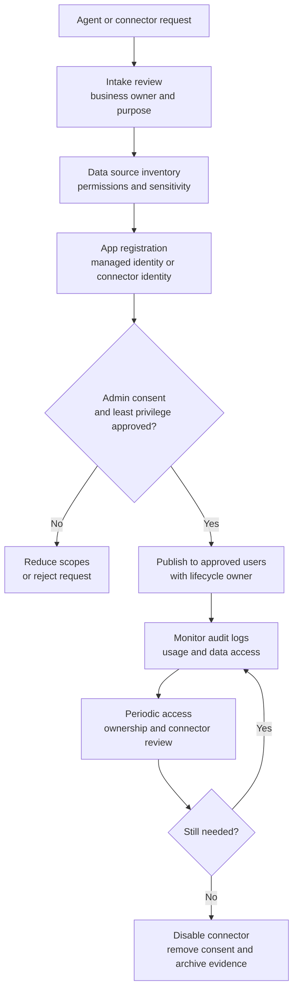
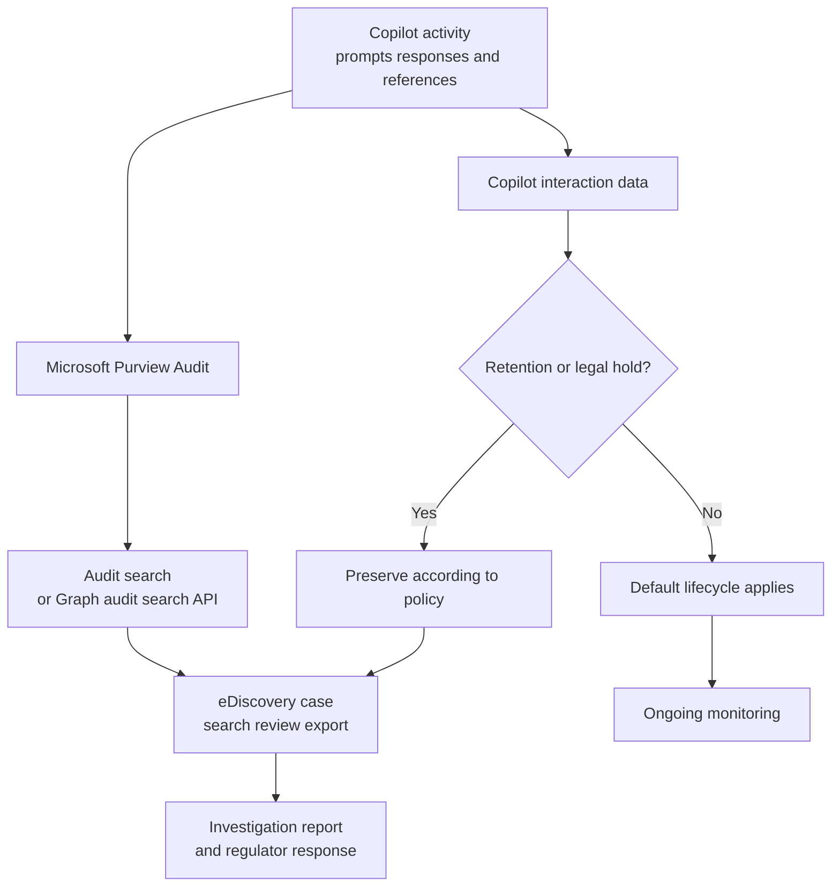
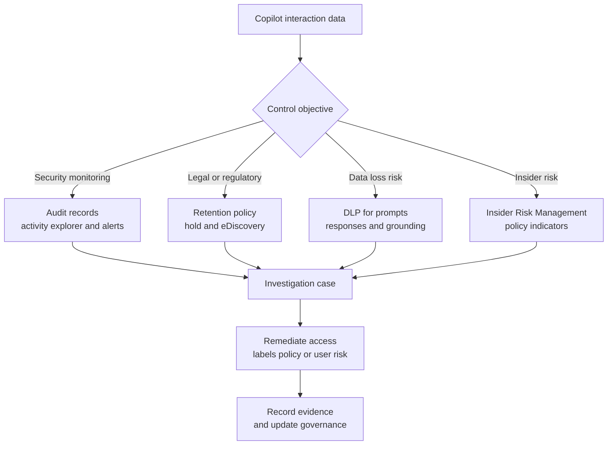
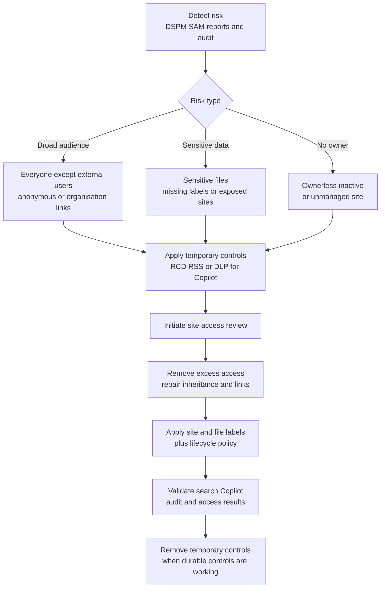
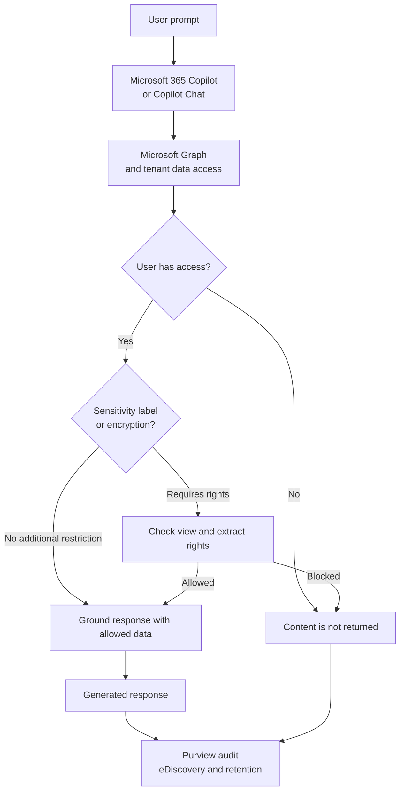
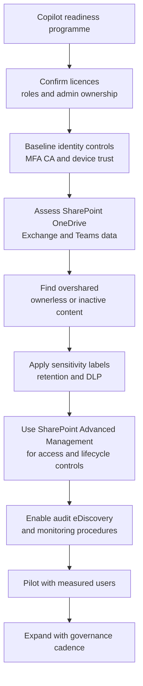

# Copilot and AI Governance

Copilot and AI governance diagrams for Microsoft 365 admins. This file contains 6 topics covering data protection, readiness, oversharing remediation, audit, eDiscovery, agent governance and interaction controls.

## Contents

- [Copilot Agent and Connector Governance](#copilot-agent-and-connector-governance)
- [Copilot Audit and eDiscovery](#copilot-audit-and-ediscovery)
- [Copilot Interaction Data Controls](#copilot-interaction-data-controls)
- [Copilot Oversharing Remediation](#copilot-oversharing-remediation)
- [Microsoft 365 Copilot Data Protection Architecture](#microsoft-365-copilot-data-protection-architecture)
- [Secure Copilot Readiness](#secure-copilot-readiness)

---

## Copilot Agent and Connector Governance

Govern Copilot agents and connectors by controlling creation, consent, data source scope, ownership, monitoring and retirement.

---

## Copilot Audit and eDiscovery

Copilot prompts, responses and referenced content can become compliance evidence. This flow shows the audit and eDiscovery handling path.

---

## Copilot Interaction Data Controls

Use this model to decide how Copilot interaction data is monitored, retained, investigated and remediated in Microsoft Purview.

---

## Copilot Oversharing Remediation

This diagram maps a practical oversharing response from discovery through temporary controls, site-owner remediation and validation.

### Notes

- Restricted SharePoint Search is a temporary measure and is not a security boundary.

---

## Microsoft 365 Copilot Data Protection Architecture

This diagram shows how Microsoft 365 Copilot grounds responses while honouring Microsoft 365 permissions, sensitivity labels, encryption and Purview compliance controls.

### Notes

- Copilot does not grant new access to content. It can only use content the user is already authorised to access.

---

## Secure Copilot Readiness

Use this readiness flow to prepare identity, data, access and compliance controls before enabling Microsoft 365 Copilot broadly.

### Notes

- Treat readiness as a continuous governance loop. Copilot quality and exposure risk change when permissions and content change.
