# Endpoint Management

Endpoint management diagrams for Microsoft 365 admins. This file contains 32 topics covering Microsoft Intune, device compliance, application management, endpoint security, analytics, add-ons and Windows update operations.

## Contents

- [Android Management Options](#android-management-options)
- [App Deployment Workflow](#app-deployment-workflow)
- [App Management Models: MAM vs. MDM](#app-management-models-mam-vs-mdm)
- [App Protection Policy Flow](#app-protection-policy-flow)
- [Apple Device Management](#apple-device-management)
- [Autopilot Profile Assignment](#autopilot-profile-assignment)
- [Cloud PKI Certificate Lifecycle](#cloud-pki-certificate-lifecycle)
- [Co-Management with Configuration Manager](#co-management-with-configuration-manager)
- [Configuration Profile Types](#configuration-profile-types)
- [Device Compliance Dashboard](#device-compliance-dashboard)
- [Device Compliance Evaluation and Remediation](#device-compliance-evaluation-and-remediation)
- [Device Enrollment Decision Tree](#device-enrollment-decision-tree)
- [Device Enrollment Methods](#device-enrollment-methods)
- [Device Lifecycle Management](#device-lifecycle-management)
- [Device Retirement Process](#device-retirement-process)
- [Endpoint Analytics and Advanced Analytics](#endpoint-analytics-and-advanced-analytics)
- [Endpoint Privilege Management Elevation Flow](#endpoint-privilege-management-elevation-flow)
- [Endpoint Security Policies](#endpoint-security-policies)
- [Enterprise App Management Lifecycle](#enterprise-app-management-lifecycle)
- [Intune Admin Role Structure](#intune-admin-role-structure)
- [Intune Architecture Overview](#intune-architecture-overview)
- [Intune Cloud Architecture: How It Connects](#intune-cloud-architecture-how-it-connects)
- [Intune Security Integration Architecture](#intune-security-integration-architecture)
- [Intune Suite Architecture](#intune-suite-architecture)
- [Microsoft Tunnel Architecture](#microsoft-tunnel-architecture)
- [Mobile Application Management (MAM)](#mobile-application-management-mam)
- [Policy Delivery Engine: The Sync Pipeline](#policy-delivery-engine-the-sync-pipeline)
- [Remote Actions Matrix](#remote-actions-matrix)
- [Remote Help Support Session Flow](#remote-help-support-session-flow)
- [Windows Autopatch Service Flow](#windows-autopatch-service-flow)
- [Windows Autopilot Deployment Lifecycle](#windows-autopilot-deployment-lifecycle)
- [Windows Update for Business Ring Configuration](#windows-update-for-business-ring-configuration)

---

## Android Management Options

Shows the main components, decisions, and operational flow for android management options in Microsoft 365 endpoint management work.

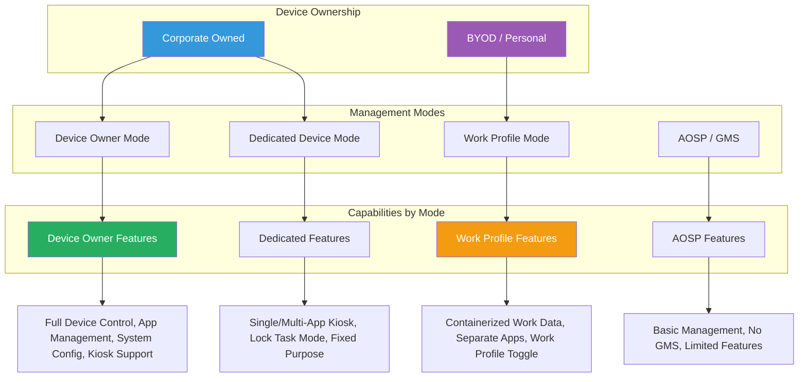
```mermaid
flowchart TB
    subgraph Ownership["Device Ownership"]
        Corporate[Corporate Owned]
        BYOD[BYOD / Personal]
    end

    subgraph ManagementModes["Management Modes"]
        DeviceOwner[Device Owner Mode]
        WorkProfile[Work Profile Mode]
        Dedicated[Dedicated Device Mode]
        AOSP[AOSP / GMS]
    end

    subgraph Features["Capabilities by Mode"]
        DOFeatures[Device Owner Features]
        WPFeatures[Work Profile Features]
        DFeatures[Dedicated Features]
        AOSPFeatures[AOSP Features]
    end

    Corporate --> DeviceOwner
    Corporate --> Dedicated
    BYOD --> WorkProfile

    DeviceOwner --> DOFeatures
    WorkProfile --> WPFeatures
    Dedicated --> DFeatures
    AOSP --> AOSPFeatures

    DOFeatures --> DOList[Full Device Control, App Management, System Config, Kiosk Support]
    WPFeatures --> WPList[Containerized Work Data, Separate Apps, Work Profile Toggle]
    DFeatures --> DList[Single/Multi-App Kiosk, Lock Task Mode, Fixed Purpose]
    AOSPFeatures --> AOSPList[Basic Management, No GMS, Limited Features]

    style Corporate fill:#3498db,color:#fff
    style BYOD fill:#9b59b6,color:#fff
    style DOFeatures fill:#27ae60,color:#fff
    style WPFeatures fill:#f39c12,color:#fff
```

---

## App Deployment Workflow

Shows the main components, decisions, and operational flow for app deployment workflow in Microsoft 365 endpoint management work.

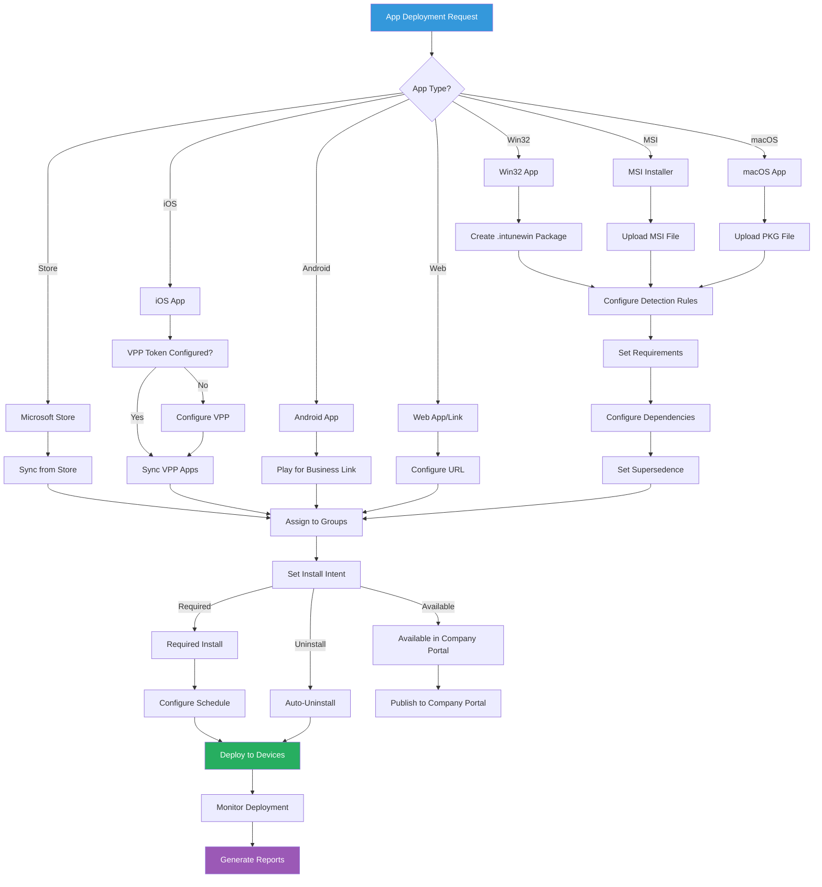
```mermaid
flowchart TB
    Start[App Deployment Request] --> Type{App Type?}

    Type -->|Win32| Win32[Win32 App]
    Type -->|MSI| MSI[MSI Installer]
    Type -->|Store| Store[Microsoft Store]
    Type -->|iOS| iOS[iOS App]
    Type -->|Android| Android[Android App]
    Type -->|macOS| macOS[macOS App]
    Type -->|Web| Web[Web App/Link]

    Win32 --> Package[Create .intunewin Package]
    MSI --> Upload[Upload MSI File]
    Store --> Sync[Sync from Store]
    iOS --> VPPCheck[VPP Token Configured?]
    Android --> PlayLink[Play for Business Link]
    macOS --> PKG[Upload PKG File]
    Web --> URL[Configure URL]

    VPPCheck -->|Yes| VPPSync[Sync VPP Apps]
    VPPCheck -->|No| ConfigVPP[Configure VPP]
    ConfigVPP --> VPPSync

    Package --> Detect[Configure Detection Rules]
    Upload --> Detect
    Sync --> Assign
    VPPSync --> Assign
    PlayLink --> Assign
    PKG --> Detect
    URL --> Assign

    Detect --> Requirements[Set Requirements]
    Requirements --> Dependencies[Configure Dependencies]
    Dependencies --> Supersedence[Set Supersedence]
    Supersedence --> Assign[Assign to Groups]

    Assign --> InstallIntent[Set Install Intent]
    InstallIntent -->|Required| Required[Required Install]
    InstallIntent -->|Available| Available[Available in Company Portal]
    InstallIntent -->|Uninstall| Uninstall[Auto-Uninstall]

    Required --> Schedule[Configure Schedule]
    Schedule --> Deploy[Deploy to Devices]

    Available --> Publish[Publish to Company Portal]
    Uninstall --> Deploy

    Deploy --> Monitor[Monitor Deployment]
    Monitor --> Report[Generate Reports]

    style Start fill:#3498db,color:#fff
    style Deploy fill:#27ae60,color:#fff
    style Report fill:#9b59b6,color:#fff
```

---

## App Management Models: MAM vs. MDM

Intune offers two fundamentally different ways to protect corporate data on endpoints. This comparison diagram clarifies when to use each.

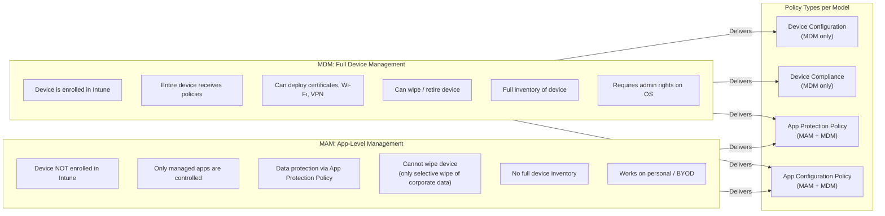
```mermaid
graph LR
    subgraph MDM["MDM: Full Device Management"]
        direction TB
        M1["Device is enrolled in Intune"]
        M2["Entire device receives policies"]
        M3["Can deploy certificates, Wi-Fi, VPN"]
        M4["Can wipe / retire device"]
        M5["Full inventory of device"]
        M6["Requires admin rights on OS"]
    end

    subgraph MAM["MAM: App-Level Management"]
        direction TB
        A1["Device NOT enrolled in Intune"]
        A2["Only managed apps are controlled"]
        A3["Data protection via App Protection Policy"]
        A4["Cannot wipe device<br/>(only selective wipe of corporate data)"]
        A5["No full device inventory"]
        A6["Works on personal / BYOD"]
    end

    subgraph Policy["Policy Types per Model"]
        direction TB
        P1["Device Configuration<br/>(MDM only)"]
        P2["Device Compliance<br/>(MDM only)"]
        P3["App Protection Policy<br/>(MAM + MDM)"]
        P4["App Configuration Policy<br/>(MAM + MDM)"]
    end

    MDM -->|Delivers| P1
    MDM -->|Delivers| P2
    MDM -->|Delivers| P3
    MDM -->|Delivers| P4
    MAM -->|Delivers| P3
    MAM -->|Delivers| P4
```

### Notes
**Key insight**: Many organisations run a **co-management** model: corporate PCs and phones are **MDM-enrolled**, while executive BYOD tablets receive only **MAM policies** via Outlook and Teams apps. App Protection Policies work regardless of MDM state.

---

## App Protection Policy Flow

Shows the main components, decisions, and operational flow for app protection policy flow in Microsoft 365 endpoint management work.

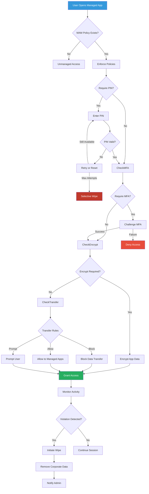
```mermaid
flowchart TD
    User[User Opens Managed App] --> Check{MAM Policy Exists?}

    Check -->|No| Unmanaged[Unmanaged Access]
    Check -->|Yes| Enforce[Enforce Policies]

    Enforce --> PIN{Require PIN?}
    PIN -->|Yes| PromptPIN[Enter PIN]
    PIN -->|No| CheckMFA

    PromptPIN --> VerifyPIN{PIN Valid?}
    VerifyPIN -->|No| RetryPIN[Retry or Reset]
    VerifyPIN -->|Yes| CheckMFA

    RetryPIN -->|Max Attempts| Wipe[Selective Wipe]
    RetryPIN -->|Still Available| PromptPIN

    CheckMFA --> MFA{Require MFA?}
    MFA -->|Yes| Challenge[Challenge MFA]
    MFA -->|No| CheckEncrypt

    Challenge -->|Success| CheckEncrypt
    Challenge -->|Failure| Deny[Deny Access]

    CheckEncrypt --> Encrypt{Encrypt Required?}
    Encrypt -->|Yes| EncryptData[Encrypt App Data]
    Encrypt -->|No| CheckTransfer

    EncryptData --> Access[Grant Access]

    CheckTransfer --> Transfer{Transfer Rules}
    Transfer -->|Block| NoTransfer[Block Data Transfer]
    Transfer -->|Allow| AllowTransfer[Allow to Managed Apps]
    Transfer -->|Prompt| PromptTransfer[Prompt User]

    NoTransfer --> Access
    AllowTransfer --> Access
    PromptTransfer --> Access

    Access --> Monitor[Monitor Activity]
    Monitor --> Violation{Violation Detected?}
    Violation -->|Yes| WipeAction[Initiate Wipe]
    Violation -->|No| Continue[Continue Session]

    WipeAction --> RemoveData[Remove Corporate Data]
    RemoveData --> Notify[Notify Admin]

    style User fill:#3498db,color:#fff
    style Access fill:#27ae60,color:#fff
    style Deny fill:#e74c3c,color:#fff
    style Wipe fill:#c0392b,color:#fff
```

---

## Apple Device Management

Shows the main components, decisions, and operational flow for apple device management in Microsoft 365 endpoint management work.

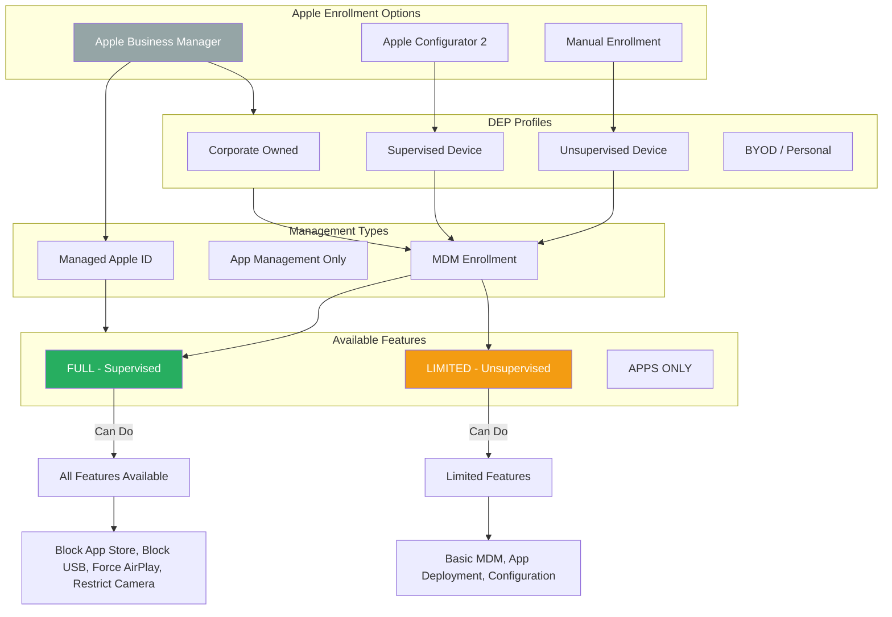
```mermaid
flowchart TB
    subgraph Enrollment["Apple Enrollment Options"]
        ABM[Apple Business Manager]
        Configurator[Apple Configurator 2]
        Manual[Manual Enrollment]
    end

    subgraph DEP["DEP Profiles"]
        Supervised[Supervised Device]
        Unsupervised[Unsupervised Device]
        Corporate[Corporate Owned]
        BYOD[BYOD / Personal]
    end

    subgraph Management["Management Types"]
        MDM[MDM Enrollment]
        MAM[App Management Only]
        ManagedAppleID[Managed Apple ID]
    end

    subgraph Features["Available Features"]
        Full[FULL - Supervised]
        Limited[LIMITED - Unsupervised]
        AppsOnly[APPS ONLY]
    end

    ABM --> DEP
    Configurator --> Supervised
    Manual --> Unsupervised

    DEP --> MDM
    Supervised --> MDM
    Unsupervised --> MDM

    MDM --> Full
    MDM --> Limited

    ABM --> ManagedAppleID
    ManagedAppleID --> Features

    Full -->|Can Do| FullFeatures[All Features Available]
    Limited -->|Can Do| LimitedFeatures[Limited Features]

    FullFeatures --> List1[Block App Store, Block USB, Force AirPlay, Restrict Camera]
    LimitedFeatures --> List2[Basic MDM, App Deployment, Configuration]

    style ABM fill:#95a5a6,color:#fff
    style Full fill:#27ae60,color:#fff
    style Limited fill:#f39c12,color:#fff
```

---

## Autopilot Profile Assignment

Shows the main components, decisions, and operational flow for autopilot profile assignment in Microsoft 365 endpoint management work.

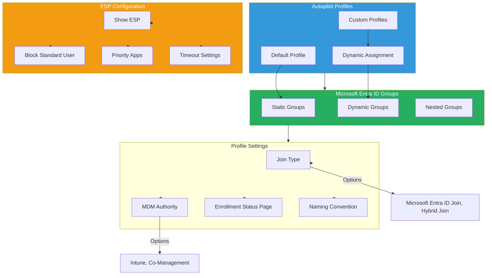
```mermaid
flowchart TB
    subgraph Profiles["Autopilot Profiles"]
        Default[Default Profile]
        Custom[Custom Profiles]
        DynamicProfile[Dynamic Assignment]
    end

    subgraph Groups["Microsoft Entra ID Groups"]
        Static[Static Groups]
        DynamicGroup[Dynamic Groups]
        Nested[Nested Groups]
    end

    subgraph Settings["Profile Settings"]
        Join[Join Type]
        MDM[MDM Authority]
        ESPSetting[Enrollment Status Page]
        Naming[Naming Convention]
    end

    subgraph ESPConfig["ESP Configuration"]
        Show[Show ESP]
        Block[Block Standard User]
        Priority[Priority Apps]
        Timeout[Timeout Settings]
    end

    Profiles --> Groups
    Groups --> Settings

    Default --> Static
    Custom --> DynamicProfile
    DynamicProfile --> DynamicGroup

    Settings --> Join
    Settings --> MDM
    Settings --> ESPSetting
    Settings --> Naming

    ESPConfig --> Show
    ESPConfig --> Block
    ESPConfig --> Priority
    ESPConfig --> Timeout

    Join -->|Options| JoinTypes[Microsoft Entra ID Join, Hybrid Join]
    MDM -->|Options| MDMTypes[Intune, Co-Management]

    style Profiles fill:#3498db,color:#fff
    style Groups fill:#27ae60,color:#fff
    style ESPConfig fill:#f39c12,color:#fff
```

---

## Cloud PKI Certificate Lifecycle

Microsoft Cloud PKI provides cloud-managed certificate issuance, renewal and revocation for Intune-managed devices.

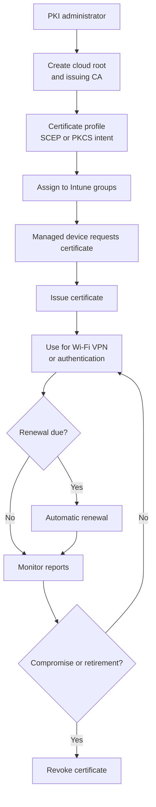
```mermaid
flowchart TB
    CPKI_Admin["PKI administrator"] --> CPKI_CA["Create cloud root<br/>and issuing CA"]
    CPKI_CA --> CPKI_Profile["Certificate profile<br/>SCEP or PKCS intent"]
    CPKI_Profile --> CPKI_Assign["Assign to Intune groups"]
    CPKI_Assign --> CPKI_Device["Managed device requests certificate"]
    CPKI_Device --> CPKI_Issue["Issue certificate"]
    CPKI_Issue --> CPKI_Use["Use for Wi-Fi VPN<br/>or authentication"]
    CPKI_Use --> CPKI_Renew{"Renewal due?"}
    CPKI_Renew -->|"Yes"| CPKI_Renewal["Automatic renewal"]
    CPKI_Renew -->|"No"| CPKI_Monitor["Monitor reports"]
    CPKI_Renewal --> CPKI_Monitor
    CPKI_Monitor --> CPKI_Revoke{"Compromise or retirement?"}
    CPKI_Revoke -->|"Yes"| CPKI_RevokeAction["Revoke certificate"]
    CPKI_Revoke -->|"No"| CPKI_Use
```

---

## Co-Management with Configuration Manager

Shows the main components, decisions, and operational flow for co-management with configuration manager in Microsoft 365 endpoint management work.

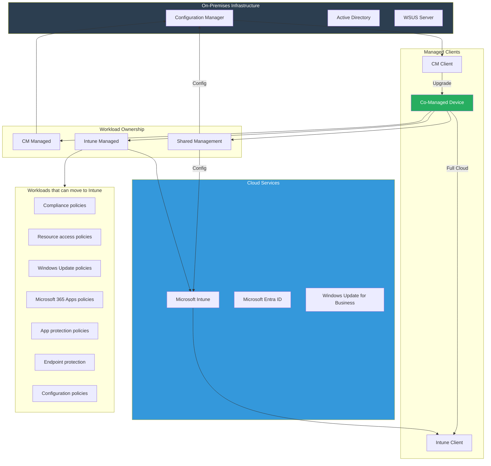
```mermaid
flowchart TB
    subgraph OnPrem["On-Premises Infrastructure"]
        CM[Configuration Manager]
        AD[Active Directory]
        WSUS[WSUS Server]
    end

    subgraph Cloud["Cloud Services"]
        Intune[Microsoft Intune]
        AAD[Microsoft Entra ID]
        WindowsUpdate[Windows Update for Business]
    end

    subgraph Clients["Managed Clients"]
        CMClient[CM Client]
        CoManaged[Co-Managed Device]
        IntuneClient[Intune Client]
    end

    subgraph Workloads["Workload Ownership"]
        CMWorkloads[CM Managed]
        Shared[Shared Management]
        IntuneWorkloads[Intune Managed]
    end

    CM --> CMClient
    Intune --> IntuneClient

    CMClient -->|Upgrade| CoManaged
    CoManaged -->|Full Cloud| IntuneClient

    CoManaged --> CMWorkloads
    CoManaged --> Shared
    CoManaged --> IntuneWorkloads

    CMWorkloads --> CM
    IntuneWorkloads --> Intune

    Shared -->|Config| CM
    Shared -->|Config| Intune

    subgraph IntuneEligibleWorkloads["Workloads that can move to Intune"]
        CompliancePolicies[Compliance policies]
        ResourceAccessPolicies[Resource access policies]
        WindowsUpdatePolicies[Windows Update policies]
        OfficePolicies[Microsoft 365 Apps policies]
        AppProtectionPolicies[App protection policies]
        EndpointProtectionPolicies[Endpoint protection]
        ConfigurationPolicies[Configuration policies]
    end

    IntuneWorkloads --> IntuneEligibleWorkloads

    style OnPrem fill:#2c3e50,color:#fff
    style Cloud fill:#3498db,color:#fff
    style CoManaged fill:#27ae60,color:#fff
```

---

## Configuration Profile Types

Shows the main components, decisions, and operational flow for configuration profile types in Microsoft 365 endpoint management work.

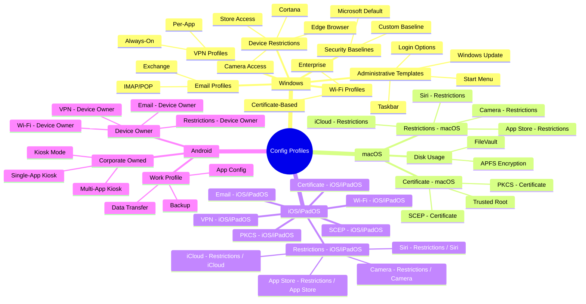
```mermaid
mindmap
  root((Config Profiles))
    Windows
      Administrative Templates
        Start Menu
        Taskbar
        Windows Update
        Login Options
      Device Restrictions
        Camera Access
        Cortana
        Edge Browser
        Store Access
      Wi-Fi Profiles
        Enterprise
        Certificate-Based
      VPN Profiles
        Always-On
        Per-App
      Email Profiles
        Exchange
        IMAP/POP
      Security Baselines
        Microsoft Default
        Custom Baseline
    macOS
      Restrictions - macOS
        App Store - Restrictions
        iCloud - Restrictions
        Siri - Restrictions
        Camera - Restrictions
      Certificate - macOS
        SCEP - Certificate
        PKCS - Certificate
        Trusted Root
      Disk Usage
        FileVault
        APFS Encryption
    iOS/iPadOS
        Restrictions - iOS/iPadOS
            Camera - Restrictions / Camera
            Siri - Restrictions / Siri
            App Store - Restrictions / App Store
            iCloud - Restrictions / iCloud
        Wi-Fi - iOS/iPadOS
        VPN - iOS/iPadOS
        Email - iOS/iPadOS
        Certificate - iOS/iPadOS
        SCEP - iOS/iPadOS
        PKCS - iOS/iPadOS
    Android
        Device Owner
            Wi-Fi - Device Owner
            VPN - Device Owner
            Email - Device Owner
            Restrictions - Device Owner
        Work Profile
            App Config
            Data Transfer
            Backup
        Corporate Owned
            Kiosk Mode
            Multi-App Kiosk
            Single-App Kiosk
```

---

## Device Compliance Dashboard

This operational view turns Intune compliance states into admin actions for access, remediation and reporting.

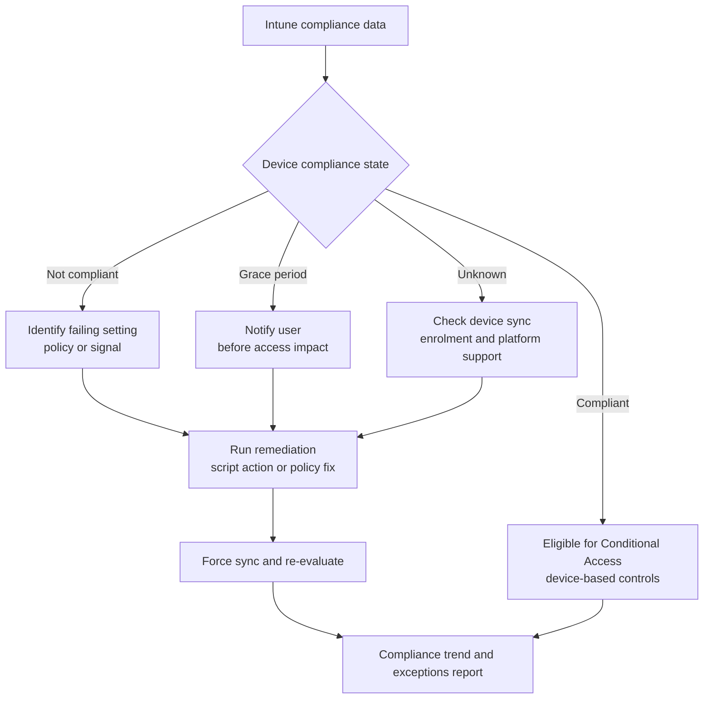
```mermaid
flowchart TB
    DCD_Intune["Intune compliance data"] --> DCD_State{"Device compliance state"}
    DCD_State -->|"Compliant"| DCD_Access["Eligible for Conditional Access<br/>device-based controls"]
    DCD_State -->|"Not compliant"| DCD_Reason["Identify failing setting<br/>policy or signal"]
    DCD_State -->|"Grace period"| DCD_Notify["Notify user<br/>before access impact"]
    DCD_State -->|"Unknown"| DCD_CheckIn["Check device sync<br/>enrolment and platform support"]
    DCD_Reason --> DCD_Remediate["Run remediation<br/>script action or policy fix"]
    DCD_Notify --> DCD_Remediate
    DCD_CheckIn --> DCD_Remediate
    DCD_Remediate --> DCD_Reevaluate["Force sync and re-evaluate"]
    DCD_Reevaluate --> DCD_Report["Compliance trend and exceptions report"]
    DCD_Access --> DCD_Report
```

### Notes

- Use compliance reports with Conditional Access sign-in logs when access is blocked unexpectedly.

---

## Device Compliance Evaluation and Remediation

Shows how Intune evaluates device health, assigns compliance state, and triggers user, admin, or Conditional Access remediation.

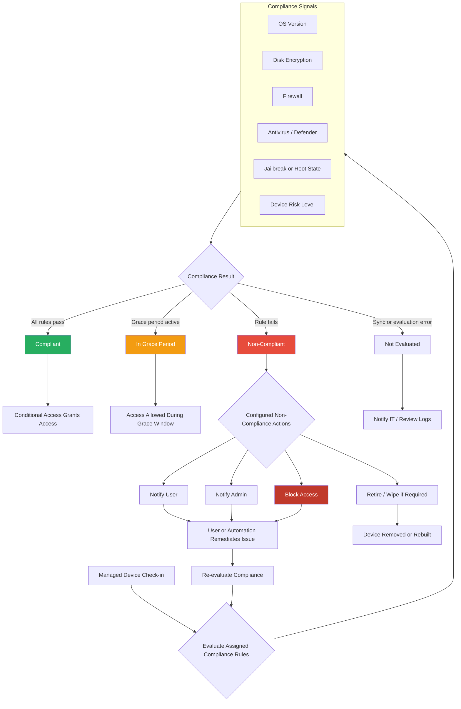
```mermaid
flowchart TB
    Device[Managed Device Check-in] --> Rules{Evaluate Assigned Compliance Rules}

    subgraph Signals["Compliance Signals"]
        OS[OS Version]
        Encryption[Disk Encryption]
        Firewall[Firewall]
        Defender[Antivirus / Defender]
        Jailbreak[Jailbreak or Root State]
        Risk[Device Risk Level]
    end

    Rules --> Signals
    Signals --> Result{Compliance Result}

    Result -->|All rules pass| Compliant[Compliant]
    Result -->|Rule fails| NonCompliant[Non-Compliant]
    Result -->|Sync or evaluation error| NotEvaluated[Not Evaluated]
    Result -->|Grace period active| Grace[In Grace Period]

    Compliant --> Grant[Conditional Access Grants Access]
    Grace --> LimitedGrant[Access Allowed During Grace Window]

    NonCompliant --> Actions{Configured Non-Compliance Actions}
    NotEvaluated --> AdminNotify[Notify IT / Review Logs]

    Actions --> NotifyUser[Notify User]
    Actions --> NotifyAdmin[Notify Admin]
    Actions --> BlockAccess[Block Access]
    Actions --> RetireOrWipe[Retire / Wipe if Required]

    NotifyUser --> Remediate[User or Automation Remediates Issue]
    NotifyAdmin --> Remediate
    Remediate --> Recheck[Re-evaluate Compliance]
    Recheck --> Rules

    BlockAccess --> Remediate
    RetireOrWipe --> Closed[Device Removed or Rebuilt]

    style Compliant fill:#27ae60,color:#fff
    style NonCompliant fill:#e74c3c,color:#fff
    style Grace fill:#f39c12,color:#fff
    style BlockAccess fill:#c0392b,color:#fff
```

### Notes
Compliance is not the same as configuration. Intune evaluates the actual device state against assigned rules, then reports that state to Conditional Access. Use grace periods for changes such as OS updates so users are not blocked during normal remediation windows.

---

## Device Enrollment Decision Tree

Enrollment is the trust anchor. This diagram maps the decision flow for selecting the right enrollment method based on device ownership and platform.

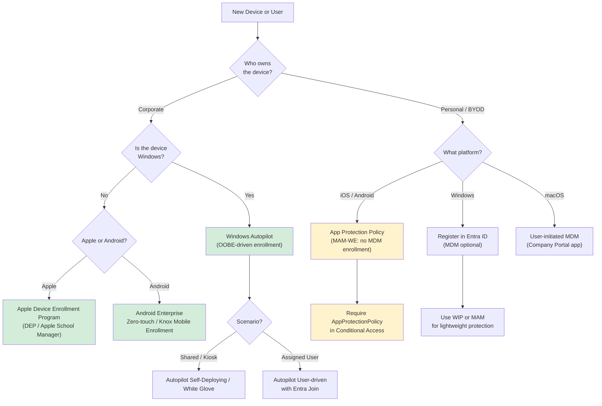
```mermaid
flowchart TD
    A["New Device or User"] --> B{"Who owns
the device?"}

    B -->|Corporate| C{"Is the device
Windows?"}
    B -->|Personal / BYOD| D{"What platform?"}

    C -->|Yes| E["Windows Autopilot<br/>(OOBE-driven enrollment)"]
    C -->|No| F{"Apple or Android?"}

    F -->|Apple| G["Apple Device Enrollment Program<br/>(DEP / Apple School Manager)"]
    F -->|Android| H["Android Enterprise<br/>Zero-touch / Knox Mobile Enrollment"]

    D -->|iOS / Android| I["App Protection Policy<br/>(MAM-WE: no MDM enrollment)"]
    D -->|Windows| J["Register in Entra ID<br/>(MDM optional)"]
    D -->|macOS| K["User-initiated MDM<br/>(Company Portal app)"]

    E --> L{"Scenario?"}
    L -->|Shared / Kiosk| M["Autopilot Self-Deploying / White Glove"]
    L -->|Assigned User| N["Autopilot User-driven<br/>with Entra Join"]

    I --> O["Require AppProtectionPolicy<br/>in Conditional Access"]
    J --> P["Use WIP or MAM<br/>for lightweight protection"]

    style E fill:#d4edda
    style G fill:#d4edda
    style H fill:#d4edda
    style I fill:#fff3cd
    style O fill:#fff3cd
```

### Notes
**Key insight**: **BYOD should rarely be fully MDM-enrolled** on personal devices. Use **Mobile Application Management without enrollment (MAM-WE)** for iOS/Android BYOD to avoid wiping personal data. Windows BYOD can remain unenrolled but use **Windows Information Protection (WIP)** or **MAM**.

---

## Device Enrollment Methods

Shows the main components, decisions, and operational flow for device enrollment methods in Microsoft 365 endpoint management work.

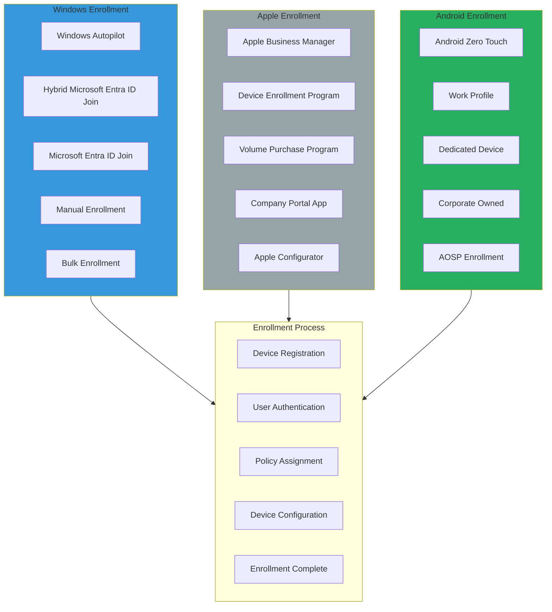
```mermaid
flowchart TB
    subgraph Windows["Windows Enrollment"]
        Autopilot[Windows Autopilot]
        HybridJoin[Hybrid Microsoft Entra ID Join]
        AzureADJoin[Microsoft Entra ID Join]
        Manual[Manual Enrollment]
        Bulk[Bulk Enrollment]
    end

    subgraph Apple["Apple Enrollment"]
        ABM[Apple Business Manager]
        DEP[Device Enrollment Program]
        VPP[Volume Purchase Program]
        CompanyPortal[Company Portal App]
        ACSP[Apple Configurator]
    end

    subgraph Android["Android Enrollment"]
        ZeroTouch[Android Zero Touch]
        WorkProfile[Work Profile]
        Dedicated[Dedicated Device]
        Corporate[Corporate Owned]
        AOSP[AOSP Enrollment]
    end

    subgraph EnrollmentFlow["Enrollment Process"]
        Register[Device Registration]
        Authenticate[User Authentication]
        Assign[Policy Assignment]
        Configure[Device Configuration]
        Enroll[Enrollment Complete]
    end

    Windows --> EnrollmentFlow
    Apple --> EnrollmentFlow
    Android --> EnrollmentFlow

    style Windows fill:#3498db
    style Apple fill:#95a5a6
    style Android fill:#27ae60
```

---

## Device Lifecycle Management

Shows the main components, decisions, and operational flow for device lifecycle management in Microsoft 365 endpoint management work.

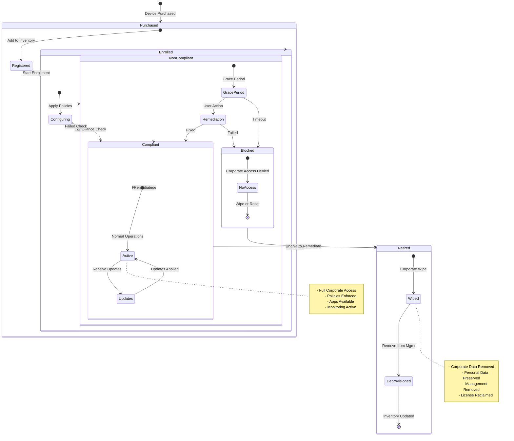
```mermaid
stateDiagram-v2
    [*] --> Purchased : Device Purchased

    state Purchased {
        [*] --> Registered : Add to Inventory
        Registered --> Enrolled : Start Enrollment
    }

    state Enrolled {
        [*] --> Configuring : Apply Policies
        Configuring --> Compliant : Compliance Check
        Configuring --> NonCompliant : Failed Check
    }

    state Compliant {
        [*] --> Active : Normal Operations
        Active --> Updates : Receive Updates
        Updates --> Active : Updates Applied
    }

    state NonCompliant {
        [*] --> GracePeriod : Grace Period
        GracePeriod --> Remediation : User Action
        GracePeriod --> Blocked : Timeout
        Remediation --> Compliant : Fixed
        Remediation --> Blocked : Failed
    }

    state Blocked {
        [*] --> NoAccess : Corporate Access Denied
        NoAccess --> [*] : Wipe or Reset
    }

    state Retired {
        [*] --> Wiped : Corporate Wipe
        Wiped --> Deprovisioned : Remove from Mgmt
        Deprovisioned --> [*] : Inventory Updated
    }

    Purchased --> Enrolled
    Enrolled --> Compliant
    Enrolled --> NonCompliant
    Compliant --> NonCompliant : Policy Change
    NonCompliant --> Compliant : Remediated
    Compliant --> Retired : End of Life
    Blocked --> Retired : Unable to Remediate

    note right of Active
        - Full Corporate Access
        - Policies Enforced
        - Apps Available
        - Monitoring Active
    end note

    note right of Wiped
        - Corporate Data Removed
        - Personal Data Preserved
        - Management Removed
        - License Reclaimed
    end note
```

---

## Device Retirement Process

Shows the main components, decisions, and operational flow for device retirement process in Microsoft 365 endpoint management work.

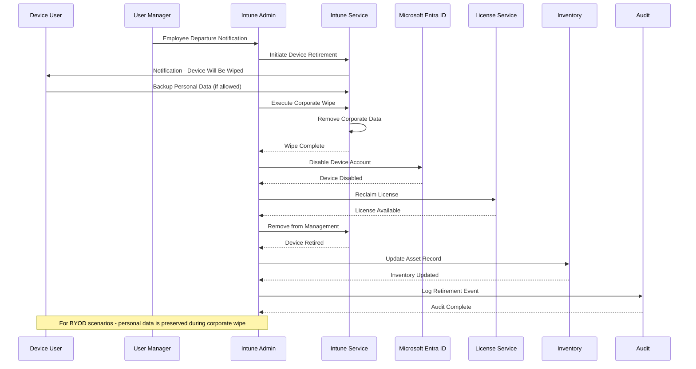
```mermaid
sequenceDiagram
    participant User as Device User
    participant Manager as User Manager
    participant Admin as Intune Admin
    participant Intune as Intune Service
    participant AAD as Microsoft Entra ID
    participant License as License Service

    Manager->>Admin: Employee Departure Notification
    Admin->>Intune: Initiate Device Retirement

    Intune->>User: Notification - Device Will Be Wiped
    User->>Intune: Backup Personal Data (if allowed)

    Admin->>Intune: Execute Corporate Wipe
    Intune->>Intune: Remove Corporate Data
    Intune-->>Admin: Wipe Complete

    Admin->>AAD: Disable Device Account
    AAD-->>Admin: Device Disabled

    Admin->>License: Reclaim License
    License-->>Admin: License Available

    Admin->>Intune: Remove from Management
    Intune-->>Admin: Device Retired

    Admin->>Inventory: Update Asset Record
    Inventory-->>Admin: Inventory Updated

    Admin->>Audit: Log Retirement Event
    Audit-->>Admin: Audit Complete

    note over User, Admin: For BYOD scenarios - personal data is preserved during corporate wipe
```

---

## Endpoint Analytics and Advanced Analytics

Endpoint Analytics and Advanced Analytics help admins identify device performance, reliability and user-experience issues from managed endpoint signals.

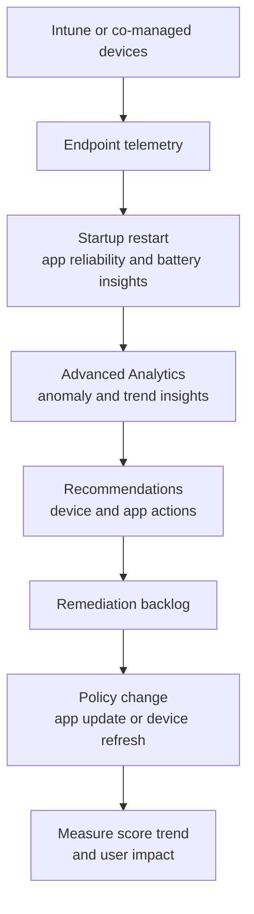
```mermaid
flowchart TB
    EA_Devices["Intune or co-managed devices"] --> EA_Telemetry["Endpoint telemetry"]
    EA_Telemetry --> EA_Scores["Startup restart<br/>app reliability and battery insights"]
    EA_Scores --> EA_Advanced["Advanced Analytics<br/>anomaly and trend insights"]
    EA_Advanced --> EA_Recommendations["Recommendations<br/>device and app actions"]
    EA_Recommendations --> EA_Backlog["Remediation backlog"]
    EA_Backlog --> EA_Action["Policy change<br/>app update or device refresh"]
    EA_Action --> EA_Trend["Measure score trend<br/>and user impact"]
```

---

## Endpoint Privilege Management Elevation Flow

Endpoint Privilege Management lets standard users complete approved elevated tasks without becoming local administrators.

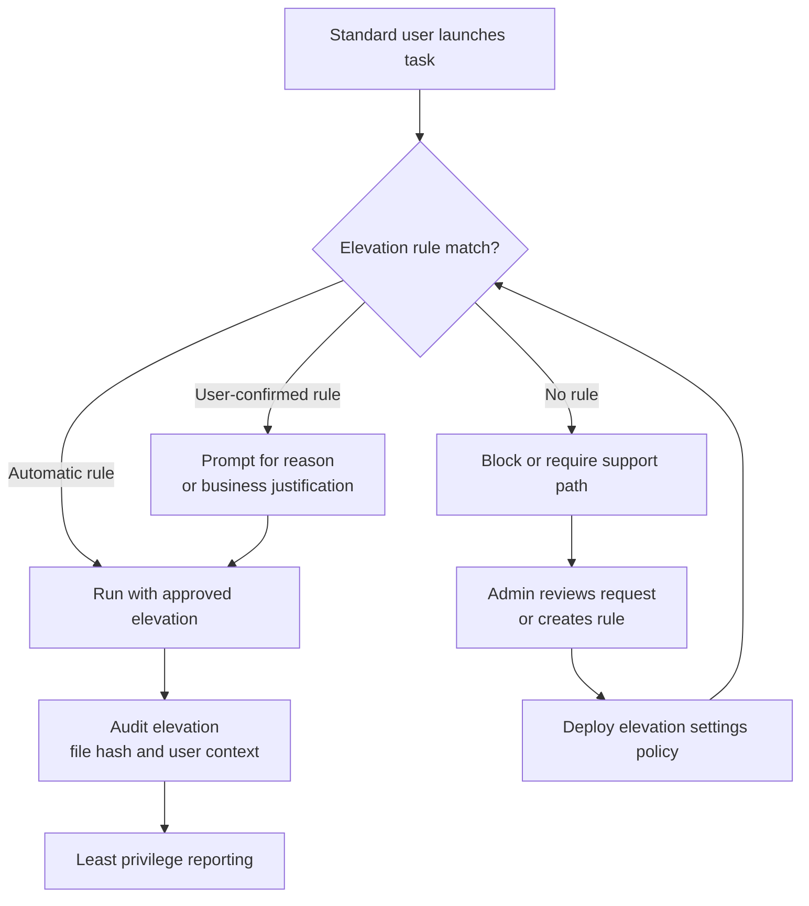
```mermaid
flowchart TB
    EPM_User["Standard user launches task"] --> EPM_Rule{"Elevation rule match?"}
    EPM_Rule -->|"Automatic rule"| EPM_Elevate["Run with approved elevation"]
    EPM_Rule -->|"User-confirmed rule"| EPM_Justify["Prompt for reason<br/>or business justification"]
    EPM_Rule -->|"No rule"| EPM_Deny["Block or require support path"]
    EPM_Justify --> EPM_Elevate
    EPM_Elevate --> EPM_Audit["Audit elevation<br/>file hash and user context"]
    EPM_Deny --> EPM_Request["Admin reviews request<br/>or creates rule"]
    EPM_Request --> EPM_Policy["Deploy elevation settings policy"]
    EPM_Policy --> EPM_Rule
    EPM_Audit --> EPM_Report["Least privilege reporting"]
```

---

## Endpoint Security Policies

Shows the main components, decisions, and operational flow for endpoint security policies in Microsoft 365 endpoint management work.

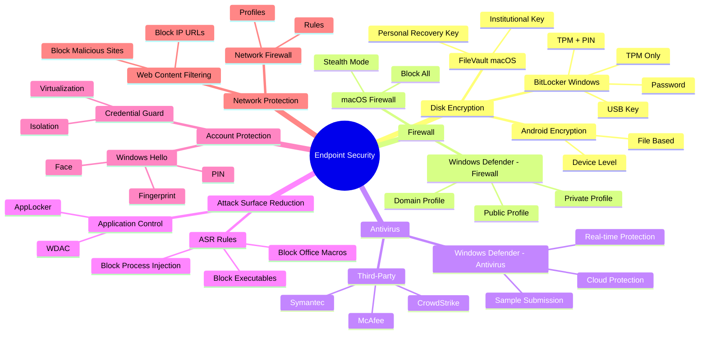
```mermaid
mindmap
  root((Endpoint Security))
    Disk Encryption
        BitLocker Windows
            TPM + PIN
            TPM Only
            USB Key
            Password
        FileVault macOS
            Institutional Key
            Personal Recovery Key
        Android Encryption
            Device Level
            File Based
    Firewall
        Windows Defender - Firewall
            Domain Profile
            Private Profile
            Public Profile
        macOS Firewall
            Block All
            Stealth Mode
    Antivirus
        Windows Defender - Antivirus
            Real-time Protection
            Cloud Protection
            Sample Submission
        Third-Party
            Symantec
            McAfee
            CrowdStrike
    Attack Surface Reduction
        ASR Rules
            Block Office Macros
            Block Executables
            Block Process Injection
        Application Control
            AppLocker
            WDAC
    Account Protection
        Windows Hello
            Face
            Fingerprint
            PIN
        Credential Guard
            Virtualization
            Isolation
    Network Protection
        Web Content Filtering
            Block Malicious Sites
            Block IP URLs
        Network Firewall
            Rules
            Profiles
```

---

## Enterprise App Management Lifecycle

Enterprise App Management streamlines Win32 app lifecycle work through a curated app catalogue, default metadata and update handling.

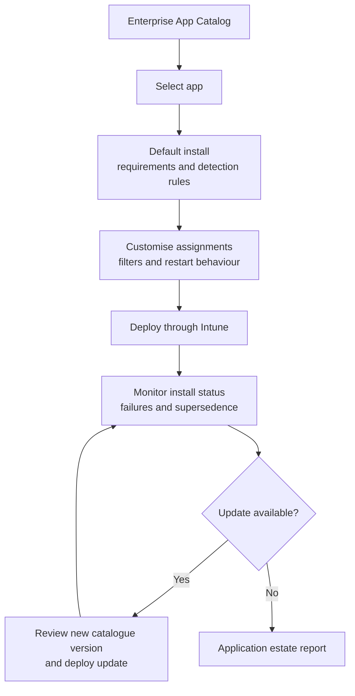
```mermaid
flowchart TB
    EAM_Catalog["Enterprise App Catalog"] --> EAM_Select["Select app"]
    EAM_Select --> EAM_Metadata["Default install<br/>requirements and detection rules"]
    EAM_Metadata --> EAM_Customise["Customise assignments<br/>filters and restart behaviour"]
    EAM_Customise --> EAM_Deploy["Deploy through Intune"]
    EAM_Deploy --> EAM_Status["Monitor install status<br/>failures and supersedence"]
    EAM_Status --> EAM_Update{"Update available?"}
    EAM_Update -->|"Yes"| EAM_Refresh["Review new catalogue version<br/>and deploy update"]
    EAM_Update -->|"No"| EAM_Report["Application estate report"]
    EAM_Refresh --> EAM_Status
```

---

## Intune Admin Role Structure

Shows the main components, decisions, and operational flow for intune admin role structure in Microsoft 365 endpoint management work.

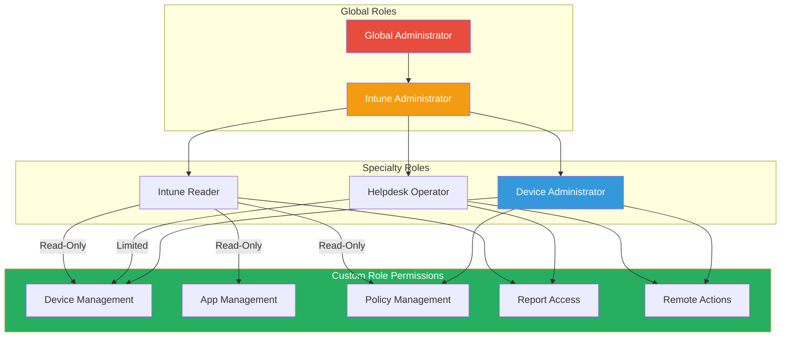
```mermaid
flowchart TB
    subgraph Global["Global Roles"]
        GA[Global Administrator]
        IntuneAdmin[Intune Administrator]
    end

    subgraph Specialty["Specialty Roles"]
        DeviceAdmin[Device Administrator]
        HelpDesk[Helpdesk Operator]
        Reader[Intune Reader]
    end

    subgraph Custom["Custom Role Permissions"]
        Devices[Device Management]
        Apps[App Management]
        Policies[Policy Management]
        Reports[Report Access]
        Remote[Remote Actions]
    end

    GA --> IntuneAdmin
    IntuneAdmin --> DeviceAdmin
    IntuneAdmin --> HelpDesk
    IntuneAdmin --> Reader

    DeviceAdmin --> Devices
    DeviceAdmin --> Policies
    DeviceAdmin --> Remote

    HelpDesk --> Remote
    HelpDesk --> Reports
    HelpDesk -->|Limited| Devices

    Reader --> Reports
    Reader -->|Read-Only| Devices
    Reader -->|Read-Only| Apps
    Reader -->|Read-Only| Policies

    style GA fill:#e74c3c,color:#fff
    style IntuneAdmin fill:#f39c12,color:#fff
    style DeviceAdmin fill:#3498db,color:#fff
    style Custom fill:#27ae60,color:#fff
```

---

## Intune Architecture Overview

Shows the main components, decisions, and operational flow for intune architecture overview in Microsoft 365 endpoint management work.

```mermaid
flowchart TB
    subgraph Intune["Microsoft Intune Service"]
        direction TB

        subgraph DeviceMgmt["Device Management"]
            Enrollment[Device Enrollment]
            Config[Configuration Profiles]
            Compliance[Compliance Policies]
            Updates[Update Policies]
        end

        subgraph AppMgmt["Application Management"]
            AppDeploy[App Deployment]
            MAM[Mobile App Mgmt]
            MDM[Mobile Device Mgmt]
            VPP[Volume Purchase Program]
        end

        subgraph Security["Security & Protection"]
            Defender[Intune Defender]
            BitLocker[BitLocker Mgmt]
            Firewall[Firewall Policies]
            ATP[Endpoint Security]
        end

        subgraph Reporting["Reporting & Analytics"]
            Inventory[Device Inventory]
            Status[Deployment Status]
            Alerts[Alerts & Notifications]
            Logs[Audit Logs]
        end
    end

    subgraph Endpoints["Managed Endpoints"]
        Windows[Windows 10/11]
        macOS[macOS Devices]
        iOS[iOS/iPadOS]
        Android[Android Devices]
        Linux[Linux Devices]
    end

    subgraph Integration["Service Integration"]
        AAD[Microsoft Entra ID]
        ConfigMgr[Configuration Manager]
        Autopilot[Windows Autopilot]
        Apple[Apple Business Manager]
        Google[Google Zero Touch]
    end

    Integration --> Intune
    Intune --> Endpoints

    style Intune fill:#1a1a2e,stroke:#0078d4,stroke-width:3px
```

---

## Intune Cloud Architecture: How It Connects

Intune is a cloud-native endpoint management service. This diagram shows how the Intune service sits between your identity layer, devices, and the broader Microsoft security ecosystem.

```mermaid
flowchart TB
    subgraph Identity["Identity & Access"]
        Entra["Microsoft Entra ID"]
        CA["Conditional Access Engine"]
        AD["On-Prem AD<br/>(via Microsoft Entra Connect Sync / Cloud Sync)"]
    end

    subgraph IntuneSvc["Microsoft Intune Service"]
        direction TB
        API["Intune Graph API"]
        PEM["Policy & Enrollment
Management"]
        RS["Reporting &
Compliance Store"]
    end

    subgraph Endpoints["Managed Endpoints"]
        direction TB
        Win["Windows 10/11
(MDM Agent / OMADM)"]
        Mac["macOS
(Apple MDM Protocol)"]
        iOS["iOS / iPadOS
(Apple MDM Protocol)"]
        And["Android
(Device Admin /
DPC / Android Enterprise)"]
        Lin["Linux
(Intune Agent)"]
    end

    subgraph Ecosystem["Integrated Ecosystem"]
        Def["Microsoft Defender for Endpoint"]
        AC["App Assurance /
App Protection"]
        WUfB["Windows Update for Business"]
        EP["Endpoint Analytics"]
        TB["Troubleshooting Portal"]
    end

    AD -->|Sync| Entra
    Entra -->|Auth + Device State| CA
    CA -->|Grant / Block| Endpoints
    Entra -->|Device Identity| IntuneSvc
    IntuneSvc -->|Policy / Config / Apps| Endpoints
    Endpoints -->|Heartbeat / Inventory / Compliance| IntuneSvc
    IntuneSvc <-->|Threat Signals| Def
    IntuneSvc <-->|App Config / WIP| AC
    IntuneSvc <-->|Update Rings| WUfB
    IntuneSvc -->|Performance / Reliability| EP
    IntuneSvc -->|Device Actions / Logs| TB
```

### Notes
**Key insight**: Intune uses the **Open Mobile Alliance Device Management (OMA-DM)** protocol for Windows, while Apple devices communicate via the **Apple Push Notification service (APNs)**. Android supports multiple enrollment modes—legacy Device Admin, Work Profile (Android Enterprise), and fully managed devices.

---

## Intune Security Integration Architecture

Intune's power comes from its native integration with Microsoft's extended detection and response (XDR) stack. This diagram maps the bidirectional data flow.

```mermaid
flowchart TB
    subgraph Intune["Microsoft Intune"]
        I1["Device Compliance"]
        I2["Endpoint Security<br/>(Antivirus / Firewall / DiskEncryption / ASR)"]
        I3["Attack Surface Reduction<br/>Policy (ASR)"]
        I4["Device Actions<br/>(Isolate / Run AV / Rotate BitLocker)"]
    end

    subgraph Defender["Microsoft Defender for Endpoint"]
        D1["Threat & Vulnerability Management"]
        D2["Advanced Hunting<br/>(KQL)"]
        D3["Live Response / Isolation"]
        D4["Device Risk Score"]
    end

    subgraph Entra["Microsoft Entra"]
        CA["Conditional Access"]
        Risk["Identity Protection<br/>Risk Detections"]
    end

    subgraph Analytics["Endpoint Analytics"]
        EA1["Proactive Remediations<br/>(PowerShell scripts)"]
        EA2["Startup Performance"]
        EA3["Application Reliability"]
        EA4["Recommended Software<br/>Update policies"]
    end

    Intune <-->|Sync device state| Defender
    Intune <-->|Compliance signal| Entra
    Defender -->|Risk score| Entra
    Entra -->|Block / Allow / MFA| Intune
    Intune -->|Deploy health scripts| Analytics
    Analytics -->|Remediation status| Intune
    Defender -->|Threat context| D2
    D2 -->|Custom detection rules| D3
```

### Notes
**Key insight**: The **Defender for Endpoint** integration allows Intune to receive **device risk scores** (e.g., device is actively compromised) and dynamically mark the device **non-compliant**, triggering Conditional Access to block corporate resources in near real-time.

---

## Intune Suite Architecture

Microsoft Intune Suite extends core endpoint management with advanced support, privilege, analytics, certificate, tunnel and application capabilities.

```mermaid
flowchart TB
    ISA_Core["Microsoft Intune core<br/>enrolment policy apps compliance"] --> ISA_Addons["Intune Suite and add-ons"]
    ISA_Addons --> ISA_EPM["Endpoint Privilege Management"]
    ISA_Addons --> ISA_Remote["Remote Help"]
    ISA_Addons --> ISA_Tunnel["Microsoft Tunnel for MAM"]
    ISA_Addons --> ISA_PKI["Microsoft Cloud PKI"]
    ISA_Addons --> ISA_Analytics["Advanced Analytics"]
    ISA_Addons --> ISA_EAM["Enterprise App Management"]
    ISA_EPM --> ISA_Outcomes["Least privilege endpoint operations"]
    ISA_Remote --> ISA_Outcomes
    ISA_Tunnel --> ISA_Outcomes
    ISA_PKI --> ISA_Outcomes
    ISA_Analytics --> ISA_Outcomes
    ISA_EAM --> ISA_Outcomes
    ISA_Outcomes --> ISA_Report["Operational reports<br/>licence and adoption review"]
```

### Notes

- Some capabilities are available as standalone add-ons, in Intune Plan 2, or in the Intune Suite. Confirm entitlement before deployment.

---

## Microsoft Tunnel Architecture

Microsoft Tunnel gives managed apps a protected path to internal resources without exposing those resources directly to the internet.

```mermaid
flowchart TB
    MT_App["Managed mobile app"] --> MT_MAM["App protection policy<br/>and tunnel profile"]
    MT_MAM --> MT_Gateway["Microsoft Tunnel Gateway<br/>Linux server"]
    MT_Gateway --> MT_Internal["Internal app or service"]
    MT_App --> MT_CA["Conditional Access<br/>identity and device signals"]
    MT_CA --> MT_Allow{"Access allowed?"}
    MT_Allow -->|"Yes"| MT_MAM
    MT_Allow -->|"No"| MT_Block["Block connection"]
    MT_Gateway --> MT_Logs["Gateway logs<br/>Intune reports and health"]
    MT_Block --> MT_Logs
```

---

## Mobile Application Management (MAM)

Shows the main components, decisions, and operational flow for mobile application management (mam) in Microsoft 365 endpoint management work.

```mermaid
flowchart TB
    subgraph AppProtection["App Protection Policies"]
        DataProtection[Data Protection]
        AccessRequirements[Access Requirements]
        ConditionalLaunch[Conditional Launch]
        DataTransfer[Data Transfer Rules]
    end

    subgraph ManagedApps["Managed Applications"]
        Office[Office Apps]
        Teams[Teams]
        Outlook[Outlook]
        Edge[Edge Browser]
        ThirdParty[Third-Party Apps]
    end

    subgraph Actions["Protection Actions"]
        PIN[Require PIN]
        MFA[Require MFA]
        Encrypt[Encrypt Data]
        BlockCopy[Block Copy/Paste]
        BlockSave[Block Save As]
        Wipe[Selective Wipe]
    end

    User[User Opens App] --> CheckPolicy{MAM Policy Applied?}
    CheckPolicy -->|Yes| Enforce[Enforce Policies]
    CheckPolicy -->|No| Allow[Allow Without Restrictions]

    Enforce --> PIN
    Enforce --> MFA
    Enforce --> Encrypt
    Enforce --> DataTransfer

    DataTransfer --> BlockCopy
    DataTransfer --> BlockSave

    PIN --> Access[Grant App Access]
    MFA --> Access
    Encrypt --> Access

    Access --> UseApp[Use Application]
    UseApp --> Monitor[Monitor Activity]

    Monitor --> Violation{Policy Violation?}
    Violation -->|Yes| WipeAction[Selective Wipe]
    Violation -->|No| Continue[Continue Monitoring]

    WipeAction --> RemoveData[Remove Corporate Data]
    RemoveData --> Notify[Notify User/Admin]

    style AppProtection fill:#3498db,color:#fff
    style ManagedApps fill:#27ae60,color:#fff
    style Actions fill:#e74c3c,color:#fff
    style WipeAction fill:#c0392b,color:#fff
```

---

## Policy Delivery Engine: The Sync Pipeline

Once a device is enrolled, Intune must deliver configurations, apps, and compliance rules. This sequence diagram shows the MDM sync lifecycle.

```mermaid
sequenceDiagram
    actor Admin
    participant Portal as Intune Admin Center
    participant Graph as Microsoft Graph API
    participant Intune as Intune Service
    participant Device as Managed Device
    participant Platform as Platform Notification

    Admin->>Portal: Create / Update policy<br/>e.g., Device Compliance
    Portal->>Graph: PATCH /deviceManagement/.../{policy-id}
    Graph->>Intune: Write to Policy Store

    Note over Intune: Policy targeted to Entra group(s)

    alt Immediate Push
        Intune->>Platform: Push notification
        Platform->>Device: APNs / WNS / FCM
        Device->>Intune: Initiate sync (OMADM / MDM)
    else Scheduled Sync
        Note over Device: Every 8 hours by default
        Device->>Intune: Scheduled sync check-in
    end

    Device->>Intune: GET policy payload
    Intune-->>Device: Return CSP / JSON config

    Note over Device: Device applies Configuration Service Providers (CSPs)

    Device->>Intune: Report status + inventory
    Intune->>Graph: Update device state
    Graph-->>Portal: Refresh device compliance blade

    alt Policy requires Compliance Check
        Intune->>Intune: Evaluate against Compliance Rule
        Intune->>Entra CA: Sync device compliance state
    end
```

### Notes
**Key insight**: The default sync interval is **every 8 hours**, but critical policies (retire, wipe, lock) trigger an **instant push** via platform notification services (APNs for Apple, WNS for Windows, FCM for Android). You can also manually initiate a sync from the Company Portal or admin console.

---

## Remote Actions Matrix

Shows the main components, decisions, and operational flow for remote actions matrix in Microsoft 365 endpoint management work.

```mermaid
flowchart LR
    subgraph Actions["Remote Actions"]
        Sync[Sync Device]
        Restart[Restart Device]
        RotateKey[Rotate BitLocker Key]
        FreshStart[Fresh Start]
        AutopilotReset[Autopilot Reset]
        Retire[Retire Device]
        Wipe[Wipe Device]
    end

    subgraph Impact["Data Impact"]
        NoData[No Data Loss]
        CorporateData[Corporate Data Only]
        AllData[All Data Lost]
    end

    subgraph UseCase["Primary Use Case"]
        Troubleshoot[Troubleshooting]
        Security[Security Response]
        Decommission[Decommissioning]
        Reprovision[Reprovisioning]
    end

    Sync --> NoData
    Restart --> NoData
    RotateKey --> NoData

    FreshStart --> CorporateData
    Retire --> CorporateData

    AutopilotReset --> AllData
    Wipe --> AllData

    Sync --> Troubleshoot
    Restart --> Troubleshoot

    RotateKey --> Security
    FreshStart --> Security
    Wipe --> Security

    Retire --> Decommission
    AutopilotReset --> Reprovision

    style NoData fill:#27ae60,color:#fff
    style CorporateData fill:#f39c12,color:#fff
    style AllData fill:#e74c3c,color:#fff
```

---

## Remote Help Support Session Flow

Remote Help provides authenticated help desk sessions with role-based controls, compliance visibility and audit records.

```mermaid
flowchart TB
    RH_Helper["Helper signs in"] --> RH_RBAC["Role-based access control"]
    RH_Sharer["Sharer signs in"] --> RH_Device["Enrolled or supported device"]
    RH_RBAC --> RH_Session["Start Remote Help session"]
    RH_Device --> RH_Session
    RH_Session --> RH_Compliance["Show device compliance<br/>and warning context"]
    RH_Compliance --> RH_Mode{"Support mode"}
    RH_Mode -->|"View screen"| RH_View["View-only assistance"]
    RH_Mode -->|"Take control"| RH_Control["User-approved control"]
    RH_View --> RH_Resolve["Resolve issue"]
    RH_Control --> RH_Resolve
    RH_Resolve --> RH_Audit["Session audit record<br/>and support notes"]
```

---

## Windows Autopatch Service Flow

Windows Autopatch automates update rollout for eligible Intune-managed or co-managed Windows devices and Microsoft 365 apps.

```mermaid
flowchart TB
    WA_Devices["Eligible Windows devices"] --> WA_Register["Register with Windows Autopatch"]
    WA_Register --> WA_Rings["Autopatch deployment rings"]
    WA_Rings --> WA_Updates["Windows quality feature<br/>driver and Microsoft 365 app updates"]
    WA_Updates --> WA_Monitor["Monitor deployment status"]
    WA_Monitor --> WA_Issue{"Issue detected?"}
    WA_Issue -->|"No"| WA_Continue["Continue rollout"]
    WA_Issue -->|"Yes"| WA_Pause["Pause or rollback<br/>where supported"]
    WA_Pause --> WA_Service["Service request<br/>and remediation"]
    WA_Service --> WA_Continue
    WA_Continue --> WA_Report["Update compliance reporting"]
```

---

## Windows Autopilot Deployment Lifecycle

Shows the full Autopilot lifecycle from hardware registration through OOBE, profile assignment, Intune enrolment, ESP, and operational compliance.

```mermaid
flowchart TB
    Register[OEM / Reseller / IT Registers Hardware Hash] --> Assign[Assign Autopilot Profile]
    Assign --> OOBE[User Powers On Device During OOBE]
    OOBE --> Profile[Device Contacts Autopilot Service]
    Profile --> Mode{Deployment Mode}

    Mode -->|User-driven| UserAuth[User Authenticates to Microsoft Entra ID]
    Mode -->|Self-deploying| DeviceToken[Device Token Authentication]
    Mode -->|Pre-provisioned| ITPrep[IT Pre-provisions and Reseals Device]

    UserAuth --> EntraJoin[Microsoft Entra Join or Hybrid Join]
    DeviceToken --> EntraJoin
    ITPrep --> EntraJoin

    EntraJoin --> IntuneEnroll[Intune MDM Enrolment]
    IntuneEnroll --> ESP[Enrollment Status Page]

    subgraph Provisioning["Provisioning Payload"]
        Apps[Required Apps]
        Config[Configuration Profiles]
        Compliance[Compliance Policies]
        Branding[Company Branding]
    end

    ESP --> Provisioning
    Provisioning --> Ready{Critical Items Installed?}
    Ready -->|Yes| Desktop[Desktop Ready]
    Ready -->|No| Block[ESP Blocks Access or Times Out]

    Block --> Troubleshoot[Troubleshoot App, Policy, Network, or Assignment]
    Troubleshoot --> ESP

    Desktop --> Operate[Operational Lifecycle]
    Operate --> ComplianceCheck[Daily or Event-driven Compliance Check]
    ComplianceCheck -->|Compliant| Operate
    ComplianceCheck -->|Non-compliant| Remediate[Remediate or Restrict Access]
    Remediate --> ComplianceCheck

    style Desktop fill:#27ae60,color:#fff
    style Block fill:#e74c3c,color:#fff
    style ESP fill:#f39c12,color:#000
```

### Notes
Pre-provisioned deployment, formerly White Glove, lets IT complete the device phase before hand-off. ESP should block only on critical apps and configuration so deployment failures are actionable rather than noisy.

---

## Windows Update for Business Ring Configuration

Shows how Intune update rings map Microsoft release dates to pilot, broad, and critical-device deployment waves.

```mermaid
flowchart LR
    subgraph Release["Microsoft Release Cadence"]
        Patch[Quality Update<br/>Patch Tuesday]
        Feature[Feature Update]
        Drivers[Driver and Product Updates]
    end

    subgraph Rings["Deployment Rings"]
        Ring0[Ring 0: Test<br/>0-day deferral]
        Ring1[Ring 1: IT Pilot<br/>7-day quality deferral]
        Ring2[Ring 2: Early Adopters<br/>14-day quality deferral]
        Ring3[Ring 3: Broad Production<br/>21-day quality deferral]
        Ring4[Ring 4: Critical Systems<br/>Manual or longer deferral]
    end

    subgraph Controls["Per-ring Controls"]
        Deferral[Quality and Feature Deferrals]
        Deadline[Deadline and Grace Period]
        Restart[Restart Behaviour and Active Hours]
        Scope[Driver / Product Update Scope]
        Pause[Pause or Roll Back]
    end

    Patch & Feature & Drivers --> Rings
    Rings --> Controls

    Ring0 -->|Validate| Ring1
    Ring1 -->|No major issues| Ring2
    Ring2 -->|No major issues| Ring3
    Ring3 -->|Exception handling| Ring4

    Controls --> Device[Device Calculates Applicability and Deadline]
    Device --> Monitor{Issues Detected?}
    Monitor -->|No| Continue[Continue Rollout]
    Monitor -->|Yes| Halt[Pause Ring and Investigate]
    Halt --> Fix[Fix Policy, App, Driver, or Update Issue]
    Fix --> Ring0

    style Ring0 fill:#27ae60,color:#fff
    style Ring3 fill:#3498db,color:#fff
    style Halt fill:#e74c3c,color:#fff
```

### Notes
Deferral days are counted from Microsoft's original publication date, not from the day a device checks in. Combine deferrals with deadlines so updates are both staged and eventually enforced.
