# Exchange Online

Exchange Online diagrams for Microsoft 365 admins. This file contains 22 topics covering mail flow, mail protection, authentication, hybrid Exchange, migration, compliance and operational troubleshooting.

## Contents

- [Calendar Sharing and Permissions](#calendar-sharing-and-permissions)
- [Email Address Policy Hierarchy](#email-address-policy-hierarchy)
- [Email Authentication: SPF, DKIM, DMARC and ARC](#email-authentication-spf-dkim-dmarc-and-arc)
- [Email Encryption (OME) Flow](#email-encryption-ome-flow)
- [Email Security Best Practices](#email-security-best-practices)
- [Exchange Admin Center Navigation](#exchange-admin-center-navigation)
- [Exchange Online Architecture Overview](#exchange-online-architecture-overview)
- [Exchange Online Compliance Features](#exchange-online-compliance-features)
- [Exchange Online Limits and Quotas](#exchange-online-limits-and-quotas)
- [Exchange Online Protection Settings](#exchange-online-protection-settings)
- [Exchange PowerShell Commands](#exchange-powershell-commands)
- [Hybrid Exchange Configuration](#hybrid-exchange-configuration)
- [Inbound Mail Flow with Security Layers](#inbound-mail-flow-with-security-layers)
- [Legacy Authentication Blocking](#legacy-authentication-blocking)
- [Mailbox Migration Workflow](#mailbox-migration-workflow)
- [Message Trace Analysis](#message-trace-analysis)
- [Microsoft 365 Groups vs Distribution Groups](#microsoft-365-groups-vs-distribution-groups)
- [Outbound Mail Flow](#outbound-mail-flow)
- [Public Folder Migration](#public-folder-migration)
- [Quarantine Management Flow](#quarantine-management-flow)
- [Shared Mailbox vs User Mailbox](#shared-mailbox-vs-user-mailbox)
- [Transport Rules Decision Tree](#transport-rules-decision-tree)

---

## Calendar Sharing and Permissions

Shows the main components, decisions, and operational flow for calendar sharing and permissions in Microsoft 365 exchange online work.

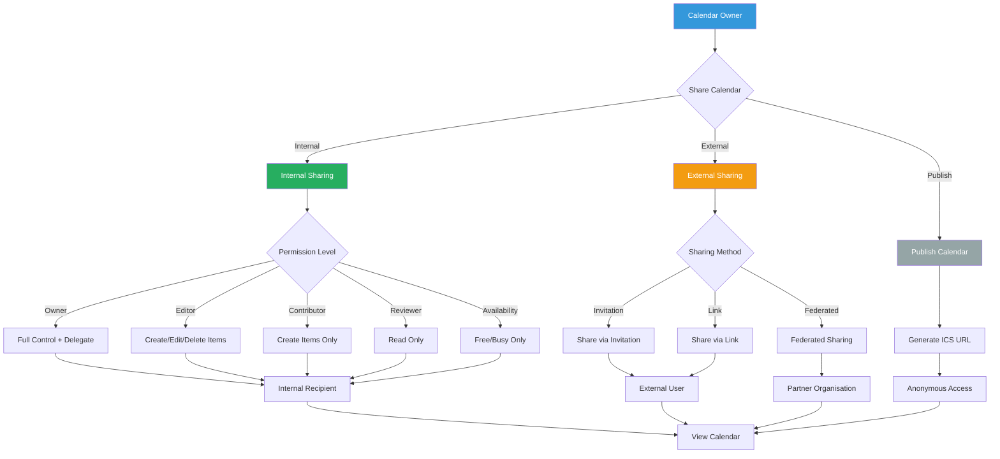

---

## Email Address Policy Hierarchy

Shows the main components, decisions, and operational flow for email address policy hierarchy in Microsoft 365 exchange online work.

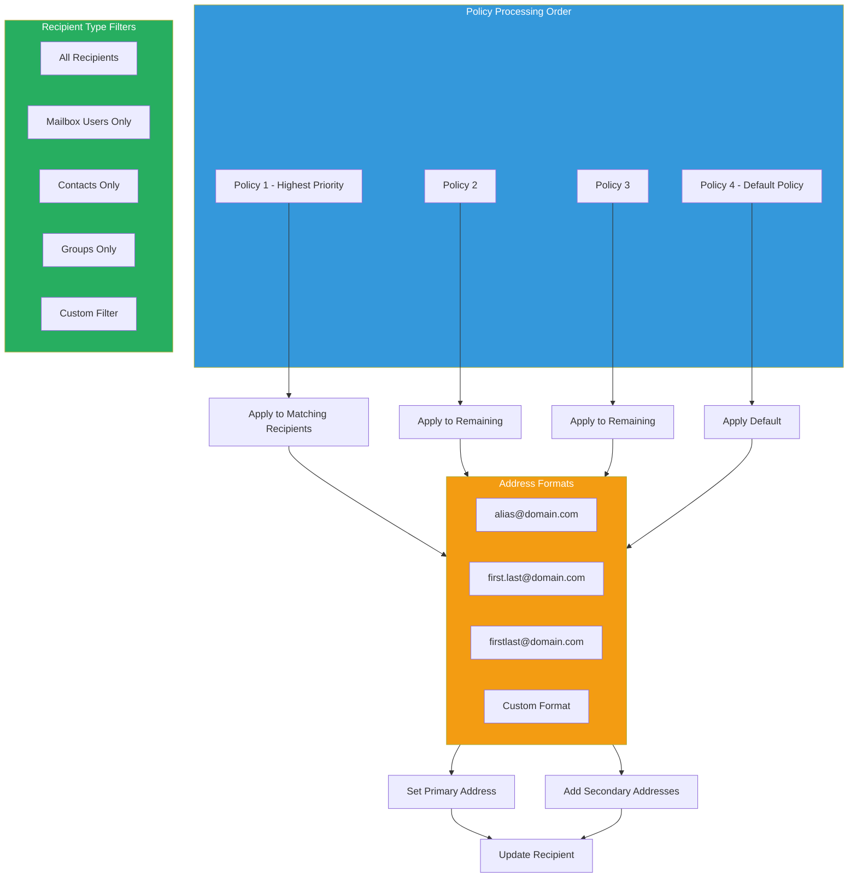

---

## Email Authentication: SPF, DKIM, DMARC and ARC

Email authentication combines DNS records, signing and authentication results so Exchange Online Protection can evaluate sender legitimacy.

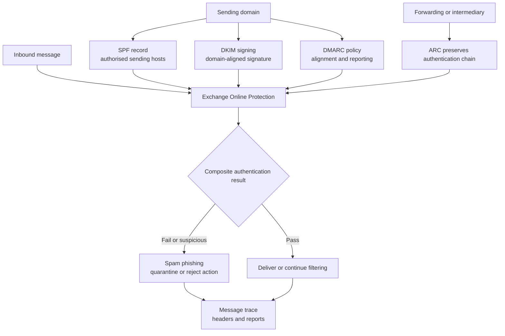

---

## Email Encryption (OME) Flow

Shows the main components, decisions, and operational flow for email encryption (ome) flow in Microsoft 365 exchange online work.

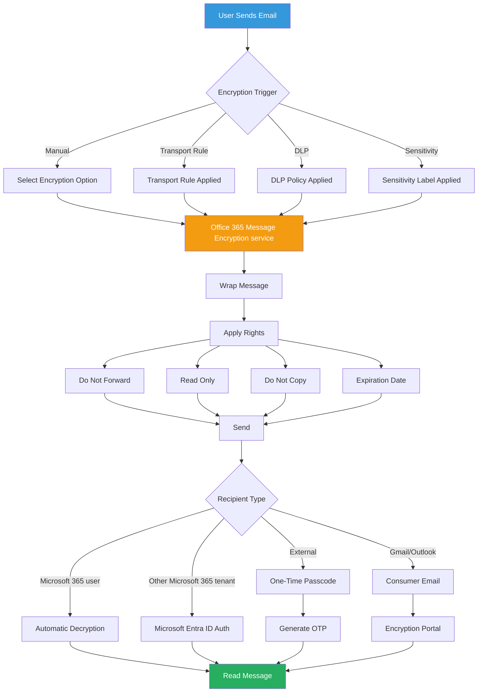

---

## Email Security Best Practices

Shows the main components, decisions, and operational flow for email security best practices in Microsoft 365 exchange online work.

```mermaid
flowchart TB
    subgraph DNS["DNS Records"]
        SPF[SPF Record]
        DKIM[DKIM Configuration]
        DMARC[DMARC Policy]
        BIMI[BIMI Record]
    end

    subgraph Authentication["Authentication"]
        MFA[MFA for Admins]
        ModernAuth[Modern Auth Only]
        LegacyBlock[Block Legacy Auth]
    end

    subgraph Protection["Protection Layers"]
        EOP[Exchange Online Protection]
        ATP[Defender for Office 365]
        SafeAttachments[Safe Attachments]
        SafeLinks[Safe Links]
    end

    subgraph Policies["Security Policies"]
        TransportRules[Transport Rules]
        DLPPolicies[DLP Policies]
        RetentionPolicies[Retention Policies]
        QuarantinePolicies[Quarantine Policies]
    end

    DNS --> SPF
    DNS --> DKIM
    DNS --> DMARC
    DNS --> BIMI

    Authentication --> MFA
    Authentication --> ModernAuth
    Authentication --> LegacyBlock

    Protection --> EOP
    Protection --> ATP
    Protection --> SafeAttachments
    Protection --> SafeLinks

    Policies --> TransportRules
    Policies --> DLPPolicies
    Policies --> RetentionPolicies
    Policies --> QuarantinePolicies

    SPF --> PreventSpoof[Prevent Spoofing]
    DKIM --> VerifySender[Verify Sender]
    DMARC --> PolicyEnforcement[Policy Enforcement]

    MFA --> ProtectAdmin[Protect Admin Accounts]
    ModernAuth --> SecureAuth[Secure Authentication]
    LegacyBlock --> ReduceAttack[Reduce Attack Surface]

    style DNS fill:#3498db,color:#fff
    style Authentication fill:#e74c3c,color:#fff
    style Protection fill:#27ae60,color:#fff
    style Policies fill:#f39c12,color:#fff
```

---

## Exchange Admin Center Navigation

Shows the main components, decisions, and operational flow for exchange admin center navigation in Microsoft 365 exchange online work.

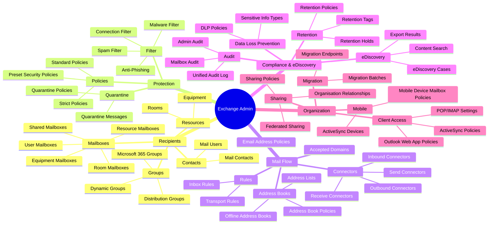

---

## Exchange Online Architecture Overview

Shows the main components, decisions, and operational flow for exchange online architecture overview in Microsoft 365 exchange online work.

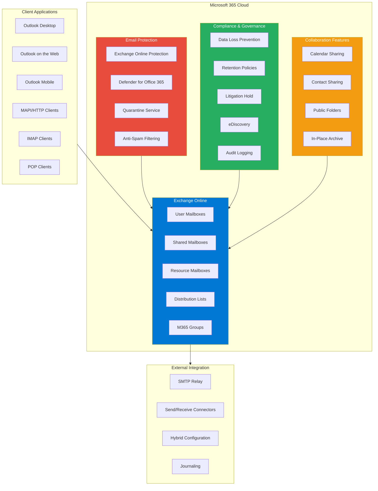

---

## Exchange Online Compliance Features

Exchange Online compliance controls should be planned as policy and evidence flows, not as isolated feature checkboxes.

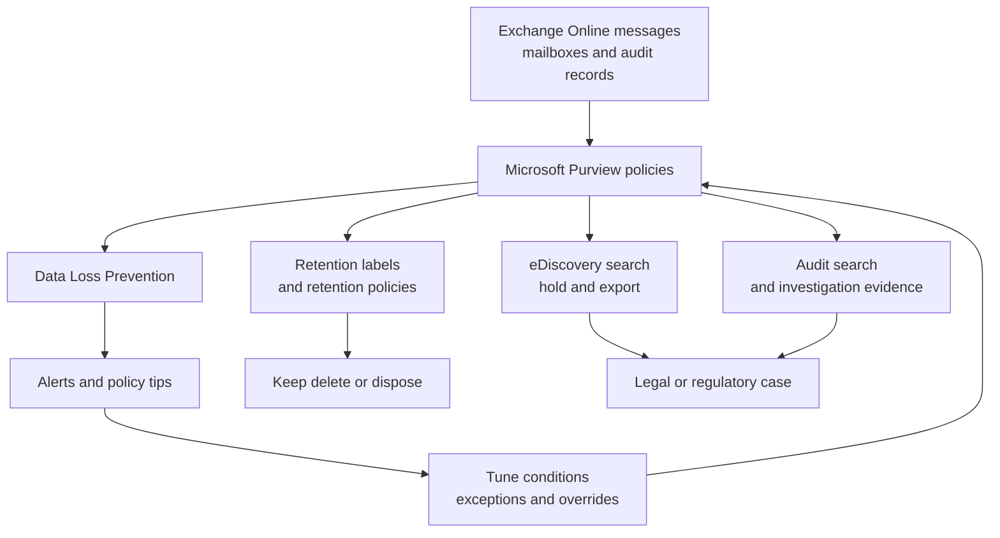

### Notes

- Configure mailbox and message controls in Microsoft Purview where possible so evidence, review and retention are consistent across workloads.

---

## Exchange Online Limits and Quotas

Shows the main components, decisions, and operational flow for exchange online limits and quotas in Microsoft 365 exchange online work.

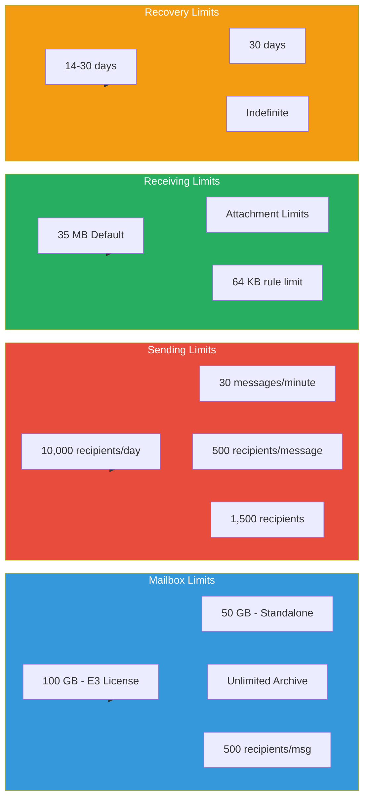

---

## Exchange Online Protection Settings

Shows the main components, decisions, and operational flow for exchange online protection settings in Microsoft 365 exchange online work.

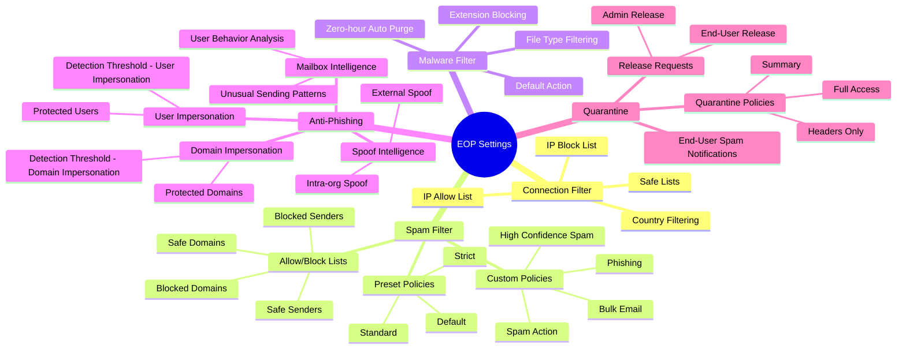

---

## Exchange PowerShell Commands

Shows the main components, decisions, and operational flow for exchange powershell commands in Microsoft 365 exchange online work.

```mermaid
flowchart LR
    subgraph Connection["Module Connection"]
        ImportModule[Import-Module ExchangeOnlineManagement]
        ConnectEXO[Connect-ExchangeOnline]
        DisconnectEXO[Disconnect-ExchangeOnline]
    end

    subgraph Mailbox["Mailbox Management"]
        GetMailbox[Get-Mailbox]
        NewMailbox[New-Mailbox]
        SetMailbox[Set-Mailbox]
        MoveMailbox[New-MoveRequest]
        RemoveMailbox[Remove-Mailbox]
    end

    subgraph Permissions["Permission Management"]
        GetPerm[Get-MailboxPermission]
        AddPerm[Add-MailboxPermission]
        RemovePerm[Remove-MailboxPermission]
        GetFolderPerm[Get-MailboxFolderPermission]
    end

    subgraph Transport["Transport Management"]
        GetTransportRule[Get-TransportRule]
        NewTransportRule[New-TransportRule]
        GetConnector[Get-SendConnector]
        GetQueue[Get-Queue]
    end

    subgraph Reports["Reporting & Tracing"]
        GetMessageTrace[Get-MessageTrace]
        GetMailboxStats[Get-MailboxStatistics]
        GetQuarantine[Get-QuarantineMessage]
        GetDlpReport[Get-DlpComplianceReport]
    end

    Connection --> Mailbox
    Mailbox --> Permissions
    Permissions --> Transport
    Transport --> Reports

    style Connection fill:#3498db,color:#fff
    style Mailbox fill:#27ae60,color:#fff
    style Permissions fill:#f39c12,color:#fff
    style Transport fill:#9b59b6,color:#fff
    style Reports fill:#e67e22,color:#fff
```

---

## Hybrid Exchange Configuration

Shows the main components, decisions, and operational flow for hybrid exchange configuration in Microsoft 365 exchange online work.

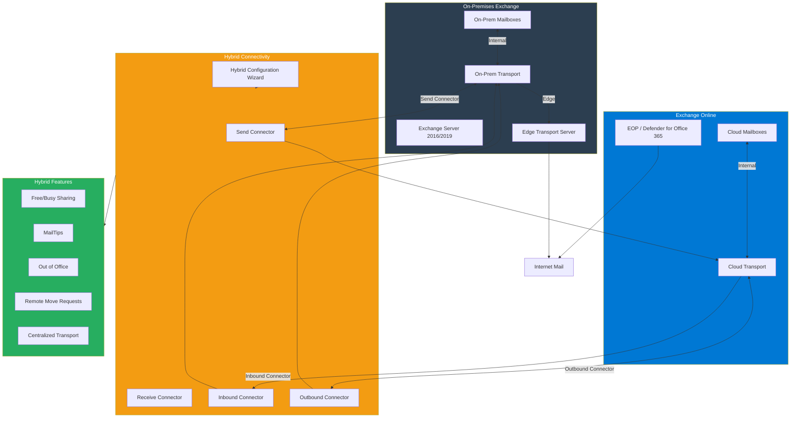

---

## Inbound Mail Flow with Security Layers

Inbound mail flow combines Exchange Online Protection, optional Defender for Office 365 capabilities, transport rules and DLP before delivery.

```mermaid
flowchart LR
    Internet["Internet sender"] --> MX["MX record"]
    MX --> EOPIngress["Exchange Online Protection"]

    subgraph EOPLayers["EOP security layers"]
        RBL["Connection filtering"]
        SPF["SPF validation"]
        DKIM["DKIM validation"]
        DMARC["DMARC validation"]
        SpamFilter["Content filtering"]
        MalwareFilter["Malware scanning"]
    end

    EOPIngress --> RBL
    RBL --> SPF
    SPF --> DKIM
    DKIM --> DMARC
    DMARC --> SpamFilter
    SpamFilter --> MalwareFilter
    MalwareFilter --> ATPDecision{"Defender for Office 365 enabled?"}

    subgraph DefenderFeatures["Defender for Office 365"]
        SafeLinks["Safe Links"]
        SafeAttachments["Safe Attachments"]
        AntiPhish["Anti-phishing"]
        Impersonation["Impersonation protection"]
    end

    ATPDecision -->|"Yes"| SafeLinks
    SafeLinks --> SafeAttachments
    SafeAttachments --> AntiPhish
    AntiPhish --> Impersonation
    Impersonation --> Transport["Transport rules"]
    ATPDecision -->|"No"| Transport

    Transport --> DLP{"DLP check"}
    DLP -->|"Violation"| Action{"Policy action"}
    DLP -->|"Clean"| Delivery["Deliver to mailbox"]
    Action -->|"Block"| Reject["Reject message"]
    Action -->|"Quarantine"| Quarantined["Quarantine message"]
    Action -->|"Encrypt"| OME["Apply message encryption"]
    Action -->|"Modify"| Modify["Modify headers or recipients"]
```

---

## Legacy Authentication Blocking

Blocking legacy authentication reduces credential replay risk by requiring modern authentication and Conditional Access compatible clients.

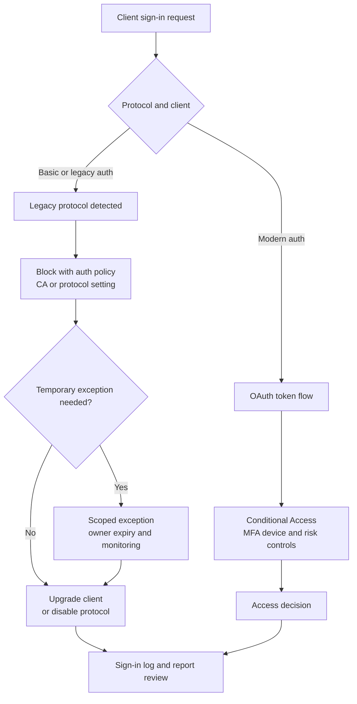

---

## Mailbox Migration Workflow

Shows the main components, decisions, and operational flow for mailbox migration workflow in Microsoft 365 exchange online work.

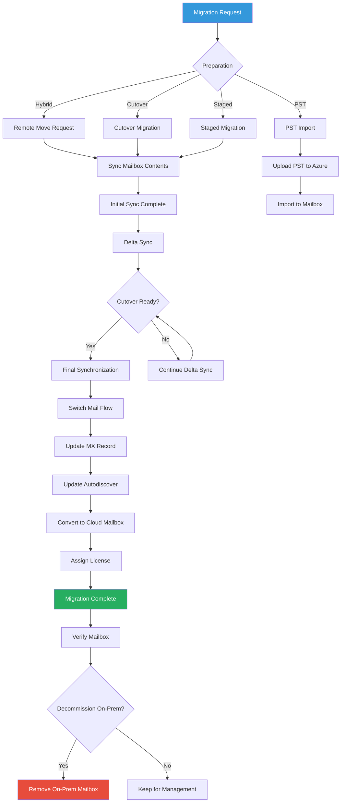

---

## Message Trace Analysis

Use message trace to move from a delivery symptom to the transport event, filtering result and remediation path.

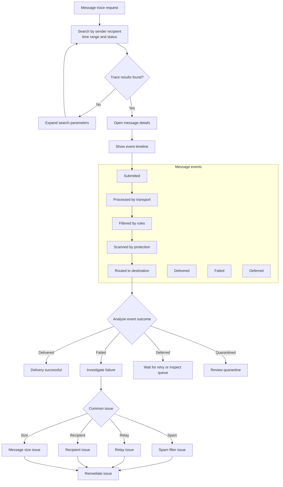

---

## Microsoft 365 Groups vs Distribution Groups

Shows the main components, decisions, and operational flow for office 365 groups vs distribution groups in Microsoft 365 exchange online work.

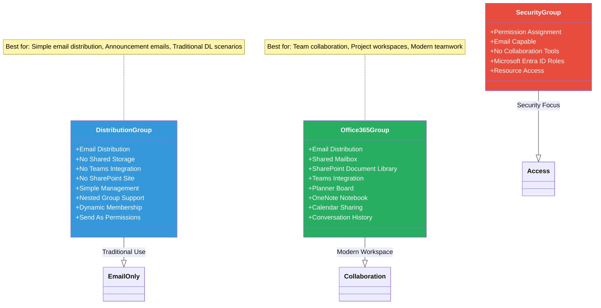

---

## Outbound Mail Flow

Shows the main components, decisions, and operational flow for outbound mail flow in Microsoft 365 exchange online work.

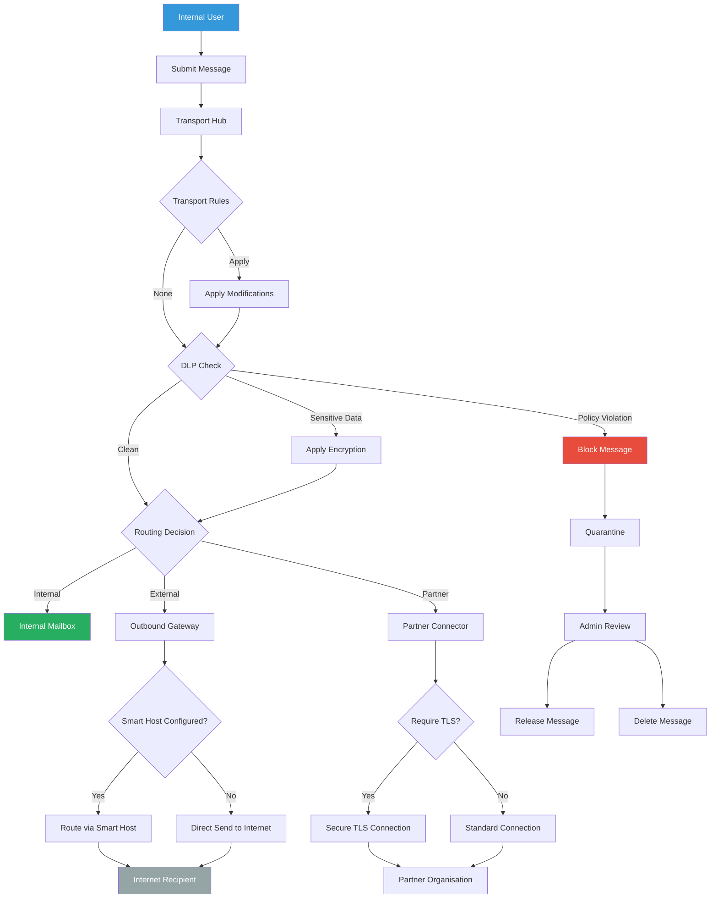

---

## Public Folder Migration

Shows the main components, decisions, and operational flow for public folder migration in Microsoft 365 exchange online work.

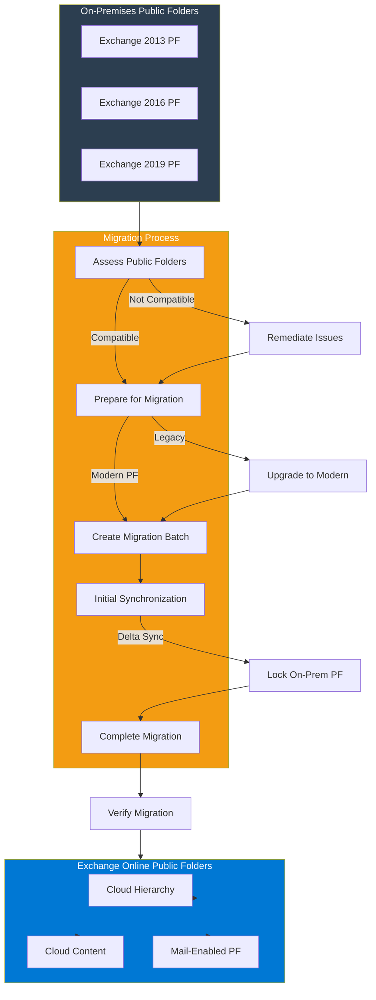

---

## Quarantine Management Flow

Shows the main components, decisions, and operational flow for quarantine management flow in Microsoft 365 exchange online work.

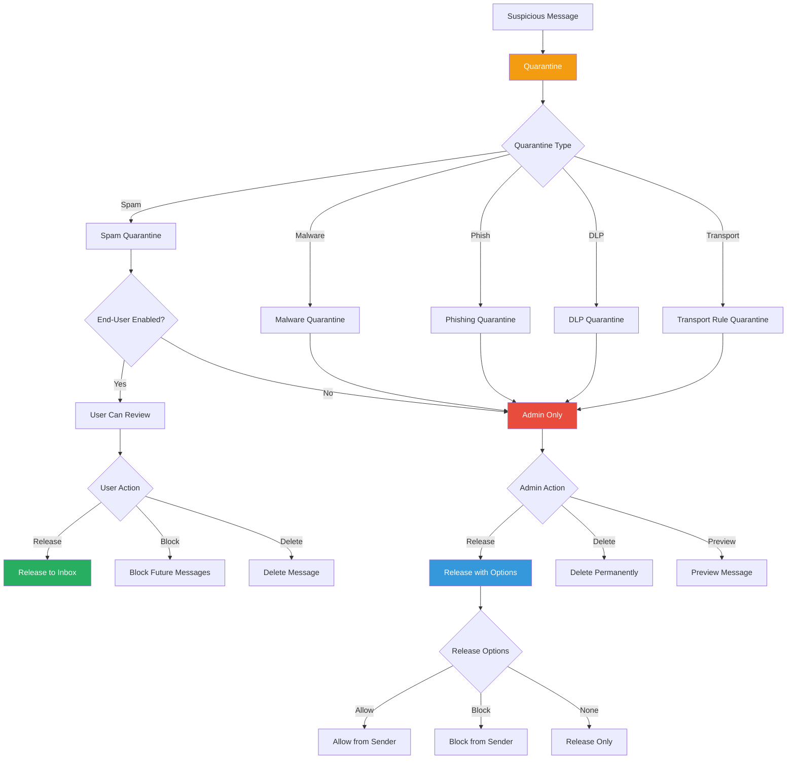

---

## Shared Mailbox vs User Mailbox

Shows the main components, decisions, and operational flow for shared mailbox vs user mailbox in Microsoft 365 exchange online work.

```mermaid
classDiagram
    class UserMailbox {
        +Licence Required
        +Direct Sign-In
        +Primary Email Access
        +Calendar Ownership
        +Sent Items Tracking
        +In-Place Archive
        +Litigation Hold
        +Size: 100 GB (E3)
        +Size: 1.5 TB (E5)
    }

    class SharedMailbox {
        +No Licence Required*
        +No Direct Sign-In
        +Delegate Access
        +Shared Calendar
        +Send As/On Behalf
        +In-Place Archive*
        +Litigation Hold*
        +Size: 50 GB
        +Size: 50 GB (with licence)
    }

    class ResourceMailbox {
        +Room Mailbox
        +Equipment Mailbox
        +Auto-Accept/Decline
        +Scheduling Period
        +Conflict Management
        +No Licence Required
    }

    UserMailbox -- SharedMailbox : Can Convert
    SharedMailbox -- UserMailbox : Can Convert
    UserMailbox -- ResourceMailbox : Can Convert

    note for SharedMailbox "* Requires Exchange Online Plan 2 or Exchange Online Archiving licence for advanced features"

    style UserMailbox fill:#3498db,color:#fff
    style SharedMailbox fill:#27ae60,color:#fff
    style ResourceMailbox fill:#9b59b6,color:#fff
```

---

## Transport Rules Decision Tree

Transport rules evaluate message conditions, apply exceptions and then enforce actions before final delivery.

```mermaid
flowchart TD
    Message["Email message"] --> ConditionsDecision{"Evaluate transport rule conditions"}

    subgraph ConditionTypes["Condition types"]
        Sender["Sender is"]
        Recipient["Recipient is"]
        Subject["Subject contains"]
        Attachment["Has attachment"]
        Size["Message size"]
        Headers["Headers match"]
        Classification["Classification applied"]
    end

    ConditionsDecision --> Sender
    ConditionsDecision --> Recipient
    ConditionsDecision --> Subject
    ConditionsDecision --> Attachment
    ConditionsDecision --> Size
    ConditionsDecision --> Headers
    ConditionsDecision --> Classification
    Classification --> MatchDecision{"Any rule match?"}
    MatchDecision -->|"No"| Deliver["Normal delivery"]
    MatchDecision -->|"Yes"| ActionsDecision{"Apply configured actions"}

    subgraph ActionTypes["Available actions"]
        Redirect["Redirect message"]
        Reject["Reject with NDR"]
        Quarantine["Send to quarantine"]
        AddDisclaimer["Add disclaimer"]
        SetHeader["Set header"]
        Forward["Forward to"]
        Block["Block sender"]
        Encrypt["Apply message encryption"]
        Moderate["Require approval"]
    end

    ActionsDecision --> Redirect
    ActionsDecision --> Reject
    ActionsDecision --> Quarantine
    ActionsDecision --> AddDisclaimer
    ActionsDecision --> SetHeader
    ActionsDecision --> Forward
    ActionsDecision --> Block
    ActionsDecision --> Encrypt
    ActionsDecision --> Moderate
    Redirect --> Deliver2["Deliver to new recipient"]
    Reject --> NDR["Send NDR"]
    Quarantine --> Q["Quarantine mailbox"]
    AddDisclaimer --> Append["Append text"]
    SetHeader --> Deliver
    Forward --> Deliver2
    Block --> Reject
    Encrypt --> OME["Encrypt message"]
    Moderate --> Moderator["Moderator approval"]
    Append --> Deliver
    OME --> Deliver
    Moderator --> Deliver
```
