# Identity and Access

Identity and access diagrams for Microsoft 365 admins. This file contains 36 topics covering Microsoft Entra ID, Conditional Access, governance, external identities, hybrid identity and workload identities.

## Contents

- [Access Reviews Lifecycle](#access-reviews-lifecycle)
- [Authentication Flow: Modern Authentication](#authentication-flow-modern-authentication)
- [Authentication Method Deployment](#authentication-method-deployment)
- [Authentication Protocol Decision Tree](#authentication-protocol-decision-tree)
- [B2B Collaboration: Guest User Lifecycle](#b2b-collaboration-guest-user-lifecycle)
- [Break-Glass Account Strategy](#break-glass-account-strategy)
- [Conditional Access + Intune: Device Trust Flow](#conditional-access-intune-device-trust-flow)
- [Conditional Access Policy and Continuous Access Evaluation](#conditional-access-policy-and-continuous-access-evaluation)
- [Cross-Tenant Access Settings](#cross-tenant-access-settings)
- [Domain Trust and Federation](#domain-trust-and-federation)
- [Entitlement Management Access Packages](#entitlement-management-access-packages)
- [Entra Core Architecture: The Identity Control Plane](#entra-core-architecture-the-identity-control-plane)
- [Entra ID Governance: Access Lifecycle Architecture](#entra-id-governance-access-lifecycle-architecture)
- [Entra ID Tenant Architecture Overview](#entra-id-tenant-architecture-overview)
- [External ID MAU Billing and Guest Governance](#external-id-mau-billing-and-guest-governance)
- [External User Access Matrix](#external-user-access-matrix)
- [Group Types and Membership](#group-types-and-membership)
- [Hybrid Identity Synchronisation Architecture](#hybrid-identity-synchronisation-architecture)
- [Hybrid Identity Topologies](#hybrid-identity-topologies)
- [Identity Health Monitoring Dashboard](#identity-health-monitoring-dashboard)
- [Identity Protection Risk Detection and Remediation](#identity-protection-risk-detection-and-remediation)
- [Kerberos/NTLM to Modern Auth Migration](#kerberosntlm-to-modern-auth-migration)
- [Lifecycle Workflows Joiner-Mover-Leaver Automation](#lifecycle-workflows-joiner-mover-leaver-automation)
- [Microsoft Entra ID B2B Collaboration Flow](#microsoft-entra-id-b2b-collaboration-flow)
- [Modern Authentication: Passwordless and MFA Methods](#modern-authentication-passwordless-and-mfa-methods)
- [Multi-Factor Authentication Methods](#multi-factor-authentication-methods)
- [Privileged Identity Management Workflow](#privileged-identity-management-workflow)
- [Secure Access: App Proxy and Private Access](#secure-access-app-proxy-and-private-access)
- [Security Defaults vs Conditional Access](#security-defaults-vs-conditional-access)
- [Self-Service Password Reset (SSPR) Flow](#self-service-password-reset-sspr-flow)
- [Service Principal vs Managed Identity](#service-principal-vs-managed-identity)
- [Stale Account Detection and Remediation](#stale-account-detection-and-remediation)
- [The Token Issuance Sequence: OAuth 2.0 Authorization Code](#the-token-issuance-sequence-oauth-20-authorization-code)
- [Token Lifecycle and Management](#token-lifecycle-and-management)
- [Workload Identity and App Registration Governance](#workload-identity-and-app-registration-governance)
- [Zero Trust Identity Model](#zero-trust-identity-model)

---

## Access Reviews Lifecycle

Shows the main components, decisions, and operational flow for access reviews lifecycle in Microsoft 365 identity and access work.

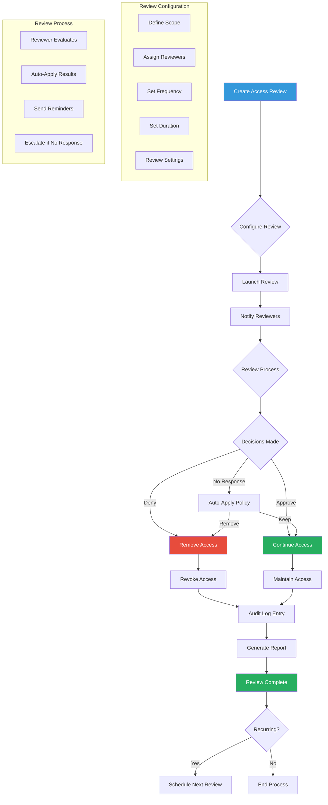
```mermaid
flowchart TB
    Start[Create Access Review] --> Config{Configure Review}

    subgraph ReviewConfig["Review Configuration"]
        Scope[Define Scope]
        Reviewers[Assign Reviewers]
        Frequency[Set Frequency]
        Duration[Set Duration]
        Settings[Review Settings]
    end

    Config --> Launch[Launch Review]
    Launch --> Notify[Notify Reviewers]

    Notify --> Review{Review Process}

    subgraph AccessReviewProcess["Review Process"]
        Reviewer[Reviewer Evaluates]
        Auto[Auto-Apply Results]
        Reminders[Send Reminders]
        Escalate[Escalate if No Response]
    end

    Review --> Decisions{Decisions Made}
    Decisions -->|Approve| Continue[Continue Access]
    Decisions -->|Deny| Remove[Remove Access]
    Decisions -->|No Response| AutoApply[Auto-Apply Policy]

    AutoApply -->|Remove| Remove
    AutoApply -->|Keep| Continue

    Remove --> Revoke[Revoke Access]
    Continue --> Maintain[Maintain Access]

    Revoke --> Audit[Audit Log Entry]
    Maintain --> Audit

    Audit --> Report[Generate Report]
    Report --> Complete[Review Complete]

    Complete --> Recurring{Recurring?}
    Recurring -->|Yes| Schedule[Schedule Next Review]
    Recurring -->|No| End[End Process]

    style Start fill:#3498db,color:#fff
    style Complete fill:#27ae60,color:#fff
    style Remove fill:#e74c3c,color:#fff
    style Continue fill:#27ae60,color:#fff
```

---

## Authentication Flow: Modern Authentication

Shows the main components, decisions, and operational flow for authentication flow: modern authentication in Microsoft 365 identity and access work.

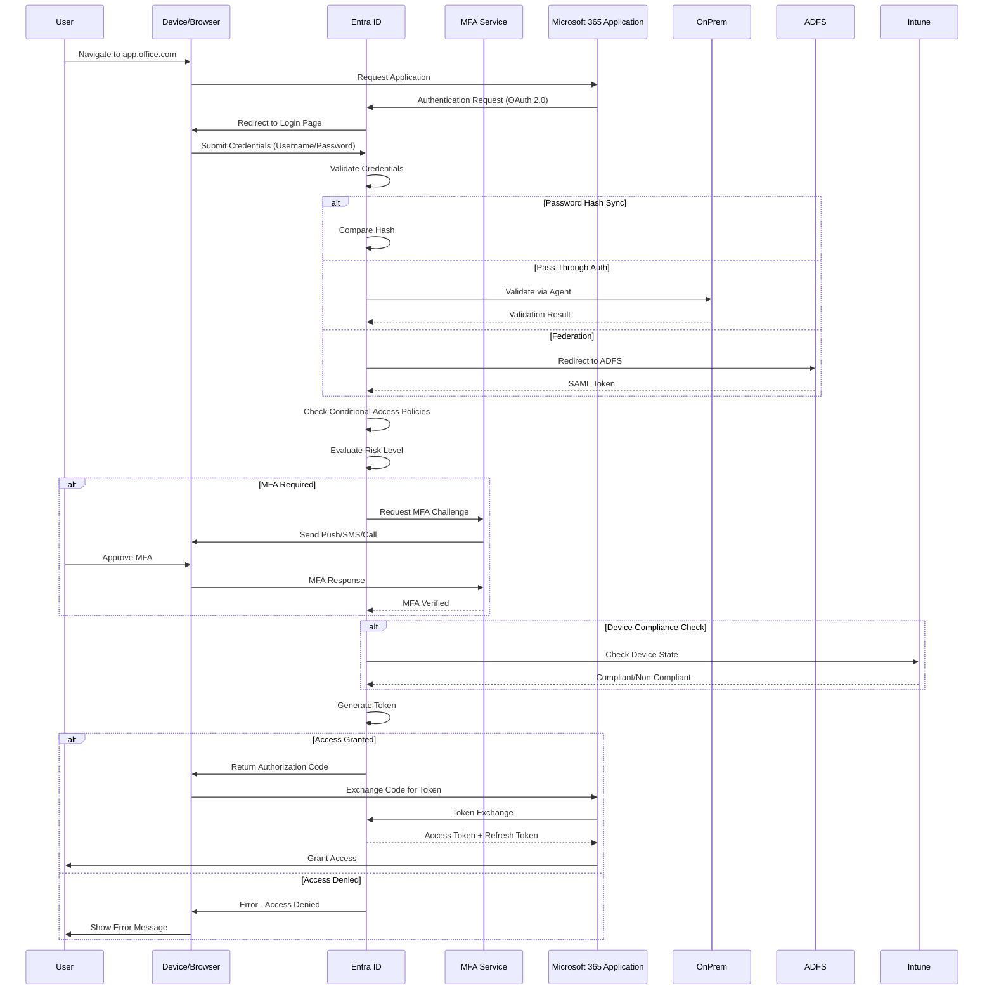
```mermaid
sequenceDiagram
    participant U as User
    participant D as Device/Browser
    participant A as Entra ID
    participant M as MFA Service
    participant App as Microsoft 365 Application

    U->>D: Navigate to app.office.com
    D->>App: Request Application
    App->>A: Authentication Request (OAuth 2.0)
    A->>D: Redirect to Login Page
    D->>A: Submit Credentials (Username/Password)

    A->>A: Validate Credentials
    alt Password Hash Sync
        A->>A: Compare Hash
    else Pass-Through Auth
        A->>OnPrem: Validate via Agent
        OnPrem-->>A: Validation Result
    else Federation
        A->>ADFS: Redirect to ADFS
        ADFS-->>A: SAML Token
    end

    A->>A: Check Conditional Access Policies
    A->>A: Evaluate Risk Level

    alt MFA Required
        A->>M: Request MFA Challenge
        M->>D: Send Push/SMS/Call
        U->>D: Approve MFA
        D->>M: MFA Response
        M-->>A: MFA Verified
    end

    alt Device Compliance Check
        A->>Intune: Check Device State
        Intune-->>A: Compliant/Non-Compliant
    end

    A->>A: Generate Token

    alt Access Granted
        A->>D: Return Authorization Code
        D->>App: Exchange Code for Token
        App->>A: Token Exchange
        A-->>App: Access Token + Refresh Token
        App->>U: Grant Access
    else Access Denied
        A->>D: Error - Access Denied
        D->>U: Show Error Message
    end
```

---

## Authentication Method Deployment

Shows the main components, decisions, and operational flow for authentication method deployment in Microsoft 365 identity and access work.

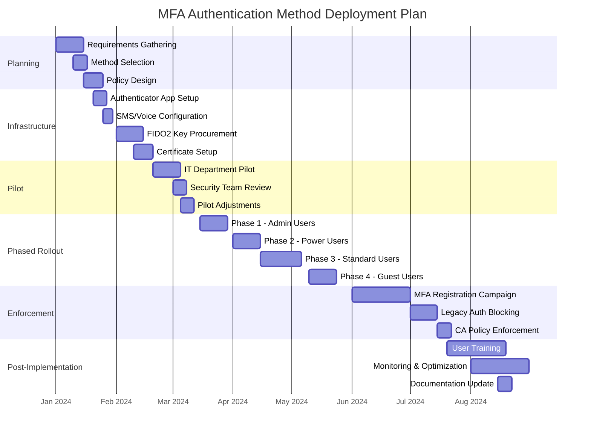
```mermaid
gantt
    title MFA Authentication Method Deployment Plan
    dateFormat  YYYY-MM-DD
    axisFormat  %b %Y

    section Planning
    Requirements Gathering      :2024-01-01, 14d
    Method Selection            :2024-01-10, 7d
    Policy Design               :2024-01-15, 10d

    section Infrastructure
    Authenticator App Setup     :2024-01-20, 7d
    SMS/Voice Configuration     :2024-01-25, 5d
    FIDO2 Key Procurement       :2024-02-01, 14d
    Certificate Setup           :2024-02-10, 10d

    section Pilot
    IT Department Pilot         :2024-02-20, 14d
    Security Team Review        :2024-03-01, 7d
    Pilot Adjustments           :2024-03-05, 7d

    section Phased Rollout
    Phase 1 - Admin Users       :2024-03-15, 14d
    Phase 2 - Power Users       :2024-04-01, 14d
    Phase 3 - Standard Users    :2024-04-15, 21d
    Phase 4 - Guest Users       :2024-05-10, 14d

    section Enforcement
    MFA Registration Campaign   :2024-06-01, 30d
    Legacy Auth Blocking        :2024-07-01, 14d
    CA Policy Enforcement       :2024-07-15, 7d

    section Post-Implementation
    User Training               :2024-07-20, 30d
    Monitoring & Optimization   :2024-08-01, 30d
    Documentation Update        :2024-08-15, 7d
```

---

## Authentication Protocol Decision Tree

Entra ID supports multiple protocols depending on the application type and security requirements. This diagram maps the selection criteria.

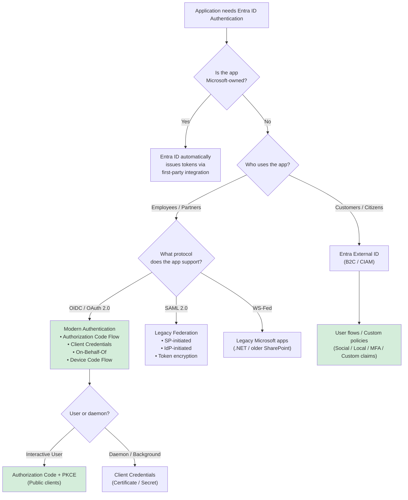
```mermaid
flowchart TD
    A["Application needs Entra ID Authentication"] --> B{"Is the app<br/>Microsoft-owned?"}

    B -->|Yes| C["Entra ID automatically<br/>issues tokens via<br/>first-party integration"]
    B -->|No| D{"Who uses the app?"}

    D -->|Employees / Partners| E{"What protocol<br/>does the app support?"}
    D -->|Customers / Citizens| F["Entra External ID<br/>(B2C / CIAM)"]

    E -->|OIDC / OAuth 2.0| G["Modern Authentication<br/>• Authorization Code Flow<br/>• Client Credentials<br/>• On-Behalf-Of<br/>• Device Code Flow"]
    E -->|SAML 2.0| H["Legacy Federation<br/>• SP-initiated<br/>• IdP-initiated<br/>• Token encryption"]
    E -->|WS-Fed| I["Legacy Microsoft apps<br/>(.NET / older SharePoint)"]

    G --> J{"User or daemon?"}
    J -->|Interactive User| K["Authorization Code + PKCE<br/>(Public clients)"]
    J -->|Daemon / Background| L["Client Credentials<br/>(Certificate / Secret)"]

    F --> M["User flows / Custom policies<br/>(Social / Local / MFA / Custom claims)"]

    style G fill:#d4edda
    style K fill:#d4edda
    style M fill:#d4edda
```

### Notes
**Key insight**: Always prefer **OIDC/OAuth 2.0** for new applications. The **Authorization Code flow with PKCE** is now the standard for all client types (mobile, SPA, desktop). SAML should only be used for legacy apps that cannot be modernised. Never use Implicit or Resource Owner Password Credentials (ROPC) in production.

---

## B2B Collaboration: Guest User Lifecycle

External collaboration is a core Entra ID capability. This diagram shows the complete guest lifecycle from invitation to access termination.

```mermaid
flowchart LR
    subgraph Invite["Invitation"]
        I1["Host tenant admin<br/>or user invites"]
        I2["Entra sends redemption link"]
        I3["Guest accepts / creates account"]
    end

    subgraph Access["Access Phase"]
        A1["Guest account in Entra ID<br/>(UserType = Guest)"]
        A2["Guest inherits group<br/>and app assignments"]
        A3["Conditional Access<br/>evaluates guest policies"]
        A4["Access Teams / SharePoint /<br/>SaaS apps"]
    end

    subgraph Control["Governance Controls"]
        C1["Access Reviews<br/>(Periodic re-certification)"]
        C2["Terms of Use<br/>(Mandatory acceptance)"]
        C3["Entitlement Management<br/>(Package-based access)"]
        C4["Cross-tenant access settings<br/>(Inbound / Outbound trust)"]
    end

    subgraph Exit["Exit Phase"]
        E1["Access Review denies continuation"]
        E2["Admin blocks / deletes account"]
        E3["Automatic lifecycle policy<br/>removes guest after N days"]
        E4["Guest leaves / account redeemed<br/>in different tenant"]
    end

    Invite --> Access
    Access --> Control
    Control --> Exit
```

### Notes
**Key insight**: Guest users have their own **Conditional Access category**. You can create policies that apply only to guests, such as requiring MFA regardless of device trust, or blocking downloads from unmanaged devices. **Cross-tenant access settings** (inbound/outbound) allow you to trust MFA and device compliance from the guest's home tenant.

---

## Break-Glass Account Strategy

Shows the main components, decisions, and operational flow for break-glass account strategy in Microsoft 365 identity and access work.

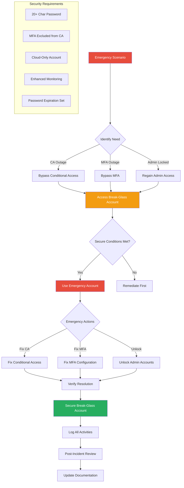
```mermaid
flowchart TB
    Start[Emergency Scenario] --> Identify{Identify Need}

    Identify -->|CA Outage| BypassCA[Bypass Conditional Access]
    Identify -->|MFA Outage| BypassMFA[Bypass MFA]
    Identify -->|Admin Locked| RegainAccess[Regain Admin Access]

    BypassCA --> AccessBreakGlass[Access Break-Glass Account]
    BypassMFA --> AccessBreakGlass
    RegainAccess --> AccessBreakGlass

    AccessBreakGlass --> Secure{Secure Conditions Met?}

    subgraph SecureRequirements["Security Requirements"]
        StrongPass[20+ Char Password]
        NoMFA[MFA Excluded from CA]
        CloudOnly[Cloud-Only Account]
        Monitoring[Enhanced Monitoring]
        Expiry[Password Expiration Set]
    end

    Secure -->|Yes| UseAccount[Use Emergency Account]
    Secure -->|No| Remediate[Remediate First]

    UseAccount --> Actions{Emergency Actions}
    Actions -->|Fix CA| FixCA[Fix Conditional Access]
    Actions -->|Fix MFA| FixMFA[Fix MFA Configuration]
    Actions -->|Unlock| Unlock[Unlock Admin Accounts]

    FixCA --> Verify[Verify Resolution]
    FixMFA --> Verify
    Unlock --> Verify

    Verify --> SecureAccount[Secure Break-Glass Account]
    SecureAccount --> Log[Log All Activities]
    Log --> Review[Post-Incident Review]
    Review --> Update[Update Documentation]

    style Start fill:#e74c3c,color:#fff
    style AccessBreakGlass fill:#f39c12,color:#fff
    style UseAccount fill:#e74c3c,color:#fff
    style SecureAccount fill:#27ae60,color:#fff
```

---

## Conditional Access + Intune: Device Trust Flow

Conditional Access is the enforcement gate. This diagram shows how Intune device state feeds into the real-time CA decision engine.

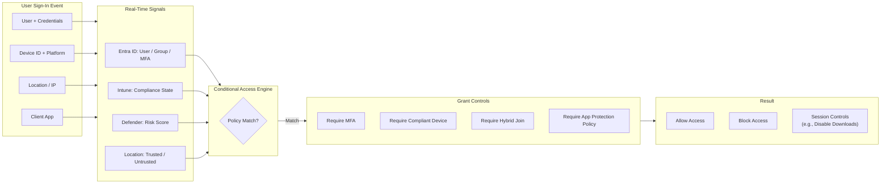
```mermaid
flowchart LR
    subgraph SignIn["User Sign-In Event"]
        A["User + Credentials"]
        B["Device ID + Platform"]
        C["Location / IP"]
        D["Client App"]
    end

    subgraph Signals["Real-Time Signals"]
        S1["Entra ID: User / Group / MFA"]
        S2["Intune: Compliance State"]
        S3["Defender: Risk Score"]
        S4["Location: Trusted / Untrusted"]
    end

    subgraph CA["Conditional Access Engine"]
        E{"Policy Match?"}
    end

    subgraph Grant["Grant Controls"]
        G1["Require MFA"]
        G2["Require Compliant Device"]
        G3["Require Hybrid Join"]
        G4["Require App Protection Policy"]
    end

    subgraph Result["Result"]
        R1["Allow Access"]
        R2["Block Access"]
        R3["Session Controls<br/>(e.g., Disable Downloads)"]
    end

    A & B & C & D --> Signals
    S1 & S2 & S3 & S4 --> CA
    CA -->|Match| Grant
    Grant --> Result
```

### Notes
**Key insight**: The most common enterprise pattern is: **Require MFA OR Require Compliant Device**. For high-risk apps (email, SharePoint), the pattern becomes: **Require Compliant Device AND Require App Protection Policy**. Intune compliance is evaluated in real-time during the Entra ID authentication flow.

---

## Conditional Access Policy and Continuous Access Evaluation

Shows how Conditional Access evaluates sign-in signals, applies grant and session controls, and uses Continuous Access Evaluation for important session events.

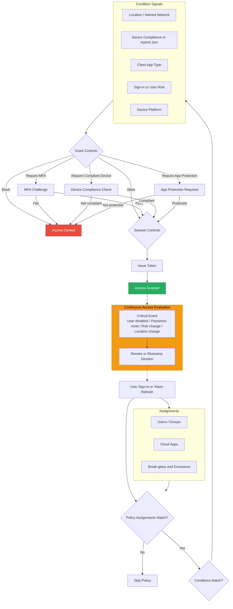
```mermaid
flowchart TB
    Request[User Sign-in or Token Refresh] --> Assignments{Policy Assignments Match?}

    subgraph AssignmentSignals["Assignments"]
        Users[Users / Groups]
        Apps[Cloud Apps]
        Exclusions[Break-glass and Exclusions]
    end

    Request --> AssignmentSignals
    AssignmentSignals --> Assignments
    Assignments -->|No| Skip[Skip Policy]
    Assignments -->|Yes| Conditions{Conditions Match?}

    subgraph ConditionSignals["Condition Signals"]
        Location[Location / Named Network]
        Device[Device Compliance or Hybrid Join]
        Client[Client App Type]
        Risk[Sign-in or User Risk]
        Platform[Device Platform]
    end

    Conditions --> ConditionSignals
    ConditionSignals --> Controls{Grant Controls}

    Controls -->|Block| Deny[Access Denied]
    Controls -->|Require MFA| MFA[MFA Challenge]
    Controls -->|Require Compliant Device| DeviceCheck[Device Compliance Check]
    Controls -->|Require App Protection| AppProtection[App Protection Required]
    Controls -->|Allow| SessionControls{Session Controls}

    MFA -->|Pass| SessionControls
    MFA -->|Fail| Deny
    DeviceCheck -->|Compliant| SessionControls
    DeviceCheck -->|Not compliant| Deny
    AppProtection -->|Protected| SessionControls
    AppProtection -->|Not protected| Deny

    SessionControls --> Token[Issue Token]
    Token --> Access[Access Granted]

    subgraph CAE["Continuous Access Evaluation"]
        Event[Critical Event<br/>User disabled / Password reset / Risk change / Location change]
        Revoke[Revoke or Reassess Session]
    end

    Access --> CAE
    Event --> Revoke
    Revoke -.-> Request

    style Access fill:#27ae60,color:#fff
    style Deny fill:#e74c3c,color:#fff
    style CAE fill:#f39c12,color:#000
```

### Notes
Conditional Access is evaluated at sign-in and token refresh. Continuous Access Evaluation shortens the response window for important security events by forcing supported sessions to be reassessed before the normal token lifetime expires.

---

## Cross-Tenant Access Settings

Cross-tenant access settings control inbound and outbound collaboration, trust settings and Teams shared channel prerequisites between organisations.

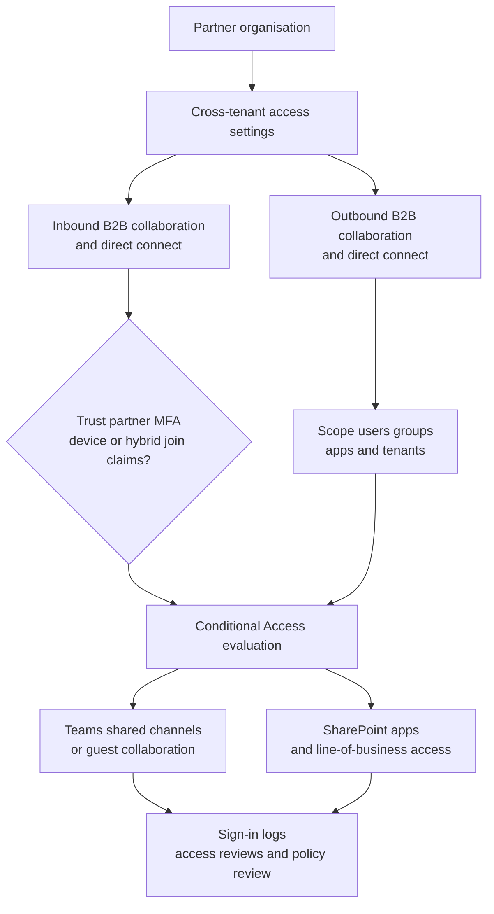
```mermaid
flowchart TB
    CTA_Partner["Partner organisation"] --> CTA_Policy["Cross-tenant access settings"]
    CTA_Policy --> CTA_Inbound["Inbound B2B collaboration<br/>and direct connect"]
    CTA_Policy --> CTA_Outbound["Outbound B2B collaboration<br/>and direct connect"]
    CTA_Inbound --> CTA_Trust{"Trust partner MFA<br/>device or hybrid join claims?"}
    CTA_Outbound --> CTA_Scope["Scope users groups<br/>apps and tenants"]
    CTA_Trust --> CTA_CA["Conditional Access evaluation"]
    CTA_Scope --> CTA_CA
    CTA_CA --> CTA_Teams["Teams shared channels<br/>or guest collaboration"]
    CTA_CA --> CTA_Apps["SharePoint apps<br/>and line-of-business access"]
    CTA_Teams --> CTA_Monitor["Sign-in logs<br/>access reviews and policy review"]
    CTA_Apps --> CTA_Monitor
```

---

## Domain Trust and Federation

Shows the main components, decisions, and operational flow for domain trust and federation in Microsoft 365 identity and access work.

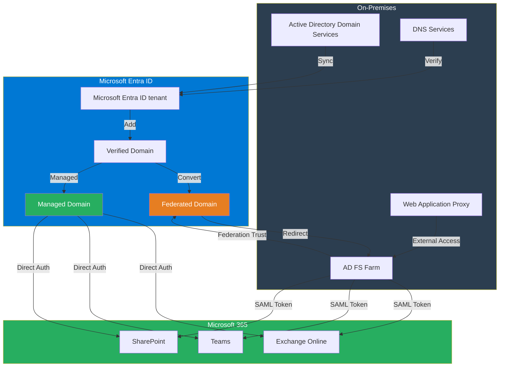
```mermaid
flowchart TB
    subgraph OnPrem["On-Premises"]
        ADDS[Active Directory Domain Services]
        ADFS[AD FS Farm]
        WAP[Web Application Proxy]
        DNS[DNS Services]
    end

    subgraph Cloud["Microsoft Entra ID"]
        AAD[Microsoft Entra ID tenant]
        Managed[Managed Domain]
        Federated[Federated Domain]
        Verified[Verified Domain]
    end

    subgraph M365["Microsoft 365"]
        Exchange[Exchange Online]
        Teams[Teams]
        SharePoint[SharePoint]
    end

    ADDS -->|Sync| AAD
    DNS -->|Verify| AAD
    AAD -->|Add| Verified

    Verified -->|Convert| Federated
    Verified -->|Managed| Managed

    ADFS -->|Federation Trust| Federated
    WAP -->|External Access| ADFS

    Managed -->|Direct Auth| Exchange
    Managed -->|Direct Auth| Teams
    Managed -->|Direct Auth| SharePoint

    Federated -->|Redirect| ADFS
    ADFS -->|SAML Token| Exchange
    ADFS -->|SAML Token| Teams
    ADFS -->|SAML Token| SharePoint

    style OnPrem fill:#2c3e50,color:#fff
    style Cloud fill:#0078d4,color:#fff
    style M365 fill:#27ae60,color:#fff
    style Federated fill:#e67e22,color:#fff
    style Managed fill:#27ae60,color:#fff
```

---

## Entitlement Management Access Packages

Entitlement Management packages controlled resources, request rules, approvals, expiry and access reviews into a reusable access lifecycle.

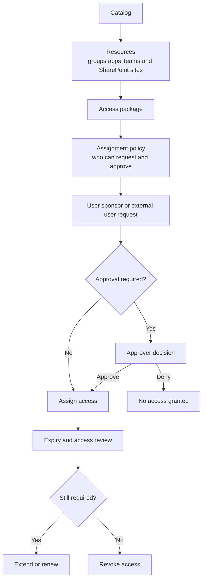
```mermaid
flowchart TB
    EMAP_Catalog["Catalog"] --> EMAP_Resources["Resources<br/>groups apps Teams and SharePoint sites"]
    EMAP_Resources --> EMAP_Package["Access package"]
    EMAP_Package --> EMAP_Policy["Assignment policy<br/>who can request and approve"]
    EMAP_Policy --> EMAP_Request["User sponsor or external user request"]
    EMAP_Request --> EMAP_Approval{"Approval required?"}
    EMAP_Approval -->|"Yes"| EMAP_Approver["Approver decision"]
    EMAP_Approval -->|"No"| EMAP_Assign["Assign access"]
    EMAP_Approver -->|"Approve"| EMAP_Assign
    EMAP_Approver -->|"Deny"| EMAP_Deny["No access granted"]
    EMAP_Assign --> EMAP_Expiry["Expiry and access review"]
    EMAP_Expiry --> EMAP_Remove{"Still required?"}
    EMAP_Remove -->|"Yes"| EMAP_Extend["Extend or renew"]
    EMAP_Remove -->|"No"| EMAP_Revoke["Revoke access"]
```

### Notes

- Use access packages to avoid ad hoc guest invitations and long-lived group membership.

---

## Entra Core Architecture: The Identity Control Plane

Microsoft Entra ID serves as the primary security boundary between users, devices, and resources. This diagram shows how the Entra control plane connects every layer of a modern enterprise.

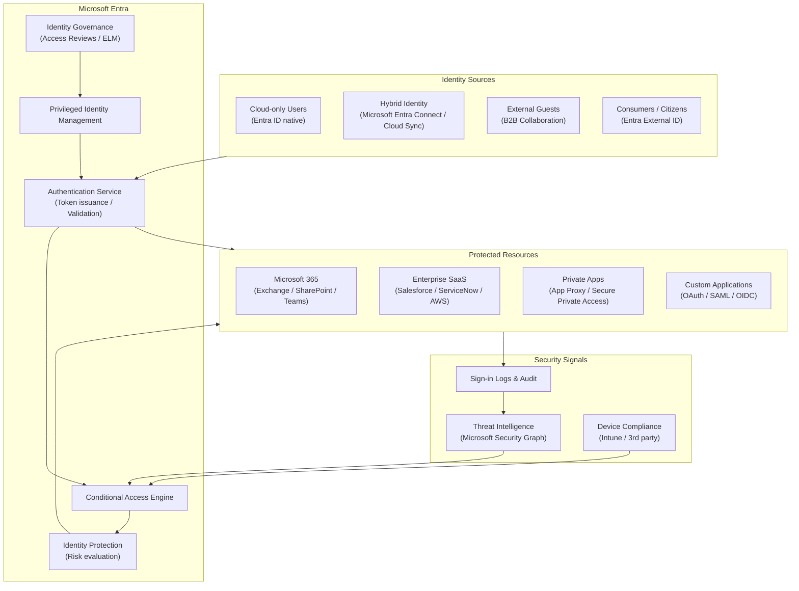
```mermaid
flowchart TB
    subgraph Identity["Identity Sources"]
        direction TB
        Cloud["Cloud-only Users<br/>(Entra ID native)"]
        Sync["Hybrid Identity<br/>(Microsoft Entra Connect / Cloud Sync)"]
        B2B["External Guests<br/>(B2B Collaboration)"]
        B2C["Consumers / Citizens<br/>(Entra External ID)"]
    end

    subgraph Entra["Microsoft Entra"]
        direction TB
        Auth["Authentication Service<br/>(Token issuance / Validation)"]
        CA["Conditional Access Engine"]
        IDP["Identity Protection<br/>(Risk evaluation)"]
        PIM["Privileged Identity Management"]
        Gov["Identity Governance<br/>(Access Reviews / ELM)"]
    end

    subgraph Resources["Protected Resources"]
        direction TB
        M365["Microsoft 365<br/>(Exchange / SharePoint / Teams)"]
        SaaS["Enterprise SaaS<br/>(Salesforce / ServiceNow / AWS)"]
        Private["Private Apps<br/>(App Proxy / Secure Private Access)"]
        Custom["Custom Applications<br/>(OAuth / SAML / OIDC)"]
    end

    subgraph Signals["Security Signals"]
        direction TB
        SI["Sign-in Logs & Audit"]
        TI["Threat Intelligence<br/>(Microsoft Security Graph)"]
        MDM["Device Compliance<br/>(Intune / 3rd party)"]
    end

    Identity --> Auth
    Auth --> CA
    CA --> IDP
    IDP --> Resources
    Auth --> Resources
    Gov --> PIM
    PIM --> Auth

    Resources --> SI
    SI --> TI
    TI --> CA
    MDM --> CA
```

### Notes
**Key insight**: Entra ID is not just a directory—it's a **real-time policy enforcement plane**. Every authentication request is evaluated against Conditional Access policies, Identity Protection risk detections, and device compliance state before a token is issued.

---

## Entra ID Governance: Access Lifecycle Architecture

Governance automates the joiner-mover-leaver lifecycle and access certifications. This diagram shows how the governance services interact.

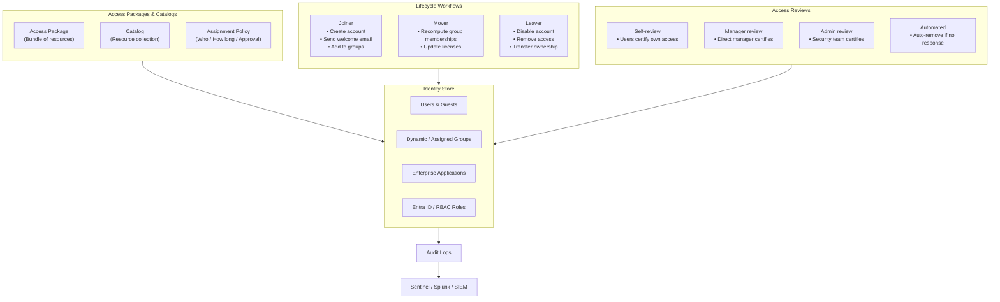
```mermaid
flowchart TB
    subgraph Catalog["Access Packages & Catalogs"]
        direction TB
        AP["Access Package<br/>(Bundle of resources)"]
        Cat["Catalog<br/>(Resource collection)"]
        Policy["Assignment Policy<br/>(Who / How long / Approval)"]
    end

    subgraph Lifecycle["Lifecycle Workflows"]
        direction TB
        Join["Joiner<br/>• Create account<br/>• Send welcome email<br/>• Add to groups"]
        Move["Mover<br/>• Recompute group memberships<br/>• Update licenses"]
        Leave["Leaver<br/>• Disable account<br/>• Remove access<br/>• Transfer ownership"]
    end

    subgraph Review["Access Reviews"]
        direction TB
        Review1["Self-review<br/>• Users certify own access"]
        Review2["Manager review<br/>• Direct manager certifies"]
        Review3["Admin review<br/>• Security team certifies"]
        Review4["Automated<br/>• Auto-remove if no response"]
    end

    subgraph Identity["Identity Store"]
        Users["Users & Guests"]
        Groups["Dynamic / Assigned Groups"]
        Apps["Enterprise Applications"]
        Roles["Entra ID / RBAC Roles"]
    end

    Catalog --> Identity
    Lifecycle --> Identity
    Review --> Identity

    Identity --> Audit["Audit Logs"]
    Audit --> SIEM["Sentinel / Splunk / SIEM"]
```

### Notes
**Key insight**: **Entitlement Management** (access packages) is ideal for project-based or time-bound access. Combine it with **Access Reviews** to force periodic re-certification, and **Lifecycle Workflows** to automate provisioning and deprovisioning. Together, these form the foundation of a **zero-standing-access** model.

---

## Entra ID Tenant Architecture Overview

Shows the main components, decisions, and operational flow for entra id tenant architecture overview in Microsoft 365 identity and access work.

```mermaid
flowchart TB
    subgraph Tenant["Entra ID Tenant: company.onmicrosoft.com"]
        direction TB

        subgraph Identity["Identity Core"]
            Users[Users & Groups]
            Devices[Registered Devices]
            ServicePrincipals[Service Principals]
            ManagedIdentities[Managed Identities]
        end

        subgraph Auth["Authentication"]
            MFA[Multi-Factor Auth]
            SSPR[Self-Service Password Reset]
            PTA[Pass-Through Authentication]
            PHS[Password Hash Sync]
            Federation[Federation / SAML]
        end

        subgraph Access["Access Management"]
            RBAC[Role-Based Access Control]
            PIM[Privileged Identity Management]
            Entitlement[Entitlement Management]
            AccessReviews[Access Reviews]
            ConditionalAccess[Conditional Access]
        end

        subgraph Protection["Identity Protection"]
            RiskPolicy[Sign-in Risk Policy]
            UserRisk[User Risk Policy]
            Detection[Risk Detections]
            Remediation[Automated Remediation]
        end

        subgraph External["External Identities"]
            B2B[B2B Collaboration]
            B2C[B2C Tenants]
            DirectConnect[Direct Federation]
            CIAM[CIAM for Applications]
        end

        subgraph Hybrid["Hybrid Identity"]
            ADConnect[Entra Connect Sync]
            CloudSync[Cloud Sync]
            AppProxy[Application Proxy]
            Writeback[Password Writeback]
        end
    end

    Identity --> Auth
    Auth --> Access
    Access --> Protection
    External --> Identity
    Hybrid --> Identity

    ConditionalAccess --> MFA
    ConditionalAccess --> Devices
    ConditionalAccess --> RiskPolicy

    PIM --> RBAC
    PIM --> AccessReviews

    style Tenant fill:#1a1a2e,stroke:#0078d4,stroke-width:3px
```

---

## External ID MAU Billing and Guest Governance

This diagram separates External ID monthly active user billing from guest access governance so admins can plan cost and control together.

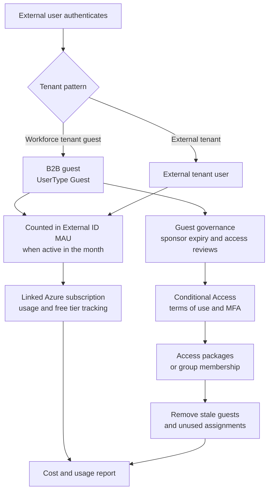
```mermaid
flowchart TB
    EID_SignIn["External user authenticates"] --> EID_Tenant{"Tenant pattern"}
    EID_Tenant -->|"Workforce tenant guest"| EID_B2B["B2B guest<br/>UserType Guest"]
    EID_Tenant -->|"External tenant"| EID_ExtTenant["External tenant user"]
    EID_B2B --> EID_MAU["Counted in External ID MAU<br/>when active in the month"]
    EID_ExtTenant --> EID_MAU
    EID_MAU --> EID_Billing["Linked Azure subscription<br/>usage and free tier tracking"]
    EID_B2B --> EID_Govern["Guest governance<br/>sponsor expiry and access reviews"]
    EID_Govern --> EID_CA["Conditional Access<br/>terms of use and MFA"]
    EID_CA --> EID_Packages["Access packages<br/>or group membership"]
    EID_Packages --> EID_Clean["Remove stale guests<br/>and unused assignments"]
    EID_Billing --> EID_Report["Cost and usage report"]
    EID_Clean --> EID_Report
```

### Notes

- The old B2B guest-ratio model should not be used as the primary planning model for new External ID deployments.

---

## External User Access Matrix

Shows the main components, decisions, and operational flow for external user access matrix in Microsoft 365 identity and access work.

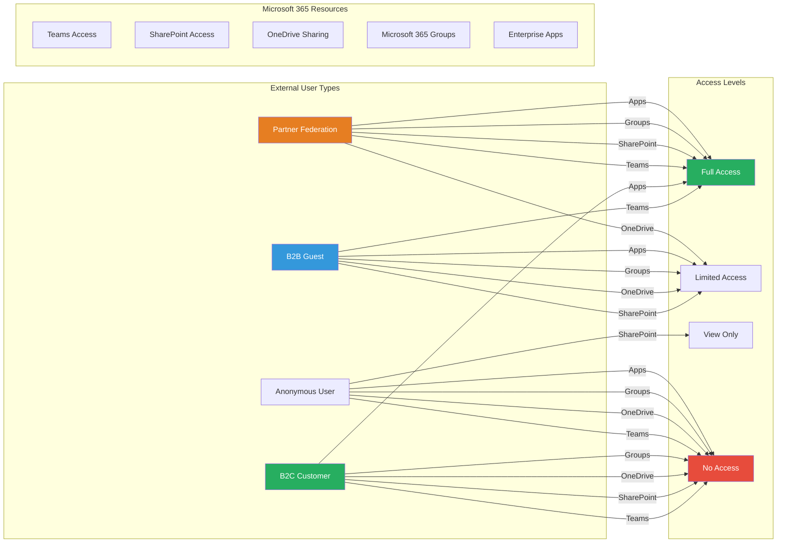
```mermaid
flowchart LR
    subgraph UserTypes["External User Types"]
        B2B[B2B Guest]
        B2C[B2C Customer]
        Anonymous[Anonymous User]
        Partner[Partner Federation]
    end

    subgraph Resources["Microsoft 365 Resources"]
        Teams[Teams Access]
        SharePoint[SharePoint Access]
        OneDrive[OneDrive Sharing]
        Groups[Microsoft 365 Groups]
        Apps[Enterprise Apps]
    end

    subgraph AccessLevels["Access Levels"]
        Full[Full Access]
        Limited[Limited Access]
        ViewOnly[View Only]
        None[No Access]
    end

    B2B -->|Teams| Full
    B2B -->|SharePoint| Limited
    B2B -->|OneDrive| Limited
    B2B -->|Groups| Limited
    B2B -->|Apps| Limited

    B2C -->|Teams| None
    B2C -->|SharePoint| None
    B2C -->|OneDrive| None
    B2C -->|Groups| None
    B2C -->|Apps| Full

    Anonymous -->|Teams| None
    Anonymous -->|SharePoint| ViewOnly
    Anonymous -->|OneDrive| None
    Anonymous -->|Groups| None
    Anonymous -->|Apps| None

    Partner -->|Teams| Full
    Partner -->|SharePoint| Full
    Partner -->|OneDrive| Limited
    Partner -->|Groups| Full
    Partner -->|Apps| Full

    style B2B fill:#3498db,color:#fff
    style B2C fill:#27ae60,color:#fff
    style Partner fill:#e67e22,color:#fff
    style Full fill:#27ae60,color:#fff
    style None fill:#e74c3c,color:#fff
```

---

## Group Types and Membership

Shows the main components, decisions, and operational flow for group types and membership in Microsoft 365 identity and access work.

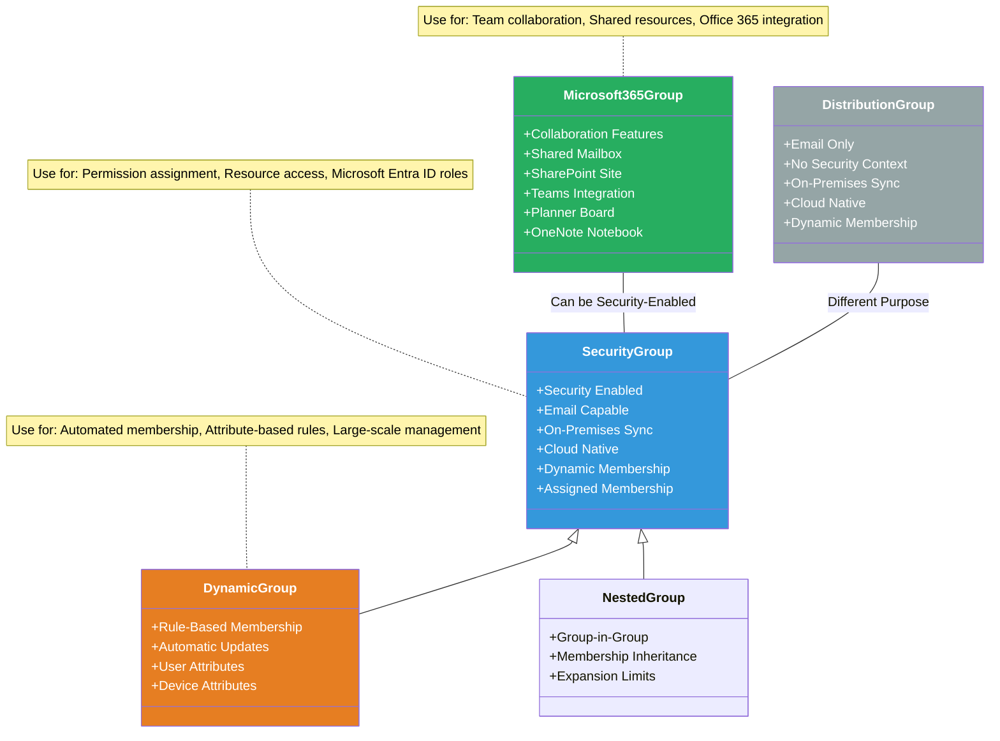
```mermaid
classDiagram
    class SecurityGroup {
        +Security Enabled
        +Email Capable
        +On-Premises Sync
        +Cloud Native
        +Dynamic Membership
        +Assigned Membership
    }

    class Microsoft365Group {
        +Collaboration Features
        +Shared Mailbox
        +SharePoint Site
        +Teams Integration
        +Planner Board
        +OneNote Notebook
    }

    class DistributionGroup {
        +Email Only
        +No Security Context
        +On-Premises Sync
        +Cloud Native
        +Dynamic Membership
    }

    class DynamicGroup {
        +Rule-Based Membership
        +Automatic Updates
        +User Attributes
        +Device Attributes
    }

    class NestedGroup {
        +Group-in-Group
        +Membership Inheritance
        +Expansion Limits
    }

    SecurityGroup <|-- DynamicGroup
    SecurityGroup <|-- NestedGroup
    Microsoft365Group -- SecurityGroup : Can be Security-Enabled
    DistributionGroup -- SecurityGroup : Different Purpose

    note for SecurityGroup "Use for: Permission assignment, Resource access, Microsoft Entra ID roles"

    note for Microsoft365Group "Use for: Team collaboration, Shared resources, Office 365 integration"

    note for DynamicGroup "Use for: Automated membership, Attribute-based rules, Large-scale management"

    style SecurityGroup fill:#3498db,color:#fff
    style Microsoft365Group fill:#27ae60,color:#fff
    style DistributionGroup fill:#95a5a6,color:#fff
    style DynamicGroup fill:#e67e22,color:#fff
```

---

## Hybrid Identity Synchronisation Architecture

Shows how Microsoft Entra Connect Sync and Microsoft Entra Cloud Sync move identities from on-premises Active Directory into Microsoft Entra ID.

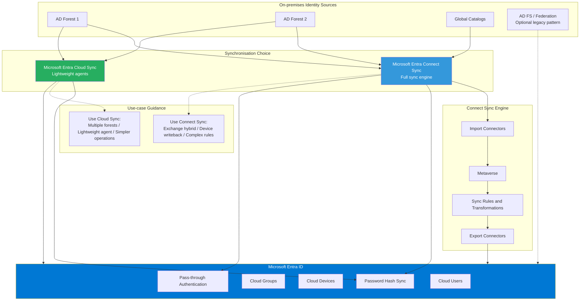
```mermaid
flowchart TB
    subgraph Source["On-premises Identity Sources"]
        Forest1[AD Forest 1]
        Forest2[AD Forest 2]
        GC[Global Catalogs]
        Federation[AD FS / Federation<br/>Optional legacy pattern]
    end

    subgraph SyncChoice["Synchronisation Choice"]
        Connect[Microsoft Entra Connect Sync<br/>Full sync engine]
        CloudSync[Microsoft Entra Cloud Sync<br/>Lightweight agents]
    end

    subgraph ConnectEngine["Connect Sync Engine"]
        Import[Import Connectors]
        Metaverse[Metaverse]
        Rules[Sync Rules and Transformations]
        Export[Export Connectors]
    end

    subgraph Entra["Microsoft Entra ID"]
        Users[Cloud Users]
        Groups[Cloud Groups]
        Devices[Cloud Devices]
        PHS[Password Hash Sync]
        PTA[Pass-through Authentication]
    end

    Forest1 & Forest2 & GC --> Connect
    Forest1 & Forest2 --> CloudSync
    Federation -.-> Entra

    Connect --> Import --> Metaverse --> Rules --> Export --> Entra
    CloudSync --> Entra

    Connect --> PHS
    Connect --> PTA
    CloudSync --> PHS

    subgraph Decision["Use-case Guidance"]
        UseConnect[Use Connect Sync:<br/>Exchange hybrid / Device writeback / Complex rules]
        UseCloud[Use Cloud Sync:<br/>Multiple forests / Lightweight agent / Simpler operations]
    end

    Connect -.-> UseConnect
    CloudSync -.-> UseCloud

    style Connect fill:#3498db,color:#fff
    style CloudSync fill:#27ae60,color:#fff
    style Entra fill:#0078d4,color:#fff
```

### Notes
Microsoft Entra Cloud Sync is preferred for many new lightweight or multi-forest deployments. Microsoft Entra Connect Sync remains important where Exchange hybrid, writeback, or complex transformation rules are required. Password Hash Sync is commonly enabled for authentication resilience.

---

## Hybrid Identity Topologies

Shows the main components, decisions, and operational flow for hybrid identity topologies in Microsoft 365 identity and access work.

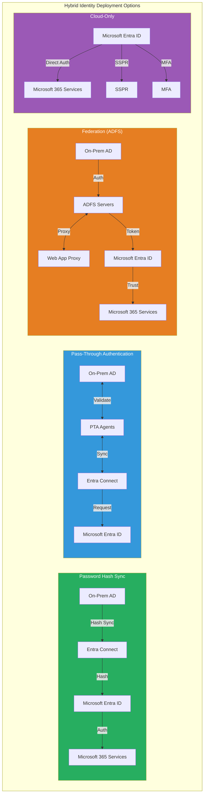
```mermaid
flowchart TB
    subgraph Topologies["Hybrid Identity Deployment Options"]

        subgraph PHS["Password Hash Sync"]
            PHS_AD[On-Prem AD]
            PHS_Connect[Entra Connect]
            PHS_AAD[Microsoft Entra ID]
            PHS_M365[Microsoft 365 Services]

            PHS_AD -->|Hash Sync| PHS_Connect
            PHS_Connect -->|Hash| PHS_AAD
            PHS_AAD -->|Auth| PHS_M365
        end

        subgraph PTA["Pass-Through Authentication"]
            PTA_AD[On-Prem AD]
            PTA_Agent[PTA Agents]
            PTA_Connect[Entra Connect]
            PTA_AAD2[Microsoft Entra ID]

            PTA_AD <-->|Validate| PTA_Agent
            PTA_Agent <-->|Sync| PTA_Connect
            PTA_Connect -->|Request| PTA_AAD2
        end

        subgraph Federation["Federation (ADFS)"]
            Fed_AD[On-Prem AD]
            Fed_ADFS[ADFS Servers]
            Fed_WAP[Web App Proxy]
            Fed_AAD3[Microsoft Entra ID]
            Fed_M365[Microsoft 365 Services]

            Fed_AD -->|Auth| Fed_ADFS
            Fed_ADFS <-->|Proxy| Fed_WAP
            Fed_ADFS -->|Token| Fed_AAD3
            Fed_AAD3 -->|Trust| Fed_M365
        end

        subgraph Cloud["Cloud-Only"]
            Cloud_AAD[Microsoft Entra ID]
            Cloud_SSPR[SSPR]
            Cloud_MFA[MFA]
            Cloud_M365[Microsoft 365 Services]

            Cloud_AAD -->|Direct Auth| Cloud_M365
            Cloud_AAD -->|SSPR| Cloud_SSPR
            Cloud_AAD -->|MFA| Cloud_MFA
        end
    end

    style PHS fill:#27ae60,color:#fff
    style PTA fill:#3498db,color:#fff
    style Federation fill:#e67e22,color:#fff
    style Cloud fill:#9b59b6,color:#fff
```

---

## Identity Health Monitoring Dashboard

Identity health monitoring combines sign-in telemetry, synchronisation status, risky user signals and privileged activity into a triage workflow.

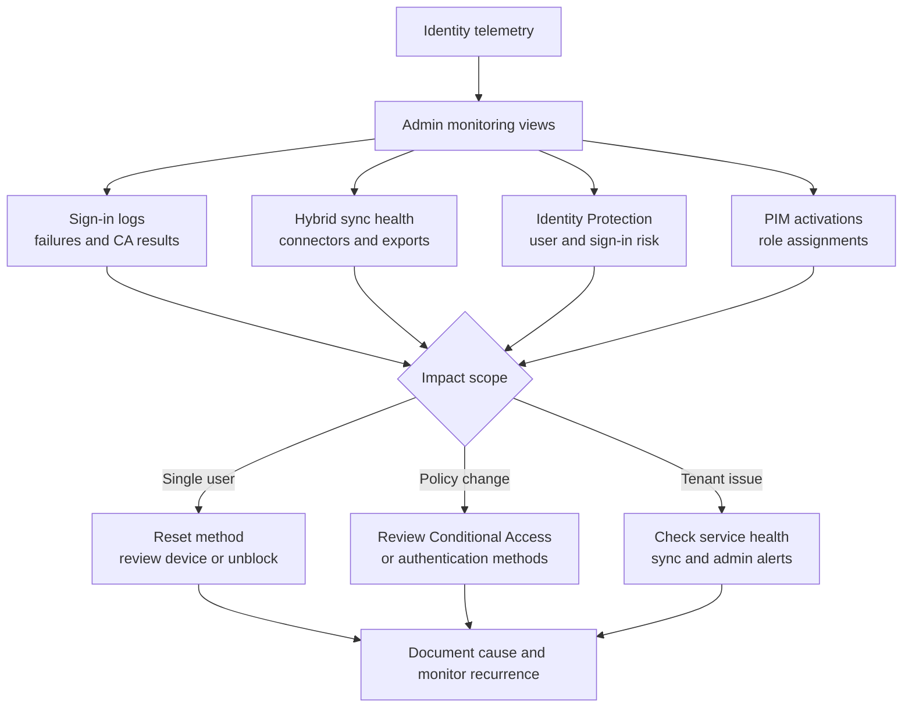
```mermaid
flowchart TB
    IHM_Signals["Identity telemetry"] --> IHM_Views["Admin monitoring views"]
    IHM_Views --> IHM_Signins["Sign-in logs<br/>failures and CA results"]
    IHM_Views --> IHM_Sync["Hybrid sync health<br/>connectors and exports"]
    IHM_Views --> IHM_Risk["Identity Protection<br/>user and sign-in risk"]
    IHM_Views --> IHM_Privileged["PIM activations<br/>role assignments"]
    IHM_Signins --> IHM_Triage{"Impact scope"}
    IHM_Sync --> IHM_Triage
    IHM_Risk --> IHM_Triage
    IHM_Privileged --> IHM_Triage
    IHM_Triage -->|"Single user"| IHM_UserFix["Reset method<br/>review device or unblock"]
    IHM_Triage -->|"Policy change"| IHM_PolicyFix["Review Conditional Access<br/>or authentication methods"]
    IHM_Triage -->|"Tenant issue"| IHM_TenantFix["Check service health<br/>sync and admin alerts"]
    IHM_UserFix --> IHM_Post["Document cause and monitor recurrence"]
    IHM_PolicyFix --> IHM_Post
    IHM_TenantFix --> IHM_Post
```

### Notes

- Correlate identity monitoring with service health before changing broad access policies.

---

## Identity Protection Risk Detection and Remediation

Shows how Microsoft Entra ID Protection detects risky sign-ins and users, then routes them through automated or administrator-led remediation.

```mermaid
flowchart TB
    SignIn[User Sign-in Attempt] --> Signals{Risk Signals}

    subgraph RiskSignals["Signals Evaluated"]
        Atypical[Atypical Travel]
        Anonymous[Anonymous IP]
        Malware[Malware-linked IP]
        Leaked[Leaked Credentials]
        Brute[Password Spray / Brute Force]
        Device[Unfamiliar Device or Properties]
    end

    Signals --> RiskSignals
    RiskSignals --> Score[Calculate Sign-in and User Risk]
    Score --> Level{Risk Level}

    Level -->|Low| Allow[Allow and Log]
    Level -->|Medium| StepUp[Require MFA or Compliant Device]
    Level -->|High| HighRisk[Block or Force Password Reset]

    StepUp --> StepResult{Challenge Passed?}
    StepResult -->|Yes| Remediated[Risk Remediated for Session]
    StepResult -->|No| Blocked[Access Blocked]

    HighRisk --> Remediation{Remediation Path}
    Remediation -->|User self-service| SSPR[Password Reset / MFA Reset]
    Remediation -->|Administrator review| AdminReview[Investigate Alert]
    Remediation -->|Policy block| Blocked

    AdminReview --> AdminDecision{Admin Decision}
    AdminDecision -->|False positive| Dismiss[Dismiss Risk]
    AdminDecision -->|Confirmed compromise| Secure[Secure Account and Reset Credentials]
    AdminDecision -->|Active threat| Disable[Disable or Block User]

    SSPR --> Cleared[Risk Cleared]
    Secure --> Cleared
    Dismiss --> Cleared
    Disable --> Closed[Incident Contained]
    Allow --> Audit[Sign-in and Audit Logs]
    Remediated --> Audit
    Blocked --> Audit
    Cleared --> Audit

    style Allow fill:#27ae60,color:#fff
    style Blocked fill:#e74c3c,color:#fff
    style HighRisk fill:#c0392b,color:#fff
    style Cleared fill:#27ae60,color:#fff
```

### Notes
User risk and sign-in risk are separate signals. A user can carry high user risk even when a particular sign-in appears low risk, so remediation policies should account for both.

---

## Kerberos/NTLM to Modern Auth Migration

Shows the main components, decisions, and operational flow for kerberos/ntlm to modern auth migration in Microsoft 365 identity and access work.

```mermaid
flowchart LR
    subgraph Legacy["Legacy Authentication"]
        Kerberos[Kerberos]
        NTLM[NTLM]
        Basic[Basic Auth]
    end

    subgraph Transition["Transition State"]
        Hybrid[Hybrid Auth]
        MTLS[mTLS]
        SSO[Seamless SSO]
    end

    subgraph Modern["Modern Authentication"]
        OAuth2[OAuth 2.0]
        OIDC[OpenID Connect]
        SAML[SAML 2.0]
        FIDO2[FIDO2]
    end

    subgraph Blockers["Migration Blockers"]
        LegacyApps[Legacy Applications]
        SMTP[SMTP Auth]
        IMAP[IMAP/POP]
        EAS[Exchange ActiveSync]
    end

    Legacy -->|Upgrade| Transition
    Transition -->|Migrate| Modern

    Blockers -->|Block| Legacy
    Blockers -->|Require| Mitigation[Mitigation Steps]

    Mitigation --> AppProxy[Application Proxy]
    Mitigation --> AppReg[App Registration]
    Mitigation --> HybridAuth[Hybrid Auth Config]

    style Legacy fill:#e74c3c,color:#fff
    style Transition fill:#f39c12,color:#fff
    style Modern fill:#27ae60,color:#fff
    style Blockers fill:#95a5a6,color:#fff
```

---

## Lifecycle Workflows Joiner-Mover-Leaver Automation

Lifecycle Workflows automate repeatable identity tasks for joiners, movers and leavers using HR-driven or scheduled triggers.

```mermaid
flowchart TB
    LW_HR["HR or identity attribute change"] --> LW_Event{"Lifecycle event"}
    LW_Event -->|"Joiner"| LW_Joiner["Pre-hire and onboarding tasks"]
    LW_Event -->|"Mover"| LW_Mover["Department role or manager change"]
    LW_Event -->|"Leaver"| LW_Leaver["Termination or end date reached"]
    LW_Joiner --> LW_Tasks["Workflow tasks<br/>groups access packages and notifications"]
    LW_Mover --> LW_Tasks
    LW_Leaver --> LW_Tasks
    LW_Tasks --> LW_Check{"Task result"}
    LW_Check -->|"Success"| LW_Audit["Audit and reporting"]
    LW_Check -->|"Failed"| LW_Retry["Retry or admin intervention"]
    LW_Retry --> LW_Audit
    LW_Audit --> LW_Review["Periodic access review<br/>and lifecycle tuning"]
```

---

## Microsoft Entra ID B2B Collaboration Flow

Shows the main components, decisions, and operational flow for microsoft entra id b2b collaboration flow in Microsoft 365 identity and access work.

```mermaid
sequenceDiagram
    participant HO as Home Organisation
    participant Res as Resource Org (Inviter)
    participant AAD as Microsoft Entra ID
    participant Guest as Guest User

    Res->>AAD: Invite Guest User
    AAD->>AAD: Check if Guest Exists
    alt Guest Exists in Another Tenant
        AAD->>HO: Find Home Tenant
        HO-->>AAD: Home Tenant Info
    else New Guest User
        AAD->>AAD: Create Guest Account
        AAD->>AAD: Send Invitation Email
    end

    AAD->>Guest: Invitation Email
    Guest->>AAD: Accept Invitation
    AAD->>AAD: Redeem Invitation
    AAD->>HO: Verify Identity (if federated)
    HO-->>AAD: User Verified

    AAD->>Res: Guest Added to Groups
    Res->>AAD: Assign Resources to Guest
    AAD->>Guest: Access Granted Notification

    Guest->>AAD: Sign In to Resources
    AAD->>HO: Redirect for Auth (if federated)
    HO-->>AAD: Auth Token
    AAD->>Guest: Access Token
    Guest->>Res: Access Resources

    note over Res, Guest: Ongoing Access
    Res->>AAD: Periodic Access Review
    AAD->>Res: Review Results
    Res->>AAD: Remove/Continue Access
    AAD->>Guest: Access Updated/Revoked
```

---

## Modern Authentication: Passwordless and MFA Methods

Entra ID supports a spectrum of authentication methods ranging from passwords to phishing-resistant credentials. This mindmap shows the hierarchy of options.

```mermaid
mindmap
  root((Authentication
  Methods))
    Something You Know
      Password
        "Least secure<br/>Enable banned password list"
      Temporary Access Pass
        "Onboarding / recovery"
    Something You Have
      Microsoft Authenticator
        Push notification
        TOTP code
        Passwordless phone sign-in
      FIDO2 Security Key
        "Phishing-resistant<br/>Hardware-bound keys"
      Smart Card
        "PIV / CAC compliance"
      SMS / Voice
        "Not recommended<br/>SIM swap risk"
    Something You Are
      Windows Hello for Business
        "Biometric + PIN<br/>Bound to device TPM"
      Certificate-based auth
        "X.509 on device/smart card"
    Authentication Strength
      Phishing-resistant MFA
        FIDO2 / WHfB + device
      MFA Required
        Any two factors
      Single-factor
        Password only
```

### Notes
**Key insight**: Microsoft recommends moving toward **passwordless** using **FIDO2 security keys** or **Windows Hello for Business** combined with **Authentication Strength** policies in Conditional Access. You can enforce that sensitive applications require **phishing-resistant MFA**, which excludes SMS, voice, and TOTP.

---

## Multi-Factor Authentication Methods

Shows the main components, decisions, and operational flow for multi-factor authentication methods in Microsoft 365 identity and access work.

```mermaid
mindmap
  root((MFA Methods))
    Push Notifications
      Microsoft Authenticator
        Number Matching
        Location Info
        App Name Display
      Duo Mobile
        One-Tap Approve
        Biometric Verify
    SMS
      One-Time Code
      Phone Number Required - SMS
      Carrier Dependent
    Voice Call
      Automated Call
      PIN Entry
      Phone Number Required - Voice Call
    Hardware Tokens
      OATH Tokens
        Time-Based
        Counter-Based
      FIDO2 Security Keys
        USB Keys
        NFC Keys
        Built-in Platform
    Certificate-Based
      PIV/CAC Cards
        Smart Card Reader
        PIN Required
      Certificate Trust
        Root Certificate
        Device Certificate
    Temporary Access
      One-Time Codes
        Admin Generated
        Time-Limited
      Temporary Pass
        Email Delivery
        SMS Delivery
    Windows Hello
      Biometric
        Face Recognition
        Fingerprint
      PIN
        Device-Linked
        Complex PIN Support
```

---

## Privileged Identity Management Workflow

Shows the eligible, requested, approved, active, and expired states used for just-in-time Privileged Identity Management access.

```mermaid
flowchart TD
    Start(( )) -->|User Assigned| Eligible

    subgraph EligibleState [Eligible]
        Eligible[Eligible State]
        Available[Role Available]
        Eligible --> Available
    end

    Available -->|User Requests Activation| Request

    subgraph RequestState [Request]
        Request[Request] --> Justification[Provide Justification]
        Justification --> Approval{Approval Required?}
        Approval -->|Yes| PendingApproval[Pending Approval]
        PendingApproval --> Approved[Approved by Admin]
        PendingApproval --> Denied[Denied by Admin]
    end

    Approval -->|No| MFACheck

    subgraph MFACheckState [MFA Check]
        MFACheck[MFA Check] --> MFARequired{MFA Satisfied?}
        MFARequired -->|Yes| Activate
        MFARequired -->|No| MFADenied[Deny Activation]
    end

    Approved --> Activate

    subgraph ActivateState [Role Active]
        Activate[Activate] --> Active[Role Activated]
        Active --> TimeLimit{Time Limit?}
        TimeLimit -->|Expires| Expired[Role Expired]
        TimeLimit -->|Manual| Deactivate[User Deactivates]

        Active --> Extend[Request Extension]
        Extend --> ApprovalCheck{Extend Approved?}
        ApprovalCheck -->|Yes| Active
        ApprovalCheck -->|No| Deactivate
    end

    Expired -.->|Can Reactivate| Eligible
    Deactivate -.->|Return to Eligible| Eligible
    Denied -.->|Can Request Again| Eligible
    MFADenied -.->|Can Retry| Eligible

    classDef note fill:#fff7d6,stroke:#e6c200,color:#000;
    ActiveNote["• Full Privileged Access<br/>• All Admin Capabilities<br/>• Audited Activities<br/>• Time-Bound Session"]:::note
    EligibleNote["• No Active Privileges<br/>• Can Request When Needed<br/>• Just-in-Time Access<br/>• Reduced Attack Surface"]:::note

    Active -.-> ActiveNote
    Eligible -.-> EligibleNote
```

### Notes
Use eligible assignments and time-bound activations to reduce standing administrative access. Require MFA and approvals for high-impact roles where appropriate.

### Related diagrams
- Consolidated related source: Privileged Identity Management Workflow (replacement.md).
- Consolidated related source: Privileged Identity Management (PIM) Workflow (entra-id-complete-guide.md).

---

## Secure Access: App Proxy and Private Access

For applications that remain on-premises, Entra ID provides reverse proxy and Zero Trust network access. This architecture diagram shows both paths.

```mermaid
flowchart LR
    subgraph Internet["Internet"]
        User["Remote User"]
    end

    subgraph Entra["Microsoft Entra"]
        CA["Conditional Access"]
        Proxy["Entra ID Application Proxy<br/>(Reverse Proxy)"]
        ZTNA["Microsoft Entra<br/>Private Access"]
    end

    subgraph Corp["Corporate Network"]
        direction TB
        Connector["App Proxy Connector<br/>(Outbound HTTPS to Entra)"]
        App1["Internal Web App<br/>(IIS / Tomcat / Custom)"]
        App2["Legacy App<br/>(Header-based auth)"]
        Segment["Private Resources<br/>(RDP / SSH / SMB / Internal sites)"]
        Agent["Global Secure Access Agent<br/>(On device)"]
    end

    User -->|HTTPS| Entra
    Entra -->|Auth + CA check| CA
    CA -->|Allowed| Proxy
    Proxy -->|Outbound 443| Connector
    Connector -->|Kerberos / Header| App1
    Connector -->|Header injection| App2

    User -->|Global Secure Access Client| ZTNA
    ZTNA --> Agent
    Agent --> Segment
```

### Notes
**Key insight**: **Application Proxy** requires no inbound firewall ports—connectors only open **outbound HTTPS** to Entra ID. **Entra Private Access** (part of Global Secure Access) replaces VPNs for internal resource access by tunneling traffic through the Entra identity-aware network. Both integrate natively with Conditional Access.

---

## Security Defaults vs Conditional Access

Shows the main components, decisions, and operational flow for security defaults vs conditional access in Microsoft 365 identity and access work.

```mermaid
classDiagram
    class SecurityDefaults {
        +Enabled by Default
        +All Users MFA Required
        +Block Legacy Auth
        +Admin Registration Required
        +Limited Customization
        +Free with Tenant
        +Quick Setup
    }

    class ConditionalAccess {
        +Requires P1/P2 License
        +Granular Policy Control
        +Risk-Based Policies
        +Device Compliance
        +Location-Based Rules
        +App-Specific Rules
        +Session Controls
    }

    class Scenarios {
        +Small Business
        +Quick Deployment
        +Basic Security
        +Limited IT Staff
    }

    class AdvancedScenarios {
        +Enterprise Org
        +Complex Requirements
        +Risk-Based Access
        +Device Management
        +Compliance Needs
    }

    SecurityDefaults -- Scenarios : Best For
    ConditionalAccess -- AdvancedScenarios : Best For

    note for SecurityDefaults "Use when: Small organisation, Quick security baseline, Limited IT resources, No specific compliance needs"

    note for ConditionalAccess "Use when: Enterprise organisation, Granular control needed, Risk-based decisions, Device compliance required, Specific compliance requirements"

    style SecurityDefaults fill:#27ae60,color:#fff
    style ConditionalAccess fill:#3498db,color:#fff
```

---

## Self-Service Password Reset (SSPR) Flow

Shows the main components, decisions, and operational flow for self-service password reset (sspr) flow in Microsoft 365 identity and access work.

```mermaid
flowchart TD
    User[User Needs Password Reset] --> Portal[Navigate to Password Reset Portal]
    Portal --> Identify[Enter User ID]
    Identify --> Verify{Verify Identity}

    Verify -->|MFA Methods| Methods{Available Methods}
    Methods -->|Email| Email[Send Code to Email]
    Methods -->|SMS| SMS[Send Code to SMS]
    Methods -->|Voice| Voice[Call with Code]
    Methods -->|Auth| AuthApp[Authenticator App]
    Methods -->|Security| SecurityQ[Security Questions]

    Email --> EnterCode[Enter Verification Code]
    SMS --> EnterCode
    Voice --> EnterCode
    AuthApp --> EnterCode
    SecurityQ --> AnswerQ[Answer Security Questions]

    EnterCode --> Validate{Code Valid?}
    AnswerQ --> ValidateQ{Answers Correct?}

    Validate -->|Yes| NewPass[Enter New Password]
    Validate -->|No| Retry[Retry or Alternate Method]
    ValidateQ -->|Yes| NewPass
    ValidateQ -->|No| Retry

    Retry -->|Max Attempts| Lockout[Account Lockout]
    Retry -->|Still Available| Methods

    NewPass --> ValidatePass{Password Meets Policy?}
    ValidatePass -->|No| NewPass
    ValidatePass -->|Yes| Reset[Reset Password]

    Reset --> Writeback{Writeback Enabled?}
    Writeback -->|Yes| OnPremReset[Reset On-Prem AD]
    Writeback -->|No| CloudOnly[Cloud Only Reset]

    OnPremReset --> Notify[Notify User]
    CloudOnly --> Notify

    Notify --> SignIn[Sign In with New Password]
    SignIn --> Success[Reset Complete]

    style User fill:#3498db,color:#fff
    style Success fill:#27ae60,color:#fff
    style Lockout fill:#e74c3c,color:#fff
```

---

## Service Principal vs Managed Identity

Shows the main components, decisions, and operational flow for service principal vs managed identity in Microsoft 365 identity and access work.

```mermaid
classDiagram
    class ServicePrincipal {
        +Application Identity
        +Tenant-Specific
        +Manual Credential Mgmt
        +Custom Permissions
        +API Access
        +Long-Lived Credentials
        +Secret/Certificate Auth
    }

    class ManagedIdentity {
        +Azure Resource Identity
        +Auto-Managed Credentials
        +Auto-Rotation
        +System-Assigned
        +User-Assigned
        +Token-Based Auth
        +No Credential Storage
    }

    class SystemAssigned {
        +Tied to Resource Lifecycle
        +Cannot Be Shared
        +Auto-Deleted with Resource
        +Simple Setup
    }

    class UserAssigned {
        +Independent Azure Resource
        +Can Be Shared
        +Manual Lifecycle
        +Multiple Resources
    }

    class CredentialTypes {
        +Client Secrets
        +Certificates
        +Federated Credentials
        +Token Authentication
    }

    ServicePrincipal <|-- CredentialTypes
    ManagedIdentity <|-- SystemAssigned
    ManagedIdentity <|-- UserAssigned

    note for ServicePrincipal "Use when: External app access, Multi-tenant scenarios, Custom credential requirements"
    note for ManagedIdentity "Use when: Azure resources only, Simpler security model, Auto credential rotation needed"

    style ServicePrincipal fill:#3498db,color:#fff
    style ManagedIdentity fill:#27ae60,color:#fff
    style SystemAssigned fill:#16a085,color:#fff
    style UserAssigned fill:#2980b9,color:#fff
```

---

## Stale Account Detection and Remediation

Shows the main components, decisions, and operational flow for stale account detection and remediation in Microsoft 365 identity and access work.

```mermaid
flowchart TD
    Start[Identity Audit] --> Scan[Scan All Accounts]

    Scan --> Criteria{Check Stale Criteria}

    subgraph StaleCriteria["Stale Indicators"]
        LastLogin[Last Login > 90 days]
        LastActivity[No Activity > 60 days]
        Disabled[Disabled Account]
        Expired[Password Expired > 30 days]
        Terminated[Employment Terminated]
    end

    Criteria --> Classify{Account Classification}

    Classify -->|Service Account| ReviewSA[Review with Owner]
    Classify -->|User Account| ReviewUser[Review with Manager]
    Classify -->|Admin Account| Escalate[Escalate to Security]
    Classify -->|Guest Account| ReviewGuest[Review with Inviter]

    ReviewSA --> Decision{Decision}
    ReviewUser --> Decision
    Escalate --> Decision
    ReviewGuest --> Decision

    Decision -->|Keep| Document[Document Justification]
    Decision -->|Disable| Disable[Disable Account]
    Decision -->|Delete| Delete[Delete Account]

    Document --> Monitor[Enhanced Monitoring]
    Disable --> Notify[Notify Stakeholders]
    Delete --> Audit[Audit Log Entry]

    Monitor --> Report[Generate Report]
    Notify --> Report
    Audit --> Report

    Report --> Schedule[Schedule Next Audit]

    style Start fill:#3498db,color:#fff
    style Delete fill:#e74c3c,color:#fff
    style Schedule fill:#27ae60,color:#fff
```

---

## The Token Issuance Sequence: OAuth 2.0 Authorization Code

This sequence diagram shows the complete end-to-end flow when a user signs into a third-party application using Entra ID.

```mermaid
sequenceDiagram
    actor User
    participant Browser as Browser / Client
    participant App as Application<br/>(Relying Party)
    participant Entra as Microsoft Entra ID
    participant IdP as Home Tenant<br/>(Token Service)
    participant CA as Conditional Access
    participant Res as Resource API<br/>(Microsoft Graph / Custom API)

    User->>App: Click "Sign In"
    App->>Browser: Redirect to Entra
    Browser->>Entra: GET /authorize?<br/>client_id + redirect_uri + scope

    Entra->>Entra: Check session cookie
    alt No Session
        Entra->>Browser: Render sign-in page
        Browser->>Entra: POST credentials / FIDO2 / certificate
    end

    Entra->>CA: Evaluate real-time policies
    CA->>Entra: Require MFA? Block? Grant?

    alt MFA Required
        Entra->>Browser: Prompt MFA challenge
        Browser->>Entra: MFA response
    end

    Entra->>IdP: Issue authorization code
    IdP-->>Browser: 302 redirect + code
    Browser->>App: GET /callback?code=xyz

    App->>Entra: POST /token<br/>code + client_secret / certificate
    Entra->>Entra: Validate code + client identity
    Entra-->>App: id_token + access_token + refresh_token

    App->>App: Validate id_token signature & claims
    App->>Res: Call API with access_token
    Res->>Entra: Validate token (JWKS / introspection)
    Entra-->>Res: Token valid + scopes
    Res-->>App: Return data
```

### Notes
**Key insight**: The **authorization code** is single-use and short-lived (typically 5–10 minutes). The **access token** is what grants API access, while the **ID token** proves identity to the app. Refresh tokens enable silent re-authentication without user interaction, but are subject to Conditional Access and session controls.

---

## Token Lifecycle and Management

Shows the main components, decisions, and operational flow for token lifecycle and management in Microsoft 365 identity and access work.

```mermaid
sequenceDiagram
    participant Client as Client Application
    participant STS as Security Token Service
    participant Resource as Resource Server
    participant Cache as Token Cache

    Client->>STS: Authentication Request
    STS->>STS: Validate Credentials
    STS->>Client: Authorization Code

    Client->>STS: Exchange Code for Token
    STS->>STS: Generate Tokens
    STS->>Client: Access Token + Refresh Token

    Client->>Cache: Store Tokens
    Client->>Resource: API Request + Access Token

    Resource->>STS: Validate Access Token
    STS-->>Resource: Token Valid

    Resource-->>Client: API Response

    loop Token Usage
        Client->>Cache: Check Token Validity
        alt Token Valid
            Client->>Resource: API Request + Access Token
        else Token Expired
            Client->>STS: Refresh Token Request
            STS->>STS: Validate Refresh Token
            STS->>Client: New Access Token
            Client->>Cache: Update Cache
        end
    end

    note over Client, Cache: Access Token: Short-lived (1 hour) - Refresh Token: Long-lived (up to 90 days)

    opt Token Revocation
        STS->>Cache: Invalidate Tokens
        Client->>Resource: API Request
        Resource->>STS: Validate Token
        STS-->>Resource: Token Revoked
        Resource-->>Client: 401 Unauthorized
    end
```

---

## Workload Identity and App Registration Governance

Govern app registrations, service principals and managed identities with owners, least privilege, credential hygiene and sign-in monitoring.

```mermaid
flowchart TB
    WIG_Request["Application or automation request"] --> WIG_Register["App registration<br/>or managed identity"]
    WIG_Register --> WIG_Owner["Assign business and technical owners"]
    WIG_Owner --> WIG_Permissions["API permissions<br/>roles and consent"]
    WIG_Permissions --> WIG_Consent{"Least privilege approved?"}
    WIG_Consent -->|"No"| WIG_Reduce["Reduce scopes<br/>or redesign access"]
    WIG_Consent -->|"Yes"| WIG_Creds["Credential model<br/>certificate secret or federated credential"]
    WIG_Creds --> WIG_Monitor["Service principal sign-in logs<br/>risk and workload identity alerts"]
    WIG_Monitor --> WIG_Rotate["Rotate credentials<br/>review unused permissions"]
    WIG_Rotate --> WIG_Review{"Still required?"}
    WIG_Review -->|"Yes"| WIG_Monitor
    WIG_Review -->|"No"| WIG_Remove["Remove credentials<br/>disable or delete app"]
```

---

## Zero Trust Identity Model

Shows the main components, decisions, and operational flow for zero trust identity model in Microsoft 365 identity and access work.

```mermaid
flowchart TB
    subgraph Verify["Verify Explicitly"]
        Identity[User Identity]
        Device[Device Health]
        Location[Location Context]
        Time[Time Patterns]
        Risk[Risk Assessment]
    end

    subgraph LeastPriv["Use Least Privilege"]
        JIT[Just-In-Time Access]
        JEA[Just-Enough-Administration]
        PIM[Privileged Identity Mgmt]
        Roles[Granular Roles]
    end

    subgraph AssumeBreach["Assume Breach"]
        Monitoring[Continuous Monitoring]
        Analytics[Behavioral Analytics]
        Alerting[Real-Time Alerting]
        Response[Automated Response]
    end

    Verify --> Policy{Conditional Access Policy}
    LeastPriv --> Policy
    AssumeBreach --> Policy

    Policy --> Decision{Access Decision}

    Decision -->|Grant| Access[Grant Access]
    Decision -->|Deny| Block[Deny Access]
    Decision -->|Challenge| MFA[Challenge MFA]

    Access --> Session[Session Monitoring]
    Session --> Analytics

    Block --> Log[Log Event]
    MFA -->|Success| Access
    MFA -->|Failure| Block

    Alerting --> Response
    Response --> Contain[Contain Threat]
    Contain --> Remediate[Remediate]

    style Verify fill:#3498db,color:#fff
    style LeastPriv fill:#27ae60,color:#fff
    style AssumeBreach fill:#e74c3c,color:#fff
    style Access fill:#27ae60,color:#fff
    style Block fill:#e74c3c,color:#fff
```
