# Information Protection

Information protection diagrams for Microsoft 365 admins. This file contains 22 topics covering Microsoft Purview, DLP, sensitivity labels, retention, audit, eDiscovery, insider risk and AI data security.

## Contents

- [Adaptive Protection with DLP](#adaptive-protection-with-dlp)
- [Audit Log Search Capabilities](#audit-log-search-capabilities)
- [Audit Premium Investigation Lifecycle](#audit-premium-investigation-lifecycle)
- [Communication Compliance Review Workflow](#communication-compliance-review-workflow)
- [Data Loss Prevention Action Decision Matrix](#data-loss-prevention-action-decision-matrix)
- [Data Loss Prevention Core Engine](#data-loss-prevention-core-engine)
- [Data Loss Prevention Policy Architecture](#data-loss-prevention-policy-architecture)
- [Data Loss Prevention Policy Evaluation Sequence](#data-loss-prevention-policy-evaluation-sequence)
- [Data Loss Prevention Rollout Phases](#data-loss-prevention-rollout-phases)
- [DLP Integration Ecosystem](#dlp-integration-ecosystem)
- [DSPM for AI](#dspm-for-ai)
- [eDiscovery Process Flow](#ediscovery-process-flow)
- [Email Retention and Archiving](#email-retention-and-archiving)
- [Endpoint Data Loss Prevention Architecture](#endpoint-data-loss-prevention-architecture)
- [Incident Remediation Workflow](#incident-remediation-workflow)
- [Insider Risk Management Policy Lifecycle](#insider-risk-management-policy-lifecycle)
- [Microsoft Purview Compliance Portal](#microsoft-purview-compliance-portal)
- [Microsoft Purview Data Lifecycle](#microsoft-purview-data-lifecycle)
- [Records Management and Disposition Review](#records-management-and-disposition-review)
- [Retention and Labeling](#retention-and-labeling)
- [Sensitive Information Detection Techniques](#sensitive-information-detection-techniques)
- [Sensitivity Labels Classification and File Protection](#sensitivity-labels-classification-and-file-protection)

---

## Adaptive Protection with DLP

Adaptive Protection connects Insider Risk Management risk levels to DLP policies so controls can become stricter or lighter as user risk changes.

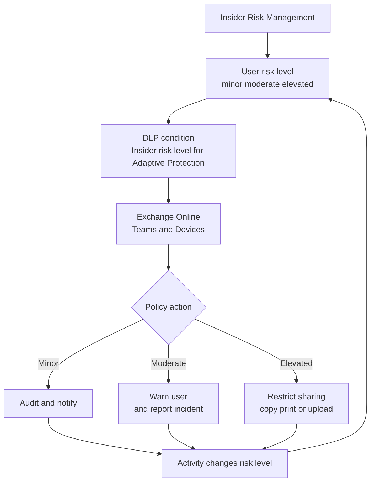
```mermaid
flowchart TB
    AP_IRM["Insider Risk Management"] --> AP_Risk["User risk level<br/>minor moderate elevated"]
    AP_Risk --> AP_DLP["DLP condition<br/>Insider risk level for Adaptive Protection"]
    AP_DLP --> AP_Locations["Exchange Online<br/>Teams and Devices"]
    AP_Locations --> AP_Action{"Policy action"}
    AP_Action -->|"Minor"| AP_Audit["Audit and notify"]
    AP_Action -->|"Moderate"| AP_Warn["Warn user<br/>and report incident"]
    AP_Action -->|"Elevated"| AP_Block["Restrict sharing<br/>copy print or upload"]
    AP_Audit --> AP_Feedback["Activity changes risk level"]
    AP_Warn --> AP_Feedback
    AP_Block --> AP_Feedback
    AP_Feedback --> AP_Risk
```

---

## Audit Log Search Capabilities

Shows the main components, decisions, and operational flow for audit log search capabilities in Microsoft 365 information protection work.

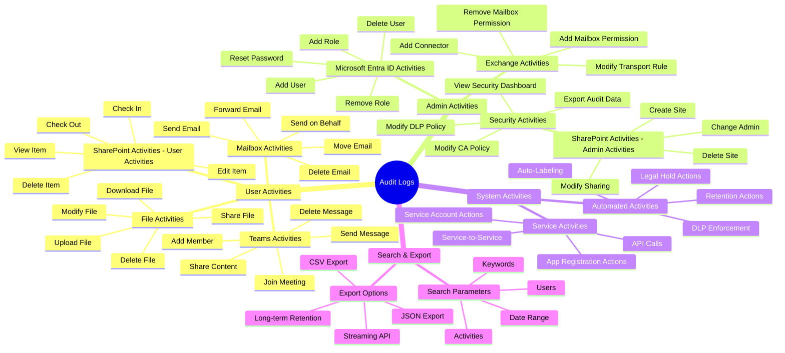
```mermaid
mindmap
  root((Audit Logs))
    User Activities
      Mailbox Activities
        Send Email
        Delete Email
        Move Email
        Forward Email
        Send on Behalf
      File Activities
        Download File
        Upload File
        Modify File
        Delete File
        Share File
      SharePoint Activities - User Activities
        View Item
        Edit Item
        Delete Item
        Check Out
        Check In
      Teams Activities
        Send Message
        Delete Message
        Join Meeting
        Share Content
        Add Member
    Admin Activities
      Microsoft Entra ID Activities
        Add User
        Delete User
        Reset Password
        Add Role
        Remove Role
      Exchange Activities
        Add Mailbox Permission
        Remove Mailbox Permission
        Modify Transport Rule
        Add Connector
      SharePoint Activities - Admin Activities
        Create Site
        Delete Site
        Modify Sharing
        Change Admin
      Security Activities
        Modify DLP Policy
        Modify CA Policy
        View Security Dashboard
        Export Audit Data
    System Activities
      Automated Activities
        Auto-Labeling
        DLP Enforcement
        Retention Actions
        Legal Hold Actions
      Service Activities
        Service Account Actions
        App Registration Actions
        API Calls
        Service-to-Service
    Search & Export
      Search Parameters
        Date Range
        Users
        Activities
        Keywords
      Export Options
        CSV Export
        JSON Export
        Long-term Retention
        Streaming API
```

---

## Audit Premium Investigation Lifecycle

Audit Premium adds longer retention options, audit retention policies, intelligent insights and higher API bandwidth for investigations.

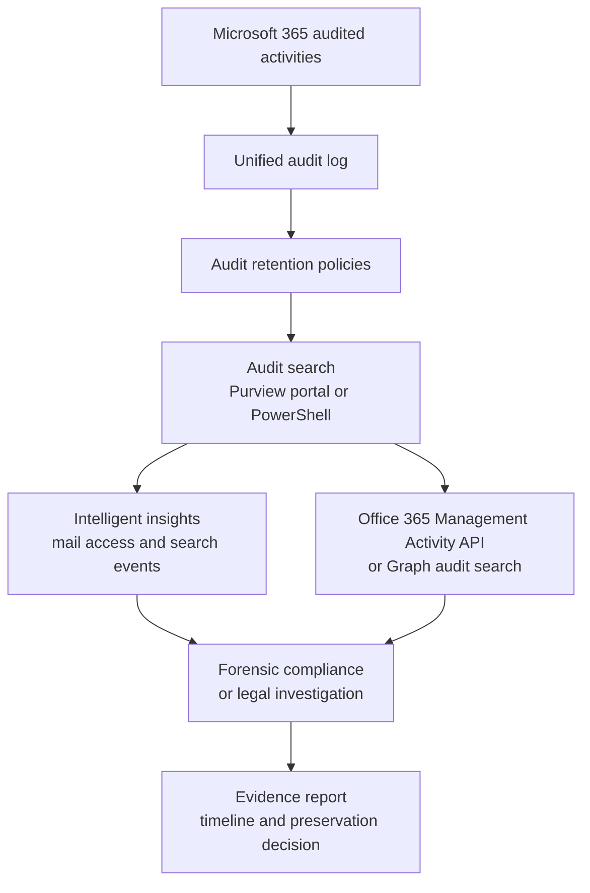
```mermaid
flowchart TB
    AUP_Events["Microsoft 365 audited activities"] --> AUP_UAL["Unified audit log"]
    AUP_UAL --> AUP_Retention["Audit retention policies"]
    AUP_Retention --> AUP_Search["Audit search<br/>Purview portal or PowerShell"]
    AUP_Search --> AUP_Insights["Intelligent insights<br/>mail access and search events"]
    AUP_Search --> AUP_API["Office 365 Management Activity API<br/>or Graph audit search"]
    AUP_Insights --> AUP_Case["Forensic compliance<br/>or legal investigation"]
    AUP_API --> AUP_Case
    AUP_Case --> AUP_Report["Evidence report<br/>timeline and preservation decision"]
```

---

## Communication Compliance Review Workflow

Communication Compliance helps reviewers detect, investigate and remediate policy matches in Teams, Exchange and supported communications.

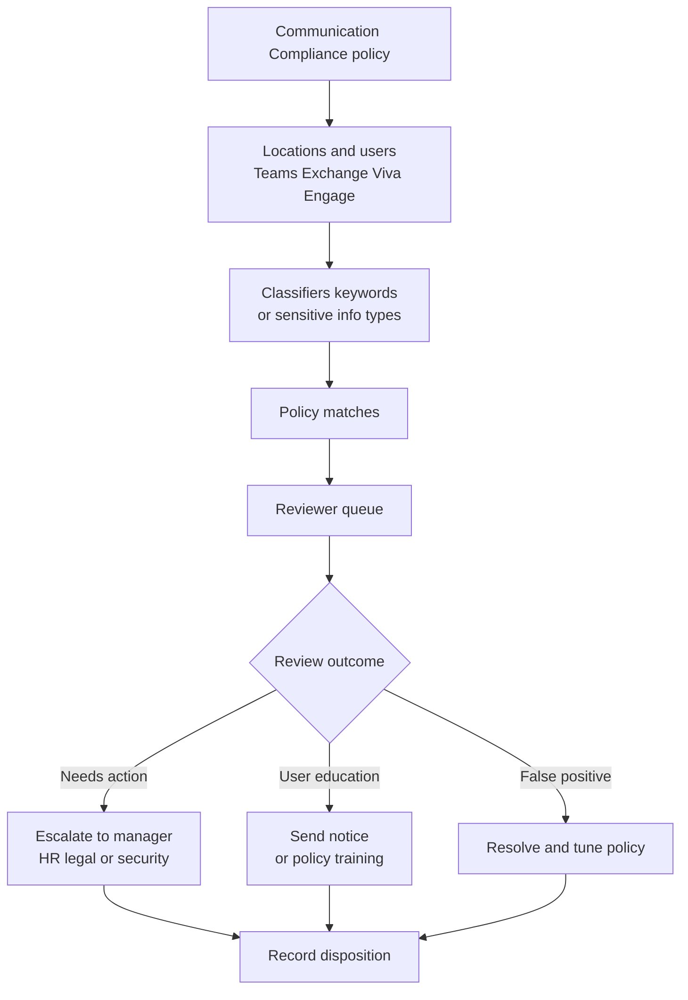
```mermaid
flowchart TB
    CC_Policy["Communication Compliance policy"] --> CC_Locations["Locations and users<br/>Teams Exchange Viva Engage"]
    CC_Locations --> CC_Classifiers["Classifiers keywords<br/>or sensitive info types"]
    CC_Classifiers --> CC_Matches["Policy matches"]
    CC_Matches --> CC_Reviewer["Reviewer queue"]
    CC_Reviewer --> CC_Decision{"Review outcome"}
    CC_Decision -->|"False positive"| CC_Close["Resolve and tune policy"]
    CC_Decision -->|"Needs action"| CC_Escalate["Escalate to manager<br/>HR legal or security"]
    CC_Decision -->|"User education"| CC_Notify["Send notice<br/>or policy training"]
    CC_Escalate --> CC_Record["Record disposition"]
    CC_Notify --> CC_Record
    CC_Close --> CC_Record
```

---

## Data Loss Prevention Action Decision Matrix

Not every policy violation should be blocked. This decision tree helps you select the appropriate enforcement action based on risk context.

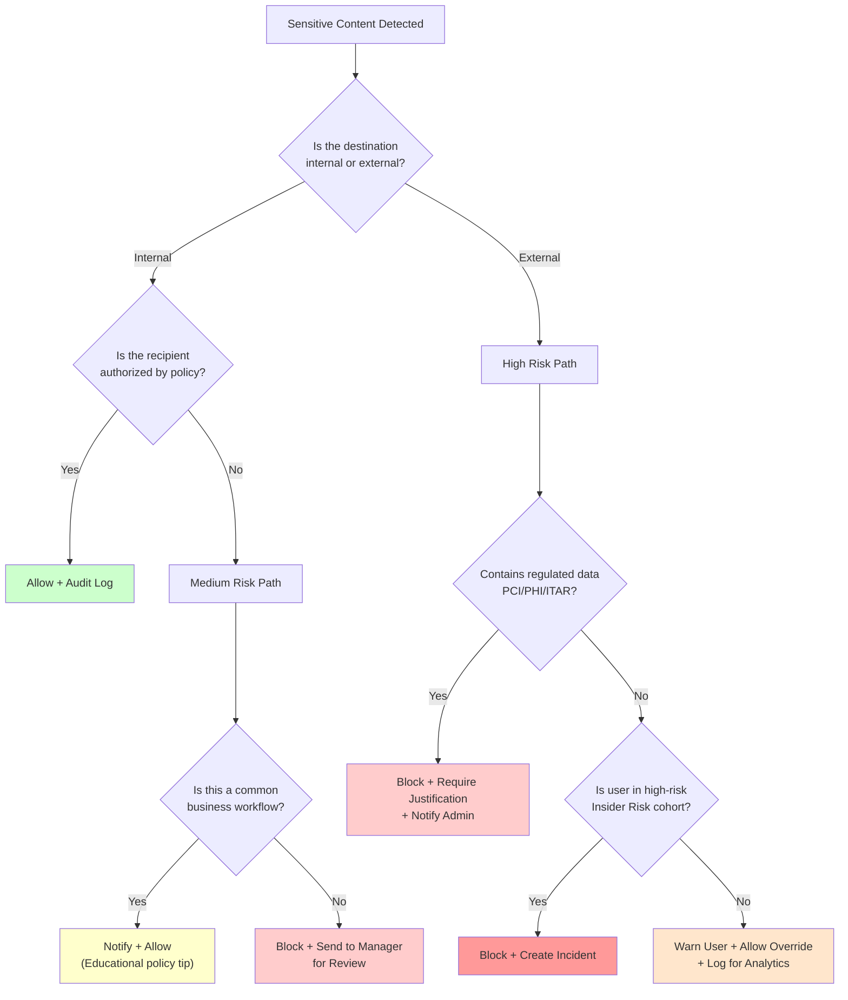
```mermaid
flowchart TD
    A["Sensitive Content Detected"] --> B{"Is the destination<br/>internal or external?"}

    B -->|Internal| C{"Is the recipient<br/>authorized by policy?"}
    B -->|External| D["High Risk Path"]

    C -->|Yes| E["Allow + Audit Log"]
    C -->|No| F["Medium Risk Path"]

    D --> G{"Contains regulated data<br/>PCI/PHI/ITAR?"}
    G -->|Yes| H["Block + Require Justification<br/>+ Notify Admin"]
    G -->|No| I{"Is user in high-risk<br/>Insider Risk cohort?"}

    I -->|Yes| J["Block + Create Incident"]
    I -->|No| K["Warn User + Allow Override<br/>+ Log for Analytics"]

    F --> L{"Is this a common<br/>business workflow?"}
    L -->|Yes| M["Notify + Allow<br/>(Educational policy tip)"]
    L -->|No| N["Block + Send to Manager<br/>for Review"]

    style H fill:#ffcccc
    style J fill:#ff9999
    style K fill:#ffe6cc
    style M fill:#ffffcc
    style E fill:#ccffcc
    style N fill:#ffcccc
```

### Notes
**Key insight**: Context-aware DLP (user risk level, destination, data classification) is significantly more effective than binary block/allow rules. Integrate with **Adaptive Protection** in Insider Risk Management to dynamically adjust enforcement based on user risk scores.

---

## Data Loss Prevention Core Engine

When content is created, modified, or shared in Microsoft 365, the DLP engine evaluates whether it matches defined policies. This flowchart shows the complete decision path from content ingestion to action enforcement.

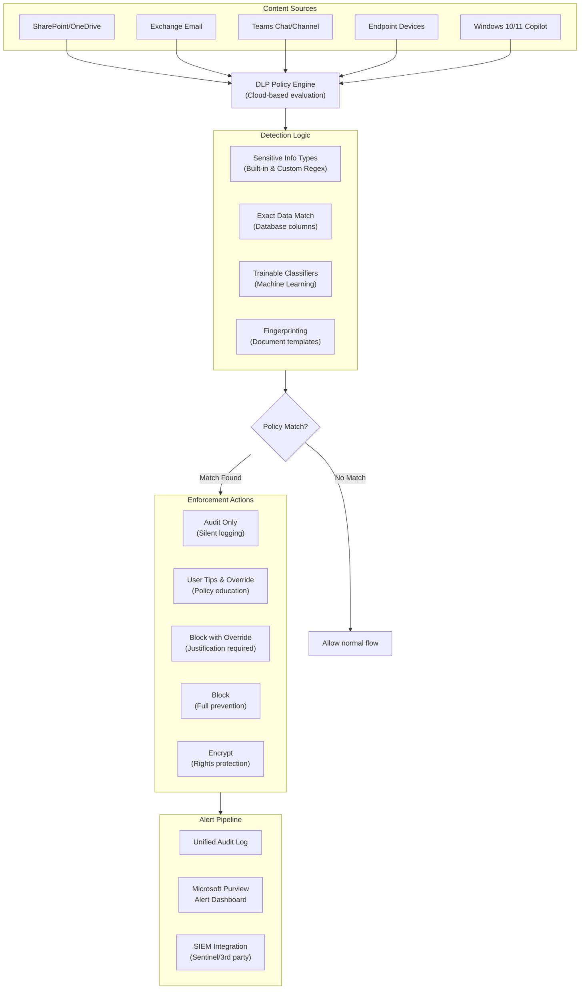
```mermaid
flowchart TB
    subgraph Sources[Content Sources]
        A1[SharePoint/OneDrive]
        A2[Exchange Email]
        A3[Teams Chat/Channel]
        A4[Endpoint Devices]
        A5[Windows 10/11 Copilot]
    end

    B["DLP Policy Engine<br/>(Cloud-based evaluation)"]

    subgraph Detection[Detection Logic]
        C1["Sensitive Info Types<br/>(Built-in & Custom Regex)"]
        C2["Exact Data Match<br/>(Database columns)"]
        C3["Trainable Classifiers<br/>(Machine Learning)"]
        C4["Fingerprinting<br/>(Document templates)"]
    end

    D{Policy Match?}

    subgraph Actions[Enforcement Actions]
        E1["Audit Only<br/>(Silent logging)"]
        E2["User Tips & Override<br/>(Policy education)"]
        E3["Block with Override<br/>(Justification required)"]
        E4["Block<br/>(Full prevention)"]
        E5["Encrypt<br/>(Rights protection)"]
    end

    subgraph Alerts[Alert Pipeline]
        F1["Unified Audit Log"]
        F2["Microsoft Purview<br/>Alert Dashboard"]
        F3["SIEM Integration<br/>(Sentinel/3rd party)"]
    end

    A1 & A2 & A3 & A4 & A5 --> B
    B --> Detection
    Detection --> D
    D -->|Match Found| Actions
    D -->|No Match| G[Allow normal flow]
    Actions --> Alerts
```

### Notes
**Key insight**: DLP operates across **data at rest** (SharePoint, OneDrive), **data in transit** (Exchange), and **data in use** (Teams, Endpoints, Windows). The detection layer uses multiple techniques, from simple pattern matching (regex for credit cards) to ML-based semantic understanding (trainable classifiers).

---

## Data Loss Prevention Policy Architecture

A DLP policy is not just a rule—it is a container with specific locations, conditions, and layered actions. This diagram breaks down the internal structure of a single policy.

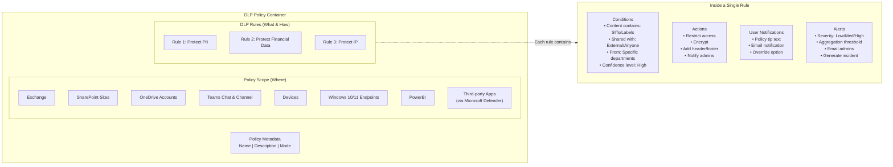
```mermaid
graph LR
    subgraph Policy["DLP Policy Container"]
        direction TB
        Meta["Policy Metadata<br/>Name | Description | Mode"]

        subgraph Locations["Policy Scope (Where)"]
            L1["Exchange"]
            L2["SharePoint Sites"]
            L3["OneDrive Accounts"]
            L4["Teams Chat & Channel"]
            L5["Devices"]
            L6["Windows 10/11 Endpoints"]
            L7["PowerBI"]
            L8["Third-party Apps<br/>(via Microsoft Defender)"]
        end

        subgraph Rules["DLP Rules (What & How)"]
            direction TB
            R1["Rule 1: Protect PII"]
            R2["Rule 2: Protect Financial Data"]
            R3["Rule 3: Protect IP"]
        end
    end

    subgraph RuleInternals["Inside a Single Rule"]
        direction TB
        Cond["Conditions<br/>• Content contains: SITs/Labels<br/>• Shared with: External/Anyone<br/>• From: Specific departments<br/>• Confidence level: High"]
        Act["Actions<br/>• Restrict access<br/>• Encrypt<br/>• Add header/footer<br/>• Notify admins"]
        UserNotify["User Notifications<br/>• Policy tip text<br/>• Email notification<br/>• Override option"]
        Alerts["Alerts<br/>• Severity: Low/Med/High<br/>• Aggregation threshold<br/>• Email admins<br/>• Generate incident"]
    end

    Rules -.->|Each rule contains| RuleInternals
```

### Notes
**Key insight**: One policy can contain **multiple rules**, each targeting different sensitive types with different enforcement levels. The **policy scope** (locations) is defined at the policy level, while **conditions and actions** are defined per rule.

---

## Data Loss Prevention Policy Evaluation Sequence

This sequence diagram shows what happens in real-time when a user attempts to share a document containing sensitive information via SharePoint.

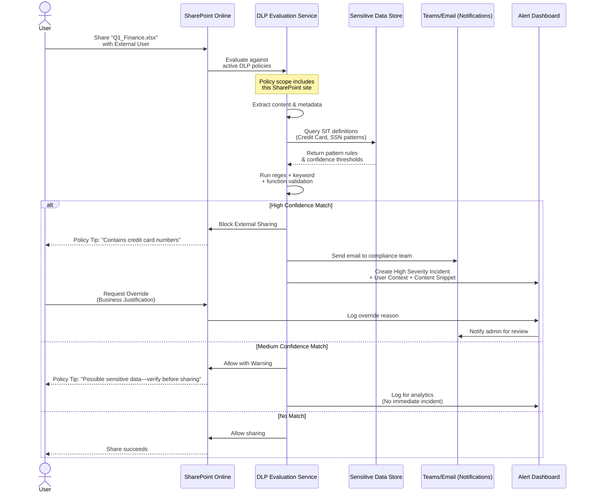
```mermaid
sequenceDiagram
    actor User
    participant SP as SharePoint Online
    participant DE as DLP Evaluation Service
    participant DB as Sensitive Data Store
    participant TE as Teams/Email (Notifications)
    participant AL as Alert Dashboard

    User->>SP: Share "Q1_Finance.xlsx"<br/>with External User
    SP->>DE: Evaluate against<br/>active DLP policies

    Note over DE: Policy scope includes<br/>this SharePoint site

    DE->>DE: Extract content & metadata
    DE->>DB: Query SIT definitions<br/>(Credit Card, SSN patterns)
    DB-->>DE: Return pattern rules<br/>& confidence thresholds

    DE->>DE: Run regex + keyword<br/>+ function validation

    alt High Confidence Match
        DE->>SP: Block External Sharing
        SP-->>User: Policy Tip: "Contains credit card numbers"
        DE->>TE: Send email to compliance team
        DE->>AL: Create High Severity Incident<br/>+ User Context + Content Snippet
        User->>SP: Request Override<br/>(Business Justification)
        SP->>AL: Log override reason
        AL->>TE: Notify admin for review
    else Medium Confidence Match
        DE->>SP: Allow with Warning
        SP-->>User: Policy Tip: "Possible sensitive data—verify before sharing"
        DE->>AL: Log for analytics<br/>(No immediate incident)
    else No Match
        DE->>SP: Allow sharing
        SP-->>User: Share succeeds
    end
```

### Notes
**Key insight**: The evaluation engine is **synchronous** for real-time user actions (sharing, sending email) and **asynchronous** for background scans (indexing existing content). The same policy can produce different UX depending on confidence thresholds.

---

## Data Loss Prevention Rollout Phases

Deploying DLP without disrupting business operations requires a phased approach. This timeline diagram shows a recommended rollout pattern.

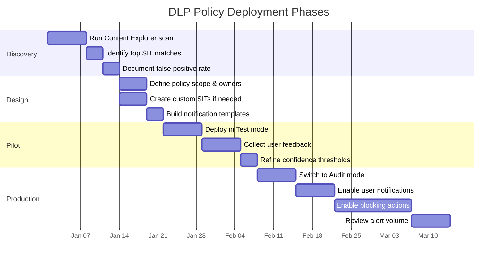
```mermaid
gantt
    title DLP Policy Deployment Phases
    dateFormat YYYY-MM-DD
    axisFormat %b %d

    section Discovery
    Run Content Explorer scan       :disc1, 2024-01-01, 7d
    Identify top SIT matches        :disc2, after disc1, 3d
    Document false positive rate    :disc3, after disc2, 3d

    section Design
    Define policy scope & owners    :des1, after disc3, 5d
    Create custom SITs if needed    :des2, after disc3, 5d
    Build notification templates    :des3, after des1, 3d

    section Pilot
    Deploy in Test mode             :pil1, after des3, 7d
    Collect user feedback           :pil2, after pil1, 7d
    Refine confidence thresholds    :pil3, after pil2, 3d

    section Production
    Switch to Audit mode            :prod1, after pil3, 7d
    Enable user notifications       :prod2, after prod1, 7d
    Enable blocking actions         :prod3, after prod2, 14d
    Review alert volume             :prod4, after prod3, 7d
```

### Notes
**Key insight**: Always start in **TestWithoutNotifications** (silent audit) mode, then progress to **TestWithNotifications**, and finally **Enforce**. Skipping the pilot phase typically results in high false-positive rates that erode user trust.

---

## DLP Integration Ecosystem

DLP does not operate in isolation. It is part of the broader Microsoft Purview Information Protection architecture. This diagram shows the integration points across the security stack.

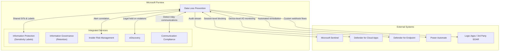
```mermaid
flowchart TB
    subgraph Purview["Microsoft Purview"]
        DLP["Data Loss Prevention"]

        subgraph Partners["Integrated Services"]
            IL["Information Protection<br/>(Sensitivity Labels)"]
            IG["Information Governance<br/>(Retention)"]
            IR["Insider Risk Management"]
            ED["eDiscovery"]
            CC["Communication Compliance"]
        end
    end

    subgraph External["External Systems"]
        S1["Microsoft Sentinel"]
        S2["Defender for Cloud Apps"]
        S3["Defender for Endpoint"]
        S4["Power Automate"]
        S5["Logic Apps / 3rd Party SOAR"]
    end

    DLP <-->|Shared SITs & Labels| IL
    DLP <-->|Alert correlation| IR
    DLP <-->|Legal hold on violations| ED
    DLP <-->|Detect risky communications| CC
    DLP <-->|Session-level blocking| S2
    DLP <-->|Device-level I/O monitoring| S3
    DLP -->|Audit stream| S1
    DLP -->|Automated remediation| S4
    DLP -->|Custom webhook flows| S5
```

### Notes
**Key insight**: The most powerful deployments combine **DLP + Sensitivity Labels + Defender for Cloud Apps**. For example: a file labeled "Confidential" is automatically blocked from upload to personal Dropbox by DLP, while Defender for Cloud Apps provides shadow IT discovery.

---

## DSPM for AI

Data Security Posture Management for AI helps admins discover AI use, assess data risk, activate protections and monitor risky interactions.

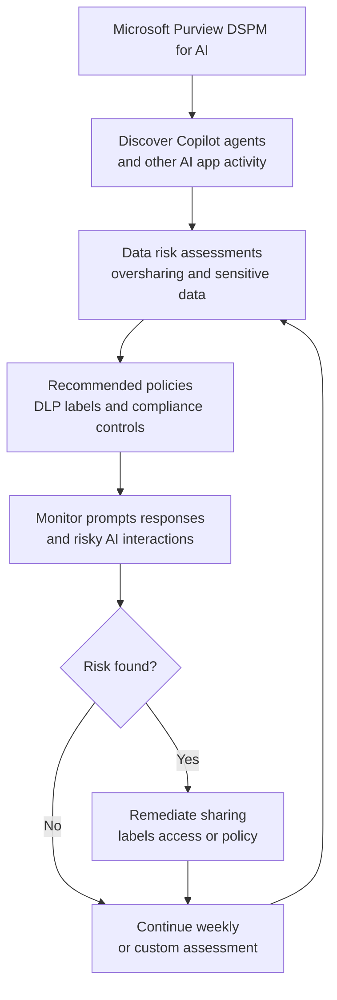
```mermaid
flowchart TB
    DSPMAI_Start["Microsoft Purview DSPM for AI"] --> DSPMAI_Discover["Discover Copilot agents<br/>and other AI app activity"]
    DSPMAI_Discover --> DSPMAI_Assess["Data risk assessments<br/>oversharing and sensitive data"]
    DSPMAI_Assess --> DSPMAI_Policies["Recommended policies<br/>DLP labels and compliance controls"]
    DSPMAI_Policies --> DSPMAI_Monitor["Monitor prompts responses<br/>and risky AI interactions"]
    DSPMAI_Monitor --> DSPMAI_Remediate{"Risk found?"}
    DSPMAI_Remediate -->|"Yes"| DSPMAI_Action["Remediate sharing<br/>labels access or policy"]
    DSPMAI_Remediate -->|"No"| DSPMAI_Continue["Continue weekly<br/>or custom assessment"]
    DSPMAI_Action --> DSPMAI_Continue
    DSPMAI_Continue --> DSPMAI_Assess
```

---

## eDiscovery Process Flow

Shows the main components, decisions, and operational flow for ediscovery process flow in Microsoft 365 information protection work.

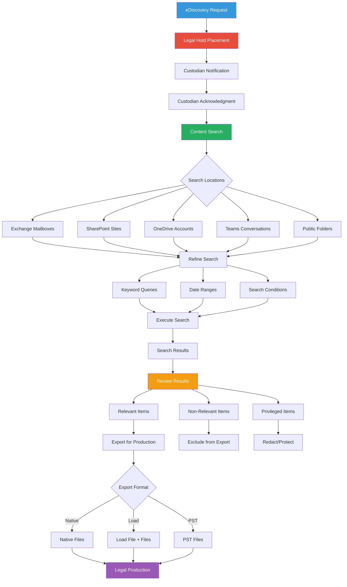
```mermaid
flowchart TB
    Start[eDiscovery Request] --> LegalHold[Legal Hold Placement]

    LegalHold --> Custodian[Custodian Notification]
    Custodian --> Acknowledge[Custodian Acknowledgment]

    Acknowledge --> Search[Content Search]

    Search --> Locations{Search Locations}

    Locations --> Exchange[Exchange Mailboxes]
    Locations --> SPO[SharePoint Sites]
    Locations --> ODB[OneDrive Accounts]
    Locations --> Teams[Teams Conversations]
    Locations --> PublicFolders[Public Folders]

    Exchange --> Refine[Refine Search]
    SPO --> Refine
    ODB --> Refine
    Teams --> Refine
    PublicFolders --> Refine

    Refine --> Keywords[Keyword Queries]
    Refine --> DateRange[Date Ranges]
    Refine --> Conditions[Search Conditions]

    Keywords --> Execute[Execute Search]
    DateRange --> Execute
    Conditions --> Execute

    Execute --> Results[Search Results]
    Results --> Review[Review Results]

    Review --> Relevant[Relevant Items]
    Review --> NotRelevant[Non-Relevant Items]
    Review --> Privileged[Privileged Items]

    Relevant --> Export[Export for Production]
    NotRelevant --> Exclude[Exclude from Export]
    Privileged --> Redact[Redact/Protect]

    Export --> Format{Export Format}
    Format -->|Native| NativeFormat[Native Files]
    Format -->|Load| LoadFile[Load File + Files]
    Format -->|PST| PSTFormat[PST Files]

    NativeFormat --> Production[Legal Production]
    LoadFile --> Production
    PSTFormat --> Production

    style Start fill:#3498db,color:#fff
    style LegalHold fill:#e74c3c,color:#fff
    style Search fill:#27ae60,color:#fff
    style Review fill:#f39c12,color:#fff
    style Production fill:#9b59b6,color:#fff
```

---

## Email Retention and Archiving

Shows the main components, decisions, and operational flow for email retention and archiving in Microsoft 365 information protection work.

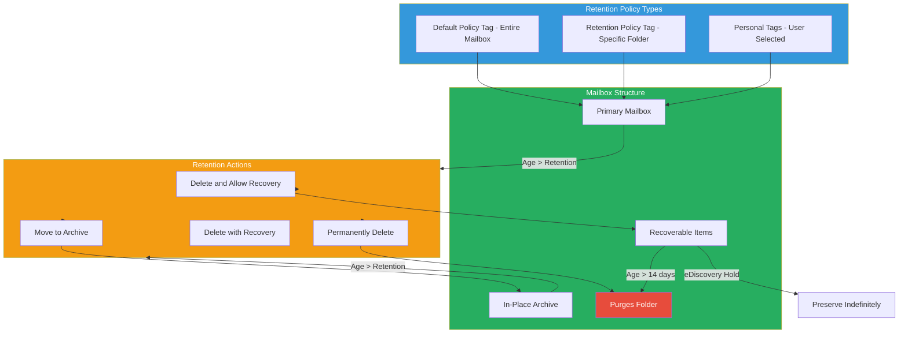
```mermaid
flowchart TB
    subgraph Retention["Retention Policy Types"]
        DPT[Default Policy Tag - Entire Mailbox]
        RPT[Retention Policy Tag - Specific Folder]
        Personal[Personal Tags - User Selected]
    end

    subgraph Actions["Retention Actions"]
        Delete[Delete and Allow Recovery]
        PermanentlyDelete[Permanently Delete]
        MoveToArchive[Move to Archive]
        DeleteAndAllowRecovery[Delete with Recovery]
    end

    subgraph Mailbox["Mailbox Structure"]
        Primary[Primary Mailbox]
        Archive[In-Place Archive]
        Recoverable[Recoverable Items]
        Purges[Purges Folder]
    end

    DPT --> Primary
    RPT --> Primary
    Personal --> Primary

    Primary -->|Age > Retention| Actions
    Archive -->|Age > Retention| Actions

    Actions --> Delete --> Recoverable
    Actions --> PermanentlyDelete --> Purges
    Actions --> MoveToArchive --> Archive

    Recoverable -->|Age > 14 days| Purges
    Recoverable -->|eDiscovery Hold| Preserved[Preserve Indefinitely]

    style Retention fill:#3498db,color:#fff
    style Actions fill:#f39c12,color:#fff
    style Mailbox fill:#27ae60,color:#fff
    style Purges fill:#e74c3c,color:#fff
```

---

## Endpoint Data Loss Prevention Architecture

Endpoint DLP extends protection to data leaving the device—not just the cloud. This diagram illustrates how the agent works with Windows and macOS to monitor local actions.

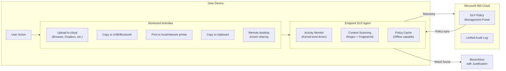
```mermaid
flowchart LR
    subgraph Device["User Device"]
        direction TB
        UserAction["User Action"]

        subgraph MonitoredActions["Monitored Activities"]
            M1["Upload to cloud<br/>(Browser, Dropbox, etc.)"]
            M2["Copy to USB/Bluetooth"]
            M3["Print to local/network printer"]
            M4["Copy to clipboard"]
            M5["Remote desktop<br/>screen sharing"]
        end

        subgraph Agent["Endpoint DLP Agent"]
            A1["Activity Monitor<br/>(Kernel-level driver)"]
            A2["Content Scanning<br/>(Regex + Fingerprint)"]
            A3["Policy Cache<br/>(Offline capable)"]
        end
    end

    subgraph Cloud["Microsoft 365 Cloud"]
        CP["DLP Policy<br/>Management Portal"]
        AUD["Unified Audit Log"]
    end

    UserAction --> MonitoredActions
    MonitoredActions --> Agent
    Agent -->|Match found| Block["Block/Allow<br/>with Justification"]
    Agent -->|Telemetry| Cloud
    CP -->|Policy sync| Agent
```

### Notes
**Key insight**: The Endpoint DLP agent caches policies locally, allowing enforcement even when the device is **offline**. It monitors **43 different file types** via I/O interception, not just Microsoft Office files.

---

## Incident Remediation Workflow

When DLP generates an alert, it enters the Microsoft Purview Incident Management workflow. This state diagram shows the lifecycle from detection to resolution.

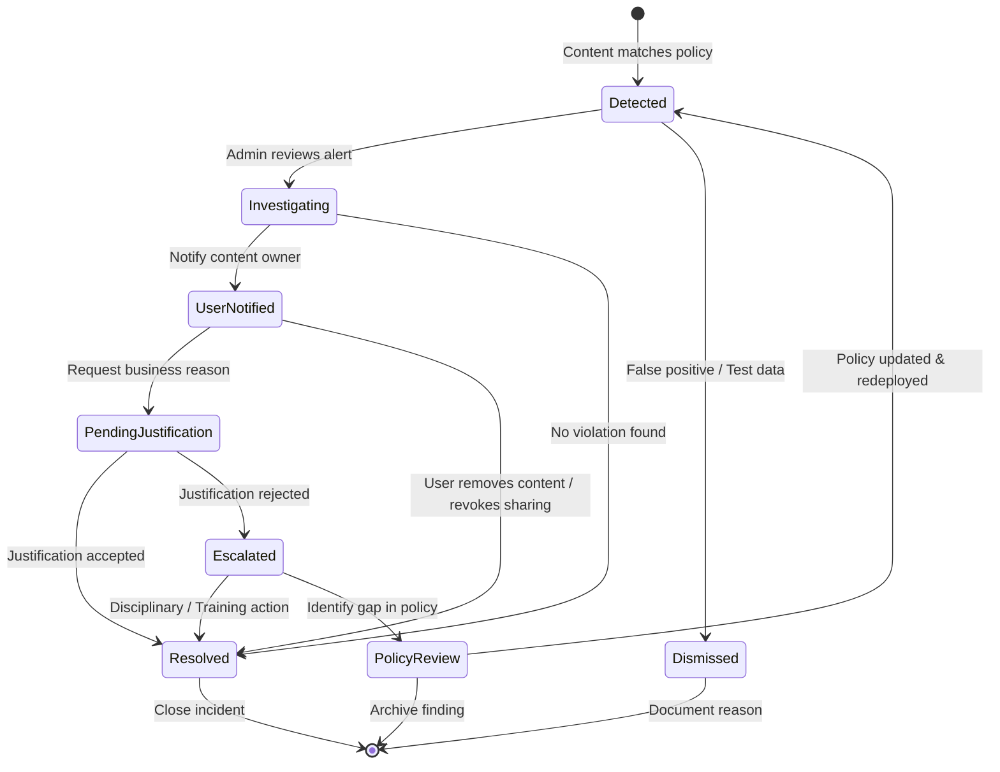
```mermaid
stateDiagram-v2
    [*] --> Detected: Content matches policy

    Detected --> Investigating: Admin reviews alert
    Detected --> Dismissed: False positive / Test data

    Investigating --> UserNotified: Notify content owner
    Investigating --> Resolved: No violation found

    UserNotified --> PendingJustification: Request business reason
    UserNotified --> Resolved: User removes content / revokes sharing

    PendingJustification --> Resolved: Justification accepted
    PendingJustification --> Escalated: Justification rejected

    Escalated --> Resolved: Disciplinary / Training action
    Escalated --> PolicyReview: Identify gap in policy

    PolicyReview --> Detected: Policy updated & redeployed
    PolicyReview --> [*]: Archive finding

    Dismissed --> [*]: Document reason
    Resolved --> [*]: Close incident
```

### Notes
**Key insight**: DLP alerts can be linked to **Microsoft Purview eDiscovery (Premium)** cases. The workflow supports delegated review—line managers can investigate their own team's violations without seeing other departments' data.

---

## Insider Risk Management Policy Lifecycle

Insider Risk Management uses policy templates, indicators, alerts and cases to detect and manage risky user activity with privacy controls.

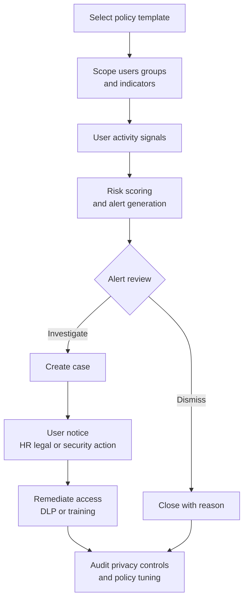
```mermaid
flowchart TB
    IRM_Template["Select policy template"] --> IRM_Scope["Scope users groups<br/>and indicators"]
    IRM_Scope --> IRM_Activity["User activity signals"]
    IRM_Activity --> IRM_Risk["Risk scoring<br/>and alert generation"]
    IRM_Risk --> IRM_Triage{"Alert review"}
    IRM_Triage -->|"Dismiss"| IRM_Dismiss["Close with reason"]
    IRM_Triage -->|"Investigate"| IRM_Case["Create case"]
    IRM_Case --> IRM_Action["User notice<br/>HR legal or security action"]
    IRM_Action --> IRM_Remediation["Remediate access<br/>DLP or training"]
    IRM_Remediation --> IRM_Audit["Audit privacy controls<br/>and policy tuning"]
    IRM_Dismiss --> IRM_Audit
```

---

## Microsoft Purview Compliance Portal

Shows the main components, decisions, and operational flow for microsoft purview compliance portal in Microsoft 365 information protection work.

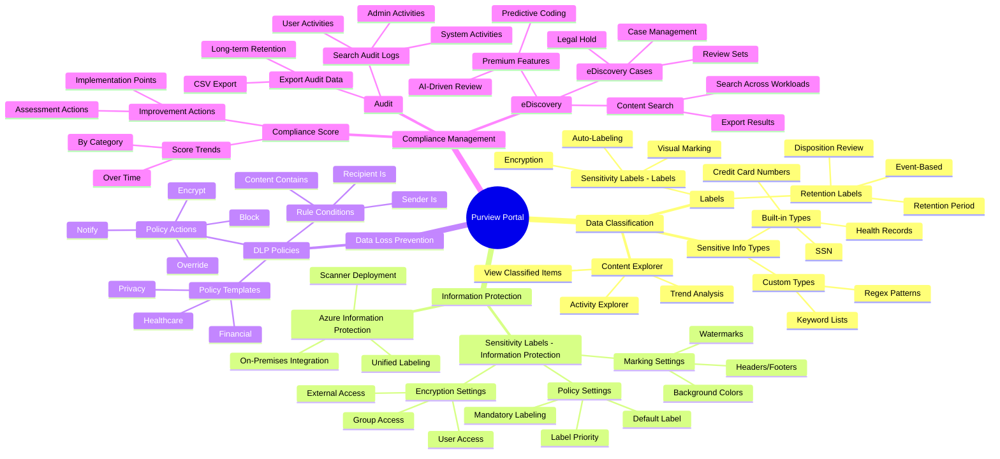
```mermaid
mindmap
  root((Purview Portal))
    Data Classification
      Sensitive Info Types
        Built-in Types
          Credit Card Numbers
          SSN
          Health Records
        Custom Types
          Regex Patterns
          Keyword Lists
      Content Explorer
        View Classified Items
        Activity Explorer
        Trend Analysis
      Labels
        Sensitivity Labels - Labels
          Encryption
          Visual Marking
          Auto-Labeling
        Retention Labels
          Retention Period
          Disposition Review
          Event-Based
    Information Protection
      Sensitivity Labels - Information Protection
        Policy Settings
          Label Priority
          Default Label
          Mandatory Labeling
        Encryption Settings
          User Access
          Group Access
          External Access
        Marking Settings
          Headers/Footers
          Watermarks
          Background Colors
      Azure Information Protection
        Unified Labeling
        On-Premises Integration
        Scanner Deployment
    Data Loss Prevention
      DLP Policies
        Policy Templates
          Financial
          Healthcare
          Privacy
        Rule Conditions
          Content Contains
          Sender Is
          Recipient Is
        Policy Actions
          Block
          Encrypt
          Notify
          Override
    Compliance Management
      Compliance Score
        Improvement Actions
          Implementation Points
          Assessment Actions
        Score Trends
          Over Time
          By Category
      Audit
        Search Audit Logs
          User Activities
          Admin Activities
          System Activities
        Export Audit Data
          CSV Export
          Long-term Retention
      eDiscovery
        Content Search
          Search Across Workloads
          Export Results
        eDiscovery Cases
          Case Management
          Legal Hold
          Review Sets
        Premium Features
          AI-Driven Review
          Predictive Coding
```

---

## Microsoft Purview Data Lifecycle

Shows the main components, decisions, and operational flow for microsoft purview data lifecycle in Microsoft 365 information protection work.

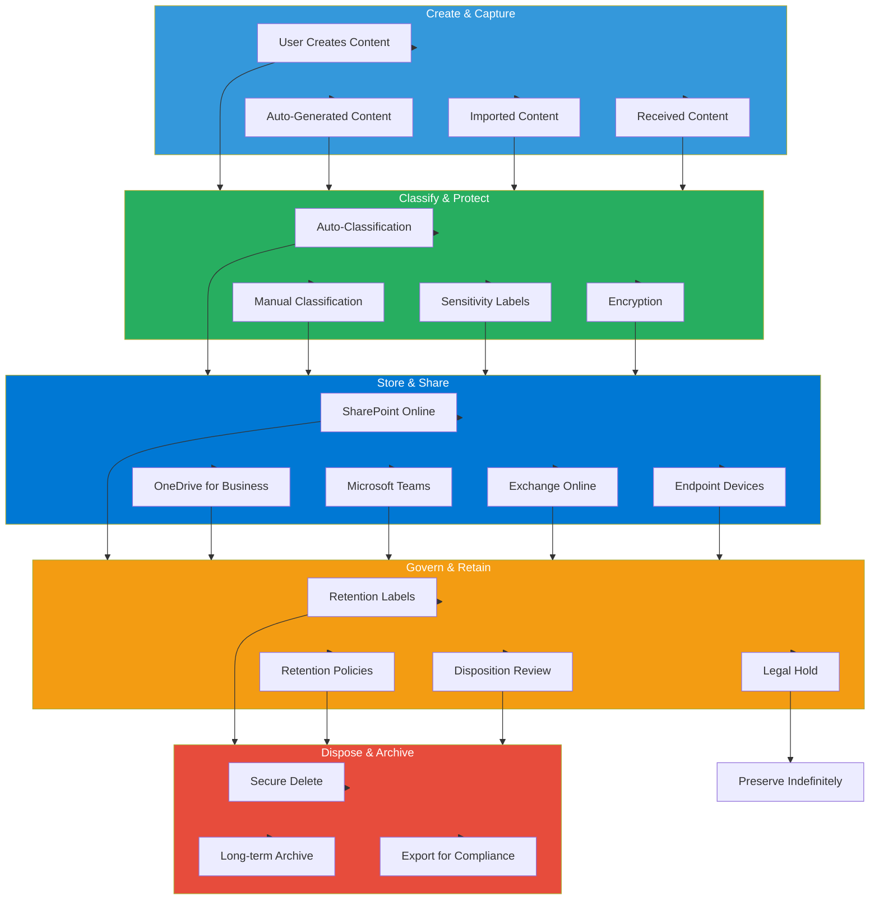
```mermaid
flowchart TB
    subgraph Create["Create & Capture"]
        UserCreate[User Creates Content]
        AutoGenerate[Auto-Generated Content]
        Import[Imported Content]
        Receive[Received Content]
    end

    subgraph Classify["Classify & Protect"]
        AutoClassify[Auto-Classification]
        ManualClassify[Manual Classification]
        SensitivityLabel[Sensitivity Labels]
        Encryption[Encryption]
    end

    subgraph Store["Store & Share"]
        SharePoint[SharePoint Online]
        OneDrive[OneDrive for Business]
        Teams[Microsoft Teams]
        Exchange[Exchange Online]
        Endpoint[Endpoint Devices]
    end

    subgraph Govern["Govern & Retain"]
        RetentionLabel[Retention Labels]
        RetentionPolicy[Retention Policies]
        LegalHold[Legal Hold]
        Disposition[Disposition Review]
    end

    subgraph Dispose["Dispose & Archive"]
        Delete[Secure Delete]
        Archive[Long-term Archive]
        Export[Export for Compliance]
    end

    Create --> UserCreate
    Create --> AutoGenerate
    Create --> Import
    Create --> Receive

    UserCreate --> Classify
    AutoGenerate --> Classify
    Import --> Classify
    Receive --> Classify

    Classify --> AutoClassify
    Classify --> ManualClassify
    Classify --> SensitivityLabel
    Classify --> Encryption

    AutoClassify --> Store
    ManualClassify --> Store
    SensitivityLabel --> Store
    Encryption --> Store

    Store --> SharePoint
    Store --> OneDrive
    Store --> Teams
    Store --> Exchange
    Store --> Endpoint

    SharePoint --> Govern
    OneDrive --> Govern
    Teams --> Govern
    Exchange --> Govern
    Endpoint --> Govern

    Govern --> RetentionLabel
    Govern --> RetentionPolicy
    Govern --> LegalHold
    Govern --> Disposition

    RetentionLabel --> Dispose
    RetentionPolicy --> Dispose
    LegalHold --> Preserve[Preserve Indefinitely]
    Disposition --> Dispose

    Dispose --> Delete
    Dispose --> Archive
    Dispose --> Export

    style Create fill:#3498db,color:#fff
    style Classify fill:#27ae60,color:#fff
    style Store fill:#0078d4,color:#fff
    style Govern fill:#f39c12,color:#fff
    style Dispose fill:#e74c3c,color:#fff
```

---

## Records Management and Disposition Review

Records management controls file plans, retention labels, event-based retention and disposition review evidence.

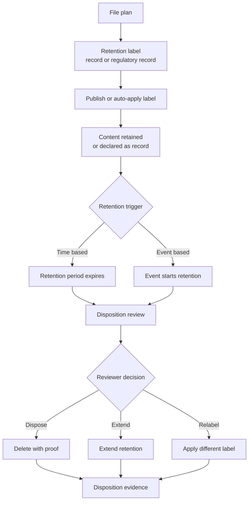
```mermaid
flowchart TB
    RM_FilePlan["File plan"] --> RM_Label["Retention label<br/>record or regulatory record"]
    RM_Label --> RM_Publish["Publish or auto-apply label"]
    RM_Publish --> RM_Content["Content retained<br/>or declared as record"]
    RM_Content --> RM_Trigger{"Retention trigger"}
    RM_Trigger -->|"Time based"| RM_Timer["Retention period expires"]
    RM_Trigger -->|"Event based"| RM_Event["Event starts retention"]
    RM_Timer --> RM_Disposition["Disposition review"]
    RM_Event --> RM_Disposition
    RM_Disposition --> RM_Decision{"Reviewer decision"}
    RM_Decision -->|"Dispose"| RM_Delete["Delete with proof"]
    RM_Decision -->|"Extend"| RM_Extend["Extend retention"]
    RM_Decision -->|"Relabel"| RM_Relabel["Apply different label"]
    RM_Delete --> RM_Evidence["Disposition evidence"]
    RM_Extend --> RM_Evidence
    RM_Relabel --> RM_Evidence
```

---

## Retention and Labeling

Shows the main components, decisions, and operational flow for retention and labeling in Microsoft 365 information protection work.

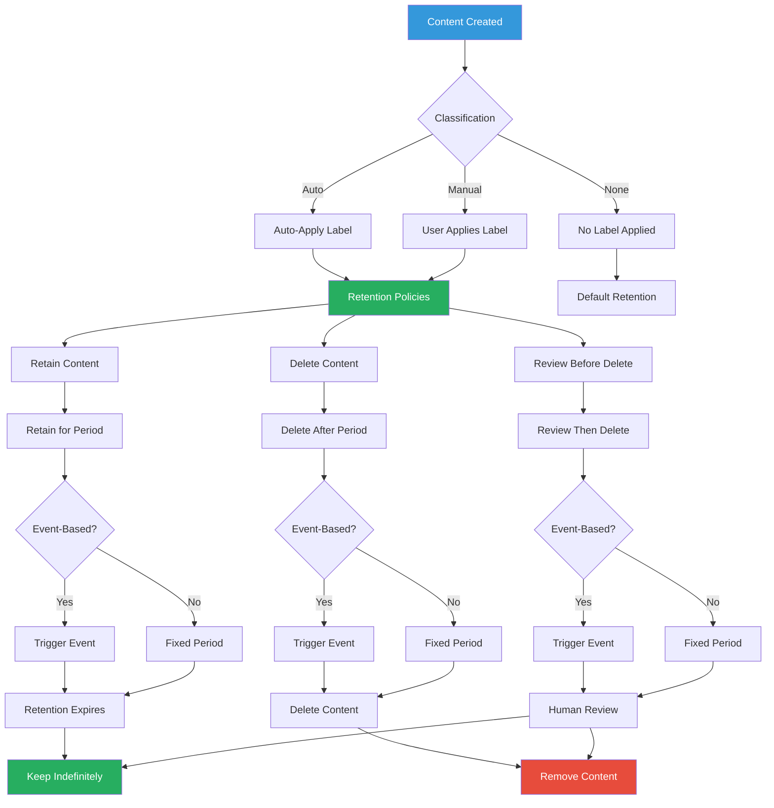
```mermaid
flowchart TB
    Content[Content Created] --> Classification{Classification}

    Classification -->|Auto| AutoLabel[Auto-Apply Label]
    Classification -->|Manual| UserLabel[User Applies Label]
    Classification -->|None| NoLabel[No Label Applied]

    AutoLabel --> Policies[Retention Policies]
    UserLabel --> Policies
    NoLabel --> Default[Default Retention]

    Policies --> Retain[Retain Content]
    Policies --> Delete[Delete Content]
    Policies --> Review[Review Before Delete]

    Retain --> Period1[Retain for Period]
    Delete --> Period2[Delete After Period]
    Review --> Period3[Review Then Delete]

    Period1 --> Event1{Event-Based?}
    Period2 --> Event2{Event-Based?}
    Period3 --> Event3{Event-Based?}

    Event1 -->|Yes| Trigger1[Trigger Event]
    Event1 -->|No| Fixed1[Fixed Period]
    Event2 -->|Yes| Trigger2[Trigger Event]
    Event2 -->|No| Fixed2[Fixed Period]
    Event3 -->|Yes| Trigger3[Trigger Event]
    Event3 -->|No| Fixed3[Fixed Period]

    Trigger1 --> Expire1[Retention Expires]
    Fixed1 --> Expire1
    Trigger2 --> Delete1[Delete Content]
    Fixed2 --> Delete1
    Trigger3 --> Review1[Human Review]
    Fixed3 --> Review1

    Expire1 --> Keep[Keep Indefinitely]
    Delete1 --> Remove[Remove Content]
    Review1 --> Keep
    Review1 --> Remove

    style Content fill:#3498db,color:#fff
    style Policies fill:#27ae60,color:#fff
    style Keep fill:#27ae60,color:#fff
    style Remove fill:#e74c3c,color:#fff
```

---

## Sensitive Information Detection Techniques

Microsoft 365 DLP doesn't rely on a single detection method. It uses a tiered approach based on the type of data you need to protect. This diagram maps the hierarchy of detection capabilities.

```mermaid
mindmap
  root((Sensitive Data<br/>Detection))
    Built-in SITs
      Keyword dictionaries
      Regular expressions
      Internal functions<br/>(checksums like Luhn)
      Confidence levels
        Low
        Medium
        High
    Exact Data Match
      Database connection
      Indexed columns
      Up to 100M values
      High volume/low false positive
    Document Fingerprinting
      Upload template
      Generate hash
      Match similar forms
    Trainable Classifiers
      Pre-trained
        Resumes
        Source code
        Harassment
        Legal docs
      Custom
        10 positive samples
        10 negative samples
        Re-train iteratively
    Sensitivity Labels
      Manual application
      Auto-labeling rules
      DLP enforcement via label
```

### Notes
**Key insight**: For structured data (e.g., employee IDs stored in SQL), use **Exact Data Match**. For unstructured concepts (e.g., "this document contains engineering specs"), use **Trainable Classifiers**. For regulated data (e.g., passport numbers), rely on **Built-in SITs**.

---

## Sensitivity Labels Classification and File Protection

Shows how sensitivity labels are selected manually or automatically, then enforced through visual markings, encryption, access controls, and sharing restrictions.

```mermaid
flowchart TB
    Content[File or Content Created] --> Existing{Label Already Applied?}
    Existing -->|Yes| Enforce[Enforce Existing Label Settings]
    Existing -->|No| Classification{Classification Method}

    Classification -->|User chooses label| Manual[Manual Label Selection]
    Classification -->|Auto-labelling enabled| Scan[Scan for Sensitive Information]
    Scan --> Match{Policy Match?}
    Match -->|Yes| AutoApply[Auto-apply Recommended or Mandatory Label]
    Match -->|No| Manual

    Manual --> Label{Sensitivity Level}
    AutoApply --> Label

    Label --> Public[Public / General]
    Label --> Internal[Internal]
    Label --> Confidential[Confidential]
    Label --> HighlyRestricted[Highly Restricted]

    Public --> PublicSettings[No or Minimal Protection]
    Internal --> InternalSettings[Visual Marking / Optional Encryption]
    Confidential --> ConfidentialSettings[Encryption + Access Restrictions]
    HighlyRestricted --> RestrictedSettings[Strong Encryption + Strict Access]

    PublicSettings --> Protected[Protected Content]
    InternalSettings --> Protected
    ConfidentialSettings --> Protected
    RestrictedSettings --> Protected

    Protected --> Sharing{Sharing Attempt}
    Sharing -->|Internal user| InternalShare[Allow According to Permissions]
    Sharing -->|External user| ExternalCheck{External Access Allowed?}
    Sharing -->|Public link| PublicCheck{Public Sharing Allowed?}

    ExternalCheck -->|Yes| AuthExternal[Require Authentication and Enforce Rights]
    ExternalCheck -->|No| BlockExternal[Block External Sharing]
    PublicCheck -->|Yes| AllowPublic[Allow Public Sharing]
    PublicCheck -->|No| BlockPublic[Block Public Link]

    style Protected fill:#27ae60,color:#fff
    style HighlyRestricted fill:#e74c3c,color:#fff
    style BlockExternal fill:#c0392b,color:#fff
    style BlockPublic fill:#c0392b,color:#fff
```

### Notes
Sensitivity labels can apply to files, emails, Teams sites, Microsoft 365 groups, and containers depending on configuration. File labels usually combine classification, marking, encryption, and sharing behaviour.
