# Licensing

Licensing diagrams for Microsoft 365 admins. This file contains 13 topics covering licence assignment, service plan provisioning, add-ons, Copilot readiness, Purview, Intune, Teams and external user billing considerations.

## Contents

- [Group-Based Licensing Architecture](#group-based-licensing-architecture)
- [Guest and External User Licensing](#guest-and-external-user-licensing)
- [Licence Assignment and Service Provisioning Flow](#licence-assignment-and-service-provisioning-flow)
- [Licence Lifecycle: Assignment to Retirement](#licence-lifecycle-assignment-to-retirement)
- [Licence Management Workflow](#licence-management-workflow)
- [Licence Selection Decision Tree](#licence-selection-decision-tree)
- [Licence Upgrade and Migration Pathways](#licence-upgrade-and-migration-pathways)
- [Microsoft 365 Add-on Attachment Model](#microsoft-365-add-on-attachment-model)
- [Microsoft 365 Add-on Licensing Stack](#microsoft-365-add-on-licensing-stack)
- [Microsoft 365 Copilot Licensing Readiness](#microsoft-365-copilot-licensing-readiness)
- [Microsoft 365 E3, E5 and Business Premium Feature Matrix](#microsoft-365-e3-e5-and-business-premium-feature-matrix)
- [Microsoft 365 Licence Hierarchy](#microsoft-365-licence-hierarchy)
- [Microsoft Purview Licensing Stack](#microsoft-purview-licensing-stack)

---

## Group-Based Licensing Architecture

Group-based licensing is the scalable way to manage licence assignment. This diagram shows how dynamic and security groups automatically map to licence plans.

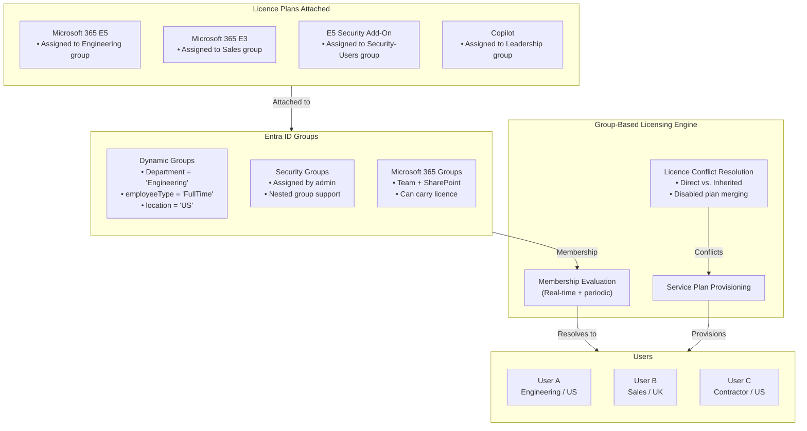

### Notes
**Key insight**: A user can be a member of **multiple groups with different licences**. The licence engine merges the service plans, enabling the union of capabilities. However, if two groups assign **conflicting plans** (e.g., E3 and E5), the engine uses a precedence rule. Always review **licence errors** in the Entra ID portal—conflicts are reported per user.

---

## Guest and External User Licensing

External user licensing now centres on Microsoft Entra External ID monthly active users, workload entitlements and any premium features assigned to guests.

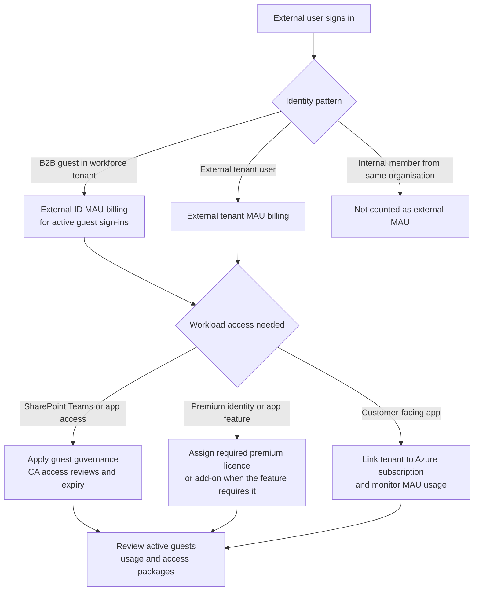

### Notes

- Do not use the retired guest-ratio model as the planning model. Check current Microsoft Entra External ID billing and workload-specific licence requirements before rollout.

---

## Licence Assignment and Service Provisioning Flow

When a licence is assigned to a user, Microsoft triggers a cascading provisioning pipeline. This sequence diagram shows the activation flow.

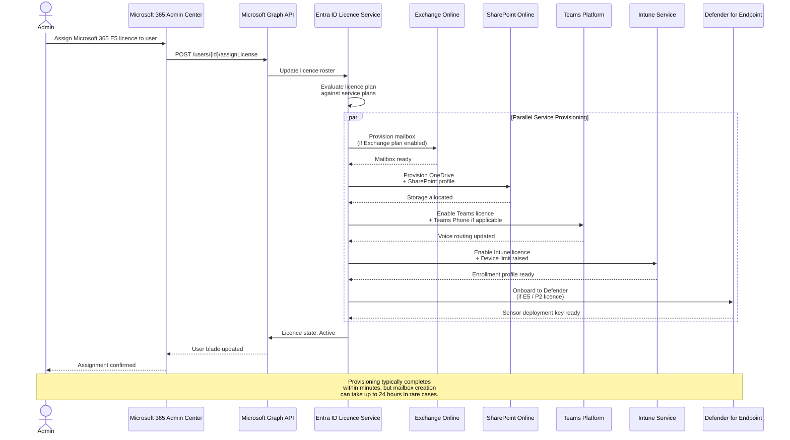

### Notes
**Key insight**: Licences are **not instantaneously atomic**—some services provision faster than others. A user might be able to sign into Teams before their Exchange mailbox is fully created. Always use the **Microsoft 365 admin center licensing page** or Graph API to verify which service plans are in a `Success` state versus `PendingInput`.

---

## Licence Lifecycle: Assignment to Retirement

This state diagram shows the full lifecycle of a licence from procurement through reassignment or removal.

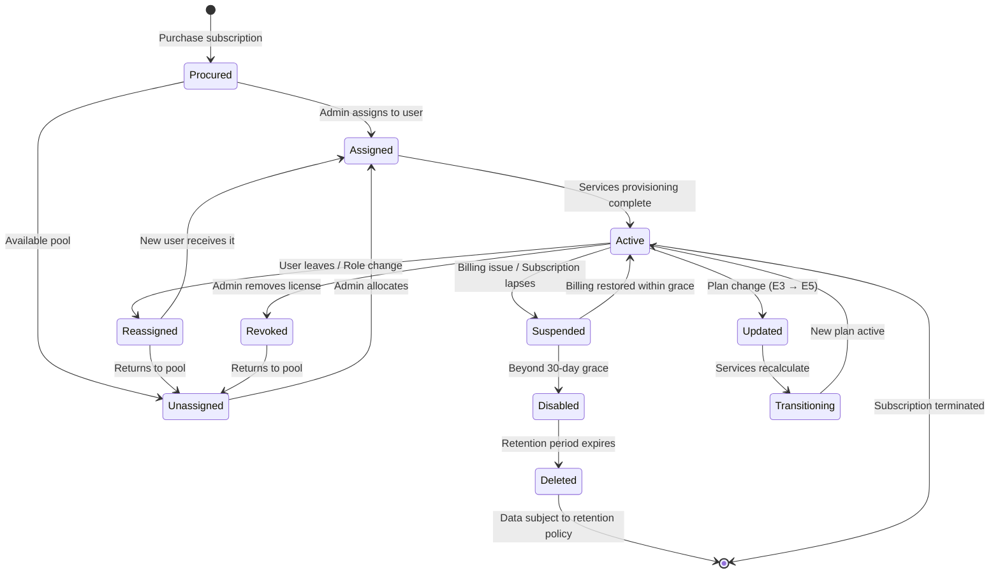

### Notes
**Key insight**: When a licence is **removed**, most services enter a **30-day grace period** before data is soft-deleted. For Exchange, the mailbox becomes inactive and can be recovered. Always use **licence groups** (Entra ID group-based licensing) rather than direct assignment—it ensures automatic reclamation when users leave groups.

---

## Licence Management Workflow

Shows the main components, decisions, and operational flow for licence management workflow in Microsoft 365 licensing work.

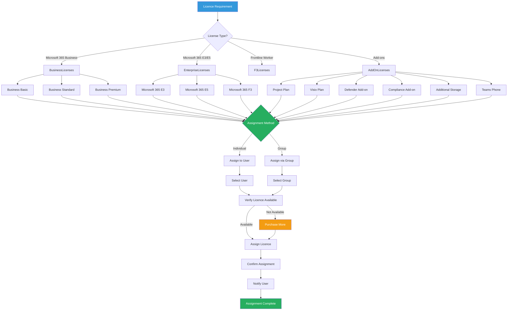

---

## Licence Selection Decision Tree

This decision tree helps navigate which base licence to start with, and which add-ons are needed based on organisational requirements.

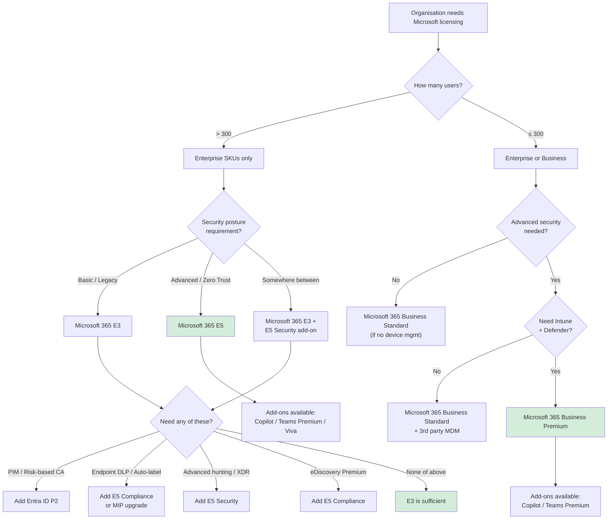

### Notes
**Key insight**: The most common mistake is buying **E3 + multiple individual add-ons** and accidentally spending more than E5 would cost. Always price the full E5 bundle before committing to E3 + E5 Security + E5 Compliance + E5 Information Protection as separate add-ons.

---

## Licence Upgrade and Migration Pathways

Organizations rarely start with their final licence mix. This flowchart shows common upgrade paths and the implications of each.

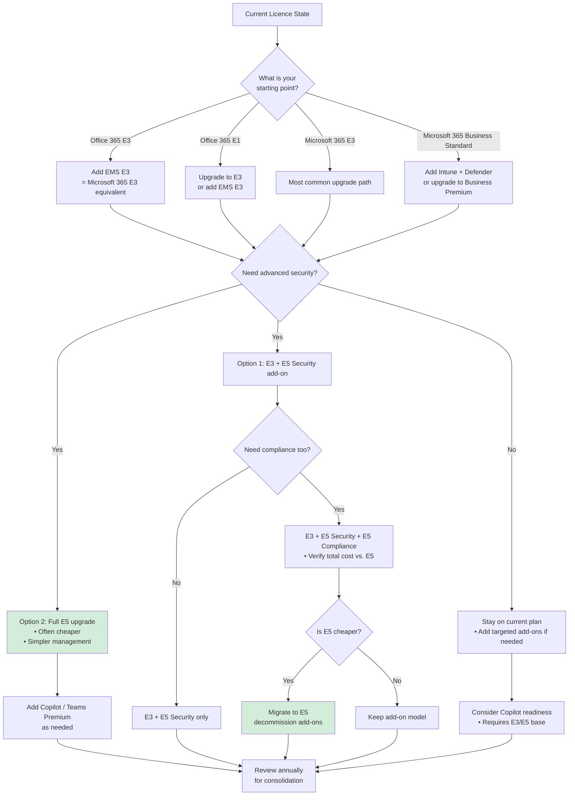

### Notes
**Key insight**: When upgrading from **E3 to E5**, the migration is typically seamless—service plans are re-evaluated and expanded automatically. However, moving from **Business Premium to Enterprise E3/E5** requires careful planning because Business Premium has a 300-seat cap and different service plan SKUs that may not map 1:1.

---

## Microsoft 365 Add-on Attachment Model

Many advanced capabilities are not base-licence features—they are licensed as add-ons that stack on top of existing subscriptions. This diagram shows how add-ons attach to base licences.

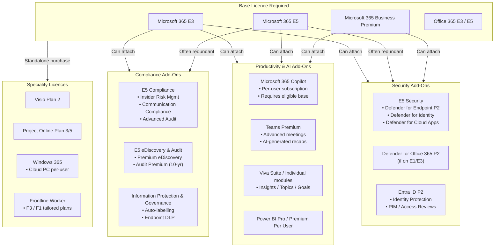

### Notes
**Key insight**: **Microsoft 365 Copilot** requires an eligible base licence (E3, E5, Business Premium, etc.) and is sold per-user. It cannot be assigned to users on Office 365 E1 or standalone Exchange Online licences. Teams Premium similarly requires an eligible base with Teams included.

---

## Microsoft 365 Add-on Licensing Stack

Many advanced Microsoft 365 capabilities attach to a base suite licence. This diagram helps admins map add-ons to workload outcomes before assignment.

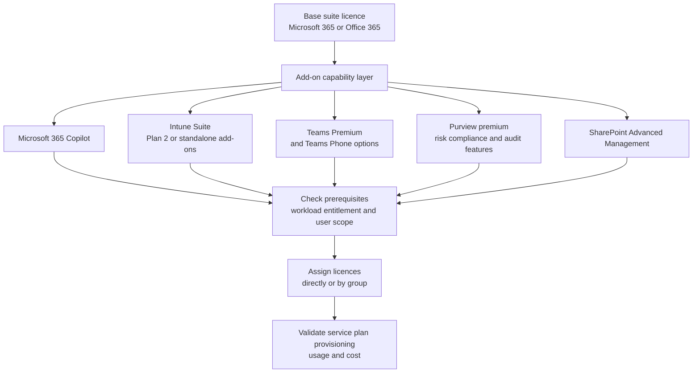

### Notes

- Add-on availability varies by plan, cloud and product terms. Validate against the current service description before purchasing or assigning.

---

## Microsoft 365 Copilot Licensing Readiness

Copilot is not a standalone product—it requires a qualified base licence and has its own infrastructure dependencies. This diagram shows the readiness checklist.

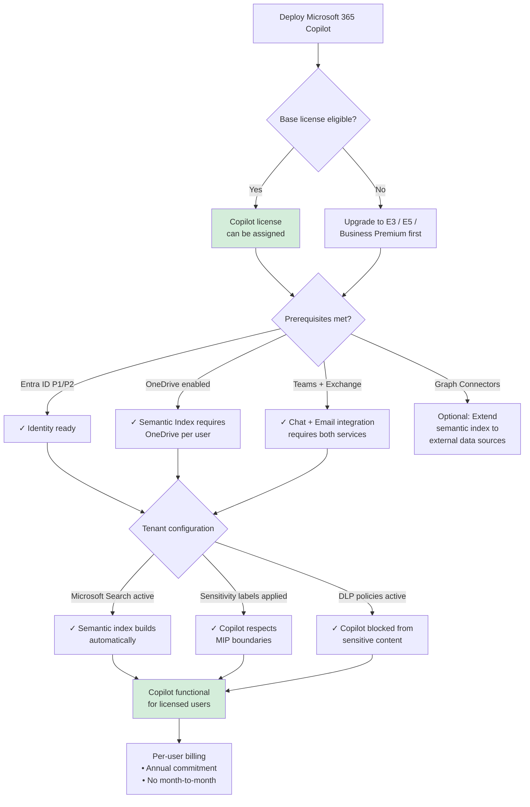

### Notes
**Key insight**: Copilot's **Semantic Index** builds on the Microsoft Graph and requires **OneDrive** to be enabled for every licensed user. Without OneDrive, Copilot cannot ground responses in the user's personal document context. Copilot also **inherits sensitivity labels**—if a user cannot access a document directly due to MIP, Copilot cannot summarise it either.

---

## Microsoft 365 E3, E5 and Business Premium Feature Matrix

This comparison diagram maps the major feature categories across the three most common bundles.

```mermaid
graph LR
    subgraph Categories["Feature Category"]
        direction TB
        F1["Identity & Access"]
        F2["Threat Protection"]
        F3["Device Management"]
        F4["Data Protection"]
        F5["Compliance"]
        F6["Productivity"]
        F7["Voice / Meetings"]
    end

    subgraph E3["Microsoft 365 E3"]
        direction TB
        E3_1["Entra ID P1<br/>Basic CA + MFA"]
        E3_2["Defender for Office 365 P1<br/>Safe Attachments/Links"]
        E3_3["Intune<br/>Device + App Mgmt"]
        E3_4["Azure RMS<br/>Basic encryption"]
        E3_5["eDiscovery (Standard)<br/>Core retention"]
        E3_6["Office E3<br/>Desktop + Web"]
        E3_7["Teams core<br/>No PSTN / Cloud PBX"]
    end

    subgraph E5["Microsoft 365 E5"]
        direction TB
        E5_1["Entra ID P2<br/>Risk + PIM + Gov"]
        E5_2["Defender XDR<br/>Endpoint P2 + Identity + Cloud Apps"]
        E5_3["Intune<br/>+ Endpoint Analytics"]
        E5_4["MIP + DLP<br/>Auto-labelling + Endpoint DLP"]
        E5_5["Purview Full Suite<br/>eDiscovery Premium / Audit Premium"]
        E5_6["Office E5<br/>+ Power BI Pro + MyAnalytics"]
        E5_7["Teams + Teams Phone<br/>Audio Conferencing"]
    end

    subgraph BP["Business Premium"]
        direction TB
        BP_1["Entra ID P1<br/>Basic CA"]
        BP_2["Defender for Business<br/>Endpoint AV + EDR (light)"]
        BP_3["Intune<br/>Full device + MAM"]
        BP_4["MIP<br/>Sensitivity labels"]
        BP_5["Retention + DLP<br/>(Standard scope)"]
        BP_6["Office apps<br/>Desktop + Web"]
        BP_7["Teams core<br/>No PSTN"]
    end

    Categories -.-> E3
    Categories -.-> E5
    Categories -.-> BP

    style E5 fill:#d4edda
    style BP fill:#fff3cd
```

### Notes
**Key insight**: **Business Premium** is technically an SMB licence but contains the same Entra ID P1, Intune, and Defender capabilities as E3. The limitation is **max 300 users** and no Exchange Online archiving. For organisations under 300 seats, Business Premium is almost always the better value than E3.

---

## Microsoft 365 Licence Hierarchy

Microsoft licensing is structured as a pyramid: foundational bundles at the base, with specialised add-ons and advanced suites at the top. This diagram shows the relationship between tiers.

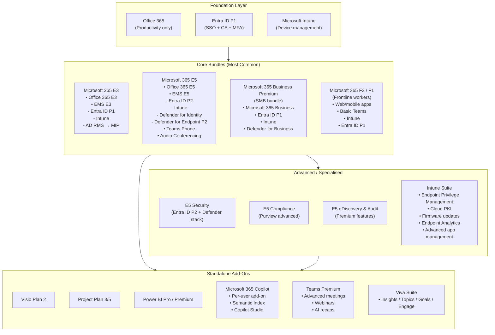

### Notes
**Key insight**: **Microsoft 365 E3** is the historical enterprise standard, but **E5** is increasingly becoming the baseline for security-conscious organisations because the incremental cost is often lower than purchasing E5 Security + E5 Compliance as add-ons to E3. SMBs often over-purchase by buying E3 instead of **Business Premium**.

---

## Microsoft Purview Licensing Stack

Microsoft Purview capabilities span multiple licence tiers. This layered diagram shows which features belong to which licensing level.

```mermaid
flowchart LR
    subgraph Tier1["E3 / Business Premium<br/>Included Base"]
        direction TB
        T1_1["Sensitivity Labels<br/>• Manual application"]
        T1_2["DLP (basic)<br/>• Exchange / SharePoint"]
        T1_3["Retention Policies<br/>• Core labels"]
        T1_4["eDiscovery (Standard)<br/>• Hold + Export"]
        T1_5["Message Encryption<br/>• OME"]
    end

    subgraph Tier2["E5 Security<br/>or E5 Compliance Add-Ons"]
        direction TB
        T2_1["Defender for Office 365 P2<br/>• Safe Docs / Campaign views"]
        T2_2["Defender for Endpoint P2<br/>• Advanced Hunting / EDR"]
        T2_3["Defender for Cloud Apps<br/>• Shadow IT / Session control"]
        T2_4["Defender for Identity<br/>• AD attack detection"]
        T2_5["Insider Risk Management<br/>• Correlation policies"]
    end

    subgraph Tier3["E5 Compliance<br/>or Full E5 Bundle"]
        direction TB
        T3_1["Advanced Audit<br/>• 10-year retention"]
        T3_2["eDiscovery (Premium)<br/>• Conversation reconstruction<br/>• Review sets / Analytics"]
        T3_3["Communication Compliance<br/>• Supervision policies"]
        T3_4["Auto-labelling<br/>• Endpoint DLP<br/>• Trainable classifiers"]
        T3_5["Customer Lockbox<br/>• Data center access control"]
    end

    subgraph Tier4["Standalone / Premium"]
        direction TB
        T4_1["Microsoft Purview<br/>Data Governance<br/>• Data Catalog / Map"]
        T4_2["Compliance Manager<br/>• Premium templates"]
        T4_3["Information Protection<br/>• Exact Data Match<br/>• Document fingerprinting"]
    end

    Tier1 -->|Upgrade| Tier2
    Tier2 -->|Upgrade| Tier3
    Tier3 -->|Add| Tier4
```

### Notes
**Key insight**: **eDiscovery (Premium)** and **Advanced Audit** are often the last features organisations adopt, but they are the most legally critical. Advanced Audit's 10-year log retention is a **legal hold enabler**, while eDiscovery Premium's conversation reconstruction is essential for Teams chat investigations. If you have E5, you own these—they are frequently underutilized.
