# Security and Compliance

Security and compliance diagrams for Microsoft 365 admins. This file contains 18 topics covering Microsoft Defender XDR, secure posture, incidents, threat hunting, exposure management and cloud app governance.

## Contents

- [Advanced Hunting Investigation Flow](#advanced-hunting-investigation-flow)
- [Anti-Phishing Protection](#anti-phishing-protection)
- [Attack Surface Reduction Rules](#attack-surface-reduction-rules)
- [Automated Investigation and Response](#automated-investigation-and-response)
- [Compliance Score Dashboard](#compliance-score-dashboard)
- [Defender Exposure Management and Vulnerability Prioritisation](#defender-exposure-management-and-vulnerability-prioritisation)
- [Defender for Cloud Apps Governance](#defender-for-cloud-apps-governance)
- [Defender XDR Incident Correlation](#defender-xdr-incident-correlation)
- [Defender XDR to Microsoft Sentinel Integration](#defender-xdr-to-microsoft-sentinel-integration)
- [Microsoft 365 Security Posture Dashboard](#microsoft-365-security-posture-dashboard)
- [Microsoft Defender for Endpoint](#microsoft-defender-for-endpoint)
- [Microsoft Defender for Office 365 Architecture](#microsoft-defender-for-office-365-architecture)
- [Microsoft Defender Portal Dashboard](#microsoft-defender-portal-dashboard)
- [Safe Attachments Analysis](#safe-attachments-analysis)
- [Safe Links Protection Flow](#safe-links-protection-flow)
- [Secure Score Improvement](#secure-score-improvement)
- [Security Incident Response Workflow](#security-incident-response-workflow)
- [Threat Intelligence Integration](#threat-intelligence-integration)

---

## Advanced Hunting Investigation Flow

Advanced hunting uses KQL across Defender and Sentinel data to search for threats, validate incidents and create custom detections.

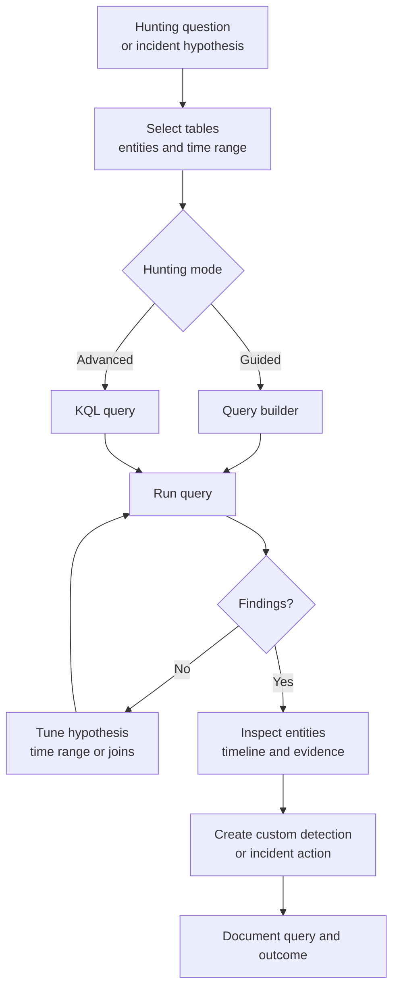
```mermaid
flowchart TB
    AH_Question["Hunting question<br/>or incident hypothesis"] --> AH_Schema["Select tables<br/>entities and time range"]
    AH_Schema --> AH_Mode{"Hunting mode"}
    AH_Mode -->|"Guided"| AH_Guided["Query builder"]
    AH_Mode -->|"Advanced"| AH_KQL["KQL query"]
    AH_Guided --> AH_Run["Run query"]
    AH_KQL --> AH_Run
    AH_Run --> AH_Results{"Findings?"}
    AH_Results -->|"No"| AH_Tune["Tune hypothesis<br/>time range or joins"]
    AH_Tune --> AH_Run
    AH_Results -->|"Yes"| AH_Investigate["Inspect entities<br/>timeline and evidence"]
    AH_Investigate --> AH_Detection["Create custom detection<br/>or incident action"]
    AH_Detection --> AH_Document["Document query and outcome"]
```

---

## Anti-Phishing Protection

Shows the main components, decisions, and operational flow for anti-phishing protection in Microsoft 365 security and compliance work.

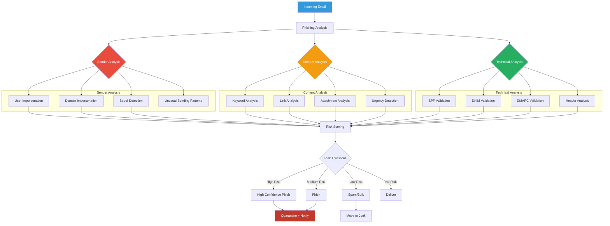
```mermaid
flowchart TD
    Email[Incoming Email] --> Analysis[Phishing Analysis]

    Analysis --> SenderCheck{Sender Analysis}
    Analysis --> ContentCheck{Content Analysis}
    Analysis --> TechCheck{Technical Analysis}

    subgraph SenderSignals["Sender Analysis"]
        UserImpersonation[User Impersonation]
        DomainImpersonation[Domain Impersonation]
        SpoofDetection[Spoof Detection]
        UnusualSending[Unusual Sending Patterns]
    end

    subgraph ContentSignals["Content Analysis"]
        KeywordAnalysis[Keyword Analysis]
        LinkAnalysis[Link Analysis]
        AttachmentAnalysis[Attachment Analysis]
        UrgencyDetection[Urgency Detection]
    end

    subgraph TechnicalSignals["Technical Analysis"]
        SPFCheck[SPF Validation]
        DKIMCheck[DKIM Validation]
        DMARCCheck[DMARC Validation]
        HeaderAnalysis[Header Analysis]
    end

    SenderCheck --> UserImpersonation
    SenderCheck --> DomainImpersonation
    SenderCheck --> SpoofDetection
    SenderCheck --> UnusualSending

    ContentCheck --> KeywordAnalysis
    ContentCheck --> LinkAnalysis
    ContentCheck --> AttachmentAnalysis
    ContentCheck --> UrgencyDetection

    TechCheck --> SPFCheck
    TechCheck --> DKIMCheck
    TechCheck --> DMARCCheck
    TechCheck --> HeaderAnalysis

    UserImpersonation --> Scoring[Risk Scoring]
    DomainImpersonation --> Scoring
    SpoofDetection --> Scoring
    KeywordAnalysis --> Scoring
    LinkAnalysis --> Scoring
    AttachmentAnalysis --> Scoring
    UrgencyDetection --> Scoring
    SPFCheck --> Scoring
    DKIMCheck --> Scoring
    DMARCCheck --> Scoring
    HeaderAnalysis --> Scoring

    Scoring --> Threshold{Risk Threshold}

    Threshold -->|High Risk| HighAction[High Confidence Phish]
    Threshold -->|Medium Risk| MedAction[Phish]
    Threshold -->|Low Risk| LowAction[Spam/Bulk]
    Threshold -->|No Risk| Deliver[Deliver]

    HighAction --> Quarantine[Quarantine + Notify]
    MedAction --> Quarantine
    LowAction --> JunkFolder[Move to Junk]

    style Email fill:#3498db,color:#fff
    style SenderCheck fill:#e74c3c,color:#fff
    style ContentCheck fill:#f39c12,color:#fff
    style TechCheck fill:#27ae60,color:#fff
    style Quarantine fill:#c0392b,color:#fff
```

---

## Attack Surface Reduction Rules

Shows the main components, decisions, and operational flow for attack surface reduction rules in Microsoft 365 security and compliance work.

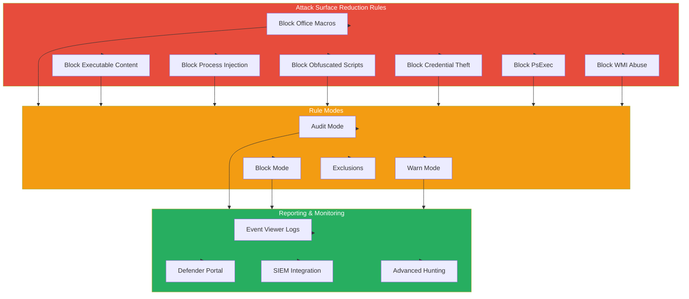
```mermaid
flowchart TB
    subgraph ASR["Attack Surface Reduction Rules"]
        OfficeMacros[Block Office Macros]
        Executables[Block Executable Content]
        ProcessInjection[Block Process Injection]
        ScriptObfuscation[Block Obfuscated Scripts]
        CredentialTheft[Block Credential Theft]
        PsExec[Block PsExec]
        WMI[Block WMI Abuse]
    end

    subgraph Modes["Rule Modes"]
        Audit[Audit Mode]
        Block[Block Mode]
        Warn[Warn Mode]
        Exclude[Exclusions]
    end

    subgraph Reporting["Reporting & Monitoring"]
        EventViewer[Event Viewer Logs]
        DefenderPortal[Defender Portal]
        SIEM[SIEM Integration]
        AdvancedHunting[Advanced Hunting]
    end

    ASR --> OfficeMacros
    ASR --> Executables
    ASR --> ProcessInjection
    ASR --> ScriptObfuscation
    ASR --> CredentialTheft
    ASR --> PsExec
    ASR --> WMI

    OfficeMacros --> Modes
    Executables --> Modes
    ProcessInjection --> Modes
    ScriptObfuscation --> Modes
    CredentialTheft --> Modes
    PsExec --> Modes
    WMI --> Modes

    Modes --> Audit
    Modes --> Block
    Modes --> Warn
    Modes --> Exclude

    Audit --> Reporting
    Block --> Reporting
    Warn --> Reporting

    Reporting --> EventViewer
    Reporting --> DefenderPortal
    Reporting --> SIEM
    Reporting --> AdvancedHunting

    style ASR fill:#e74c3c,color:#fff
    style Modes fill:#f39c12,color:#fff
    style Reporting fill:#27ae60,color:#fff
```

---

## Automated Investigation and Response

Shows the main components, decisions, and operational flow for automated investigation and response in Microsoft 365 security and compliance work.

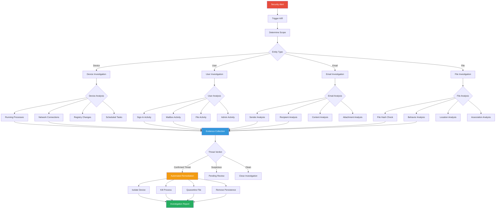
```mermaid
flowchart TD
    Alert[Security Alert] --> Trigger[Trigger AIR]

    Trigger --> Scope[Determine Scope]
    Scope --> Entity{Entity Type}

    Entity -->|Device| DeviceInvestigate[Device Investigation]
    Entity -->|User| UserInvestigate[User Investigation]
    Entity -->|Email| EmailInvestigate[Email Investigation]
    Entity -->|File| FileInvestigate[File Investigation]

    DeviceInvestigate --> DeviceActions{Device Analysis}
    UserInvestigate --> UserActions{User Analysis}
    EmailInvestigate --> EmailActions{Email Analysis}
    FileInvestigate --> FileActions{File Analysis}

    DeviceActions --> RunningProcesses[Running Processes]
    DeviceActions --> NetworkConnections[Network Connections]
    DeviceActions --> RegistryChanges[Registry Changes]
    DeviceActions --> ScheduledTasks[Scheduled Tasks]

    UserActions --> SignInActivity[Sign-In Activity]
    UserActions --> MailboxActivity[Mailbox Activity]
    UserActions --> FileActivity[File Activity]
    UserActions --> AdminActivity[Admin Activity]

    EmailActions --> SenderAnalysis[Sender Analysis]
    EmailActions --> RecipientAnalysis[Recipient Analysis]
    EmailActions --> ContentAnalysis[Content Analysis]
    EmailActions --> AttachmentAnalysis[Attachment Analysis]

    FileActions --> FileHash[File Hash Check]
    FileActions --> FileBehavior[Behavior Analysis]
    FileActions --> FileLocation[Location Analysis]
    FileActions --> FileAssociations[Association Analysis]

    RunningProcesses --> Evidence[Evidence Collection]
    NetworkConnections --> Evidence
    SignInActivity --> Evidence
    MailboxActivity --> Evidence
    SenderAnalysis --> Evidence
    RecipientAnalysis --> Evidence
    FileHash --> Evidence
    FileBehavior --> Evidence

    Evidence --> Verdict{Threat Verdict}

    Verdict -->|Confirmed Threat| Remediate[Automated Remediation]
    Verdict -->|Suspicious| Pending[Pending Review]
    Verdict -->|Clean| Close[Close Investigation]

    Remediate --> Isolate[Isolate Device]
    Remediate --> KillProc[Kill Process]
    Remediate --> Quarantine[Quarantine File]
    Remediate --> RemovePersistence[Remove Persistence]

    Isolate --> Report[Investigation Report]
    KillProc --> Report
    Quarantine --> Report
    RemovePersistence --> Report

    style Alert fill:#e74c3c,color:#fff
    style Evidence fill:#3498db,color:#fff
    style Remediate fill:#f39c12,color:#fff
    style Report fill:#27ae60,color:#fff
```

---

## Compliance Score Dashboard

Compliance score is most useful when it becomes an improvement-action backlog with owners, evidence and review cadence.

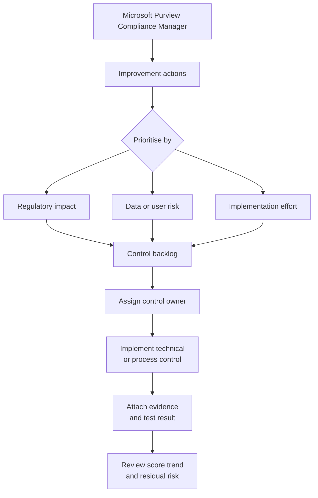
```mermaid
flowchart TB
    CSD_Assess["Microsoft Purview Compliance Manager"] --> CSD_Actions["Improvement actions"]
    CSD_Actions --> CSD_Prioritise{"Prioritise by"}
    CSD_Prioritise --> CSD_Reg["Regulatory impact"]
    CSD_Prioritise --> CSD_Risk["Data or user risk"]
    CSD_Prioritise --> CSD_Effort["Implementation effort"]
    CSD_Reg --> CSD_Backlog["Control backlog"]
    CSD_Risk --> CSD_Backlog
    CSD_Effort --> CSD_Backlog
    CSD_Backlog --> CSD_Owner["Assign control owner"]
    CSD_Owner --> CSD_Implement["Implement technical<br/>or process control"]
    CSD_Implement --> CSD_Evidence["Attach evidence<br/>and test result"]
    CSD_Evidence --> CSD_Review["Review score trend<br/>and residual risk"]
```

---

## Defender Exposure Management and Vulnerability Prioritisation

Use exposure and vulnerability signals to prioritise remediation by asset criticality, exploitability, attack paths and business impact.

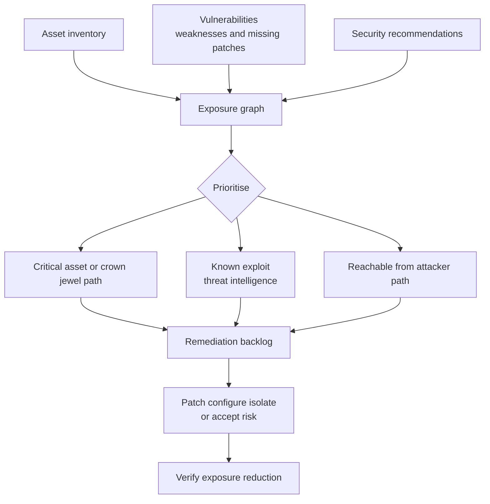
```mermaid
flowchart TB
    DEM_Assets["Asset inventory"] --> DEM_Exposure["Exposure graph"]
    DEM_Vuln["Vulnerabilities<br/>weaknesses and missing patches"] --> DEM_Exposure
    DEM_Controls["Security recommendations"] --> DEM_Exposure
    DEM_Exposure --> DEM_Prioritise{"Prioritise"}
    DEM_Prioritise --> DEM_Critical["Critical asset or crown jewel path"]
    DEM_Prioritise --> DEM_Exploit["Known exploit<br/>threat intelligence"]
    DEM_Prioritise --> DEM_Reachable["Reachable from attacker path"]
    DEM_Critical --> DEM_Backlog["Remediation backlog"]
    DEM_Exploit --> DEM_Backlog
    DEM_Reachable --> DEM_Backlog
    DEM_Backlog --> DEM_Fix["Patch configure isolate<br/>or accept risk"]
    DEM_Fix --> DEM_Verify["Verify exposure reduction"]
```

---

## Defender for Cloud Apps Governance

Defender for Cloud Apps gives admins visibility and control over cloud app use, OAuth apps, sessions, policies and risky activities.

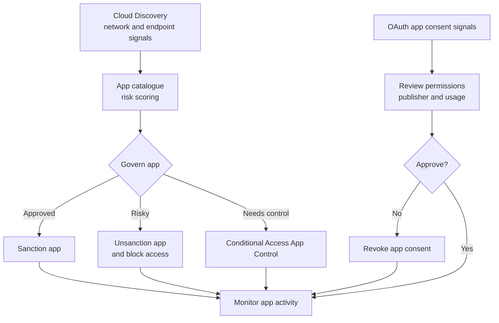
```mermaid
flowchart TB
    DCA_Discovery["Cloud Discovery<br/>network and endpoint signals"] --> DCA_Catalog["App catalogue<br/>risk scoring"]
    DCA_Catalog --> DCA_Decision{"Govern app"}
    DCA_Decision -->|"Approved"| DCA_Sanction["Sanction app"]
    DCA_Decision -->|"Risky"| DCA_Unsanction["Unsanction app<br/>and block access"]
    DCA_Decision -->|"Needs control"| DCA_Session["Conditional Access App Control"]
    DCA_OAuth["OAuth app consent signals"] --> DCA_Review["Review permissions<br/>publisher and usage"]
    DCA_Review --> DCA_Revoke{"Approve?"}
    DCA_Revoke -->|"No"| DCA_Remove["Revoke app consent"]
    DCA_Revoke -->|"Yes"| DCA_Monitor["Monitor app activity"]
    DCA_Sanction --> DCA_Monitor
    DCA_Unsanction --> DCA_Monitor
    DCA_Session --> DCA_Monitor
    DCA_Remove --> DCA_Monitor
```

---

## Defender XDR Incident Correlation

Microsoft Defender XDR correlates alerts and evidence across Microsoft security workloads into incidents that analysts can triage and respond to.

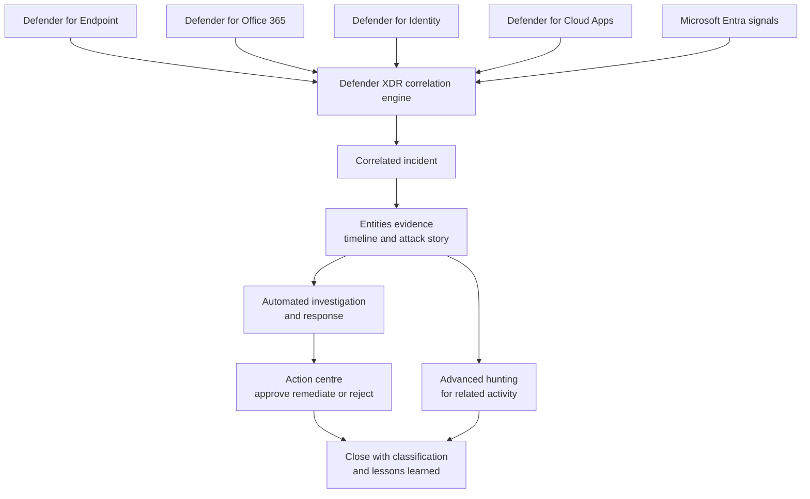
```mermaid
flowchart TB
    DXIC_Endpoint["Defender for Endpoint"] --> DXIC_Correlation["Defender XDR correlation engine"]
    DXIC_Email["Defender for Office 365"] --> DXIC_Correlation
    DXIC_Identity["Defender for Identity"] --> DXIC_Correlation
    DXIC_Cloud["Defender for Cloud Apps"] --> DXIC_Correlation
    DXIC_Entra["Microsoft Entra signals"] --> DXIC_Correlation
    DXIC_Correlation --> DXIC_Incident["Correlated incident"]
    DXIC_Incident --> DXIC_Entities["Entities evidence<br/>timeline and attack story"]
    DXIC_Entities --> DXIC_AIR["Automated investigation<br/>and response"]
    DXIC_AIR --> DXIC_Action["Action centre<br/>approve remediate or reject"]
    DXIC_Entities --> DXIC_Hunt["Advanced hunting<br/>for related activity"]
    DXIC_Action --> DXIC_Close["Close with classification<br/>and lessons learned"]
    DXIC_Hunt --> DXIC_Close
```

---

## Defender XDR to Microsoft Sentinel Integration

Connect Defender XDR with Microsoft Sentinel when you need SIEM correlation, automation, long-term investigation and cross-platform response.

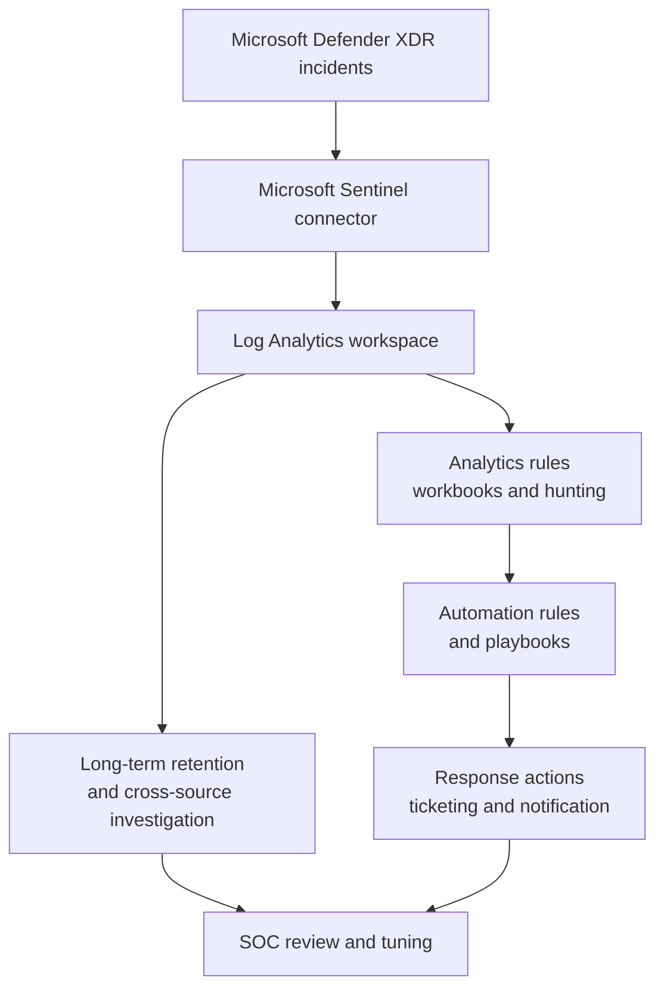
```mermaid
flowchart TB
    DSI_Defender["Microsoft Defender XDR incidents"] --> DSI_Connector["Microsoft Sentinel connector"]
    DSI_Connector --> DSI_Workspace["Log Analytics workspace"]
    DSI_Workspace --> DSI_Analytics["Analytics rules<br/>workbooks and hunting"]
    DSI_Analytics --> DSI_Automation["Automation rules<br/>and playbooks"]
    DSI_Automation --> DSI_Response["Response actions<br/>ticketing and notification"]
    DSI_Workspace --> DSI_LongTerm["Long-term retention<br/>and cross-source investigation"]
    DSI_LongTerm --> DSI_Review["SOC review and tuning"]
    DSI_Response --> DSI_Review
```

---

## Microsoft 365 Security Posture Dashboard

A security posture view should connect Secure Score, exposure, incidents and configuration drift to a prioritised remediation queue.

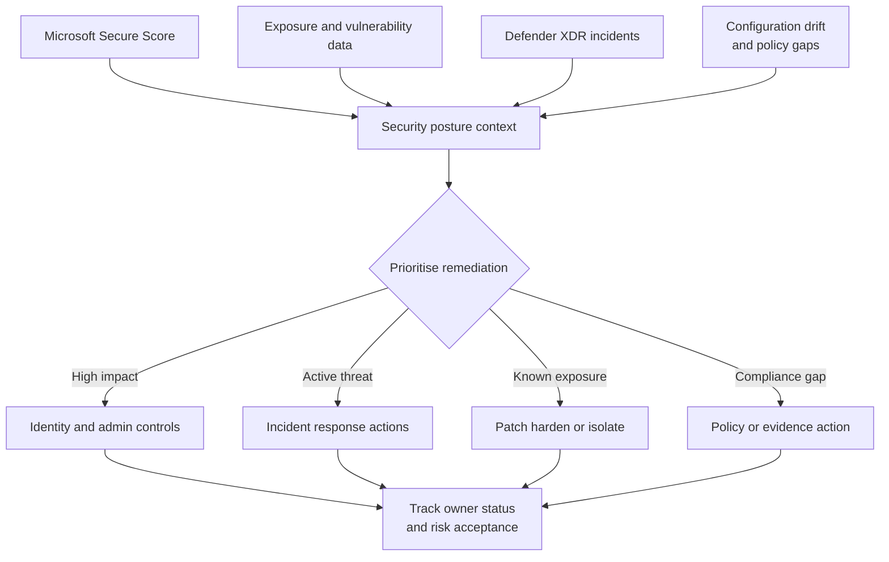
```mermaid
flowchart TB
    SPD_Score["Microsoft Secure Score"] --> SPD_Context["Security posture context"]
    SPD_Exposure["Exposure and vulnerability data"] --> SPD_Context
    SPD_Incidents["Defender XDR incidents"] --> SPD_Context
    SPD_Config["Configuration drift<br/>and policy gaps"] --> SPD_Context
    SPD_Context --> SPD_Prioritise{"Prioritise remediation"}
    SPD_Prioritise -->|"High impact"| SPD_Identity["Identity and admin controls"]
    SPD_Prioritise -->|"Active threat"| SPD_Response["Incident response actions"]
    SPD_Prioritise -->|"Known exposure"| SPD_Remediation["Patch harden or isolate"]
    SPD_Prioritise -->|"Compliance gap"| SPD_Control["Policy or evidence action"]
    SPD_Identity --> SPD_Track["Track owner status<br/>and risk acceptance"]
    SPD_Response --> SPD_Track
    SPD_Remediation --> SPD_Track
    SPD_Control --> SPD_Track
```

---

## Microsoft Defender for Endpoint

Shows the main components, decisions, and operational flow for microsoft defender for endpoint in Microsoft 365 endpoint management work.

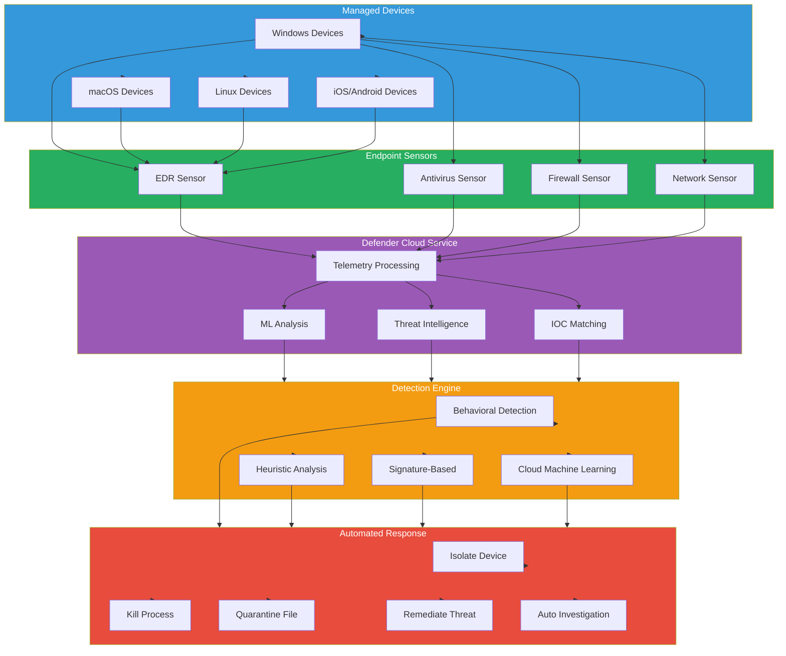
```mermaid
flowchart TB
    subgraph Devices["Managed Devices"]
        Windows[Windows Devices]
        macOS[macOS Devices]
        Linux[Linux Devices]
        Mobile[iOS/Android Devices]
    end

    subgraph Sensors["Endpoint Sensors"]
        EDRSensor[EDR Sensor]
        AVSensor[Antivirus Sensor]
        FirewallSensor[Firewall Sensor]
        NetworkSensor[Network Sensor]
    end

    subgraph Cloud["Defender Cloud Service"]
        Telemetry[Telemetry Processing]
        MachineLearning[ML Analysis]
        ThreatIntel[Threat Intelligence]
        IOCMatching[IOC Matching]
    end

    subgraph Detection["Detection Engine"]
        Behavioral[Behavioral Detection]
        Heuristic[Heuristic Analysis]
        Signature[Signature-Based]
        CloudML[Cloud Machine Learning]
    end

    subgraph Response["Automated Response"]
        Isolate[Isolate Device]
        KillProcess[Kill Process]
        QuarantineFile[Quarantine File]
        Remediate[Remediate Threat]
        Investigate[Auto Investigation]
    end

    Devices --> Windows
    Devices --> macOS
    Devices --> Linux
    Devices --> Mobile

    Windows --> EDRSensor
    Windows --> AVSensor
    Windows --> FirewallSensor
    Windows --> NetworkSensor

    macOS --> EDRSensor
    Linux --> EDRSensor
    Mobile --> EDRSensor

    EDRSensor --> Telemetry
    AVSensor --> Telemetry
    FirewallSensor --> Telemetry
    NetworkSensor --> Telemetry

    Telemetry --> MachineLearning
    Telemetry --> ThreatIntel
    Telemetry --> IOCMatching

    MachineLearning --> Detection
    ThreatIntel --> Detection
    IOCMatching --> Detection

    Detection --> Behavioral
    Detection --> Heuristic
    Detection --> Signature
    Detection --> CloudML

    Behavioral --> Response
    Heuristic --> Response
    Signature --> Response
    CloudML --> Response

    Response --> Isolate
    Response --> KillProcess
    Response --> QuarantineFile
    Response --> Remediate
    Response --> Investigate

    style Devices fill:#3498db,color:#fff
    style Sensors fill:#27ae60,color:#fff
    style Cloud fill:#9b59b6,color:#fff
    style Detection fill:#f39c12,color:#fff
    style Response fill:#e74c3c,color:#fff
```

---

## Microsoft Defender for Office 365 Architecture

Shows the main components, decisions, and operational flow for microsoft defender for office 365 architecture in Microsoft 365 security and compliance work.

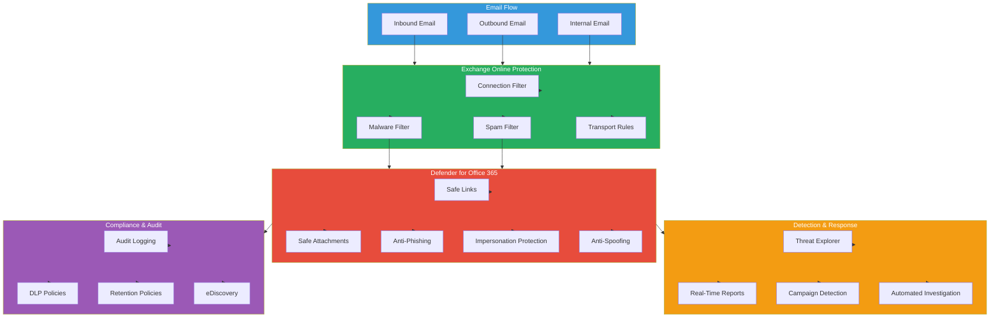
```mermaid
flowchart TB
    subgraph EmailFlow["Email Flow"]
        Inbound[Inbound Email]
        Outbound[Outbound Email]
        Internal[Internal Email]
    end

    subgraph EOP["Exchange Online Protection"]
        ConnectionFilter[Connection Filter]
        SpamFilter[Spam Filter]
        MalwareFilter[Malware Filter]
        TransportRules[Transport Rules]
    end

    subgraph ATP["Defender for Office 365"]
        SafeLinks[Safe Links]
        SafeAttachments[Safe Attachments]
        AntiPhish[Anti-Phishing]
        Impersonation[Impersonation Protection]
        Spoof[Anti-Spoofing]
    end

    subgraph Detection["Detection & Response"]
        ThreatExplorer[Threat Explorer]
        RealTimeReports[Real-Time Reports]
        Campaigns[Campaign Detection]
        AutomatedInvestigation[Automated Investigation]
    end

    subgraph Compliance["Compliance & Audit"]
        AuditLog[Audit Logging]
        DLPPolicies[DLP Policies]
        RetentionPolicies[Retention Policies]
        eDiscovery[eDiscovery]
    end

    Inbound --> EOP
    Outbound --> EOP
    Internal --> EOP

    EOP --> ConnectionFilter
    EOP --> SpamFilter
    EOP --> MalwareFilter
    EOP --> TransportRules

    MalwareFilter --> ATP
    SpamFilter --> ATP

    ATP --> SafeLinks
    ATP --> SafeAttachments
    ATP --> AntiPhish
    ATP --> Impersonation
    ATP --> Spoof

    ATP --> Detection
    Detection --> ThreatExplorer
    Detection --> RealTimeReports
    Detection --> Campaigns
    Detection --> AutomatedInvestigation

    ATP --> Compliance
    Compliance --> AuditLog
    Compliance --> DLPPolicies
    Compliance --> RetentionPolicies
    Compliance --> eDiscovery

    style EmailFlow fill:#3498db,color:#fff
    style EOP fill:#27ae60,color:#fff
    style ATP fill:#e74c3c,color:#fff
    style Detection fill:#f39c12,color:#fff
    style Compliance fill:#9b59b6,color:#fff
```

---

## Microsoft Defender Portal Dashboard

The Defender portal is an operations queue for incidents, alerts, evidence, action centre tasks and hunting outcomes.

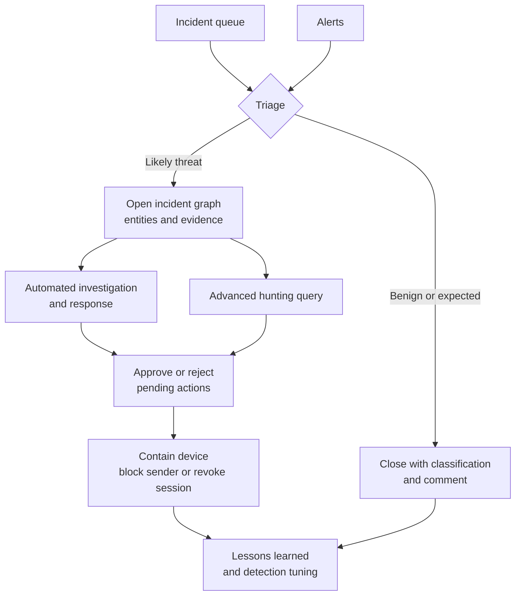
```mermaid
flowchart TB
    MDP_Incidents["Incident queue"] --> MDP_Triage{"Triage"}
    MDP_Alerts["Alerts"] --> MDP_Triage
    MDP_Triage -->|"Likely threat"| MDP_Investigate["Open incident graph<br/>entities and evidence"]
    MDP_Triage -->|"Benign or expected"| MDP_Close["Close with classification<br/>and comment"]
    MDP_Investigate --> MDP_AIR["Automated investigation<br/>and response"]
    MDP_Investigate --> MDP_Hunt["Advanced hunting query"]
    MDP_AIR --> MDP_Action["Approve or reject<br/>pending actions"]
    MDP_Hunt --> MDP_Action
    MDP_Action --> MDP_Remediate["Contain device<br/>block sender or revoke session"]
    MDP_Remediate --> MDP_Learn["Lessons learned<br/>and detection tuning"]
    MDP_Close --> MDP_Learn
```

---

## Safe Attachments Analysis

Shows the main components, decisions, and operational flow for safe attachments analysis in Microsoft 365 security and compliance work.

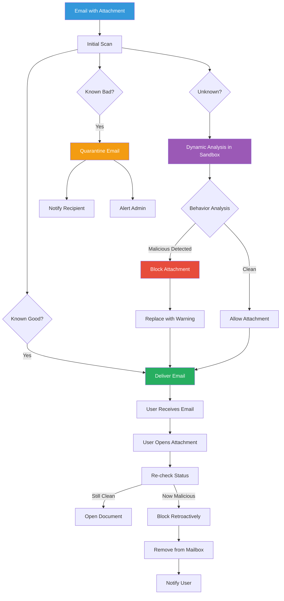
```mermaid
flowchart TB
    Email[Email with Attachment] --> Scan[Initial Scan]

    Scan --> KnownGood{Known Good?}
    Scan --> KnownBad{Known Bad?}
    Scan --> Unknown{Unknown?}

    KnownGood -->|Yes| Deliver[Deliver Email]
    KnownBad -->|Yes| Quarantine[Quarantine Email]

    Unknown --> Sandbox[Dynamic Analysis in Sandbox]

    Sandbox --> BehaviorAnalysis{Behavior Analysis}

    BehaviorAnalysis -->|Malicious Detected| BlockAttachment[Block Attachment]
    BehaviorAnalysis -->|Clean| AllowAttachment[Allow Attachment]

    BlockAttachment --> Replace[Replace with Warning]
    Replace --> Deliver

    Quarantine --> Notify[Notify Recipient]
    Quarantine --> AdminAlert[Alert Admin]

    AllowAttachment --> Deliver
    Deliver --> User[User Receives Email]

    User --> ClickAttachment[User Opens Attachment]
    ClickAttachment --> Recheck[Re-check Status]

    Recheck -->|Still Clean| Open[Open Document]
    Recheck -->|Now Malicious| BlockRetrospect[Block Retroactively]

    BlockRetrospect --> RemoveEmail[Remove from Mailbox]
    RemoveEmail --> NotifyUser[Notify User]

    style Email fill:#3498db,color:#fff
    style Deliver fill:#27ae60,color:#fff
    style Quarantine fill:#f39c12,color:#fff
    style BlockAttachment fill:#e74c3c,color:#fff
    style Sandbox fill:#9b59b6,color:#fff
```

---

## Safe Links Protection Flow

Shows the main components, decisions, and operational flow for safe links protection flow in Microsoft 365 security and compliance work.

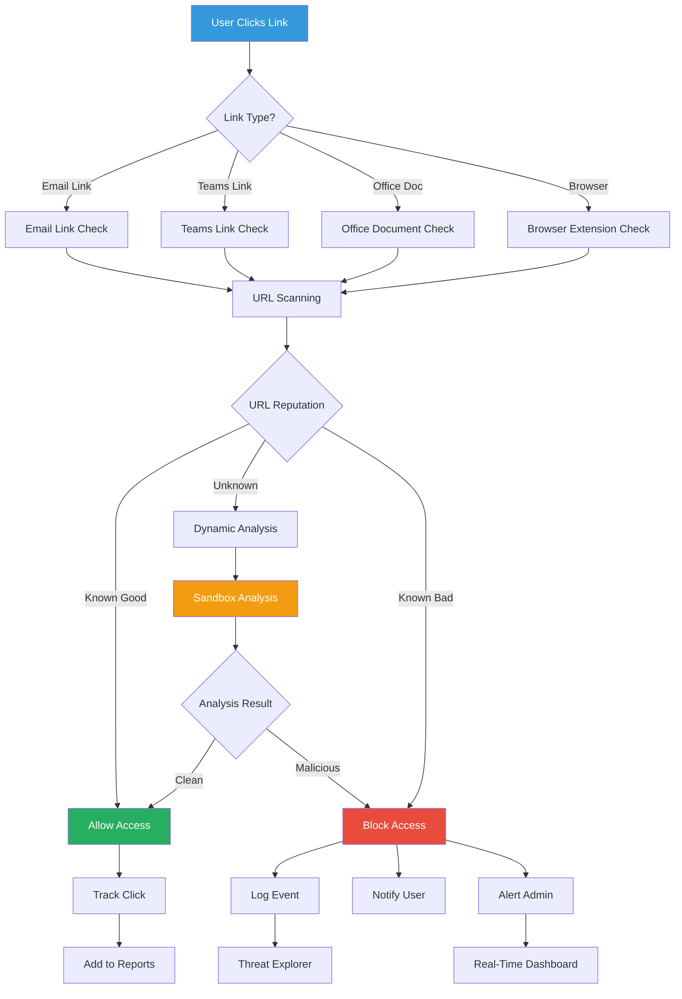
```mermaid
flowchart TD
    User[User Clicks Link] --> CheckType{Link Type?}

    CheckType -->|Email Link| EmailCheck[Email Link Check]
    CheckType -->|Teams Link| TeamsCheck[Teams Link Check]
    CheckType -->|Office Doc| OfficeCheck[Office Document Check]
    CheckType -->|Browser| BrowserCheck[Browser Extension Check]

    EmailCheck --> URLScan[URL Scanning]
    TeamsCheck --> URLScan
    OfficeCheck --> URLScan
    BrowserCheck --> URLScan

    URLScan --> Reputation{URL Reputation}

    Reputation -->|Known Good| Allow[Allow Access]
    Reputation -->|Unknown| DynamicCheck[Dynamic Analysis]
    Reputation -->|Known Bad| Block[Block Access]

    DynamicCheck --> Sandbox[Sandbox Analysis]
    Sandbox --> Result{Analysis Result}

    Result -->|Clean| Allow
    Result -->|Malicious| Block

    Block --> Log[Log Event]
    Block --> Notify[Notify User]
    Block --> AdminAlert[Alert Admin]

    Allow --> Track[Track Click]
    Track --> Report[Add to Reports]

    Log --> ThreatExplorer[Threat Explorer]
    AdminAlert --> RealTimeDash[Real-Time Dashboard]

    style User fill:#3498db,color:#fff
    style Allow fill:#27ae60,color:#fff
    style Block fill:#e74c3c,color:#fff
    style Sandbox fill:#f39c12,color:#fff
```

---

## Secure Score Improvement

Shows the main components, decisions, and operational flow for secure score improvement in Microsoft 365 security and compliance work.

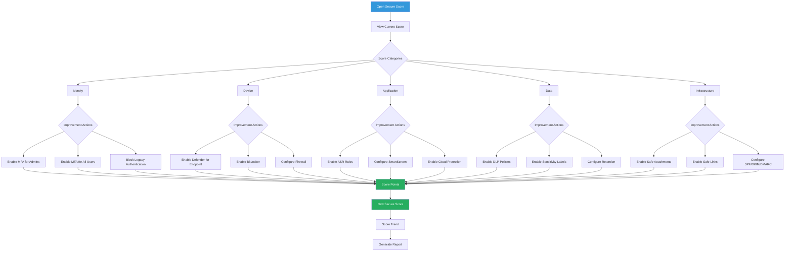
```mermaid
flowchart TB
    Start[Open Secure Score] --> CurrentScore[View Current Score]

    CurrentScore --> Categories{Score Categories}

    Categories --> Identity[Identity]
    Categories --> Device[Device]
    Categories --> App[Application]
    Categories --> Data[Data]
    Categories --> Infrastructure[Infrastructure]

    Identity --> Actions1{Improvement Actions}
    Device --> Actions2{Improvement Actions}
    App --> Actions3{Improvement Actions}
    Data --> Actions4{Improvement Actions}
    Infrastructure --> Actions5{Improvement Actions}

    Actions1 --> EnableMFA[Enable MFA for Admins]
    Actions1 --> EnableMFAAll[Enable MFA for All Users]
    Actions1 --> BlockLegacy[Block Legacy Authentication]

    Actions2 --> EnableDefender[Enable Defender for Endpoint]
    Actions2 --> EnableBitLocker[Enable BitLocker]
    Actions2 --> ConfigFirewall[Configure Firewall]

    Actions3 --> EnableASR[Enable ASR Rules]
    Actions3 --> ConfigSmartScreen[Configure SmartScreen]
    Actions3 --> EnableCloudProtection[Enable Cloud Protection]

    Actions4 --> EnableDLP[Enable DLP Policies]
    Actions4 --> EnableLabels[Enable Sensitivity Labels]
    Actions4 --> ConfigRetention[Configure Retention]

    Actions5 --> EnableSafeAttachments[Enable Safe Attachments]
    Actions5 --> EnableSafeLinks[Enable Safe Links]
    Actions5 --> ConfigSPF[Configure SPF/DKIM/DMARC]

    EnableMFA --> Points[Score Points]
    EnableMFAAll --> Points
    BlockLegacy --> Points
    EnableDefender --> Points
    EnableBitLocker --> Points
    ConfigFirewall --> Points
    EnableASR --> Points
    ConfigSmartScreen --> Points
    EnableCloudProtection --> Points
    EnableDLP --> Points
    EnableLabels --> Points
    ConfigRetention --> Points
    EnableSafeAttachments --> Points
    EnableSafeLinks --> Points
    ConfigSPF --> Points

    Points --> NewScore[New Secure Score]
    NewScore --> Trend[Score Trend]
    Trend --> Report[Generate Report]

    style Start fill:#3498db,color:#fff
    style Points fill:#27ae60,color:#fff
    style NewScore fill:#27ae60,color:#fff
```

---

## Security Incident Response Workflow

Shows the main components, decisions, and operational flow for security incident response workflow in Microsoft 365 security and compliance work.

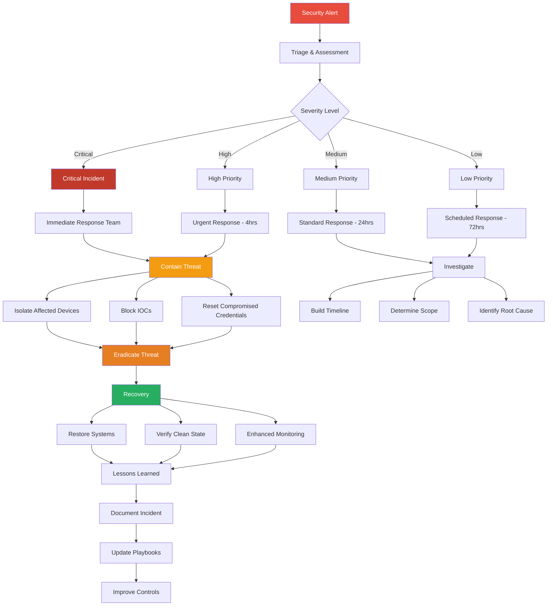
```mermaid
flowchart TD
    Alert[Security Alert] --> Triage[Triage & Assessment]

    Triage --> Severity{Severity Level}

    Severity -->|Critical| Critical[Critical Incident]
    Severity -->|High| High[High Priority]
    Severity -->|Medium| Medium[Medium Priority]
    Severity -->|Low| Low[Low Priority]

    Critical --> ImmediateResponse[Immediate Response Team]
    High --> UrgentResponse[Urgent Response - 4hrs]
    Medium --> StandardResponse[Standard Response - 24hrs]
    Low --> ScheduledResponse[Scheduled Response - 72hrs]

    ImmediateResponse --> Contain[Contain Threat]
    UrgentResponse --> Contain
    StandardResponse --> Investigate[Investigate]
    ScheduledResponse --> Investigate

    Contain --> IsolateDevice[Isolate Affected Devices]
    Contain --> BlockIOC[Block IOCs]
    Contain --> ResetCreds[Reset Compromised Credentials]

    Investigate --> Timeline[Build Timeline]
    Investigate --> Scope[Determine Scope]
    Investigate --> RootCause[Identify Root Cause]

    IsolateDevice --> Eradicate[Eradicate Threat]
    BlockIOC --> Eradicate
    ResetCreds --> Eradicate

    Eradicate --> Recover[Recovery]
    Recover --> RestoreSystems[Restore Systems]
    Recover --> VerifyClean[Verify Clean State]
    Recover --> Monitor[Enhanced Monitoring]

    RestoreSystems --> LessonsLearned[Lessons Learned]
    VerifyClean --> LessonsLearned
    Monitor --> LessonsLearned

    LessonsLearned --> Document[Document Incident]
    Document --> UpdatePlaybook[Update Playbooks]
    UpdatePlaybook --> ImproveControls[Improve Controls]

    style Alert fill:#e74c3c,color:#fff
    style Critical fill:#c0392b,color:#fff
    style Contain fill:#f39c12,color:#fff
    style Eradicate fill:#e67e22,color:#fff
    style Recover fill:#27ae60,color:#fff
```

---

## Threat Intelligence Integration

Shows the main components, decisions, and operational flow for threat intelligence integration in Microsoft 365 security and compliance work.

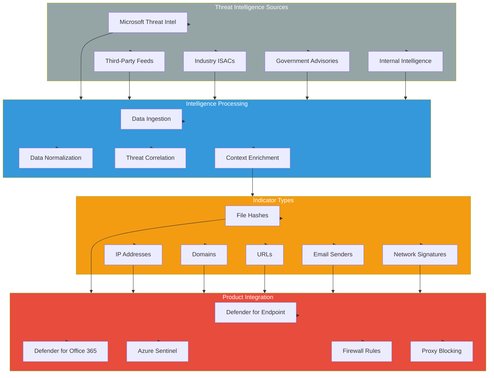
```mermaid
flowchart TB
    subgraph Sources["Threat Intelligence Sources"]
        MicrosoftTI[Microsoft Threat Intel]
        ThirdPartyTI[Third-Party Feeds]
        ISACs[Industry ISACs]
        GovernmentTI[Government Advisories]
        InternalTI[Internal Intelligence]
    end

    subgraph Processing["Intelligence Processing"]
        Ingest[Data Ingestion]
        Normalize[Data Normalization]
        Correlate[Threat Correlation]
        Enrich[Context Enrichment]
    end

    subgraph IOC["Indicator Types"]
        FileHash[File Hashes]
        IPAddr[IP Addresses]
        Domain[Domains]
        URL[URLs]
        EmailSender[Email Senders]
        NetworkSig[Network Signatures]
    end

    subgraph Integration["Product Integration"]
        DefenderEndpoint[Defender for Endpoint]
        DefenderOffice[Defender for Office 365]
        AzureSentinel[Azure Sentinel]
        Firewall[Firewall Rules]
        Proxy[Proxy Blocking]
    end

    Sources --> MicrosoftTI
    Sources --> ThirdPartyTI
    Sources --> ISACs
    Sources --> GovernmentTI
    Sources --> InternalTI

    MicrosoftTI --> Processing
    ThirdPartyTI --> Processing
    ISACs --> Processing
    GovernmentTI --> Processing
    InternalTI --> Processing

    Processing --> Ingest
    Processing --> Normalize
    Processing --> Correlate
    Processing --> Enrich

    Enrich --> IOC
    IOC --> FileHash
    IOC --> IPAddr
    IOC --> Domain
    IOC --> URL
    IOC --> EmailSender
    IOC --> NetworkSig

    FileHash --> Integration
    IPAddr --> Integration
    Domain --> Integration
    URL --> Integration
    EmailSender --> Integration
    NetworkSig --> Integration

    Integration --> DefenderEndpoint
    Integration --> DefenderOffice
    Integration --> AzureSentinel
    Integration --> Firewall
    Integration --> Proxy

    style Sources fill:#95a5a6,color:#fff
    style Processing fill:#3498db,color:#fff
    style IOC fill:#f39c12,color:#fff
    style Integration fill:#e74c3c,color:#fff
```
