# SharePoint and OneDrive

SharePoint and OneDrive diagrams for Microsoft 365 admins. This file contains 25 topics covering sites, permissions, sharing, sync, search, migration, SharePoint Advanced Management and Copilot readiness.

## Contents

- [Document Library Features](#document-library-features)
- [External Sharing Governance](#external-sharing-governance)
- [Information Architecture Planning](#information-architecture-planning)
- [OneDrive Known Folder Move](#onedrive-known-folder-move)
- [OneDrive Sharing Link Lifecycle](#onedrive-sharing-link-lifecycle)
- [OneDrive Storage Dashboard](#onedrive-storage-dashboard)
- [OneDrive Sync Architecture](#onedrive-sync-architecture)
- [Permission Level Hierarchy](#permission-level-hierarchy)
- [Restricted Access Control for SharePoint Sites](#restricted-access-control-for-sharepoint-sites)
- [Restricted SharePoint Search](#restricted-sharepoint-search)
- [SharePoint Admin Center Navigation](#sharepoint-admin-center-navigation)
- [SharePoint Advanced Management Governance](#sharepoint-advanced-management-governance)
- [SharePoint Governance Framework](#sharepoint-governance-framework)
- [SharePoint Hub Site Association](#sharepoint-hub-site-association)
- [SharePoint Migration Paths](#sharepoint-migration-paths)
- [SharePoint Online Architecture Overview](#sharepoint-online-architecture-overview)
- [SharePoint Online Limits](#sharepoint-online-limits)
- [SharePoint Oversharing Remediation](#sharepoint-oversharing-remediation)
- [SharePoint PowerShell Module](#sharepoint-powershell-module)
- [SharePoint Premium Content Processing](#sharepoint-premium-content-processing)
- [SharePoint Search Architecture](#sharepoint-search-architecture)
- [SharePoint Security Groups](#sharepoint-security-groups)
- [SharePoint Site Collection Hierarchy](#sharepoint-site-collection-hierarchy)
- [SharePoint Site Scripts and Designs](#sharepoint-site-scripts-and-designs)
- [Sharing Permission Flow](#sharing-permission-flow)

---

## Document Library Features

Shows the main components, decisions, and operational flow for document library features in Microsoft 365 sharepoint and onedrive work.

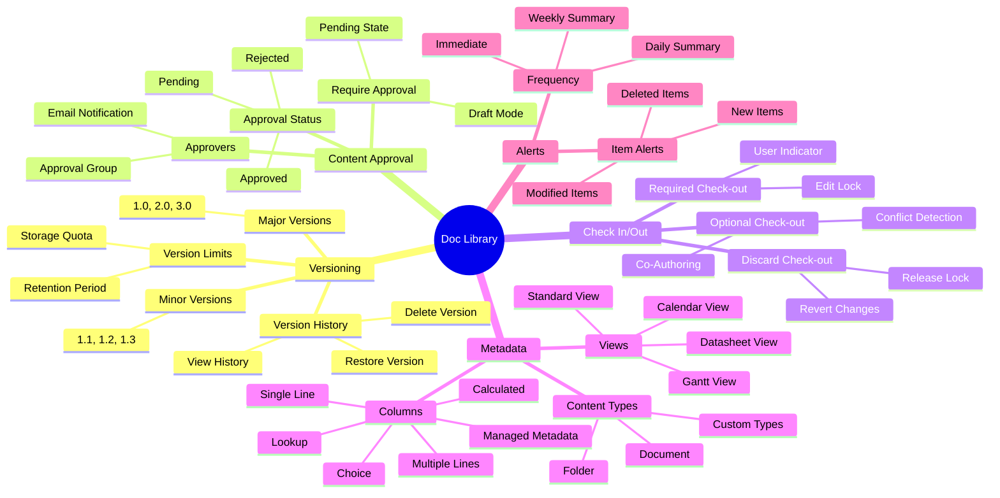
```mermaid
mindmap
  root((Doc Library))
    Versioning
      Major Versions
        1.0, 2.0, 3.0
      Minor Versions
        1.1, 1.2, 1.3
      Version Limits
        Storage Quota
        Retention Period
      Version History
        View History
        Restore Version
        Delete Version
    Content Approval
      Require Approval
        Draft Mode
        Pending State
      Approvers
        Approval Group
        Email Notification
      Approval Status
        Approved
        Rejected
        Pending
    Check In/Out
      Required Check-out
        Edit Lock
        User Indicator
      Optional Check-out
        Co-Authoring
        Conflict Detection
      Discard Check-out
        Revert Changes
        Release Lock
    Metadata
      Columns
        Single Line
        Multiple Lines
        Choice
        Lookup
        Calculated
        Managed Metadata
      Content Types
        Document
        Folder
        Custom Types
      Views
        Standard View
        Datasheet View
        Calendar View
        Gantt View
    Alerts
      Item Alerts
        New Items
        Modified Items
        Deleted Items
      Frequency
        Immediate
        Daily Summary
        Weekly Summary
```

---

## External Sharing Governance

Shows the main components, decisions, and operational flow for external sharing governance in Microsoft 365 sharepoint and onedrive work.

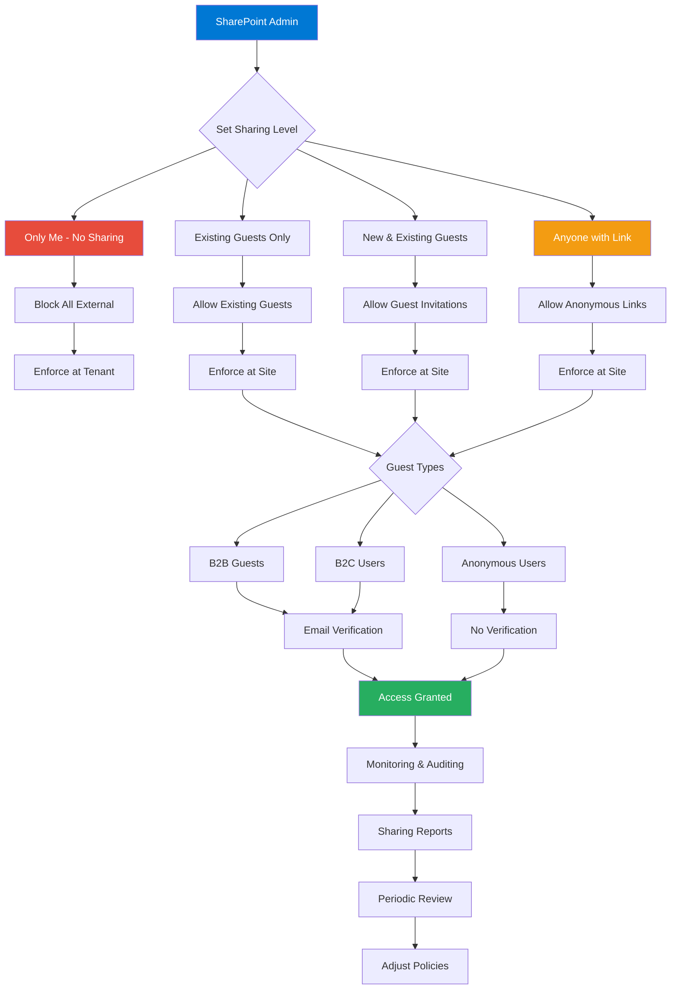
```mermaid
flowchart TD
    Admin[SharePoint Admin] --> SetLevel{Set Sharing Level}

    SetLevel --> OnlyMe[Only Me - No Sharing]
    SetLevel --> Existing[Existing Guests Only]
    SetLevel --> NewAndExisting[New & Existing Guests]
    SetLevel --> Anyone[Anyone with Link]

    OnlyMe --> Policy1[Block All External]
    Existing --> Policy2[Allow Existing Guests]
    NewAndExisting --> Policy3[Allow Guest Invitations]
    Anyone --> Policy4[Allow Anonymous Links]

    Policy1 --> Enforce1[Enforce at Tenant]
    Policy2 --> Enforce2[Enforce at Site]
    Policy3 --> Enforce3[Enforce at Site]
    Policy4 --> Enforce4[Enforce at Site]

    Enforce2 --> GuestTypes{Guest Types}
    Enforce3 --> GuestTypes
    Enforce4 --> GuestTypes

    GuestTypes --> B2B[B2B Guests]
    GuestTypes --> B2C[B2C Users]
    GuestTypes --> Anonymous[Anonymous Users]

    B2B --> Verification[Email Verification]
    B2C --> Verification
    Anonymous --> NoVerification[No Verification]

    Verification --> AccessGranted[Access Granted]
    NoVerification --> AccessGranted

    AccessGranted --> Monitoring[Monitoring & Auditing]
    Monitoring --> Reports[Sharing Reports]
    Reports --> Review[Periodic Review]
    Review --> Adjust[Adjust Policies]

    style Admin fill:#0078d4,color:#fff
    style OnlyMe fill:#e74c3c,color:#fff
    style Anyone fill:#f39c12,color:#fff
    style AccessGranted fill:#27ae60,color:#fff
```

---

## Information Architecture Planning

Shows the main components, decisions, and operational flow for information architecture planning in Microsoft 365 sharepoint and onedrive work.

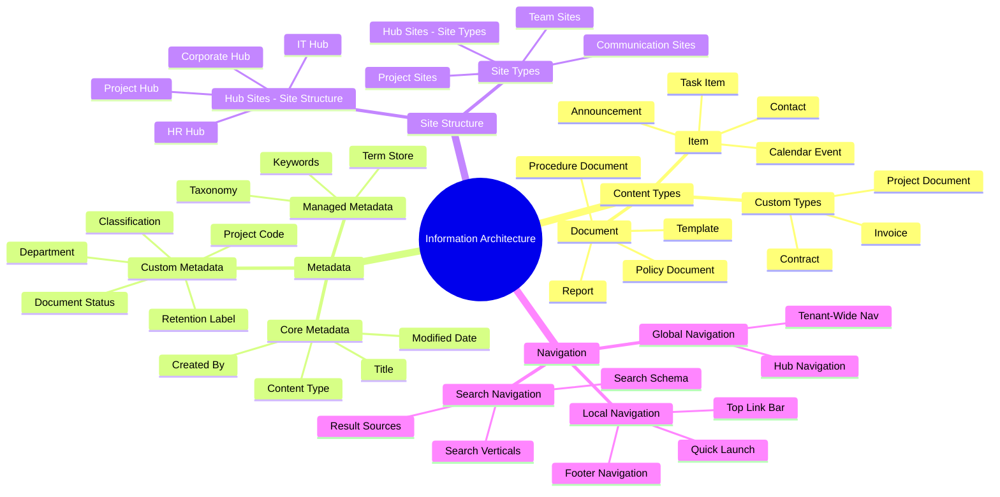
```mermaid
mindmap
  root((Information Architecture))
    Content Types
      Document
        Policy Document
        Procedure Document
        Template
        Report
      Item
        Calendar Event
        Task Item
        Contact
        Announcement
      Custom Types
        Contract
        Invoice
        Project Document
    Metadata
      Core Metadata
        Title
        Created By
        Modified Date
        Content Type
      Custom Metadata
        Department
        Project Code
        Document Status
        Classification
        Retention Label
      Managed Metadata
        Term Store
        Taxonomy
        Keywords
    Site Structure
      Hub Sites - Site Structure
        Corporate Hub
        HR Hub
        IT Hub
        Project Hub
      Site Types
        Team Sites
        Communication Sites
        Hub Sites - Site Types
        Project Sites
    Navigation
      Global Navigation
        Hub Navigation
        Tenant-Wide Nav
      Local Navigation
        Quick Launch
        Top Link Bar
        Footer Navigation
      Search Navigation
        Search Verticals
        Result Sources
        Search Schema
```

---

## OneDrive Known Folder Move

Shows the main components, decisions, and operational flow for onedrive known folder move in Microsoft 365 sharepoint and onedrive work.

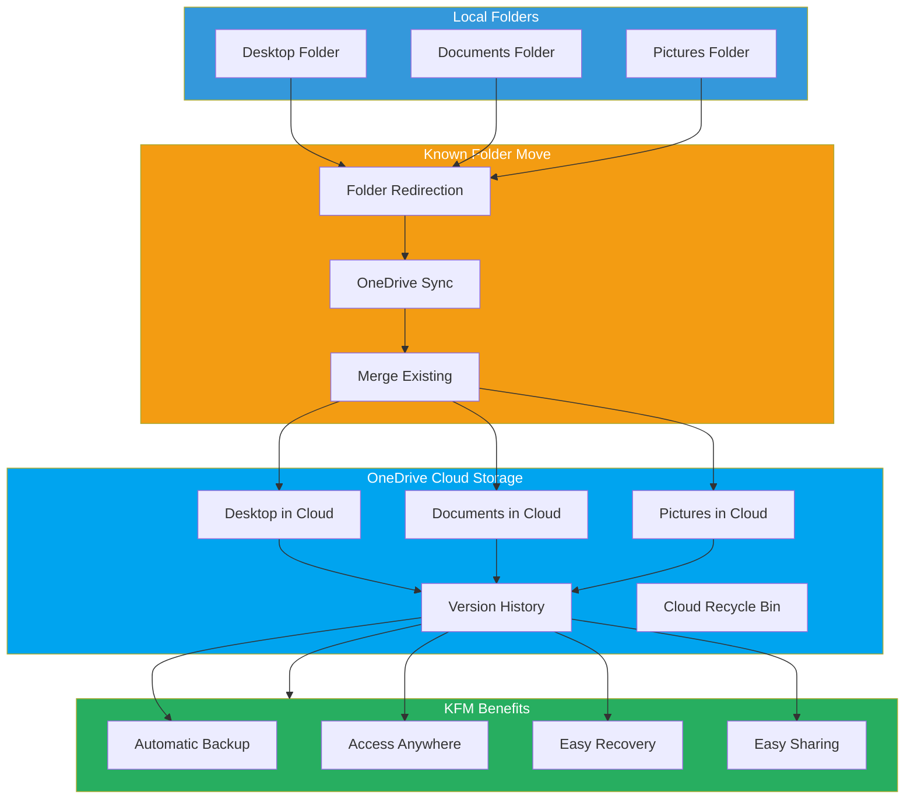
```mermaid
flowchart TB
    subgraph LocalFolders["Local Folders"]
        Desktop[Desktop Folder]
        Documents[Documents Folder]
        Pictures[Pictures Folder]
    end

    subgraph KFM["Known Folder Move"]
        Redirect[Folder Redirection]
        Sync[OneDrive Sync]
        Merge[Merge Existing]
    end

    subgraph Cloud["OneDrive Cloud Storage"]
        CloudDesktop[Desktop in Cloud]
        CloudDocuments[Documents in Cloud]
        CloudPictures[Pictures in Cloud]
        Versioning[Version History]
        RecycleBin[Cloud Recycle Bin]
    end

    subgraph Benefits["KFM Benefits"]
        Backup[Automatic Backup]
        Access[Access Anywhere]
        Recovery[Easy Recovery]
        Sharing[Easy Sharing]
    end

    Desktop --> Redirect
    Documents --> Redirect
    Pictures --> Redirect

    Redirect --> Sync
    Sync --> Merge

    Merge --> CloudDesktop
    Merge --> CloudDocuments
    Merge --> CloudPictures

    CloudDesktop --> Versioning
    CloudDocuments --> Versioning
    CloudPictures --> Versioning

    Versioning --> Benefits
    Versioning --> Backup
    Versioning --> Access
    Versioning --> Recovery
    Versioning --> Sharing

    style LocalFolders fill:#3498db,color:#fff
    style KFM fill:#f39c12,color:#fff
    style Cloud fill:#00a4ef,color:#fff
    style Benefits fill:#27ae60,color:#fff
```

---

## OneDrive Sharing Link Lifecycle

OneDrive sharing governance depends on link type, expiry, audience, sensitivity and ongoing access review.

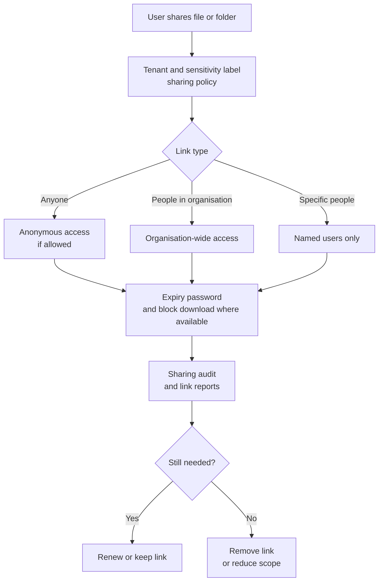
```mermaid
flowchart TB
    OSL_User["User shares file or folder"] --> OSL_Policy["Tenant and sensitivity label<br/>sharing policy"]
    OSL_Policy --> OSL_Type{"Link type"}
    OSL_Type -->|"Anyone"| OSL_Anyone["Anonymous access<br/>if allowed"]
    OSL_Type -->|"People in organisation"| OSL_Org["Organisation-wide access"]
    OSL_Type -->|"Specific people"| OSL_Specific["Named users only"]
    OSL_Anyone --> OSL_Controls["Expiry password<br/>and block download where available"]
    OSL_Org --> OSL_Controls
    OSL_Specific --> OSL_Controls
    OSL_Controls --> OSL_Audit["Sharing audit<br/>and link reports"]
    OSL_Audit --> OSL_Review{"Still needed?"}
    OSL_Review -->|"Yes"| OSL_Extend["Renew or keep link"]
    OSL_Review -->|"No"| OSL_Remove["Remove link<br/>or reduce scope"]
```

---

## OneDrive Storage Dashboard

OneDrive storage monitoring should drive lifecycle, retention and user support actions before quota pressure becomes an incident.

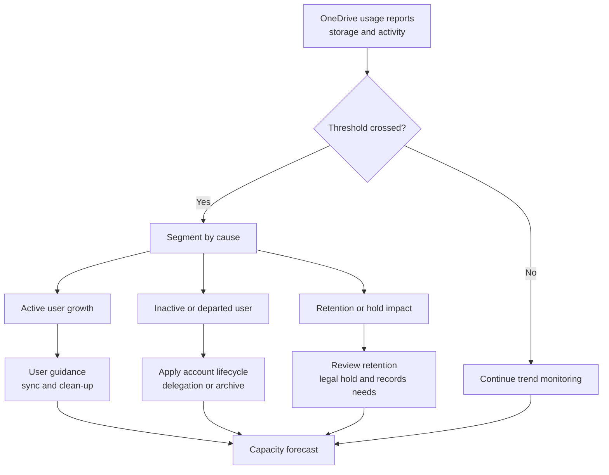
```mermaid
flowchart TB
    OSD_Signals["OneDrive usage reports<br/>storage and activity"] --> OSD_Threshold{"Threshold crossed?"}
    OSD_Threshold -->|"No"| OSD_Monitor["Continue trend monitoring"]
    OSD_Threshold -->|"Yes"| OSD_Segment["Segment by cause"]
    OSD_Segment --> OSD_User["Active user growth"]
    OSD_Segment --> OSD_Inactive["Inactive or departed user"]
    OSD_Segment --> OSD_Retention["Retention or hold impact"]
    OSD_User --> OSD_Advice["User guidance<br/>sync and clean-up"]
    OSD_Inactive --> OSD_Lifecycle["Apply account lifecycle<br/>delegation or archive"]
    OSD_Retention --> OSD_Review["Review retention<br/>legal hold and records needs"]
    OSD_Advice --> OSD_Report["Capacity forecast"]
    OSD_Lifecycle --> OSD_Report
    OSD_Review --> OSD_Report
    OSD_Monitor --> OSD_Report
```

---

## OneDrive Sync Architecture

Shows the main components, decisions, and operational flow for onedrive sync architecture in Microsoft 365 sharepoint and onedrive work.

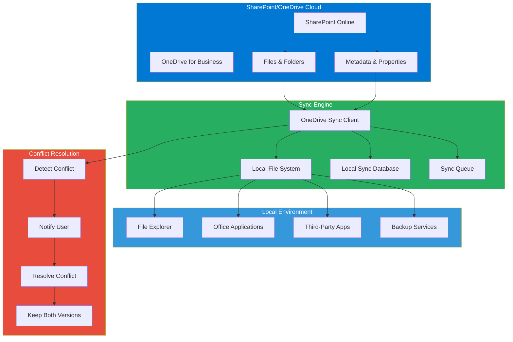
```mermaid
flowchart TB
    subgraph Cloud["SharePoint/OneDrive Cloud"]
        SPO[SharePoint Online]
        ODB[OneDrive for Business]
        Files[Files & Folders]
        Metadata[Metadata & Properties]
    end

    subgraph Sync["Sync Engine"]
        OneDriveClient[OneDrive Sync Client]
        FileSystem[Local File System]
        Database[Local Sync Database]
        Queue[Sync Queue]
    end

    subgraph Local["Local Environment"]
        Explorer[File Explorer]
        OfficeApps[Office Applications]
        ThirdParty[Third-Party Apps]
        Backup[Backup Services]
    end

    subgraph Conflicts["Conflict Resolution"]
        Detect[Detect Conflict]
        Notify[Notify User]
        Resolve[Resolve Conflict]
        KeepBoth[Keep Both Versions]
    end

    Cloud --> Files
    Cloud --> Metadata

    Files --> OneDriveClient
    Metadata --> OneDriveClient

    OneDriveClient --> FileSystem
    OneDriveClient --> Database
    OneDriveClient --> Queue

    FileSystem --> Explorer
    FileSystem --> OfficeApps
    FileSystem --> ThirdParty
    FileSystem --> Backup

    OneDriveClient --> Detect
    Detect --> Notify
    Notify --> Resolve
    Resolve --> KeepBoth

    style Cloud fill:#0078d4,color:#fff
    style Sync fill:#27ae60,color:#fff
    style Local fill:#3498db,color:#fff
    style Conflicts fill:#e74c3c,color:#fff
```

---

## Permission Level Hierarchy

Shows the main components, decisions, and operational flow for permission level hierarchy in Microsoft 365 sharepoint and onedrive work.

```mermaid
flowchart TB
    subgraph SitePermissions["Site Permissions"]
        FullControl[Full Control]
        Design[Design]
        Edit[Edit]
        Contribute[Contribute]
        Read[Read]
        ViewOnly[View Only]
    end

    subgraph ListPermissions["List/Library Permissions"]
        FullControlList[Full Control]
        DesignList[Design]
        EditList[Edit]
        ContributeList[Contribute]
        ReadList[Read]
    end

    subgraph ItemPermissions["Item Permissions"]
        FullControlItem[Full Control]
        EditItem[Edit]
        ContributeItem[Contribute]
        ReadItem[Read]
    end

    subgraph SpecialPermissions["Special Permissions"]
        ManageHierarchy[Manage Hierarchy]
        Approve[Approve Items]
        Open[Open Items]
        ViewVersions[View Versions]
        DeleteVersions[Delete Versions]
    end

    SitePermissions --> FullControl
    SitePermissions --> Design
    SitePermissions --> Edit
    SitePermissions --> Contribute
    SitePermissions --> Read
    SitePermissions --> ViewOnly

    ListPermissions --> FullControlList
    ListPermissions --> DesignList
    ListPermissions --> EditList
    ListPermissions --> ContributeList
    ListPermissions --> ReadList

    ItemPermissions --> FullControlItem
    ItemPermissions --> EditItem
    ItemPermissions --> ContributeItem
    ItemPermissions --> ReadItem

    SpecialPermissions --> ManageHierarchy
    SpecialPermissions --> Approve
    SpecialPermissions --> Open
    SpecialPermissions --> ViewVersions
    SpecialPermissions --> DeleteVersions
```

---

## Restricted Access Control for SharePoint Sites

Restricted Access Control limits access to selected SharePoint sites to specified Microsoft Entra security groups, even when broader permissions exist.

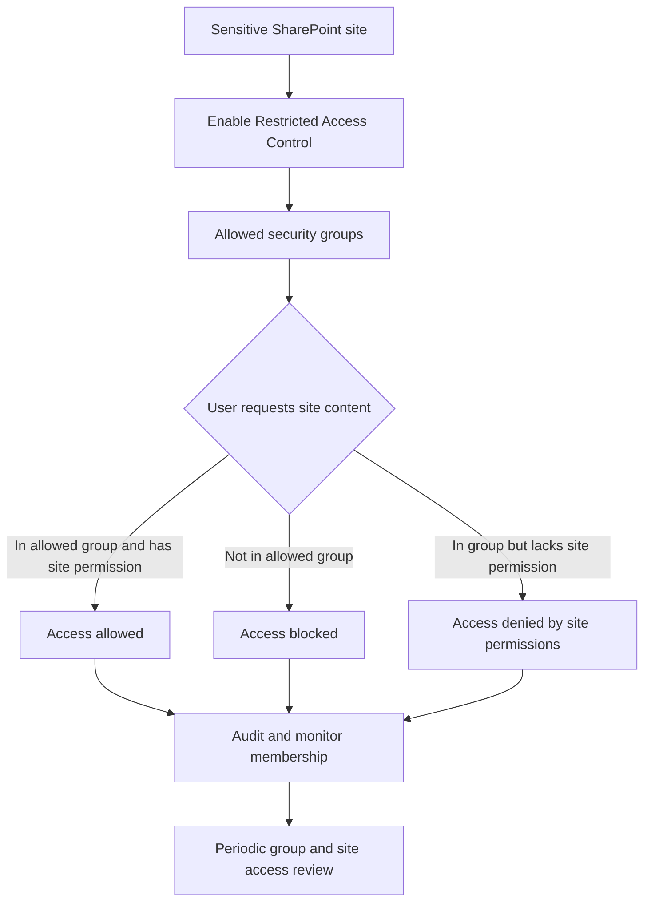
```mermaid
flowchart TB
    RAC_Site["Sensitive SharePoint site"] --> RAC_Enable["Enable Restricted Access Control"]
    RAC_Enable --> RAC_Group["Allowed security groups"]
    RAC_Group --> RAC_User{"User requests site content"}
    RAC_User -->|"In allowed group and has site permission"| RAC_Allow["Access allowed"]
    RAC_User -->|"Not in allowed group"| RAC_Block["Access blocked"]
    RAC_User -->|"In group but lacks site permission"| RAC_NoPerm["Access denied by site permissions"]
    RAC_Allow --> RAC_Audit["Audit and monitor membership"]
    RAC_Block --> RAC_Audit
    RAC_NoPerm --> RAC_Audit
    RAC_Audit --> RAC_Review["Periodic group and site access review"]
```

---

## Restricted SharePoint Search

Restricted SharePoint Search is a temporary allowed-list control for organisation-wide search and Copilot or agentic experiences while permissions are remediated.

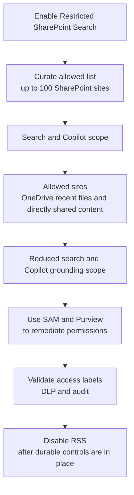
```mermaid
flowchart TB
    RSS_Enable["Enable Restricted SharePoint Search"] --> RSS_Allow["Curate allowed list<br/>up to 100 SharePoint sites"]
    RSS_Allow --> RSS_Experience["Search and Copilot scope"]
    RSS_Experience --> RSS_Sources["Allowed sites<br/>OneDrive recent files and directly shared content"]
    RSS_Sources --> RSS_Limit["Reduced search and Copilot grounding scope"]
    RSS_Limit --> RSS_Remediate["Use SAM and Purview<br/>to remediate permissions"]
    RSS_Remediate --> RSS_Validate["Validate access labels<br/>DLP and audit"]
    RSS_Validate --> RSS_Disable["Disable RSS<br/>after durable controls are in place"]
```

### Notes

- Restricted SharePoint Search is not a security boundary and should not replace least-privilege permissions.

---

## SharePoint Admin Center Navigation

Shows the main components, decisions, and operational flow for sharepoint admin center navigation in Microsoft 365 sharepoint and onedrive work.

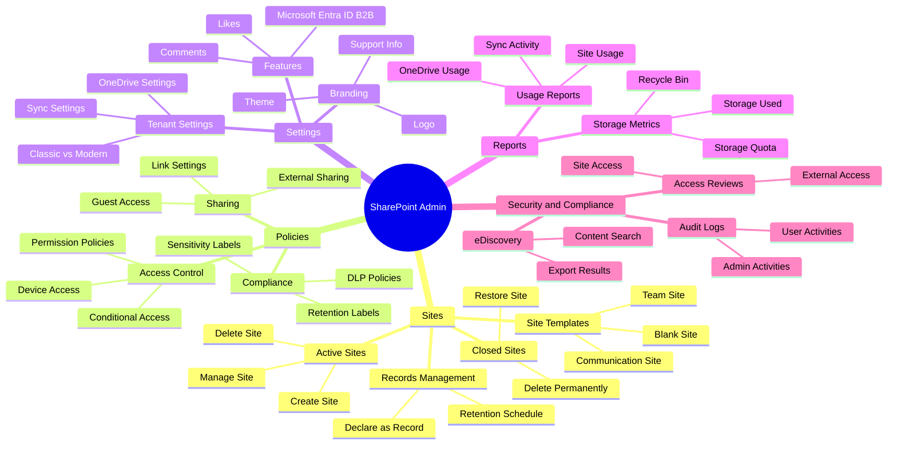
```mermaid
mindmap
  root((SharePoint Admin))
    Sites
      Active Sites
        Create Site
        Manage Site
        Delete Site
      Closed Sites
        Restore Site
        Delete Permanently
      Site Templates
        Team Site
        Communication Site
        Blank Site
      Records Management
        Declare as Record
        Retention Schedule
    Policies
      Sharing
        External Sharing
        Link Settings
        Guest Access
      Access Control
        Permission Policies
        Conditional Access
        Device Access
      Compliance
        DLP Policies
        Retention Labels
        Sensitivity Labels
    Settings
      Tenant Settings
        Classic vs Modern
        OneDrive Settings
        Sync Settings
      Branding
        Theme
        Logo
        Support Info
      Features
        Microsoft Entra ID B2B
        Comments
        Likes
    Reports
      Usage Reports
        Site Usage
        OneDrive Usage
        Sync Activity
      Storage Metrics
        Storage Used
        Storage Quota
        Recycle Bin
    Security and Compliance
      Access Reviews
        Site Access
        External Access
      Audit Logs
        User Activities
        Admin Activities
      eDiscovery
        Content Search
        Export Results
```

---

## SharePoint Advanced Management Governance

SharePoint Advanced Management provides governance controls for content sprawl, lifecycle, oversharing and permission management across SharePoint and OneDrive.

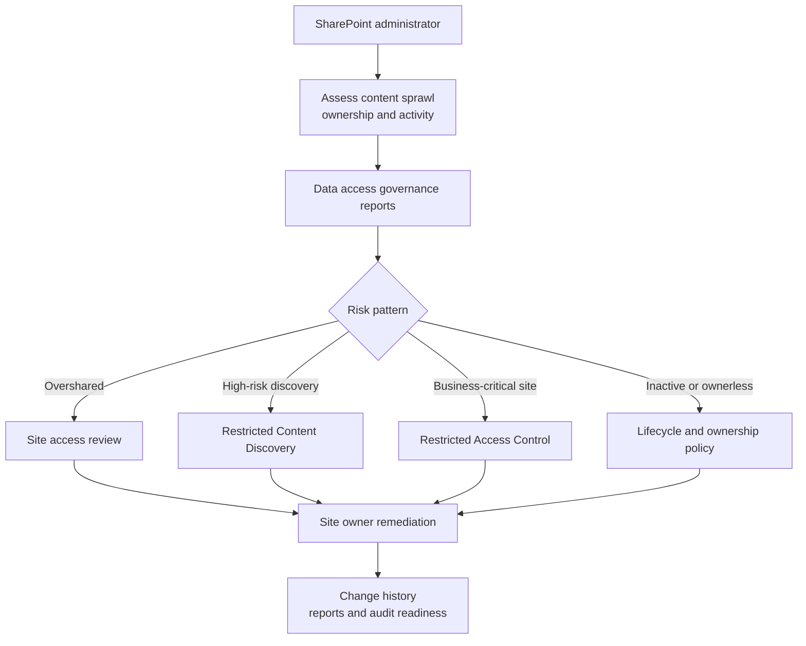
```mermaid
flowchart TB
    SAM_Admin["SharePoint administrator"] --> SAM_Assess["Assess content sprawl<br/>ownership and activity"]
    SAM_Assess --> SAM_DAG["Data access governance reports"]
    SAM_DAG --> SAM_Risk{"Risk pattern"}
    SAM_Risk -->|"Overshared"| SAM_AccessReview["Site access review"]
    SAM_Risk -->|"High-risk discovery"| SAM_RCD["Restricted Content Discovery"]
    SAM_Risk -->|"Business-critical site"| SAM_RAC["Restricted Access Control"]
    SAM_Risk -->|"Inactive or ownerless"| SAM_Lifecycle["Lifecycle and ownership policy"]
    SAM_AccessReview --> SAM_Fix["Site owner remediation"]
    SAM_RCD --> SAM_Fix
    SAM_RAC --> SAM_Fix
    SAM_Lifecycle --> SAM_Fix
    SAM_Fix --> SAM_Evidence["Change history<br/>reports and audit readiness"]
```

---

## SharePoint Governance Framework

Shows the main components, decisions, and operational flow for sharepoint governance framework in Microsoft 365 sharepoint and onedrive work.

```mermaid
flowchart TB
    subgraph Policies["Governance Policies"]
        SiteCreation[Site Creation Policy]
        Naming[Naming Convention]
        Classification[Site Classification]
        ExternalSharing[External Sharing Policy]
        Retention[Retention Policy]
    end

    subgraph Lifecycle["Site Lifecycle"]
        Request[Site Request]
        Approval[Approval Process]
        Creation[Site Creation]
        Active[Active Use]
        Review[Periodic Review]
        Archive[Archival]
        Delete[Deletion]
    end

    subgraph Roles["Roles & Responsibilities"]
        Admins[SharePoint Admins]
        Owners[Site Owners]
        Members[Site Members]
        Visitors[Site Visitors]
        Governance[Governance Board]
    end

    subgraph Monitoring["Monitoring & Compliance"]
        UsageReports[Usage Reports]
        StorageReports[Storage Reports]
        SharingReports[Sharing Reports]
        AuditLogs[Audit Logs]
        ComplianceReports[Compliance Reports]
    end

    Policies --> SiteCreation
    Policies --> Naming
    Policies --> Classification
    Policies --> ExternalSharing
    Policies --> Retention

    Lifecycle --> Request
    Lifecycle --> Approval
    Lifecycle --> Creation
    Lifecycle --> Active
    Lifecycle --> Review
    Lifecycle --> Archive
    Lifecycle --> Delete

    Roles --> Admins
    Roles --> Owners
    Roles --> Members
    Roles --> Visitors
    Roles --> Governance

    Monitoring --> UsageReports
    Monitoring --> StorageReports
    Monitoring --> SharingReports
    Monitoring --> AuditLogs
    Monitoring --> ComplianceReports

    style Policies fill:#0078d4,color:#fff
    style Lifecycle fill:#27ae60,color:#fff
    style Roles fill:#3498db,color:#fff
    style Monitoring fill:#e74c3c,color:#fff
```

---

## SharePoint Hub Site Association

Shows the main components, decisions, and operational flow for sharepoint hub site association in Microsoft 365 sharepoint and onedrive work.

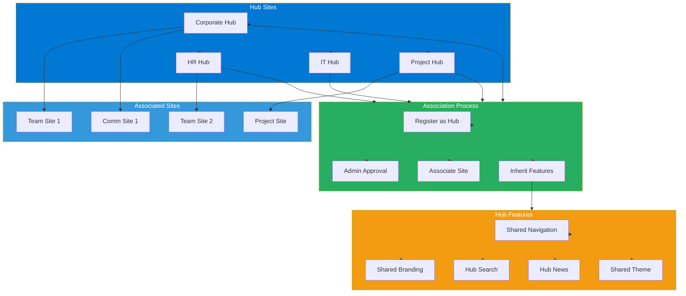
```mermaid
flowchart TB
    subgraph HubSites["Hub Sites"]
        CorporateHub[Corporate Hub]
        HRHub[HR Hub]
        ITHub[IT Hub]
        ProjectHub[Project Hub]
    end

    subgraph Association["Association Process"]
        Register[Register as Hub]
        Approve[Admin Approval]
        Associate[Associate Site]
        Inherit[Inherit Features]
    end

    subgraph Features["Hub Features"]
        Navigation[Shared Navigation]
        Branding[Shared Branding]
        Search[Hub Search]
        News[Hub News]
        Theming[Shared Theme]
    end

    subgraph Sites["Associated Sites"]
        TeamSite1[Team Site 1]
        CommSite1[Comm Site 1]
        TeamSite2[Team Site 2]
        ProjectSite[Project Site]
    end

    HubSites --> CorporateHub
    HubSites --> HRHub
    HubSites --> ITHub
    HubSites --> ProjectHub

    CorporateHub --> Association
    HRHub --> Association
    ITHub --> Association
    ProjectHub --> Association

    Association --> Register
    Association --> Approve
    Association --> Associate
    Association --> Inherit

    Inherit --> Features
    Features --> Navigation
    Features --> Branding
    Features --> Search
    Features --> News
    Features --> Theming

    CorporateHub --> TeamSite1
    CorporateHub --> CommSite1
    HRHub --> TeamSite2
    ProjectHub --> ProjectSite

    style HubSites fill:#0078d4,color:#fff
    style Association fill:#27ae60,color:#fff
    style Features fill:#f39c12,color:#fff
    style Sites fill:#3498db,color:#fff
```

---

## SharePoint Migration Paths

Shows the main components, decisions, and operational flow for sharepoint migration paths in Microsoft 365 sharepoint and onedrive work.

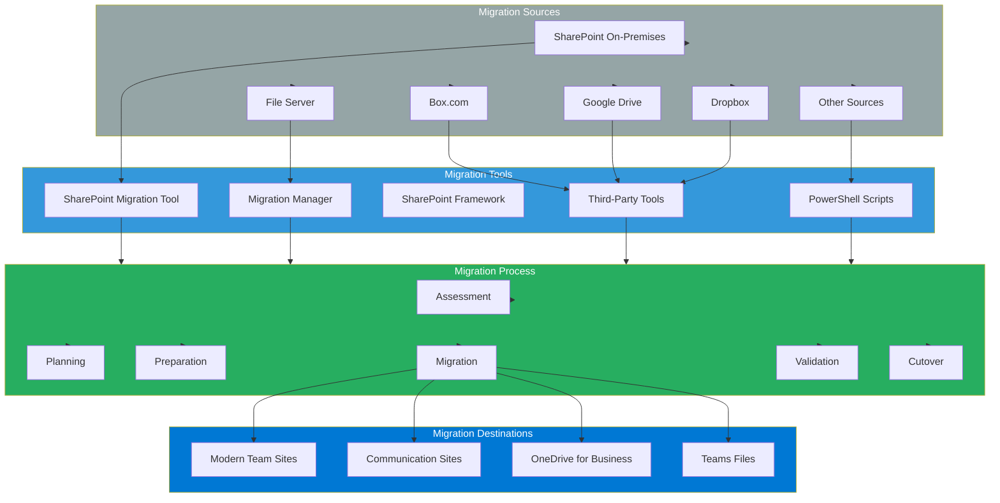
```mermaid
flowchart TB
    subgraph Sources["Migration Sources"]
        OnPrem[SharePoint On-Premises]
        FileServer[File Server]
        Box[Box.com]
        GDrive[Google Drive]
        DropBox[Dropbox]
        Other[Other Sources]
    end

    subgraph Tools["Migration Tools"]
        SMT[SharePoint Migration Tool]
        MCT[Migration Manager]
        SPFX[SharePoint Framework]
        ThirdParty[Third-Party Tools]
        PowerShell[PowerShell Scripts]
    end

    subgraph Destinations["Migration Destinations"]
        ModernSites[Modern Team Sites]
        CommSites[Communication Sites]
        OneDrive[OneDrive for Business]
        TeamsFiles[Teams Files]
    end

    subgraph Process["Migration Process"]
        Assess[Assessment]
        Plan[Planning]
        Prep[Preparation]
        Migrate[Migration]
        Validate[Validation]
        Cutover[Cutover]
    end

    Sources --> OnPrem
    Sources --> FileServer
    Sources --> Box
    Sources --> GDrive
    Sources --> DropBox
    Sources --> Other

    OnPrem --> SMT
    FileServer --> MCT
    Box --> ThirdParty
    GDrive --> ThirdParty
    DropBox --> ThirdParty
    Other --> PowerShell

    SMT --> Process
    MCT --> Process
    ThirdParty --> Process
    PowerShell --> Process

    Process --> Assess
    Process --> Plan
    Process --> Prep
    Process --> Migrate
    Process --> Validate
    Process --> Cutover

    Migrate --> ModernSites
    Migrate --> CommSites
    Migrate --> OneDrive
    Migrate --> TeamsFiles

    style Sources fill:#95a5a6,color:#fff
    style Tools fill:#3498db,color:#fff
    style Destinations fill:#0078d4,color:#fff
    style Process fill:#27ae60,color:#fff
```

---

## SharePoint Online Architecture Overview

Shows the main components, decisions, and operational flow for sharepoint online architecture overview in Microsoft 365 sharepoint and onedrive work.

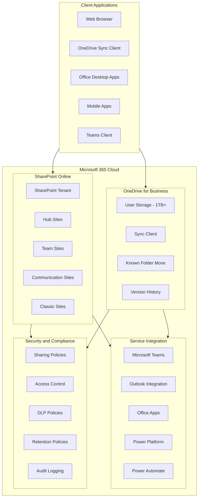
```mermaid
flowchart TB
    subgraph M365["Microsoft 365 Cloud"]
        direction TB

        subgraph SPO["SharePoint Online"]
            Tenant[SharePoint Tenant]
            HubSites[Hub Sites]
            TeamSites[Team Sites]
            CommSites[Communication Sites]
            ClassicSites[Classic Sites]
        end

        subgraph ODB["OneDrive for Business"]
            UserStorage[User Storage - 1TB+]
            Sync[Sync Client]
            Backup[Known Folder Move]
            Versioning[Version History]
        end

        subgraph Integration["Service Integration"]
            Teams[Microsoft Teams]
            Outlook[Outlook Integration]
            Office[Office Apps]
            PowerPlatform[Power Platform]
            Flow[Power Automate]
        end

        subgraph Security["Security and Compliance"]
            Sharing[Sharing Policies]
            AccessControl[Access Control]
            DLP[DLP Policies]
            Retention[Retention Policies]
            Audit[Audit Logging]
        end
    end

    subgraph Clients["Client Applications"]
        Browser[Web Browser]
        OneDriveSync[OneDrive Sync Client]
        OfficeApps[Office Desktop Apps]
        Mobile[Mobile Apps]
        TeamsClient[Teams Client]
    end

    Clients --> SPO
    Clients --> ODB
    SPO --> Integration
    ODB --> Integration
    SPO --> Security
    ODB --> Security
```

---

## SharePoint Online Limits

Shows the main components, decisions, and operational flow for sharepoint online limits in Microsoft 365 sharepoint and onedrive work.

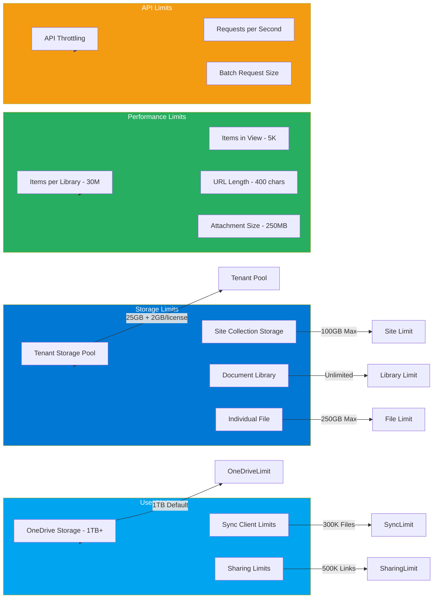
```mermaid
flowchart LR
    subgraph Storage["Storage Limits"]
        Tenant[Tenant Storage Pool]
        Site[Site Collection Storage]
        Library[Document Library]
        File[Individual File]
    end

    subgraph Users["User Limits"]
        OneDrive[OneDrive Storage - 1TB+]
        Sync[Sync Client Limits]
        Sharing[Sharing Limits]
    end

    subgraph Performance["Performance Limits"]
        Items[Items per Library - 30M]
        View[Items in View - 5K]
        URL[URL Length - 400 chars]
        Attachments[Attachment Size - 250MB]
    end

    subgraph API["API Limits"]
        Throttling[API Throttling]
        Requests[Requests per Second]
        Batch[Batch Request Size]
    end

    Storage --> Tenant
    Storage --> Site
    Storage --> Library
    Storage --> File

    Tenant -->|25GB + 2GB/license| Pool[Tenant Pool]
    Site -->|100GB Max| SiteLimit[Site Limit]
    Library -->|Unlimited| LibLimit[Library Limit]
    File -->|250GB Max| FileLimit[File Limit]

    Users --> OneDrive
    Users --> Sync
    Users --> Sharing

    OneDrive -->|1TB Default| OneDriveLimit
    Sync -->|300K Files| SyncLimit
    Sharing -->|500K Links| SharingLimit

    Performance --> Items
    Performance --> View
    Performance --> URL
    Performance --> Attachments

    API --> Throttling
    API --> Requests
    API --> Batch

    style Storage fill:#0078d4,color:#fff
    style Users fill:#00a4ef,color:#fff
    style Performance fill:#27ae60,color:#fff
    style API fill:#f39c12,color:#fff
```

---

## SharePoint Oversharing Remediation

Use this flow to move from oversharing detection to durable site, link, permission and ownership fixes.

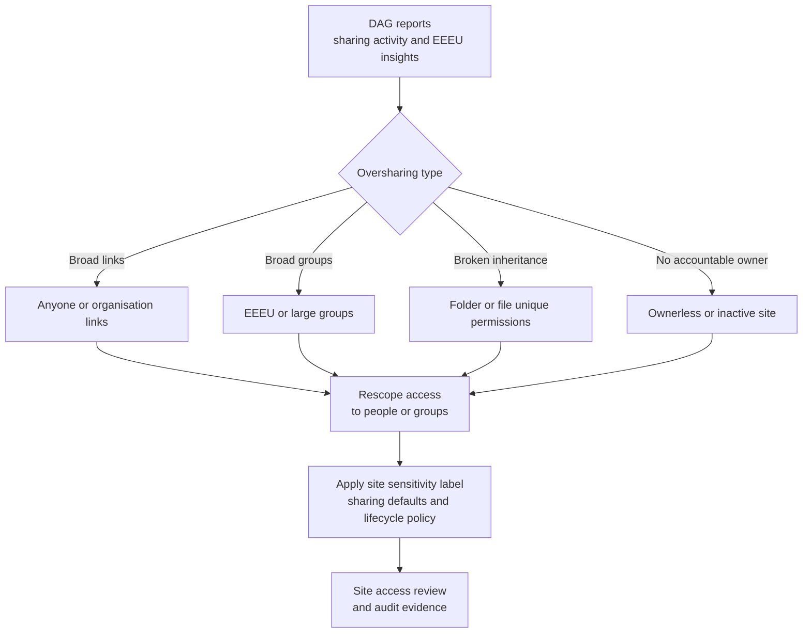
```mermaid
flowchart TB
    SPOR_Report["DAG reports<br/>sharing activity and EEEU insights"] --> SPOR_Triage{"Oversharing type"}
    SPOR_Triage -->|"Broad links"| SPOR_Links["Anyone or organisation links"]
    SPOR_Triage -->|"Broad groups"| SPOR_Groups["EEEU or large groups"]
    SPOR_Triage -->|"Broken inheritance"| SPOR_Inheritance["Folder or file unique permissions"]
    SPOR_Triage -->|"No accountable owner"| SPOR_Owner["Ownerless or inactive site"]
    SPOR_Links --> SPOR_Action["Rescope access<br/>to people or groups"]
    SPOR_Groups --> SPOR_Action
    SPOR_Inheritance --> SPOR_Action
    SPOR_Owner --> SPOR_Action
    SPOR_Action --> SPOR_Label["Apply site sensitivity label<br/>sharing defaults and lifecycle policy"]
    SPOR_Label --> SPOR_Review["Site access review<br/>and audit evidence"]
```

---

## SharePoint PowerShell Module

Shows the main components, decisions, and operational flow for sharepoint powershell module in Microsoft 365 sharepoint and onedrive work.

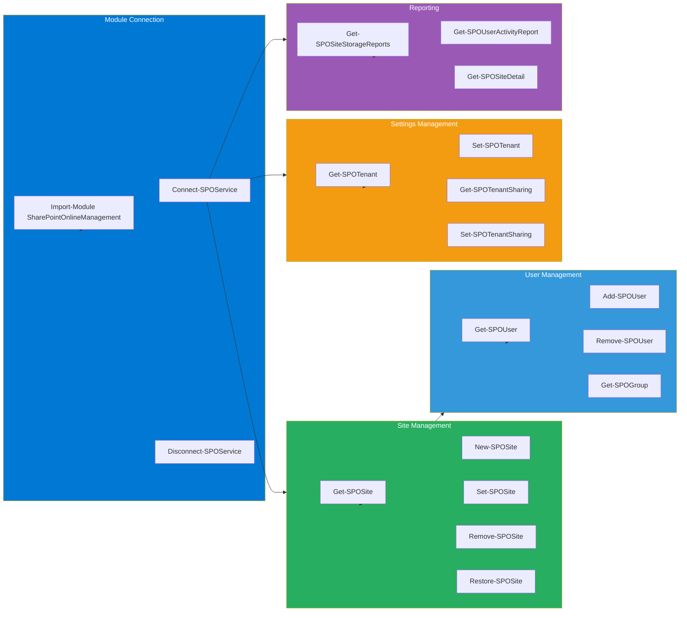
```mermaid
flowchart LR
    subgraph Connection["Module Connection"]
        ImportModule[Import-Module SharePointOnlineManagement]
        ConnectSPO[Connect-SPOService]
        DisconnectSPO[Disconnect-SPOService]
    end

    subgraph Sites["Site Management"]
        GetSite[Get-SPOSite]
        NewSite[New-SPOSite]
        SetSite[Set-SPOSite]
        RemoveSite[Remove-SPOSite]
        RestoreSite[Restore-SPOSite]
    end

    subgraph Users["User Management"]
        GetUser[Get-SPOUser]
        AddUser[Add-SPOUser]
        RemoveUser[Remove-SPOUser]
        GetGroup[Get-SPOGroup]
    end

    subgraph Settings["Settings Management"]
        GetSettings[Get-SPOTenant]
        SetSettings[Set-SPOTenant]
        GetSharing[Get-SPOTenantSharing]
        SetSharing[Set-SPOTenantSharing]
    end

    subgraph Reports["Reporting"]
        GetStorage[Get-SPOSiteStorageReports]
        GetActivity[Get-SPOUserActivityReport]
        GetDetails[Get-SPOSiteDetail]
    end

    Connection --> ImportModule
    Connection --> ConnectSPO
    Connection --> DisconnectSPO

    ConnectSPO --> Sites
    Sites --> GetSite
    Sites --> NewSite
    Sites --> SetSite
    Sites --> RemoveSite
    Sites --> RestoreSite

    Sites --> Users
    Users --> GetUser
    Users --> AddUser
    Users --> RemoveUser
    Users --> GetGroup

    ConnectSPO --> Settings
    Settings --> GetSettings
    Settings --> SetSettings
    Settings --> GetSharing
    Settings --> SetSharing

    ConnectSPO --> Reports
    Reports --> GetStorage
    Reports --> GetActivity
    Reports --> GetDetails

    style Connection fill:#0078d4,color:#fff
    style Sites fill:#27ae60,color:#fff
    style Users fill:#3498db,color:#fff
    style Settings fill:#f39c12,color:#fff
    style Reports fill:#9b59b6,color:#fff
```

---

## SharePoint Premium Content Processing

SharePoint Premium, including Syntex content processing, can classify, extract and route content so information architecture and compliance actions are repeatable.

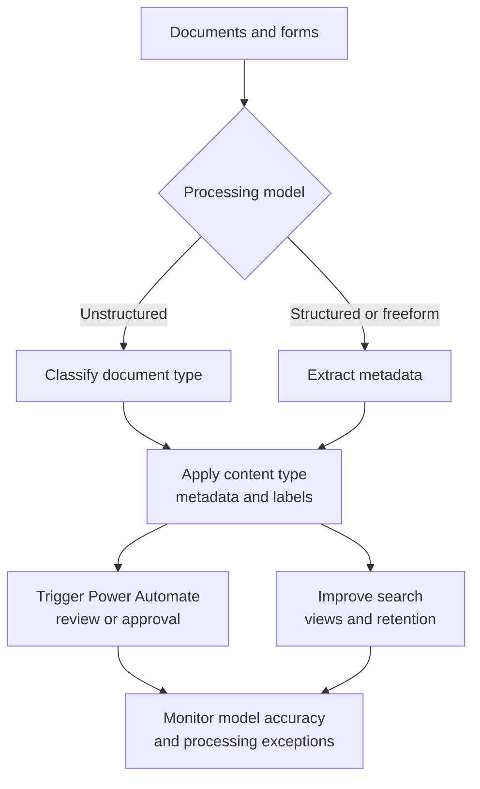
```mermaid
flowchart TB
    SPP_Content["Documents and forms"] --> SPP_Model{"Processing model"}
    SPP_Model -->|"Unstructured"| SPP_Classify["Classify document type"]
    SPP_Model -->|"Structured or freeform"| SPP_Extract["Extract metadata"]
    SPP_Classify --> SPP_Metadata["Apply content type<br/>metadata and labels"]
    SPP_Extract --> SPP_Metadata
    SPP_Metadata --> SPP_Workflow["Trigger Power Automate<br/>review or approval"]
    SPP_Metadata --> SPP_Search["Improve search<br/>views and retention"]
    SPP_Workflow --> SPP_Monitor["Monitor model accuracy<br/>and processing exceptions"]
    SPP_Search --> SPP_Monitor
```

---

## SharePoint Search Architecture

Shows the main components, decisions, and operational flow for sharepoint search architecture in Microsoft 365 sharepoint and onedrive work.

```mermaid
flowchart TB
    subgraph ContentSources["Content Sources"]
        SPOContent[SharePoint Content]
        ODBContent[OneDrive Content]
        ExternalContent[External Sources]
        CustomContent[Custom Sources]
    end

    subgraph Crawl["Crawl Process"]
        CrawlComponent[Crawl Component]
        ContentProcessing[Content Processing]
        TextExtraction[Text Extraction]
        PropertyExtraction[Property Extraction]
    end

    subgraph Index["Search Index"]
        IndexComponent[Index Component]
        IndexPartitions[Index Partitions]
        IndexReplicas[Index Replicas]
    end

    subgraph Query["Query Processing"]
        QueryComponent[Query Component]
        QueryRewrite[Query Rewrite]
        Ranking[Result Ranking]
        SecurityTrim[Security Trimming]
    end

    subgraph Results["Search Results"]
        ResultSource[Result Sources]
        DisplayTemplate[Display Templates]
        Refiners[Refiners]
        CustomResults[Custom Results]
    end

    ContentSources --> SPOContent
    ContentSources --> ODBContent
    ContentSources --> ExternalContent
    ContentSources --> CustomContent

    SPOContent --> Crawl
    ODBContent --> Crawl
    ExternalContent --> Crawl
    CustomContent --> Crawl

    Crawl --> CrawlComponent
    Crawl --> ContentProcessing
    Crawl --> TextExtraction
    Crawl --> PropertyExtraction

    ContentProcessing --> Index
    TextExtraction --> Index
    PropertyExtraction --> Index

    Index --> IndexComponent
    Index --> IndexPartitions
    Index --> IndexReplicas

    Index --> Query
    Query --> QueryComponent
    Query --> QueryRewrite
    Query --> Ranking
    Query --> SecurityTrim

    Query --> Results
    Results --> ResultSource
    Results --> DisplayTemplate
    Results --> Refiners
    Results --> CustomResults

    style ContentSources fill:#95a5a6,color:#fff
    style Crawl fill:#3498db,color:#fff
    style Index fill:#27ae60,color:#fff
    style Query fill:#f39c12,color:#fff
    style Results fill:#0078d4,color:#fff
```

---

## SharePoint Security Groups

Shows the main components, decisions, and operational flow for sharepoint security groups in Microsoft 365 sharepoint and onedrive work.

```mermaid
classDiagram
    class SharePointGroup {
        +Group Name
        +Group Owner
        +Permission Level
        +Membership Type
        +AllowRequest
        +AutoAccept
    }

    class SiteOwners {
        +Full Control
        +Manage Site
        +Manage Permissions
        +Delete Site
        +Owner: Site Admin
    }

    class SiteMembers {
        +Contribute
        +Add/Edit Items
        +Delete Items
        +View Pages
        +Owner: Group Owner
    }

    class SiteVisitors {
        +Read Only
        +View Items
        +View Pages
        +No Edit Rights
        +Owner: Group Owner
    }

    class Approvers {
        +Approve Items
        +Edit Items
        +Delete Items
        +Manage Permissions
        +Owner: Group Owner
    }

    class HierarchyManagement {
        +Manage Hierarchy
        +Add Subsites
        +Manage Navigation
        +Owner: Site Owner
    }

    SharePointGroup <|-- SiteOwners
    SharePointGroup <|-- SiteMembers
    SharePointGroup <|-- SiteVisitors
    SharePointGroup <|-- Approvers
    SharePointGroup <|-- HierarchyManagement

    note for SiteOwners "Highest permission level - Use sparingly: 2-3 owners max"

    note for SiteMembers "Most common permission - For daily contributors"

    note for SiteVisitors "Read-only access - For information consumers"

    style SharePointGroup fill:#0078d4,color:#fff
    style SiteOwners fill:#e74c3c,color:#fff
    style SiteMembers fill:#27ae60,color:#fff
    style SiteVisitors fill:#3498db,color:#fff
```

---

## SharePoint Site Collection Hierarchy

Shows the main components, decisions, and operational flow for sharepoint site collection hierarchy in Microsoft 365 sharepoint and onedrive work.

```mermaid
flowchart TB
    subgraph Root["Root Site Collection"]
        RootSite[Root Site]
    end

    subgraph Hub["Hub Site"]
        Hub1[Hub Site 1]
        Hub2[Hub Site 2]
        Hub3[Hub Site 3]
    end

    subgraph Associated["Associated Sites"]
        subgraph Hub1Sites["Hub 1 Sites"]
            Site1A[Team Site A]
            Site1B[Comm Site B]
            Site1C[Team Site C]
        end

        subgraph Hub2Sites["Hub 2 Sites"]
            Site2A[Team Site A]
            Site2B[Comm Site B]
        end

        subgraph Hub3Sites["Hub 3 Sites"]
            Site3A[Project Site A]
            Site3B[Department Site B]
            Site3C[Team Site C]
        end
    end

    subgraph Subsites["Legacy Subsites (Flat)"]
        Sub1[Subsite 1]
        Sub2[Subsite 2]
        Sub3[Subsite 3]
    end

    RootSite --> Hub1
    RootSite --> Hub2
    RootSite --> Hub3

    Hub1 --> Site1A
    Hub1 --> Site1B
    Hub1 --> Site1C

    Hub2 --> Site2A
    Hub2 --> Site2B

    Hub3 --> Site3A
    Hub3 --> Site3B
    Hub3 --> Site3C

    RootSite -.->|Legacy| Sub1
    RootSite -.->|Legacy| Sub2
    RootSite -.->|Legacy| Sub3
```

---

## SharePoint Site Scripts and Designs

Shows the main components, decisions, and operational flow for sharepoint site scripts and designs in Microsoft 365 sharepoint and onedrive work.

```mermaid
flowchart TB
    subgraph Components["Site Design Components"]
        SiteScriptsComponent[Site Scripts]
        SiteDesignsComponent[Site Designs]
        Tasks[Site Design Tasks]
    end

    subgraph SiteScripts["Site Scripts"]
        JSON[JSON Configuration]
        SchemaActions[Schema Actions]
        Parameters[Action Parameters]
    end

    subgraph SiteDesigns["Site Designs"]
        Title[Design Title]
        Description[Design Description]
        WebTemplate[Web Template]
        Thumbnail[Thumbnail URL]
        Order[Display Order]
    end

    subgraph AvailableActions["Available Actions"]
        CreateSPList[Create SP List]
        SetSPField[Set SP Field]
        ApplySPTheme[Apply SP Theme]
        SetSPWebConfig[Set SP Web Config]
        AddSPFieldXml[Add SP Field XML]
        SetSiteLogo[Set Site Logo]
        AddNavLink[Add Navigation Link]
    end

    Components --> SiteScriptsComponent
    Components --> SiteDesignsComponent
    Components --> Tasks

    SiteScripts --> JSON
    SiteScripts --> SchemaActions
    SiteScripts --> Parameters

    SiteDesigns --> Title
    SiteDesigns --> Description
    SiteDesigns --> WebTemplate
    SiteDesigns --> Thumbnail
    SiteDesigns --> Order

    AvailableActions --> CreateSPList
    AvailableActions --> SetSPField
    AvailableActions --> ApplySPTheme
    AvailableActions --> SetSPWebConfig
    AvailableActions --> AddSPFieldXml
    AvailableActions --> SetSiteLogo
    AvailableActions --> AddNavLink

    style Components fill:#0078d4,color:#fff
    style SiteScripts fill:#27ae60,color:#fff
    style SiteDesigns fill:#3498db,color:#fff
    style AvailableActions fill:#f39c12,color:#fff
```

---

## Sharing Permission Flow

Shows the main components, decisions, and operational flow for sharing permission flow in Microsoft 365 sharepoint and onedrive work.

```mermaid
flowchart TD
    Owner[Content Owner] --> Share{Share Content}

    Share --> LinkType{Link Type}

    LinkType -->|Anyone| AnyoneLink[Anyone Link]
    LinkType -->|Organisation| OrgLink[Organisation link]
    LinkType -->|Specific| SpecificLink[Specific People Link]
    LinkType -->|Direct| DirectAccess[Direct User Access]

    AnyoneLink --> Permissions1{Permission Level}
    OrgLink --> Permissions2{Permission Level}
    SpecificLink --> Permissions3{Permission Level}
    DirectAccess --> Permissions4{Permission Level}

    Permissions1 --> CanView1[Can View]
    Permissions1 --> CanEdit1[Can Edit]

    Permissions2 --> CanView2[Can View]
    Permissions2 --> CanEdit2[Can Edit]

    Permissions3 --> CanView3[Can View]
    Permissions3 --> CanEdit3[Can Edit]

    Permissions4 --> FullControl[Full Control]
    Permissions4 --> Edit[Edit]
    Permissions4 --> Read[Read]

    CanView1 --> Recipient1[Anonymous Recipient]
    CanEdit1 --> Recipient1
    CanView2 --> Recipient2[Org Member]
    CanEdit2 --> Recipient2
    CanView3 --> Recipient3[Specific Person]
    CanEdit3 --> Recipient3
    FullControl --> Recipient4[Named User]
    Edit --> Recipient4
    Read --> Recipient4

    Recipient1 --> Access1[Access Granted]
    Recipient2 --> Access2[Access Granted]
    Recipient3 --> Access3[Access Granted]
    Recipient4 --> Access4[Access Granted]

    style Owner fill:#0078d4,color:#fff
    style AnyoneLink fill:#e74c3c,color:#fff
    style OrgLink fill:#f39c12,color:#fff
    style SpecificLink fill:#27ae60,color:#fff
    style Access1 fill:#27ae60,color:#fff
    style Access2 fill:#27ae60,color:#fff
    style Access3 fill:#27ae60,color:#fff
    style Access4 fill:#27ae60,color:#fff
```
