# Teams and Voice

Teams and voice diagrams for Microsoft 365 admins. This file contains 25 topics covering Teams governance, collaboration models, meetings, voice routing, Teams Phone, Teams Premium and media quality.

## Contents

- [Auto Attendant Flow](#auto-attendant-flow)
- [Call Queue Configuration](#call-queue-configuration)
- [Direct Routing Architecture](#direct-routing-architecture)
- [Operator Connect Calling Architecture](#operator-connect-calling-architecture)
- [Teams Admin Center Structure](#teams-admin-center-structure)
- [Teams and SharePoint Integration](#teams-and-sharepoint-integration)
- [Teams App Permission Policy](#teams-app-permission-policy)
- [Teams Architecture Overview](#teams-architecture-overview)
- [Teams Call Quality Dashboard](#teams-call-quality-dashboard)
- [Teams Call Routing Options](#teams-call-routing-options)
- [Teams Channel Model: Standard, Private and Shared Channels](#teams-channel-model-standard-private-and-shared-channels)
- [Teams Chat and Channel Architecture](#teams-chat-and-channel-architecture)
- [Teams Compliance Features](#teams-compliance-features)
- [Teams Emergency Calling](#teams-emergency-calling)
- [Teams Governance Framework](#teams-governance-framework)
- [Teams Guest Access vs External Access](#teams-guest-access-vs-external-access)
- [Teams Town Hall and Live Event Architecture](#teams-town-hall-and-live-event-architecture)
- [Teams Media Stack](#teams-media-stack)
- [Teams Meeting Lifecycle and Policy Controls](#teams-meeting-lifecycle-and-policy-controls)
- [Teams Network Requirements](#teams-network-requirements)
- [Teams Phone Features](#teams-phone-features)
- [Teams Premium Events Governance](#teams-premium-events-governance)
- [Teams Rooms Deployment](#teams-rooms-deployment)
- [Teams Upgrade Paths](#teams-upgrade-paths)
- [Teams Voice Routing Configuration](#teams-voice-routing-configuration)

---

## Auto Attendant Flow

Shows the main components, decisions, and operational flow for auto attendant flow in Microsoft 365 teams and voice work.

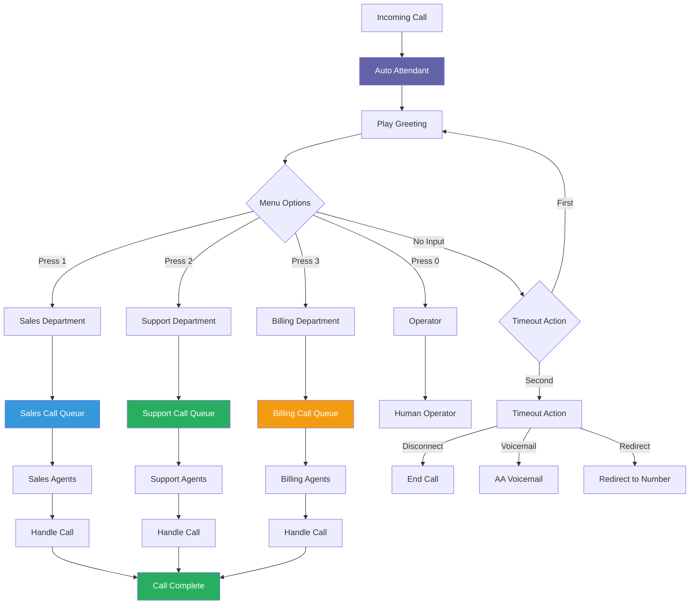
```mermaid
flowchart TD
    IncomingCall[Incoming Call] --> AA[Auto Attendant]

    AA --> Greeting[Play Greeting]
    Greeting --> Menu{Menu Options}

    Menu -->|Press 1| Sales[Sales Department]
    Menu -->|Press 2| Support[Support Department]
    Menu -->|Press 3| Billing[Billing Department]
    Menu -->|Press 0| Operator[Operator]
    Menu -->|No Input| Timeout{Timeout Action}

    Sales --> Queue1[Sales Call Queue]
    Support --> Queue2[Support Call Queue]
    Billing --> Queue3[Billing Call Queue]
    Operator --> HumanOperator[Human Operator]

    Timeout -->|First| Greeting
    Timeout -->|Second| TimeoutAction[Timeout Action]

    TimeoutAction -->|Disconnect| Disconnect[End Call]
    TimeoutAction -->|Voicemail| AAVoicemail[AA Voicemail]
    TimeoutAction -->|Redirect| Redirect[Redirect to Number]

    Queue1 --> Agent1[Sales Agents]
    Queue2 --> Agent2[Support Agents]
    Queue3 --> Agent3[Billing Agents]

    Agent1 --> Handle1[Handle Call]
    Agent2 --> Handle2[Handle Call]
    Agent3 --> Handle3[Handle Call]

    Handle1 --> Complete[Call Complete]
    Handle2 --> Complete
    Handle3 --> Complete

    style AA fill:#6264a7,color:#fff
    style Queue1 fill:#3498db,color:#fff
    style Queue2 fill:#27ae60,color:#fff
    style Queue3 fill:#f39c12,color:#fff
    style Complete fill:#27ae60,color:#fff
```

---

## Call Queue Configuration

Shows the main components, decisions, and operational flow for call queue configuration in Microsoft 365 teams and voice work.

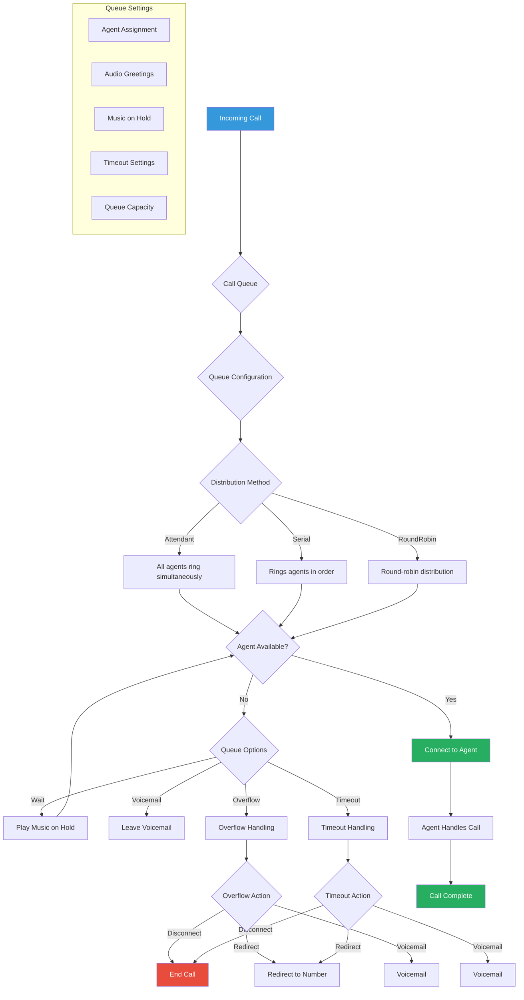
```mermaid
flowchart TD
    IncomingCall[Incoming Call] --> Queue{Call Queue}

    Queue --> Config{Queue Configuration}

    subgraph QueueSettings["Queue Settings"]
        Agents[Agent Assignment]
        Greetings[Audio Greetings]
        Music[Music on Hold]
        TimeoutSettings[Timeout Settings]
        Capacity[Queue Capacity]
    end

    Config --> Distribution{Distribution Method}

    Distribution -->|Attendant| AttendantMode[All agents ring simultaneously]
    Distribution -->|Serial| SerialMode[Rings agents in order]
    Distribution -->|RoundRobin| RoundRobinMode[Round-robin distribution]

    AttendantMode --> AgentAvailability{Agent Available?}
    SerialMode --> AgentAvailability
    RoundRobinMode --> AgentAvailability

    AgentAvailability -->|Yes| ConnectAgent[Connect to Agent]
    AgentAvailability -->|No| QueueOptions{Queue Options}

    QueueOptions -->|Wait| HoldMusic[Play Music on Hold]
    QueueOptions -->|Voicemail| QueueVM[Leave Voicemail]
    QueueOptions -->|Overflow| Overflow[Overflow Handling]
    QueueOptions -->|Timeout| Timeout[Timeout Handling]

    HoldMusic --> AgentAvailability

    Overflow --> OverflowAction{Overflow Action}
    OverflowAction -->|Disconnect| Disconnect[End Call]
    OverflowAction -->|Redirect| Redirect[Redirect to Number]
    OverflowAction -->|Voicemail| OverflowVM[Voicemail]

    Timeout --> TimeoutAction{Timeout Action}
    TimeoutAction -->|Disconnect| Disconnect
    TimeoutAction -->|Redirect| Redirect
    TimeoutAction -->|Voicemail| TimeoutVM[Voicemail]

    ConnectAgent --> Handle[Agent Handles Call]
    Handle --> Complete[Call Complete]

    style IncomingCall fill:#3498db,color:#fff
    style ConnectAgent fill:#27ae60,color:#fff
    style Disconnect fill:#e74c3c,color:#fff
    style Complete fill:#27ae60,color:#fff
```

---

## Direct Routing Architecture

Shows the main components, decisions, and operational flow for direct routing architecture in Microsoft 365 teams and voice work.

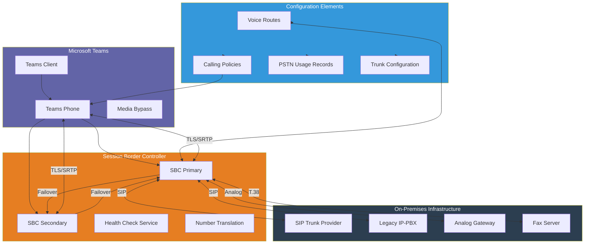
```mermaid
flowchart TB
    subgraph Teams["Microsoft Teams"]
        TeamsClient[Teams Client]
        PhoneSystem[Teams Phone]
        MediaBypass[Media Bypass]
    end

    subgraph SBC["Session Border Controller"]
        SBC1[SBC Primary]
        SBC2[SBC Secondary]
        HealthCheck[Health Check Service]
        Translation[Number Translation]
    end

    subgraph OnPrem["On-Premises Infrastructure"]
        SIPTrunk[SIP Trunk Provider]
        IPPBX[Legacy IP-PBX]
        AnalogGate[Analog Gateway]
        FaxServer[Fax Server]
    end

    subgraph Config["Configuration Elements"]
        VoiceRoute[Voice Routes]
        VoicePolicy[Calling Policies]
        PSTNUsage[PSTN Usage Records]
        TrunkConfig[Trunk Configuration]
    end

    TeamsClient --> PhoneSystem
    PhoneSystem --> SBC1
    PhoneSystem --> SBC2

    SBC1 <-->|TLS/SRTP| PhoneSystem
    SBC2 <-->|TLS/SRTP| PhoneSystem

    SBC1 -->|Failover| SBC2
    SBC2 -->|Failover| SBC1

    SBC1 <-->|SIP| SIPTrunk
    SBC1 <-->|SIP| IPPBX
    SBC1 <-->|Analog| AnalogGate
    SBC1 <-->|T.38| FaxServer

    Config --> VoiceRoute
    Config --> VoicePolicy
    Config --> PSTNUsage
    Config --> TrunkConfig

    VoiceRoute --> SBC1
    VoicePolicy --> PhoneSystem

    style Teams fill:#6264a7,color:#fff
    style SBC fill:#e67e22,color:#fff
    style OnPrem fill:#2c3e50,color:#fff
    style Config fill:#3498db,color:#fff
```

---

## Operator Connect Calling Architecture

Operator Connect connects Teams Phone to participating operators through managed peering, number assignment and Teams voice policies.

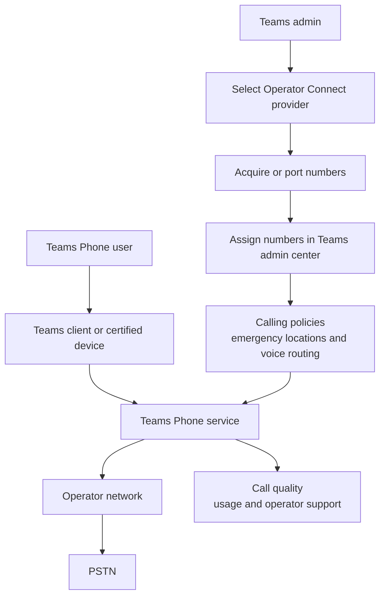
```mermaid
flowchart TB
    OC_Admin["Teams admin"] --> OC_Operator["Select Operator Connect provider"]
    OC_Operator --> OC_Numbers["Acquire or port numbers"]
    OC_Numbers --> OC_Teams["Assign numbers in Teams admin center"]
    OC_Teams --> OC_Policies["Calling policies<br/>emergency locations and voice routing"]
    OC_User["Teams Phone user"] --> OC_Client["Teams client or certified device"]
    OC_Client --> OC_Service["Teams Phone service"]
    OC_Service --> OC_Provider["Operator network"]
    OC_Provider --> OC_PSTN["PSTN"]
    OC_Policies --> OC_Service
    OC_Service --> OC_Reports["Call quality<br/>usage and operator support"]
```

---

## Teams Admin Center Structure

Shows the main components, decisions, and operational flow for teams admin center structure in Microsoft 365 teams and voice work.

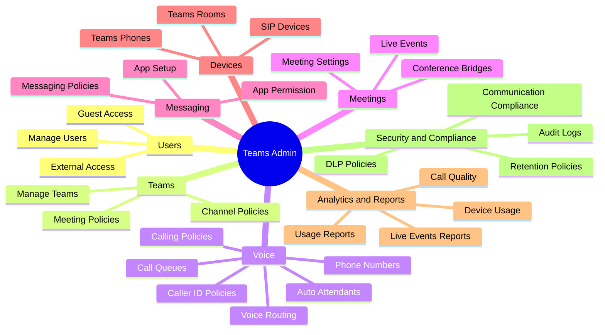
```mermaid
mindmap
  root((Teams Admin))
    Users
      Manage Users
      Guest Access
      External Access
    Teams
      Manage Teams
      Channel Policies
      Meeting Policies
    Voice
      Phone Numbers
      Voice Routing
      Call Queues
      Auto Attendants
      Calling Policies
      Caller ID Policies
    Meetings
      Meeting Settings
      Live Events
      Conference Bridges
    Messaging
      Messaging Policies
      App Permission
      App Setup
    Devices
      Teams Phones
      Teams Rooms
      SIP Devices
    Analytics and Reports
      Usage Reports
      Call Quality
      Live Events Reports
      Device Usage
    Security and Compliance
      DLP Policies
      Retention Policies
      Communication Compliance
      Audit Logs
```

---

## Teams and SharePoint Integration

Shows the main components, decisions, and operational flow for teams and sharepoint integration in Microsoft 365 teams and voice work.

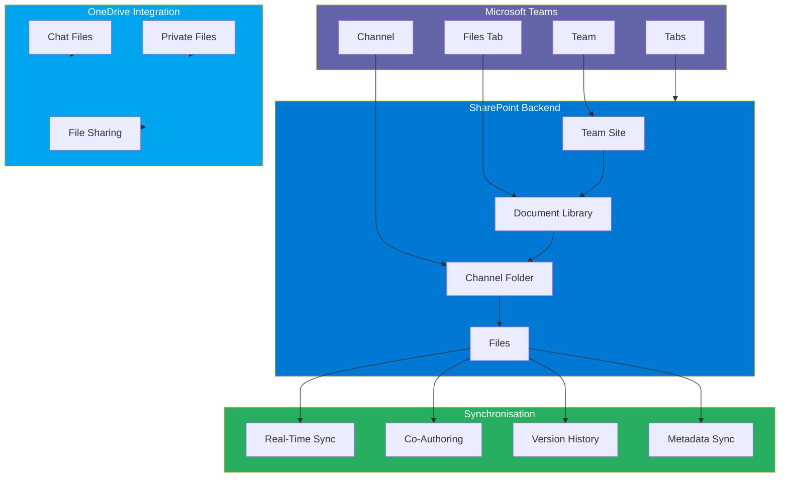
```mermaid
flowchart TB
    subgraph Teams["Microsoft Teams"]
        Team[Team]
        Channel[Channel]
        Tab[Tabs]
        FilesTab[Files Tab]
    end

    subgraph SharePoint["SharePoint Backend"]
        TeamSite[Team Site]
        DocLib[Document Library]
        Folder[Channel Folder]
        Files[Files]
    end

    subgraph OneDrive["OneDrive Integration"]
        ChatFiles[Chat Files]
        PrivateFiles[Private Files]
        Sharing[File Sharing]
    end

    subgraph Sync["Synchronisation"]
        RealTime[Real-Time Sync]
        CoAuthor[Co-Authoring]
        Versioning[Version History]
        Metadata[Metadata Sync]
    end

    Team --> TeamSite
    Channel --> Folder
    FilesTab --> DocLib
    Tab --> SharePoint

    TeamSite --> DocLib
    DocLib --> Folder
    Folder --> Files

    ChatFiles --> OneDrive
    PrivateFiles --> OneDrive
    Sharing --> OneDrive

    Files --> RealTime
    Files --> CoAuthor
    Files --> Versioning
    Files --> Metadata

    style Teams fill:#6264a7,color:#fff
    style SharePoint fill:#0078d4,color:#fff
    style OneDrive fill:#00a4ef,color:#fff
    style Sync fill:#27ae60,color:#fff
```

---

## Teams App Permission Policy

Shows the main components, decisions, and operational flow for teams app permission policy in Microsoft 365 teams and voice work.

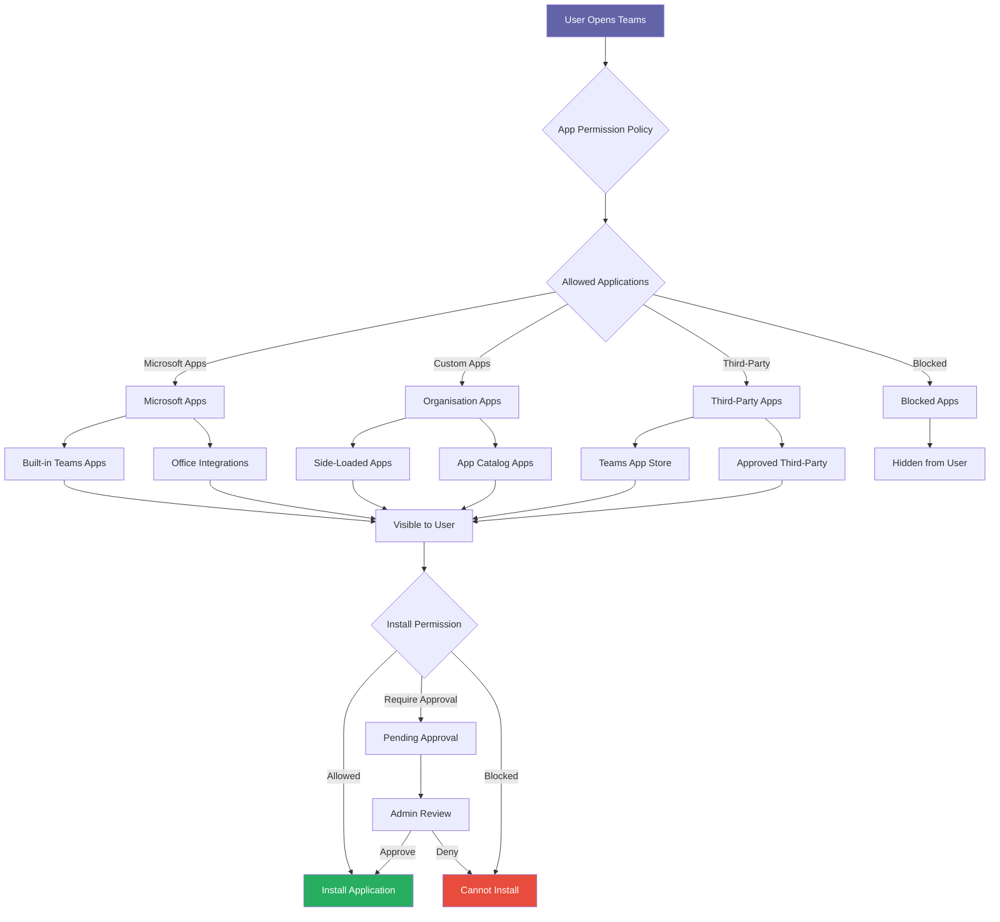
```mermaid
flowchart TD
    User[User Opens Teams] --> CheckPolicy{App Permission Policy}

    CheckPolicy --> AllowedApps{Allowed Applications}

    AllowedApps -->|Microsoft Apps| MsApps[Microsoft Apps]
    AllowedApps -->|Custom Apps| CustomApps[Organisation Apps]
    AllowedApps -->|Third-Party| ThirdParty[Third-Party Apps]
    AllowedApps -->|Blocked| BlockedApps[Blocked Apps]

    MsApps --> TeamsApps[Built-in Teams Apps]
    MsApps --> OfficeApps[Office Integrations]

    CustomApps --> SideLoad[Side-Loaded Apps]
    CustomApps --> AppCatalog[App Catalog Apps]

    ThirdParty --> AppStore[Teams App Store]
    ThirdParty --> ApprovedList[Approved Third-Party]

    BlockedApps --> Hidden[Hidden from User]

    TeamsApps --> UserView[Visible to User]
    OfficeApps --> UserView
    SideLoad --> UserView
    AppCatalog --> UserView
    AppStore --> UserView
    ApprovedList --> UserView

    UserView --> Install{Install Permission}

    Install -->|Allowed| InstallApp[Install Application]
    Install -->|Require Approval| Pending[Pending Approval]
    Install -->|Blocked| CantInstall[Cannot Install]

    Pending --> AdminReview[Admin Review]
    AdminReview -->|Approve| InstallApp
    AdminReview -->|Deny| CantInstall

    style User fill:#6264a7,color:#fff
    style InstallApp fill:#27ae60,color:#fff
    style CantInstall fill:#e74c3c,color:#fff
```

---

## Teams Architecture Overview

Shows the main components, decisions, and operational flow for teams architecture overview in Microsoft 365 teams and voice work.

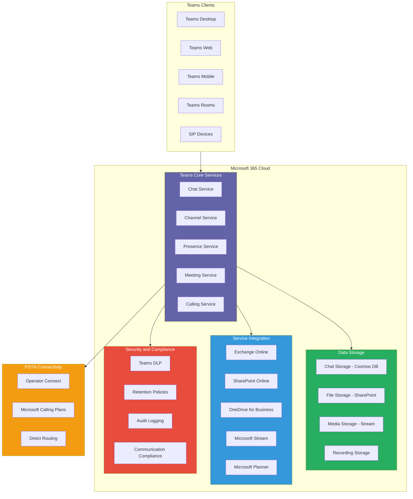
```mermaid
flowchart TB
    subgraph M365["Microsoft 365 Cloud"]
        direction TB

        subgraph TeamsCore["Teams Core Services"]
            ChatSvc[Chat Service]
            ChannelSvc[Channel Service]
            PresenceSvc[Presence Service]
            MeetingSvc[Meeting Service]
            CallingSvc[Calling Service]
        end

        subgraph Storage["Data Storage"]
            ChatStore[Chat Storage - Cosmos DB]
            FileStore[File Storage - SharePoint]
            MediaStore[Media Storage - Stream]
            RecStore[Recording Storage]
        end

        subgraph Integration["Service Integration"]
            Exchange[Exchange Online]
            SharePoint[SharePoint Online]
            OneDrive[OneDrive for Business]
            Stream[Microsoft Stream]
            Planner[Microsoft Planner]
        end

        subgraph Security["Security and Compliance"]
            TeamsDLP[Teams DLP]
            TeamsRetention[Retention Policies]
            TeamsAudit[Audit Logging]
            TeamsCompliance[Communication Compliance]
        end
    end

    subgraph Clients["Teams Clients"]
        Desktop[Teams Desktop]
        Web[Teams Web]
        Mobile[Teams Mobile]
        Rooms[Teams Rooms]
        SIP[SIP Devices]
    end

    subgraph PSTN["PSTN Connectivity"]
        OperatorDirect[Operator Connect]
        CallingPlan[Microsoft Calling Plans]
        DirectRouting[Direct Routing]
    end

    Clients --> TeamsCore
    TeamsCore --> Storage
    TeamsCore --> Integration
    TeamsCore --> Security
    TeamsCore --> PSTN

    style TeamsCore fill:#6264a7,color:#fff
    style Storage fill:#27ae60,color:#fff
    style Integration fill:#3498db,color:#fff
    style Security fill:#e74c3c,color:#fff
    style PSTN fill:#f39c12,color:#fff
```

---

## Teams Call Quality Dashboard

Teams call quality troubleshooting works best when CQD and Call Analytics data are mapped to network, device, client and service actions.

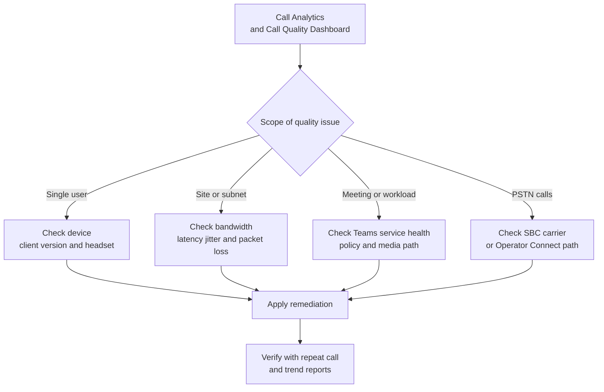
```mermaid
flowchart TB
    TCQ_Signal["Call Analytics<br/>and Call Quality Dashboard"] --> TCQ_Scope{"Scope of quality issue"}
    TCQ_Scope -->|"Single user"| TCQ_User["Check device<br/>client version and headset"]
    TCQ_Scope -->|"Site or subnet"| TCQ_Network["Check bandwidth<br/>latency jitter and packet loss"]
    TCQ_Scope -->|"Meeting or workload"| TCQ_Service["Check Teams service health<br/>policy and media path"]
    TCQ_Scope -->|"PSTN calls"| TCQ_Voice["Check SBC carrier<br/>or Operator Connect path"]
    TCQ_User --> TCQ_Fix["Apply remediation"]
    TCQ_Network --> TCQ_Fix
    TCQ_Service --> TCQ_Fix
    TCQ_Voice --> TCQ_Fix
    TCQ_Fix --> TCQ_Verify["Verify with repeat call<br/>and trend reports"]
```

---

## Teams Call Routing Options

Shows the main components, decisions, and operational flow for teams call routing options in Microsoft 365 teams and voice work.

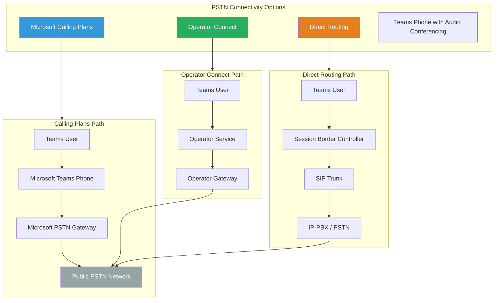
```mermaid
flowchart TB
    subgraph PSTNOptions["PSTN Connectivity Options"]
        CallingPlan[Microsoft Calling Plans]
        OperatorConnect[Operator Connect]
        DirectRouting[Direct Routing]
        TeamsPhone[Teams Phone with Audio Conferencing]
    end

    subgraph CallingPlanPath["Calling Plans Path"]
        User1[Teams User]
        CPService[Microsoft Teams Phone]
        CPPSTN[Microsoft PSTN Gateway]
        PublicPSTN[Public PSTN Network]
    end

    subgraph OperatorPath["Operator Connect Path"]
        User2[Teams User]
        OCService[Operator Service]
        OCPSTN[Operator Gateway]
    end

    subgraph DirectPath["Direct Routing Path"]
        User3[Teams User]
        SBC[Session Border Controller]
        Trunk[SIP Trunk]
        IPPBX[IP-PBX / PSTN]
    end

    CallingPlan --> CallingPlanPath
    OperatorConnect --> OperatorPath
    DirectRouting --> DirectPath

    User1 --> CPService
    CPService --> CPPSTN
    CPPSTN --> PublicPSTN

    User2 --> OCService
    OCService --> OCPSTN
    OCPSTN --> PublicPSTN

    User3 --> SBC
    SBC --> Trunk
    Trunk --> IPPBX
    IPPBX --> PublicPSTN

    style CallingPlan fill:#3498db,color:#fff
    style OperatorConnect fill:#27ae60,color:#fff
    style DirectRouting fill:#e67e22,color:#fff
    style PublicPSTN fill:#95a5a6,color:#fff
```

---

## Teams Channel Model: Standard, Private and Shared Channels

Teams channel type determines membership, SharePoint storage, external collaboration pattern and governance controls.

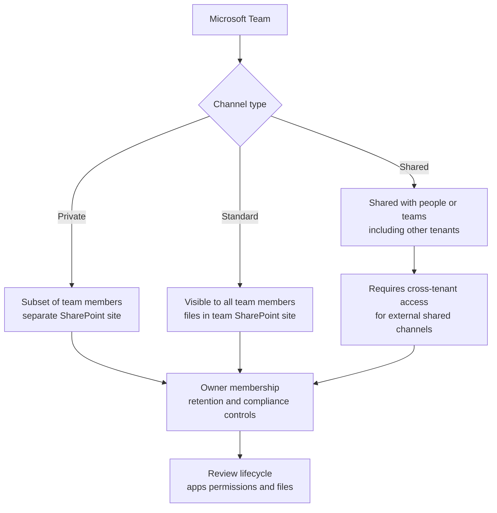
```mermaid
flowchart TB
    TCM_Team["Microsoft Team"] --> TCM_Type{"Channel type"}
    TCM_Type -->|"Standard"| TCM_Standard["Visible to all team members<br/>files in team SharePoint site"]
    TCM_Type -->|"Private"| TCM_Private["Subset of team members<br/>separate SharePoint site"]
    TCM_Type -->|"Shared"| TCM_Shared["Shared with people or teams<br/>including other tenants"]
    TCM_Shared --> TCM_CTA["Requires cross-tenant access<br/>for external shared channels"]
    TCM_Private --> TCM_Govern["Owner membership<br/>retention and compliance controls"]
    TCM_Standard --> TCM_Govern
    TCM_CTA --> TCM_Govern
    TCM_Govern --> TCM_Review["Review lifecycle<br/>apps permissions and files"]
```

---

## Teams Chat and Channel Architecture

Shows the main components, decisions, and operational flow for teams chat and channel architecture in Microsoft 365 teams and voice work.

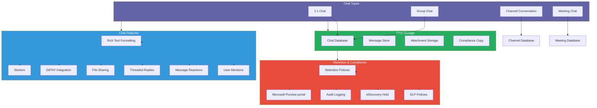
```mermaid
flowchart TB
    subgraph ChatTypes["Chat Types"]
        OneOnOne[1:1 Chat]
        GroupChat[Group Chat]
        ChannelChat[Channel Conversation]
        MeetingChat[Meeting Chat]
    end

    subgraph Storage["Chat Storage"]
        ChatDB[Chat Database]
        MessageStore[Message Store]
        AttachmentStore[Attachment Storage]
        ComplianceCopy[Compliance Copy]
    end

    subgraph Features["Chat Features"]
        RichText[Rich Text Formatting]
        Mentions[User Mentions]
        Reactions[Message Reactions]
        Replies[Threaded Replies]
        Files[File Sharing]
        Giphy[GIPHY Integration]
        Stickers[Stickers]
    end

    subgraph Retention["Retention & Compliance"]
        RetentionPolicies[Retention Policies]
        DLPPolicies[DLP Policies]
        eDiscovery[eDiscovery Hold]
        AuditLog[Audit Logging]
        PurviewPortal[Microsoft Purview portal]
    end

    ChatTypes --> Storage
    ChatTypes --> Features

    OneOnOne --> ChatDB
    GroupChat --> ChatDB
    ChannelChat --> ChannelDB[Channel Database]
    MeetingChat --> MeetingDB[Meeting Database]

    Features --> RichText
    Features --> Mentions
    Features --> Reactions
    Features --> Replies
    Features --> Files
    Features --> Giphy
    Features --> Stickers

    Storage --> Retention
    Retention --> RetentionPolicies
    Retention --> DLPPolicies
    Retention --> eDiscovery
    Retention --> AuditLog
    Retention --> PurviewPortal

    style ChatTypes fill:#6264a7,color:#fff
    style Storage fill:#27ae60,color:#fff
    style Features fill:#3498db,color:#fff
    style Retention fill:#e74c3c,color:#fff
```

---

## Teams Compliance Features

Shows the main components, decisions, and operational flow for teams compliance features in Microsoft 365 teams and voice work.

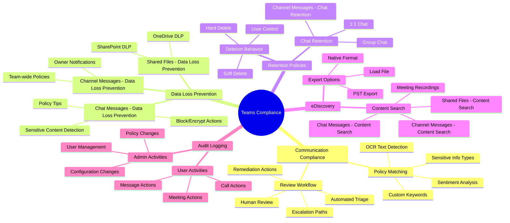
```mermaid
mindmap
  root((Teams Compliance))
    Communication Compliance
      Policy Matching
        Sensitive Info Types
        Custom Keywords
        OCR Text Detection
        Sentiment Analysis
      Review Workflow
        Automated Triage
        Human Review
        Escalation Paths
        Remediation Actions
    Data Loss Prevention
      Chat Messages - Data Loss Prevention
        Sensitive Content Detection
        Policy Tips
        Block/Encrypt Actions
      Channel Messages - Data Loss Prevention
        Team-wide Policies
        Owner Notifications
      Shared Files - Data Loss Prevention
        SharePoint DLP
        OneDrive DLP
    Retention Policies
      Chat Retention
        1:1 Chat
        Group Chat
        Channel Messages - Chat Retention
      Deletion Behavior
        Soft Delete
        Hard Delete
        User Control
    eDiscovery
      Content Search
        Chat Messages - Content Search
        Channel Messages - Content Search
        Shared Files - Content Search
        Meeting Recordings
      Export Options
        Native Format
        Load File
        PST Export
    Audit Logging
      User Activities
        Message Actions
        Call Actions
        Meeting Actions
      Admin Activities
        Policy Changes
        Configuration Changes
        User Management
```

---

## Teams Emergency Calling

Shows the main components, decisions, and operational flow for teams emergency calling in Microsoft 365 teams and voice work.

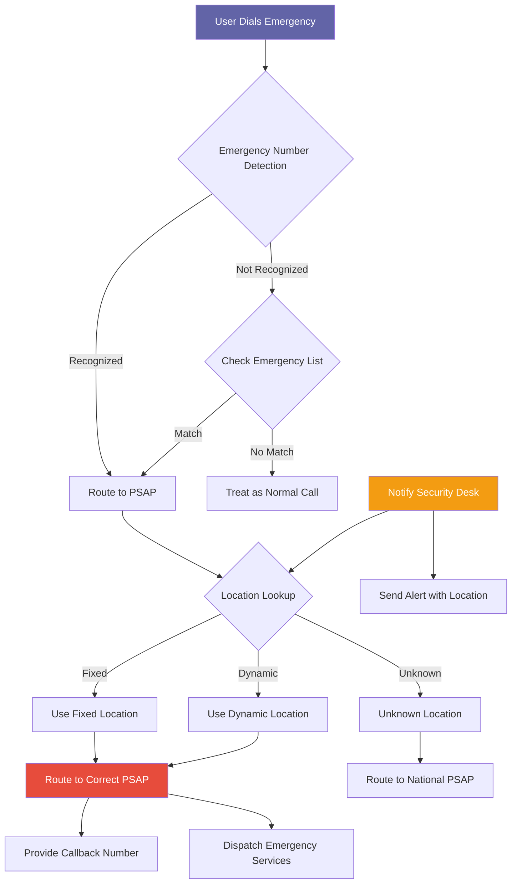
```mermaid
flowchart TD
    User[User Dials Emergency] --> Detection{Emergency Number Detection}

    Detection -->|Recognized| Route[Route to PSAP]
    Detection -->|Not Recognized| CheckList{Check Emergency List}

    CheckList -->|Match| Route
    CheckList -->|No Match| NormalCall[Treat as Normal Call]

    Route --> Location{Location Lookup}

    Location -->|Fixed| FixedLocation[Use Fixed Location]
    Location -->|Dynamic| DynamicLocation[Use Dynamic Location]
    Location -->|Unknown| UnknownLocation[Unknown Location]

    FixedLocation --> PSAP[Route to Correct PSAP]
    DynamicLocation --> PSAP
    UnknownLocation --> NationalPSAP[Route to National PSAP]

    PSAP --> Callback[Provide Callback Number]
    PSAP --> Dispatch[Dispatch Emergency Services]

    Notification[Notify Security Desk] --> Location
    Notification --> Alert[Send Alert with Location]

    style User fill:#6264a7,color:#fff
    style PSAP fill:#e74c3c,color:#fff
    style Notification fill:#f39c12,color:#fff
```

---

## Teams Governance Framework

Shows the main components, decisions, and operational flow for teams governance framework in Microsoft 365 teams and voice work.

```mermaid
flowchart TB
    subgraph Policies["Teams Policies"]
        MessagingPolicy[Messaging Policy]
        MeetingPolicy[Meeting Policy]
        CallingPolicy[Calling Policy]
        AppPermissionPolicy[App Permission Policy]
        ExternalAccessPolicy[External Access Policy]
    end

    subgraph Lifecycle["Team Lifecycle"]
        Creation[Team Creation]
        Naming[Naming Convention]
        Classification[Data Classification]
        Expiration[Expiration Policy]
        Archival[Archival Process]
        Deletion[Deletion Process]
    end

    subgraph Ownership["Ownership & Roles"]
        Owners[Team Owners]
        Members[Team Members]
        Guests[Guest Users]
        Admins[Teams Admins]
    end

    subgraph Compliance["Compliance & Security"]
        DLP[DLP Policies]
        Retention[Retention Policies]
        Audit[Audit Logging]
        eDiscovery[eDiscovery]
        CommunicationCompliance[Communication Compliance]
    end

    Policies --> MessagingPolicy
    Policies --> MeetingPolicy
    Policies --> CallingPolicy
    Policies --> AppPermissionPolicy
    Policies --> ExternalAccessPolicy

    Lifecycle --> Creation
    Lifecycle --> Naming
    Lifecycle --> Classification
    Lifecycle --> Expiration
    Lifecycle --> Archival
    Lifecycle --> Deletion

    Ownership --> Owners
    Ownership --> Members
    Ownership --> Guests
    Ownership --> Admins

    Compliance --> DLP
    Compliance --> Retention
    Compliance --> Audit
    Compliance --> eDiscovery
    Compliance --> CommunicationCompliance

    style Policies fill:#6264a7,color:#fff
    style Lifecycle fill:#3498db,color:#fff
    style Ownership fill:#27ae60,color:#fff
    style Compliance fill:#e74c3c,color:#fff
```

---

## Teams Guest Access vs External Access

Shows the main components, decisions, and operational flow for teams guest access vs external access in Microsoft 365 teams and voice work.

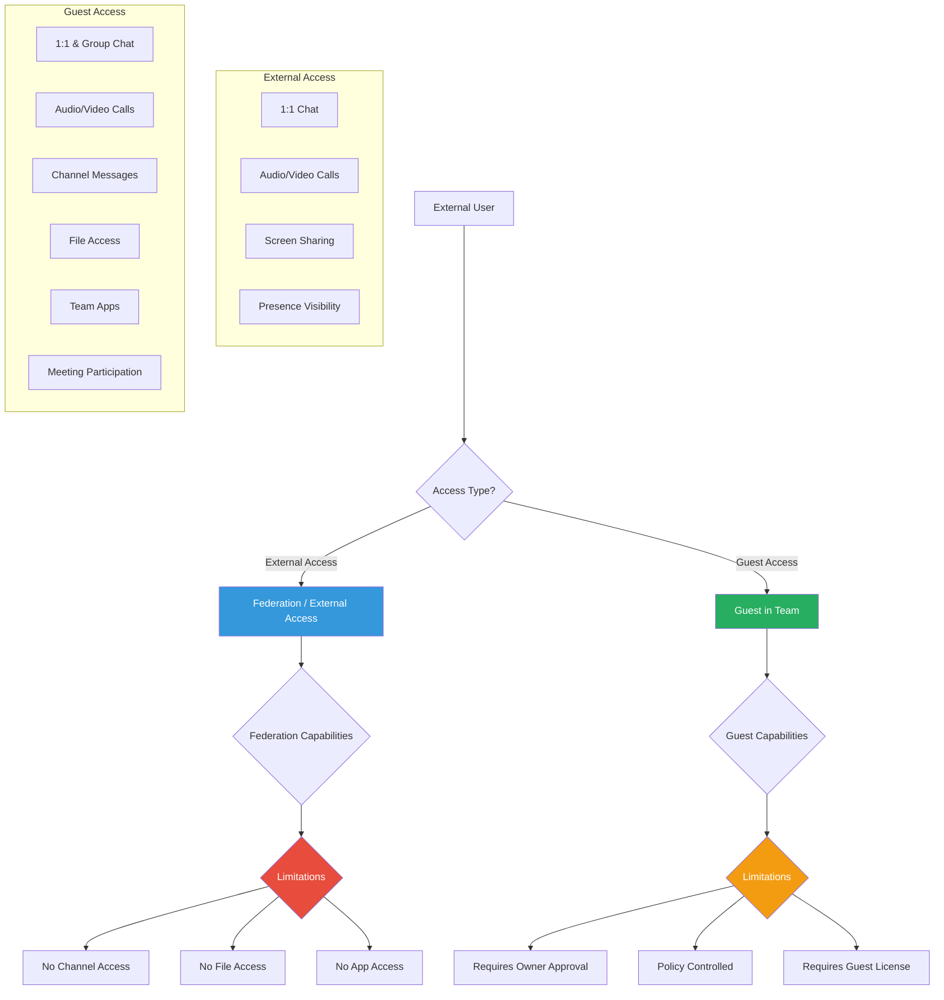
```mermaid
flowchart TD
    User[External User] --> Type{Access Type?}

    Type -->|External Access| Federate[Federation / External Access]
    Type -->|Guest Access| Guest[Guest in Team]

    Federate --> Capabilities1{Federation Capabilities}
    Guest --> Capabilities2{Guest Capabilities}

    subgraph ExternalAccessCapabilities["External Access"]
        Chat1[1:1 Chat]
        Call1[Audio/Video Calls]
        ScreenShare1[Screen Sharing]
        Presence1[Presence Visibility]
    end

    subgraph GuestAccessCapabilities["Guest Access"]
        Chat2[1:1 & Group Chat]
        Call2[Audio/Video Calls]
        ChannelMsg[Channel Messages]
        Files2[File Access]
        Apps2[Team Apps]
        Meeting2[Meeting Participation]
    end

    Capabilities1 --> Limitations1{Limitations}
    Capabilities2 --> Limitations2{Limitations}

    Limitations1 --> NoChannel[No Channel Access]
    Limitations1 --> NoFiles[No File Access]
    Limitations1 --> NoApps[No App Access]

    Limitations2 --> OwnerRequired[Requires Owner Approval]
    Limitations2 --> PolicyControlled[Policy Controlled]
    Limitations2 --> LicenseRequired[Requires Guest License]

    style Federate fill:#3498db,color:#fff
    style Guest fill:#27ae60,color:#fff
    style Limitations1 fill:#e74c3c,color:#fff
    style Limitations2 fill:#f39c12,color:#fff
```

---

## Teams Town Hall and Live Event Architecture

Shows how Teams town halls, webinars and legacy live events map to organiser roles, production flow, delivery and reporting.

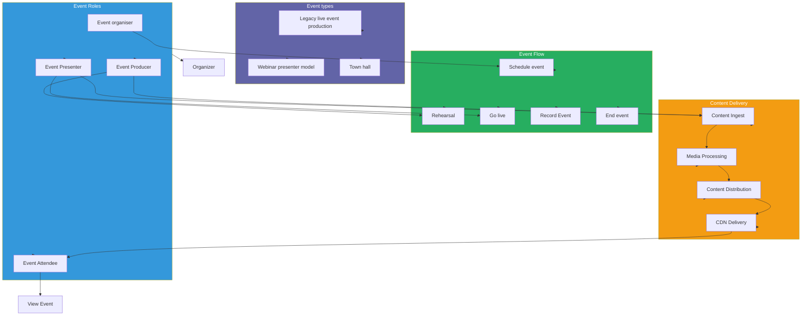
```mermaid
flowchart TB
    subgraph EventTypes["Event types"]
        ProducerMode[Legacy live event production]
        PresenterMode[Webinar presenter model]
        TownHall[Town hall]
    end

    subgraph Roles["Event Roles"]
        Organiser[Event organiser]
        Producer[Event Producer]
        Presenter[Event Presenter]
        Attendee[Event Attendee]
    end

    subgraph Flow["Event Flow"]
        Schedule[Schedule event]
        Rehearse[Rehearsal]
        GoLive[Go live]
        Record[Record Event]
        End[End event]
    end

    subgraph Delivery["Content Delivery"]
        Ingest[Content Ingest]
        Process[Media Processing]
        Distribute[Content Distribution]
        CDN[CDN Delivery]
    end

    EventTypes --> ProducerMode
    EventTypes --> PresenterMode
    EventTypes --> TownHall

    Roles --> Organizer
    Roles --> Producer
    Roles --> Presenter
    Roles --> Attendee

    Flow --> Schedule
    Flow --> Rehearse
    Flow --> GoLive
    Flow --> Record
    Flow --> End

    Delivery --> Ingest
    Delivery --> Process
    Delivery --> Distribute
    Delivery --> CDN

    Producer --> Ingest
    Presenter --> Ingest
    Ingest --> Process
    Process --> Distribute
    Distribute --> CDN
    CDN --> Attendee

    Organiser --> Schedule
    Producer --> Rehearse
    Presenter --> GoLive
    Attendee --> View[View Event]

    style EventTypes fill:#6264a7,color:#fff
    style Roles fill:#3498db,color:#fff
    style Flow fill:#27ae60,color:#fff
    style Delivery fill:#f39c12,color:#fff
```

---

## Teams Media Stack

This diagram separates client media processing, transport selection, Teams media cloud services and optimisation signals used for call-quality operations.

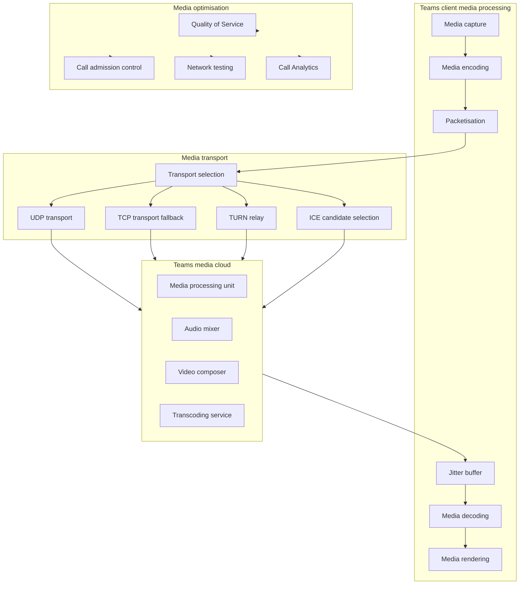
```mermaid
flowchart TB
    subgraph ClientMedia["Teams client media processing"]
        Capture["Media capture"]
        Encode["Media encoding"]
        Packetize["Packetisation"]
        JitterBuffer["Jitter buffer"]
        Decode["Media decoding"]
        Render["Media rendering"]
    end

    subgraph MediaTransport["Media transport"]
        TransportSelect["Transport selection"]
        UDP["UDP transport"]
        TCP["TCP transport fallback"]
        TURN["TURN relay"]
        ICE["ICE candidate selection"]
    end

    subgraph TeamsMediaCloud["Teams media cloud"]
        MCU["Media processing unit"]
        Mixer["Audio mixer"]
        Composer["Video composer"]
        Transcoder["Transcoding service"]
    end

    subgraph MediaOptimisation["Media optimisation"]
        QoS["Quality of Service"]
        CAC["Call admission control"]
        NetworkTest["Network testing"]
        CallAnalytics["Call Analytics"]
    end

    Capture --> Encode
    Encode --> Packetize
    Packetize --> TransportSelect
    TransportSelect --> UDP
    TransportSelect --> TCP
    TransportSelect --> TURN
    TransportSelect --> ICE
    UDP --> TeamsMediaCloud
    TCP --> TeamsMediaCloud
    TURN --> TeamsMediaCloud
    ICE --> TeamsMediaCloud
    TeamsMediaCloud --> JitterBuffer
    JitterBuffer --> Decode
    Decode --> Render
    MediaOptimisation --> QoS
    MediaOptimisation --> CAC
    MediaOptimisation --> NetworkTest
    MediaOptimisation --> CallAnalytics
```

---

## Teams Meeting Lifecycle and Policy Controls

Shows how a Teams meeting moves from scheduling to join, lobby, media, sharing, recording, and post-meeting artefacts, with meeting policies controlling each stage.

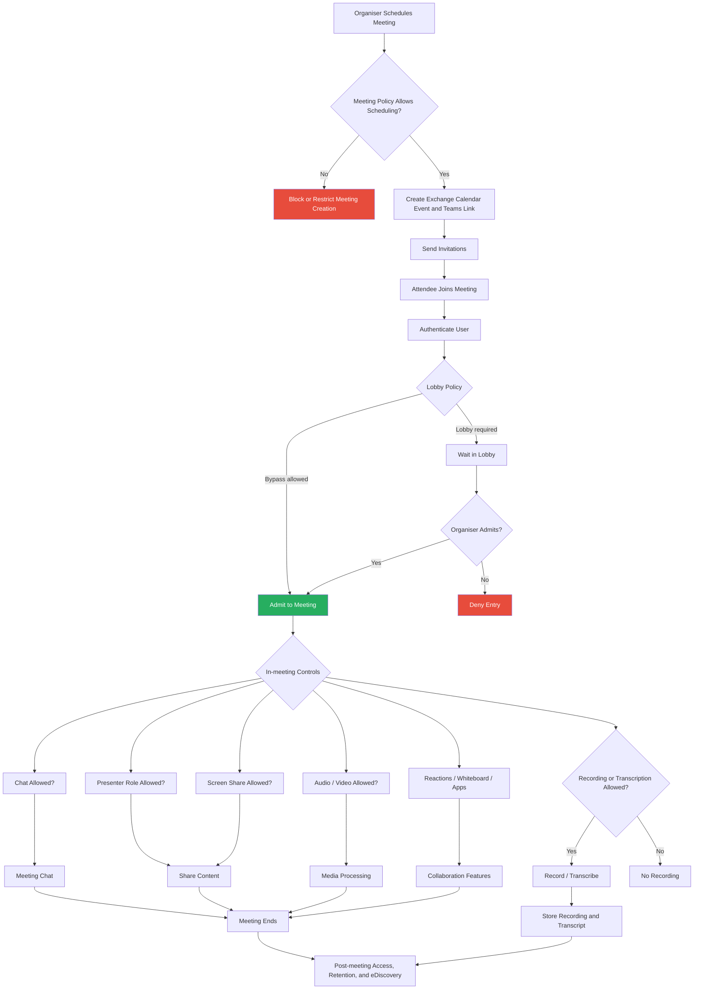
```mermaid
flowchart TB
    Schedule[Organiser Schedules Meeting] --> PolicyCheck{Meeting Policy Allows Scheduling?}
    PolicyCheck -->|No| BlockSchedule[Block or Restrict Meeting Creation]
    PolicyCheck -->|Yes| Calendar[Create Exchange Calendar Event and Teams Link]

    Calendar --> Invite[Send Invitations]
    Invite --> Join[Attendee Joins Meeting]
    Join --> Auth[Authenticate User]
    Auth --> Lobby{Lobby Policy}

    Lobby -->|Bypass allowed| Admit[Admit to Meeting]
    Lobby -->|Lobby required| Wait[Wait in Lobby]
    Wait --> OrganiserDecision{Organiser Admits?}
    OrganiserDecision -->|Yes| Admit
    OrganiserDecision -->|No| Deny[Deny Entry]

    Admit --> InMeeting{In-meeting Controls}
    InMeeting --> Chat[Chat Allowed?]
    InMeeting --> Present[Presenter Role Allowed?]
    InMeeting --> Screen[Screen Share Allowed?]
    InMeeting --> AudioVideo[Audio / Video Allowed?]
    InMeeting --> Reactions[Reactions / Whiteboard / Apps]

    Present --> ShareContent[Share Content]
    Screen --> ShareContent
    AudioVideo --> Media[Media Processing]
    Chat --> Conversation[Meeting Chat]
    Reactions --> Collaboration[Collaboration Features]

    InMeeting --> Recording{Recording or Transcription Allowed?}
    Recording -->|Yes| Capture[Record / Transcribe]
    Recording -->|No| NoCapture[No Recording]

    Capture --> Store[Store Recording and Transcript]
    Media --> End[Meeting Ends]
    Conversation --> End
    Collaboration --> End
    ShareContent --> End
    Store --> PostMeeting[Post-meeting Access, Retention, and eDiscovery]
    End --> PostMeeting

    style Admit fill:#27ae60,color:#fff
    style Deny fill:#e74c3c,color:#fff
    style BlockSchedule fill:#e74c3c,color:#fff
```

### Notes
Meeting policies affect scheduling, lobby behaviour, presenters, chat, screen sharing, recording, transcription, and collaboration features. The meeting lifecycle and policy model are best treated as one governance surface.

---

## Teams Network Requirements

Shows the main components, decisions, and operational flow for teams network requirements in Microsoft 365 teams and voice work.

```mermaid
flowchart TB
    subgraph Endpoints["Teams Endpoints"]
        Client[Teams Client]
        Subnet[Client Subnet]
    end

    subgraph Connectivity["Connectivity Requirements"]
        Identity[Identity Services]
        Portal[Office Portal]
        ConnectivitySignaling[Signaling]
        Media[Media Traffic]
        TURN[TURN Servers]
    end

    subgraph QoS["Quality of Service"]
        Audio[Audio Traffic - DSCP 46]
        Video[Video Traffic - DSCP 34]
        QoSScreenShare[Screen Share - DSCP 24]
        QoSSignaling[SIP Signaling - DSCP 24]
    end

    subgraph Bandwidth["Bandwidth Requirements"]
        AudioCall[Audio Call - 30 Kbps]
        VideoCall[Video Call - 1.5 Mbps]
        HDTV[HDTV - 2.5 Mbps]
        BandwidthScreenShare[Screen Share - 7.5 Mbps]
        GroupCall[Group Call - 500 Kbps/user]
    end

    Endpoints --> Client
    Client --> Subnet

    Subnet --> Identity
    Subnet --> Portal
    Subnet --> ConnectivitySignaling
    Subnet --> Media
    Subnet --> TURN

    QoS --> Audio
    QoS --> Video
    QoS --> QoSScreenShare
    QoS --> QoSSignaling

    Bandwidth --> AudioCall
    Bandwidth --> VideoCall
    Bandwidth --> HDTV
    Bandwidth --> BandwidthScreenShare
    Bandwidth --> GroupCall

    style Endpoints fill:#6264a7,color:#fff
    style Connectivity fill:#3498db,color:#fff
    style QoS fill:#27ae60,color:#fff
    style Bandwidth fill:#f39c12,color:#fff
```

---

## Teams Phone Features

Shows the core Teams Phone capabilities admins configure and monitor for PSTN calling, call handling and quality reporting.

```mermaid
flowchart TB
    subgraph CoreFeatures["Core Teams Phone features"]
        PSTNCalling[PSTN Calling]
        CallQueues[Call Queues]
        AutoAttendant[Auto Attendant]
        Voicemail[Cloud Voicemail]
    end

    subgraph CallHandling["Call Handling"]
        Transfer[Call Transfer]
        Forward[Call Forwarding]
        Simultaneous[Simultaneous Ring]
        Delegate[Delegated Calling]
        GroupCall[Group Call Pickup]
    end

    subgraph AdvancedFeatures["Advanced Features"]
        CAC[Call Admission Control]
        MediaBypass[Media Bypass]
        CallPark[Call Park]
        CallJoin[Call Join]
        TeamCall[Team Calling]
    end

    subgraph Reporting["Reporting & Analytics"]
        CallQuality[Call Quality Dashboard]
        CallRecords[Call Records]
        UsageReports[Usage Reports]
        PSTNReports[PSTN Reports]
    end

    CoreFeatures --> PSTNCalling
    CoreFeatures --> CallQueues
    CoreFeatures --> AutoAttendant
    CoreFeatures --> Voicemail

    CallHandling --> Transfer
    CallHandling --> Forward
    CallHandling --> Simultaneous
    CallHandling --> Delegate
    CallHandling --> GroupCall

    AdvancedFeatures --> CAC
    AdvancedFeatures --> MediaBypass
    AdvancedFeatures --> CallPark
    AdvancedFeatures --> CallJoin
    AdvancedFeatures --> TeamCall

    Reporting --> CallQuality
    Reporting --> CallRecords
    Reporting --> UsageReports
    Reporting --> PSTNReports

    style CoreFeatures fill:#6264a7,color:#fff
    style CallHandling fill:#27ae60,color:#fff
    style AdvancedFeatures fill:#3498db,color:#fff
    style Reporting fill:#f39c12,color:#fff
```

---

## Teams Premium Events Governance

Teams Premium event governance brings organiser permissions, webinar or town hall controls, branding, protection and reporting into one operating model.

```mermaid
flowchart TB
    TPE_Request["Event request"] --> TPE_Type{"Event type"}
    TPE_Type -->|"Webinar"| TPE_Webinar["Registration<br/>presenters and attendee controls"]
    TPE_Type -->|"Town hall"| TPE_TownHall["Large audience<br/>production and moderation controls"]
    TPE_Webinar --> TPE_Premium["Teams Premium features<br/>branding protection and analytics"]
    TPE_TownHall --> TPE_Premium
    TPE_Premium --> TPE_Policy["Meeting and event policies"]
    TPE_Policy --> TPE_Run["Run event"]
    TPE_Run --> TPE_Report["Attendance engagement<br/>quality and compliance reports"]
    TPE_Report --> TPE_Review["Post-event review<br/>template and policy updates"]
```

---

## Teams Rooms Deployment

Shows the main components, decisions, and operational flow for teams rooms deployment in Microsoft 365 teams and voice work.

```mermaid
flowchart TB
    subgraph RoomTypes["Teams Rooms Types"]
        AndroidRooms[Teams Rooms on Android]
        WindowsRooms[Teams Rooms on Windows]
        SurfaceHub[Surface Hub Integration]
        SIPGateway[SIP Gateway Mode]
    end

    subgraph Components["Room Components"]
        Console[Teams Rooms Console]
        TouchController[Touch Controller]
        Camera[PTZ Camera]
        Audio[Audio System]
        Display[Display/Monitor]
        Compute[Compute Unit]
    end

    subgraph Deployment["Deployment Steps"]
        Plan[Room Planning]
        Provision[Device Provisioning]
        Configure[Room Configuration]
        Test[Testing & Validation]
        Train[User Training]
    end

    subgraph Management["Ongoing Management"]
        AdminCenter[Teams Admin Center]
        RemoteMgmt[Remote Management]
        Updates[Firmware Updates]
        Monitoring[Room Monitoring]
        Analytics[Usage Analytics]
    end

    RoomTypes --> AndroidRooms
    RoomTypes --> WindowsRooms
    RoomTypes --> SurfaceHub
    RoomTypes --> SIPGateway

    Components --> Console
    Components --> TouchController
    Components --> Camera
    Components --> Audio
    Components --> Display
    Components --> Compute

    Deployment --> Plan
    Deployment --> Provision
    Deployment --> Configure
    Deployment --> Test
    Deployment --> Train

    Management --> AdminCenter
    Management --> RemoteMgmt
    Management --> Updates
    Management --> Monitoring
    Management --> Analytics

    style RoomTypes fill:#6264a7,color:#fff
    style Components fill:#3498db,color:#fff
    style Deployment fill:#27ae60,color:#fff
    style Management fill:#f39c12,color:#fff
```

---

## Teams Upgrade Paths

Shows the main components, decisions, and operational flow for teams upgrade paths in Microsoft 365 teams and voice work.

```mermaid
flowchart TB
    subgraph Legacy["Legacy Platforms"]
        Skype4B[Skype for Business]
        Lync[Lync Server]
        OnPrem[On-Premises Deployment]
    end

    subgraph Coexistence["Coexistence Modes"]
        Islands[Islands Mode]
        SfBOnly[Skype for Business Only]
        TeamsOnly[Teams Only]
        SfBWithTeams[SfB with Teams Collab]
        TeamsWithSfB[Teams with SfB Messaging]
    end

    subgraph Migration["Migration Paths"]
        Hybrid[Hybrid Deployment]
        DirectUpgrade[Direct Upgrade]
        Sidestep[Sidestep Migration]
    end

    subgraph Target["Target State"]
        TeamsCloud["Teams (Cloud)"]
        PhoneSystem["Teams Phone"]
        AudioConferencing["Audio Conferencing"]
    end

    Legacy --> Skype4B
    Legacy --> Lync
    Legacy --> OnPrem

    Skype4B --> Coexistence
    Lync --> Coexistence
    OnPrem --> Coexistence

    Coexistence --> Islands
    Coexistence --> SfBOnly
    Coexistence --> TeamsOnly
    Coexistence --> SfBWithTeams
    Coexistence --> TeamsWithSfB

    Islands --> Migration
    SfBOnly --> Migration
    SfBWithTeams --> Migration
    TeamsWithSfB --> Migration

    Migration --> Hybrid
    Migration --> DirectUpgrade
    Migration --> Sidestep

    Hybrid --> TeamsCloud
    DirectUpgrade --> TeamsCloud
    Sidestep --> TeamsCloud

    TeamsCloud --> PhoneSystem
    TeamsCloud --> AudioConferencing

    style Legacy fill:#95a5a6,color:#fff
    style Coexistence fill:#f39c12,color:#fff
    style Migration fill:#3498db,color:#fff
    style Target fill:#27ae60,color:#fff
```

---

## Teams Voice Routing Configuration

Shows the main components, decisions, and operational flow for teams voice routing configuration in Microsoft 365 teams and voice work.

```mermaid
flowchart TB
    subgraph Components["Voice Routing Components"]
        VoiceRoute[Voice Route]
        PSTNUsage[PSTN Usage Record]
        VoicePolicy[Voice Routing Policy]
        Trunk[Voice Trunk]
    end

    subgraph RouteConfig["Route Configuration"]
        Pattern[Number Pattern]
        Gateway[SBC/Gateway]
        Priority[Route Priority]
    end

    subgraph PolicyConfig["Policy Configuration"]
        Usage1[PSTN Usage 1]
        Usage2[PSTN Usage 2]
        Usage3[PSTN Usage 3]
    end

    subgraph Assignment["Policy Assignment"]
        Global[Global Policy]
        User[User Policy]
        Group[Group Policy]
    end

    Components --> VoiceRoute
    Components --> PSTNUsage
    Components --> VoicePolicy
    Components --> Trunk

    VoiceRoute --> Pattern
    VoiceRoute --> Gateway
    VoiceRoute --> Priority

    VoicePolicy --> Usage1
    VoicePolicy --> Usage2
    VoicePolicy --> Usage3

    Usage1 --> VoiceRoute
    Usage2 --> VoiceRoute
    Usage3 --> VoiceRoute

    Assignment --> Global
    Assignment --> User
    Assignment --> Group

    Global --> AllUsers[All Users]
    User --> SpecificUser[Specific User]
    Group --> GroupUsers[Group Members]

    style Components fill:#6264a7,color:#fff
    style RouteConfig fill:#3498db,color:#fff
    style PolicyConfig fill:#27ae60,color:#fff
    style Assignment fill:#f39c12,color:#fff
```
