# Troubleshooting

Troubleshooting diagrams for Microsoft 365 admins. This file contains 11 topics covering support escalation and targeted diagnostic flows for identity, Exchange, Intune, SharePoint, Teams, DLP and Copilot exposure issues.

## Contents

- [Troubleshooting and Support Chain](#troubleshooting-and-support-chain)
- [Troubleshooting Conditional Access Sign-in Failures](#troubleshooting-conditional-access-sign-in-failures)
- [Troubleshooting Copilot Content Exposure](#troubleshooting-copilot-content-exposure)
- [Troubleshooting DLP False Positives](#troubleshooting-dlp-false-positives)
- [Troubleshooting Teams Call Quality](#troubleshooting-teams-call-quality)
- [Troubleshooting: Microsoft Entra Connect Sync Errors](#troubleshooting-microsoft-entra-connect-sync-errors)
- [Troubleshooting: Exchange NDRs and Mail Routing](#troubleshooting-exchange-ndrs-and-mail-routing)
- [Troubleshooting: Intune Enrollment and ESP Failures](#troubleshooting-intune-enrollment-and-esp-failures)
- [Troubleshooting: MFA and Sign-In Loops](#troubleshooting-mfa-and-sign-in-loops)
- [Troubleshooting: SharePoint / OneDrive Sync Issues](#troubleshooting-sharepoint-onedrive-sync-issues)
- [Troubleshooting: Unexpected DLP Blocks](#troubleshooting-unexpected-dlp-blocks)

---

## Troubleshooting and Support Chain

This swimlane diagram shows how device issues flow from user to resolution, involving multiple Intune support tools.

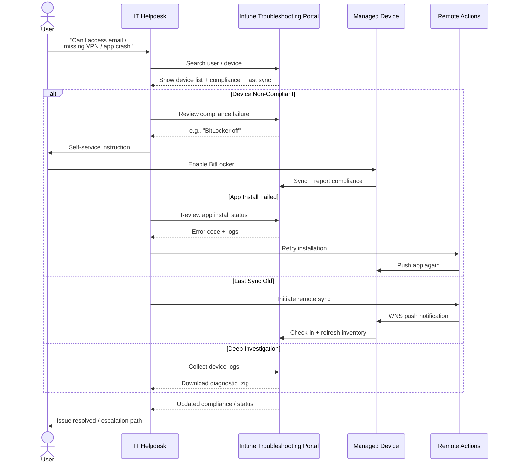

### Notes
**Key insight**: The **Troubleshooting + support blade** in Intune now shows per-app install status, per-policy error codes, and deep device logs. For Windows, you can remotely initiate **Collect diagnostics** which gathers Event Viewer logs, registry keys, and MDM diagnostic reports into a downloadable ZIP.

---

## Troubleshooting Conditional Access Sign-in Failures

Use this flow to isolate whether a Conditional Access failure is caused by user scope, app targeting, device state, risk, grant controls or session controls.

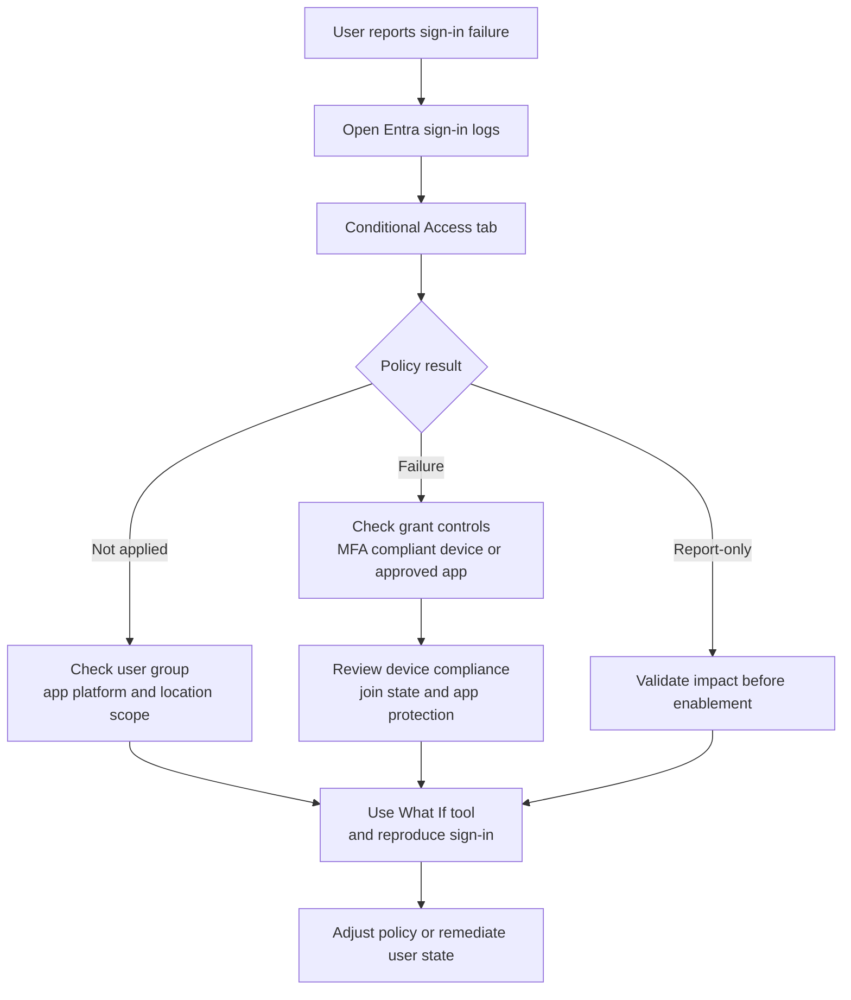

---

## Troubleshooting Copilot Content Exposure

When Copilot surfaces unexpected content, start with the user access path before applying search restrictions or data protection controls.

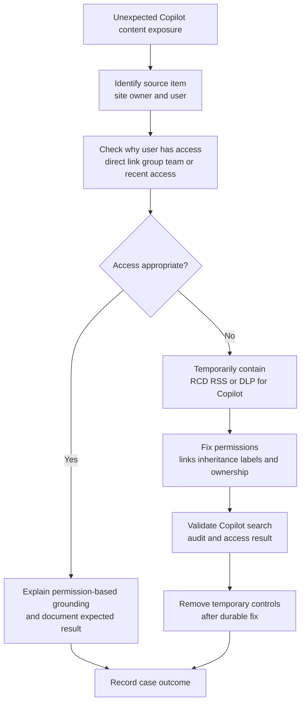

---

## Troubleshooting DLP False Positives

DLP false-positive triage should preserve evidence, identify the matched condition, validate classifier behaviour and tune rules without weakening protection.

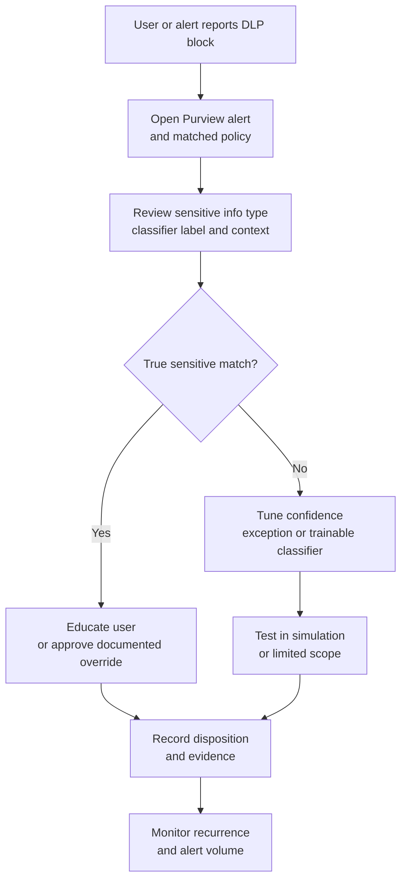

---

## Troubleshooting Teams Call Quality

Teams call quality troubleshooting requires narrowing the issue by user, network, device, client, meeting and PSTN path before applying fixes.

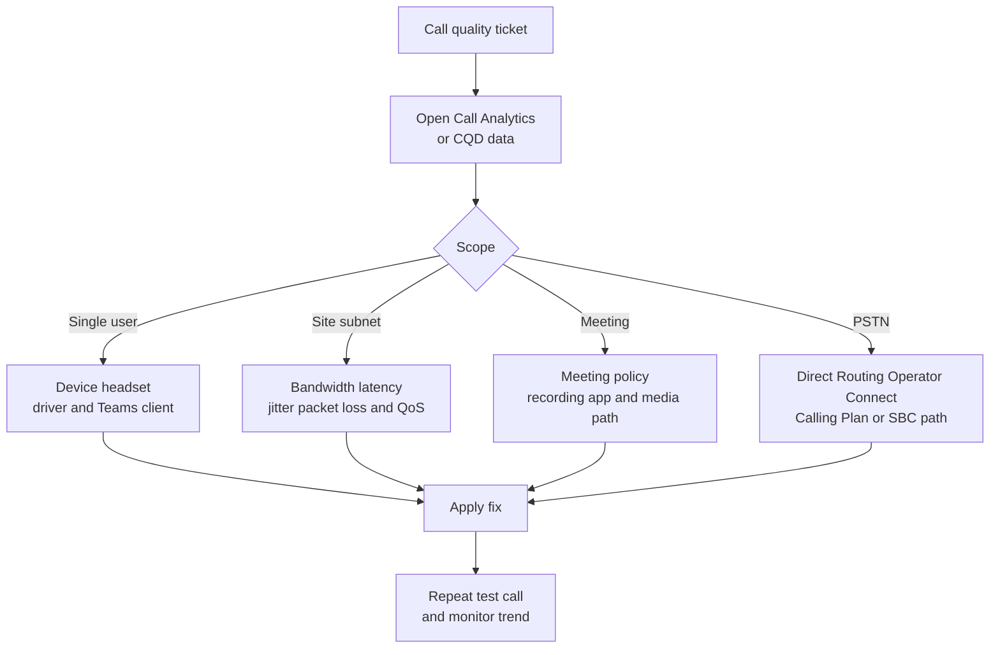

---

## Troubleshooting: Microsoft Entra Connect Sync Errors

Shows the investigation path and remediation decisions for Microsoft Entra Connect Sync errors in Microsoft 365 environments.

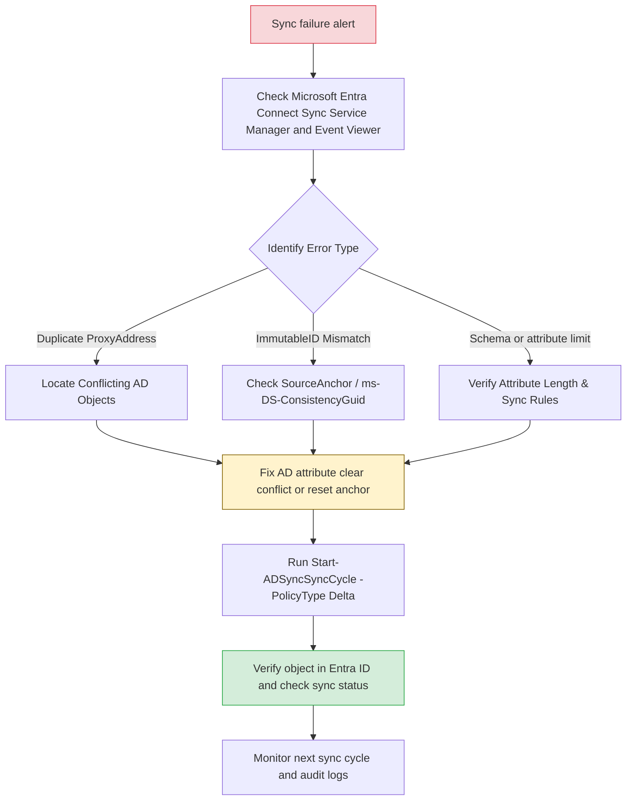

---

## Troubleshooting: Exchange NDRs and Mail Routing

Shows the investigation path and remediation decisions for troubleshooting: exchange ndrs and mail routing in Microsoft 365 environments.

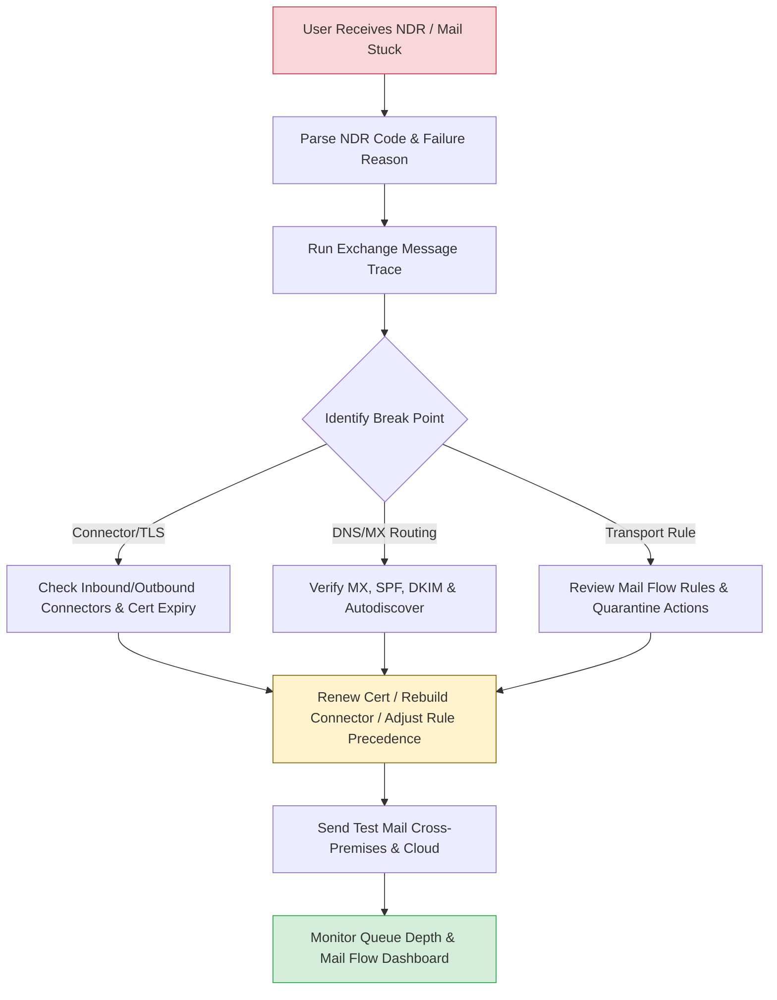

---

## Troubleshooting: Intune Enrollment and ESP Failures

Shows how to isolate Microsoft Intune enrolment, Autopilot, and Enrollment Status Page failures across identity, licence, platform, network, restriction, and policy causes.

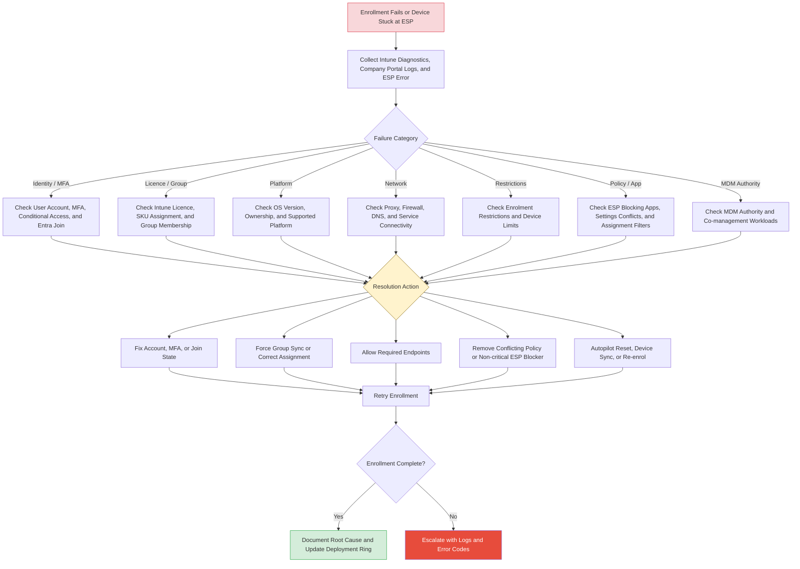

### Notes
This replaces the separate generic enrolment troubleshooting and Intune ESP troubleshooting diagrams. Start with diagnostics and error codes, then separate identity, licensing, platform, network, restrictions, policy conflicts, and MDM authority issues before retrying enrolment.

---

## Troubleshooting: MFA and Sign-In Loops

Shows the investigation path and remediation decisions for troubleshooting: mfa and sign-in loops in Microsoft 365 environments.

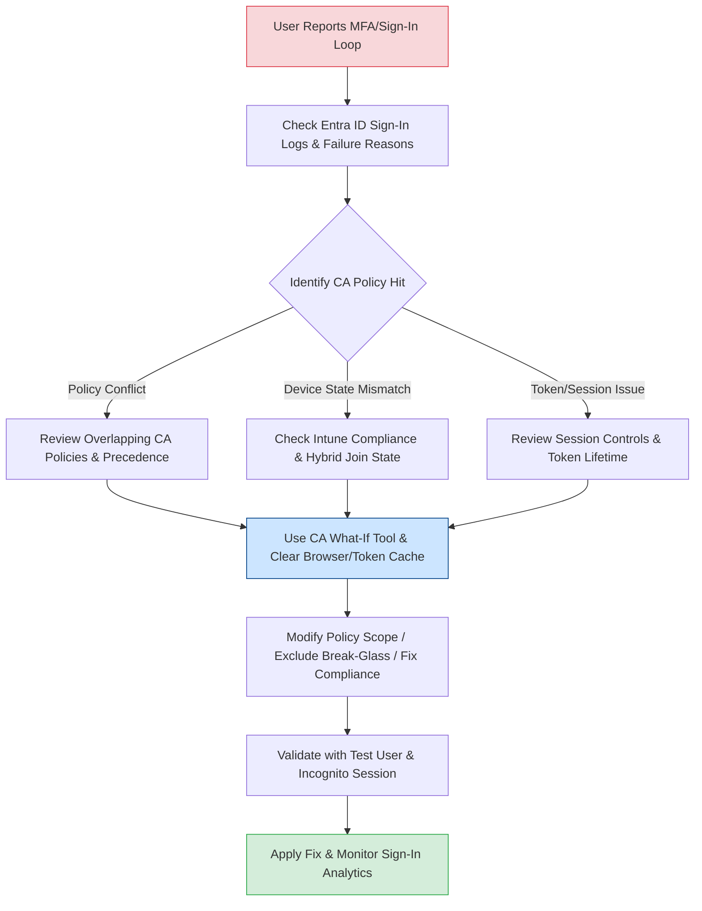

---

## Troubleshooting: SharePoint / OneDrive Sync Issues

Shows the investigation path and remediation decisions for troubleshooting: sharepoint / onedrive sync issues in Microsoft 365 environments.

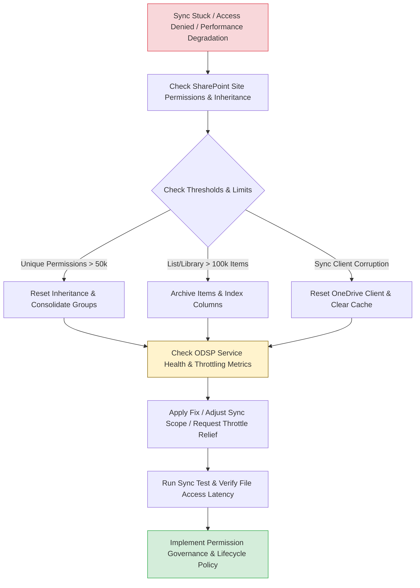

---

## Troubleshooting: Unexpected DLP Blocks

Shows the investigation path and remediation decisions for troubleshooting: unexpected dlp blocks in Microsoft 365 environments.

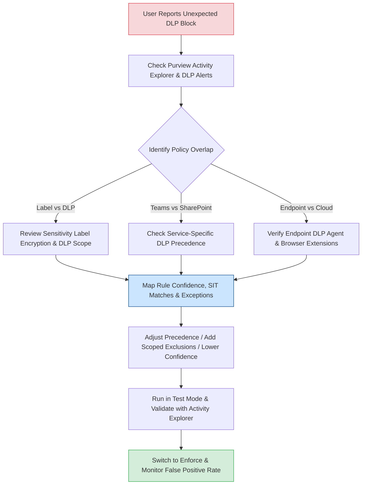
