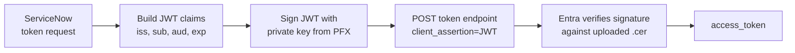

# Entra OAuth Certificate Authentication

How to authenticate a ServiceNow OAuth integration to an Entra-protected API (Microsoft Graph, Intune, any internal API registered in Entra) using a **certificate credential** instead of a client secret. ServiceNow signs a short-lived JWT assertion with the private key; Entra verifies it against the uploaded public certificate. Works with any `client_credentials` OAuth flow.

## Certificate vs client secret

Both credential types satisfy `client_credentials`. The tradeoffs:

| Aspect | Client secret | Certificate |
|---|---|---|
| **Setup effort** | Low — paste a string into ServiceNow | Moderate — generate, upload, configure a JWT Provider |
| **Rotation** | Manual cutover with a short overlap window at best | Overlap rotation with zero downtime (both credentials valid simultaneously) |
| **Exposure in exports** | Encrypted in `oauth_entity` XML exports, but the ciphertext is only as safe as the instance's encryption key | Private key never leaves ServiceNow — exports carry no reusable material |
| **Silent-expiry risk** | High — secrets expire with no warning | Same risk, but cert expiry is a structured date on a first-class record, easier to alert on |
| **Max lifetime** | 24 months (Entra cap) | 24 months is typical; can be longer per your PKI policy |
| **Compromise blast radius** | Secret leak = immediate token issuance by attacker | Key compromise requires the PFX + keystore password |
| **Auditability** | Secret key ID only | Cert thumbprint visible in sign-in logs |
| **Good default for** | Quick dev/test, low-sensitivity data, time-boxed POCs | Production, privileged Graph scopes (Directory, Device, Audit), anything regulated |

!!! tip "Rule of thumb"
    If the integration will outlive its first secret rotation, use a certificate. The one-time setup cost pays for itself the first time you rotate without downtime.

## At a glance



## 1. Prerequisites

- An existing Entra app registration with the API permissions you need (and admin consent granted)
- An existing ServiceNow OAuth Application Registry record and REST Message that currently use the app (even if just sketched out)
- Owner rights on the Entra app
- ServiceNow roles to create **Certificates** and **JWT Providers**
- Local machine with `openssl` available

## 2. Generate a certificate pair

Run locally. The public `.cer` goes to Entra; the `.pfx` (private + public) goes to ServiceNow.

``` bash title="generate-cert.sh"
openssl req -x509 -newkey rsa:2048 -sha256 -days 730 \
  -nodes -keyout snow-graph.key -out snow-graph.cer \
  -subj "/CN=snow-<your-integration-name>"

openssl pkcs12 -export -in snow-graph.cer -inkey snow-graph.key \
  -out snow-graph.pfx -name "snow-<your-integration-name>"
```

!!! tip "Record the expiry now"
    `-days 730` gives a 2-year certificate. Calendar-reminder the expiry **minus 30 days**. Cert expiries are silent failures — the integration will just start returning 401s.

!!! warning "Protect the PFX and key files"
    The `.pfx` and `.key` contain the private key. Transfer to ServiceNow over a secure channel, then delete local copies. Never commit them to a repository or paste them into chat tools.

## 3. Entra side

**App registration → Certificates & secrets → Certificates → Upload certificate** → select `snow-graph.cer`.

After upload, Entra displays the **Thumbprint** (SHA-1, hex). You don't paste it anywhere — ServiceNow derives it from the PFX and injects it into the JWT header automatically. Keep it handy for debugging signature mismatches.

!!! info "Keep the existing secret during cutover"
    An Entra app can hold multiple credentials simultaneously. Leave the old client secret in place while you test the cert. Only remove it once cert auth is confirmed working end-to-end.

## 4. ServiceNow side

### 4a. Upload the PFX

**System Definition → Certificates → New**

| Field | Value |
|---|---|
| Name | descriptive, e.g. `Entra - <integration name> (cert)` |
| Format | PKCS12 |
| Type | Java Key Store |
| PEM Certificate | *(attach `snow-graph.pfx`)* |
| Key store password | the PFX password you set in step 2 |

### 4b. Create a JWT Provider

**System OAuth → JWT Providers → New**

| Field | Value |
|---|---|
| Name | e.g. `Entra JWT - <integration name>` |
| Signing Key | the Certificate record from step 4a |
| Signing Algorithm | `RS256` |
| Signing Keystore Alias | the PFX friendly name from step 2 (`snow-<your-integration-name>`) |
| Signing Keystore Password | the PFX password |

Then open the **Standard JWT Claims** (or the JWT Claims template on the provider) and set:

| Claim | Value |
|---|---|
| `iss` | `<CLIENT_ID>` from the Entra app |
| `sub` | `<CLIENT_ID>` (same value as `iss`) |
| `aud` | `https://login.microsoftonline.com/<TENANT_ID>/oauth2/v2.0/token` |
| `jti` | auto-generated GUID (leave blank if ServiceNow auto-fills) |
| `nbf` | current timestamp |
| `exp` | current + **≤ 10 minutes** |

!!! danger "Expiry must be ≤ 10 minutes"
    Entra rejects client assertions where `exp − nbf > 10 minutes`. Longer lifetimes fail with `AADSTS700024`.

### 4c. Wire the JWT Provider to the OAuth entity

Open your existing OAuth Application Registry record:

- **JWT Provider**: the provider created in step 4b
- **Default grant type**: `Client Credentials` (unchanged)
- **Client Secret**: leave populated during testing; clear it once cert auth passes verification

## 5. Verify

Use the REST Message that already calls this Entra app. In **Scripts - Background**:

``` javascript title="smoke-test.js"
var rm = new sn_ws.RESTMessageV2('<Your REST Message name>', '<method name>');
var r = rm.execute();
gs.info(r.getStatusCode() + ' ' + r.getBody().substring(0, 500));
```

A `200` response means the JWT was accepted and the certificate chain validated. A `401` with `AADSTS…` in the body points at the troubleshooting table below.

## 6. Troubleshooting

| Error | Likely cause |
|---|---|
| `AADSTS700027: Client assertion contains an invalid signature` | PFX private key doesn't match the `.cer` uploaded to Entra, or wrong cert selected in the JWT Provider |
| `AADSTS50027: JWT token is invalid or malformed` | Claim format wrong — check `aud` is the tenant-specific token URL, not `/common/` |
| `AADSTS700024: Client assertion is not within its valid time range` | Instance clock skew, or `exp > nbf + 10 minutes` |
| `AADSTS700016: Application with identifier X was not found` | `iss` / `sub` don't match the Entra app's client ID |
| `AADSTS50012: Thumbprint does not match` | Uploaded cert in Entra doesn't match the one in the JWT header — re-upload the `.cer` |
| ServiceNow log: `No signing key found` | JWT Provider can't resolve the alias — check the PFX friendly name matches the Signing Keystore Alias field |
| ServiceNow log: `UnrecoverableKeyException` | Wrong keystore password on either the Certificate record or the JWT Provider |

## 7. Rotation procedure

The headline benefit of certificate auth is **overlap-based rotation with zero downtime**.

- [ ] Generate a new cert pair (step 2) at least 30 days before the current one expires
- [ ] Upload the new `.cer` to the Entra app — both certs now valid simultaneously
- [ ] Upload the new `.pfx` to ServiceNow as a **new** Certificate record
- [ ] Update the JWT Provider to point at the new Certificate record
- [ ] Run the smoke test — confirm `200` with the new cert
- [ ] Leave the old Certificate record and old Entra cert in place for at least 24 hours in case rollback is needed
- [ ] Delete the old cert from Entra
- [ ] Delete the old Certificate record from ServiceNow
- [ ] Calendar-reminder the next rotation based on the new cert's expiry

!!! tip "Automate the reminder"
    Put the cert's expiry date in the Certificate record's description or a custom field. Schedule a job that runs weekly and alerts when `expiry − now ≤ 30 days`.

*[JWT]: JSON Web Token
*[PFX]: Personal Information Exchange (PKCS#12 key+cert bundle)
*[CER]: Certificate file (public key only, DER or PEM-encoded)
*[OAuth]: Open Authorization
*[PKI]: Public Key Infrastructure
*[POC]: Proof of Concept
