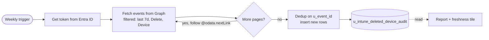

# Intune Deleted Devices Report

Imports Microsoft Intune managed-device delete events into a ServiceNow custom table on a schedule, and reports on them.

## At a glance



## 1. Prerequisites

- Entra ID tenant with rights to register apps and grant admin consent
- ServiceNow admin role (or scoped equivalent) to create OAuth records, REST messages, custom tables, scheduled jobs, and reports
- Custom table entitlement confirmed with your account team

## 2. Entra app registration

1. **New registration**, single-tenant (`AzureADMyOrg`). Name it identifiably, e.g. `svc-snow-intune-audit`.
2. **API permissions** → Microsoft Graph → Application permissions → `DeviceManagementManagedDevices.Read.All` → **Grant admin consent**.
3. **Certificates & secrets → Client secrets → New client secret**. Give it a descriptive name and record the expiry.

    !!! tip "Calendar the expiry"
        Put a reminder 30 days before the secret expires. A silent expiry will kill the job with no warning.

4. Capture: tenant ID, client ID, and the secret value (the secret is shown **once** — copy it immediately).

## 3. ServiceNow OAuth entity

**System OAuth → Application Registry → Connect to a third-party OAuth Provider**

| Field | Value |
|---|---|
| Name | `Microsoft Graph - Intune Audit` |
| Grant type | Client Credentials |
| Client ID | from Entra |
| Client Secret | from Entra |
| Token URL | `https://login.microsoftonline.com/<TENANT_ID>/oauth2/v2.0/token` |

!!! danger "AADSTS90014 — the classic gotcha"
    Add OAuth entity scope `https://graph.microsoft.com/.default` **and attach it to the OAuth profile record**, not only the standalone scope list. If authentication returns `AADSTS90014: The required field scope is missing`, the scope exists but is not attached to the profile ServiceNow is using.

## 4. REST Message

**System Web Services → Outbound → REST Message**

| Field | Value |
|---|---|
| Name | `Microsoft Graph - Intune Audit Events` |
| Endpoint | `https://graph.microsoft.com/v1.0/deviceManagement/auditEvents` |
| Authentication type | OAuth 2.0 |
| OAuth profile | profile from [the OAuth entity](#3-servicenow-oauth-entity) |

Then create the HTTP method:

| Field | Value |
|---|---|
| Method name | `get` |
| HTTP method | GET |
| Header: Name | `Accept` |
| Header: Value | `application/json` |

!!! warning "Header fields are separate"
    `Accept` and `application/json` go in **separate Name and Value fields**, not one combined field. Keep the endpoint as the base `auditEvents` URL only — the script adds filters dynamically.

## 5. Custom table

**System Definition → Tables → New**

!!! warning "Clear the Name field before typing"
    When you type the Label, ServiceNow auto-fills the Name field. **Clear the Name field completely** before typing the intended name, or type Name before Label. Appending to the auto-filled value produces malformed names like `u_intune_deleted_devicesu_intune_deleted_device_audit`.

- **Label**: `Intune Deleted Devices`
- **Name**: ==`u_intune_deleted_device_audit`==
- Create role `u_intune_deleted_devices_user` and set it as the required read role
- Enable **Audit** on the table

| Column | Type | Notes |
|---|---|---|
| `u_event_id` | String (100) | **Unique index** — used for dedup |
| `u_activity_date_time` | Date/Time | UTC. Must be Date/Time, not Date |
| `u_activity` | String (255) | e.g. `Delete ManagedDevice` |
| `u_actor_upn` | String (255) | PII — gate reads on the role above |
| `u_resource_name` | String (255) | Deleted device name when present |
| `u_resource_id` | String (100) | Fallback when name is blank |
| `u_raw_json` | Large String | Full event, kept for troubleshooting |
| `u_imported_on` | Date/Time | UTC |

## 6. Smoke test

**System Definition → Scripts - Background**

``` javascript title="smoke-test.js"
var rm = new sn_ws.RESTMessageV2('Microsoft Graph - Intune Audit Events', 'get');
var r = rm.execute();
gs.info(r.getStatusCode() + ' ' + r.getBody().substring(0, 500));
```

Expect `200` and a JSON body. Otherwise re-check the scope/profile linkage and that the REST message and method names match exactly.

## 7. Import script

Run in **Scripts - Background** first to verify, then place it in the [scheduled job](#8-scheduled-job).

???+ example "Full import script"

    ``` javascript title="import-intune-deletions.js" linenums="1"
    (function() {
        var sevenDaysAgo = new GlideDateTime();
        sevenDaysAgo.addDaysUTC(-7);
        var from = sevenDaysAgo.getValue().replace(' ', 'T') + 'Z';

        var filter = "activityDateTime ge " + from +
            " and activityOperationType eq 'Delete'" +
            " and category eq 'Device'";

        var totalReturned = 0;
        var inserted = 0;
        var skipped = 0;
        var pageCount = 0;
        var nextLink = null;

        do {
            var rm = new sn_ws.RESTMessageV2('Microsoft Graph - Intune Audit Events', 'get');
            if (nextLink) {
                rm.setEndpoint(nextLink);
            } else {
                rm.setQueryParameter('$filter', filter);
                rm.setQueryParameter('$top', '200');
            }

            var response = rm.execute();
            var status = response.getStatusCode();
            var body = response.getBody();
            pageCount++;

            if (status != 200) {
                gs.error('Intune audit pull failed. Page: ' + pageCount +
                    ' Status: ' + status + ' Body: ' + body);
                return;
            }

            var payload;
            try {
                payload = JSON.parse(body);
            } catch (e) {
                gs.error('Intune audit JSON parse failed on page ' + pageCount +
                    ': ' + e + ' Body: ' + body);
                return;
            }

            var events = payload.value || [];
            totalReturned += events.length;

            for (var i = 0; i < events.length; i++) {
                var ev = events[i];
                var component = (ev.componentName || '').toLowerCase();
                var resources = ev.resources || [];

                if (component !== 'manageddevices') {
                    skipped++;
                    continue;
                }

                var matchedResource = null;
                for (var r = 0; r < resources.length; r++) {
                    var res = resources[r];
                    var auditResourceType = (res.auditResourceType || '').toLowerCase();

                    if (auditResourceType.indexOf('manageddevice') > -1) {
                        matchedResource = res;
                        break;
                    }
                }

                if (!matchedResource) {
                    skipped++;
                    continue;
                }

                var gr = new GlideRecord('u_intune_deleted_device_audit');
                gr.addQuery('u_event_id', ev.id);
                gr.query();

                if (gr.next()) {
                    skipped++;
                    continue;
                }

                gr.initialize();
                gr.u_event_id = ev.id;

                var dt = ev.activityDateTime || '';
                if (dt) {
                    dt = dt.replace('T', ' ').replace(/\..*Z$/, '').replace('Z', '');
                    var gdt = new GlideDateTime();
                    gdt.setValue(dt);
                    gr.u_activity_date_time = gdt;
                }

                gr.u_activity = ev.displayName || ev.activityType || ev.activityOperationType || '';

                if (ev.actor) {
                    gr.u_actor_upn = ev.actor.userPrincipalName || '';
                }

                gr.u_resource_name = matchedResource.displayName || '';
                gr.u_raw_json = JSON.stringify(ev);
                gr.u_imported_on = gs.nowDateTime();
                gr.insert();
                inserted++;
            }

            nextLink = payload['@odata.nextLink'] || null;
        } while (nextLink);

        gs.info('Filter used: ' + filter);
        gs.info('Pages fetched: ' + pageCount);
        gs.info('Events returned: ' + totalReturned);
        gs.info('Inserted rows: ' + inserted);
        gs.info('Skipped rows: ' + skipped);
    })();
    ```

**What the script does:**

- Filters server-side for the last 7 days, `Delete` operations, `Device` category
- Confirms the event belongs to `ManagedDevices` client-side so non-managed-device events don't get imported
- Follows `@odata.nextLink` so responses larger than 200 rows aren't silently dropped
- Dedupes on `u_event_id`
- Uses `displayName ‖ activityType ‖ activityOperationType` because `activity` can be blank
- Converts the Graph timestamp so the Date/Time field stores the correct UTC time
- Catches JSON parse failures and logs them

!!! tip "Make it reusable"
    For long-term use, wrap the body in a **Script Include** (e.g. `IntuneAuditImporter` with a `run()` method) so the scheduled job is one line and the logic is testable.

!!! note "Window vs cadence"
    The script fetches the last 7 days and the job runs weekly, so the window and cadence are aligned exactly. If a single run fails and the next one doesn't happen until 7 days later, events that slid off the window are missed.

    Two ways to add a safety margin:

    === "Widen the window"

        Change `addDaysUTC(-7)` to `addDaysUTC(-8)` for a 1-day overlap. Dedup on `u_event_id` handles the duplicates.

    === "Last-run checkpoint"

        Use the [checkpoint approach](#10-production-hardening) — query from `lastRun − 1h` instead of a fixed window. More correct, slightly more code.

## 8. Scheduled job

**System Definition → Scheduled Jobs → New → Automatically run a script of your choosing.**

| Field | Value |
|---|---|
| Name | `Import Intune Deleted Devices` |
| Run | Weekly |
| Active | checked |
| Run as | dedicated integration user (not admin) |
| Script | `new IntuneAuditImporter().run();` or the full body of the [import script](#7-import-script) |

!!! danger "Do not use Process Mining"
    Pick **Automatically run a script of your choosing**, not the Process Mining job type. Process Mining is an unrelated ITOM feature and will not execute this code.

## 9. Report

**Reports → Create New**

- **Table**: `u_intune_deleted_device_audit`
- **Type**: List
- **Filter**: `u_activity_date_time on or after last 7 days`
- **Columns**: activity date time, activity, actor UPN, resource name

!!! tip "Freshness indicator"
    Add a second single-score or list report showing `max(u_imported_on)`. A report with zero rows could mean "no deletions last week" or "the import job is broken" — the freshness indicator distinguishes them. With a weekly cadence, a healthy freshness value is **< 8 days old**.

Optional: a bar chart grouped by `u_activity_date_time` by day for a deletions-per-day view.

## 10. Production hardening

Recommended before this becomes load-bearing.

!!! abstract "Checkpoint"
    Store the last successful run timestamp in `sys_properties` (e.g. `u.intune.audit.last_run_utc`) and query from `lastRun − 1h` instead of a fixed window. Smaller payloads, and a missed run can't silently drop events that slid off the window.

!!! abstract "Retry on 429 / 5xx"
    Honour the `Retry-After` header, exponential backoff, cap at 5 attempts.

!!! abstract "Failure alerting"
    On error, fire `gs.eventQueue('u.intune.audit.failed', ...)` and wire a notification to an inbox or Teams webhook. System logs alone are not monitoring.

!!! abstract "Run-log table"
    `u_intune_audit_run_log` with `started_at`, `finished_at`, `pages`, `returned`, `inserted`, `skipped`, `status`, `error`. Makes "did last week's run succeed?" a one-click answer.

!!! abstract "Retention"
    Scheduled cleanup that deletes rows older than your compliance window (commonly 1–2 years for audit data).

!!! abstract "Scoped app"
    Place the OAuth entity, REST message, table, script include, and scheduled job into a scoped application. Portable between instances, versioned, ACL-clean.

!!! abstract "Dedicated service user"
    Own all records and job execution under a named integration user with the minimum roles required.

## 11. Validation

Open `https://<instance>.service-now.com/u_intune_deleted_device_audit_list.do`.

Useful columns: activity date time, activity, actor UPN, resource name.

!!! info "Blank resource name"
    A blank `resource name` means the Graph audit event didn't include a `displayName` for that deletion. The row is still valid — check `u_raw_json` for context, or fall back to the resource ID.

## 12. Troubleshooting

| Symptom | Check |
|---|---|
| `AADSTS90014: required field scope is missing` | `.default` scope attached to the OAuth **profile**, not only the entity scope list |
| `REST message … cannot be found` | Exact name match between ServiceNow record and `new sn_ws.RESTMessageV2(...)` |
| `invalid table name` | `sys_db_object.name` matches the table name the script uses |
| 0 rows inserted | No matching deletions, or the event shape differs — inspect `u_raw_json` from a raw fetch |
| `u_activity` blank | Ensure the fallback `displayName ‖ activityType ‖ activityOperationType` is in place |
| Time shows midnight | `u_activity_date_time` must be Date/Time (not Date); use `setValue`, not `setDisplayValue` |
| Frequent 429s | Add retry/backoff — see [production hardening](#10-production-hardening) |
| Auth fails one day with no changes | Check the Entra client secret expiry |

## 13. Build order

- Entra app registration + permission + admin consent
- ServiceNow OAuth entity, with `.default` scope attached to the profile
- REST message and GET method
- Custom table and fields (**clear the Name field before typing**)
- Run the [smoke test](#6-smoke-test)
- Run the [import script](#7-import-script) in Scripts - Background
- Verify rows appear in the table
- Create the [scheduled job](#8-scheduled-job)
- Build the [report and freshness indicator](#9-report)
- File the [production hardening](#10-production-hardening) items as follow-up tickets

*[UPN]: User Principal Name
*[PII]: Personally Identifiable Information
*[PDI]: Personal Developer Instance
*[OAuth]: Open Authorization
*[REST]: Representational State Transfer
*[ACL]: Access Control List
