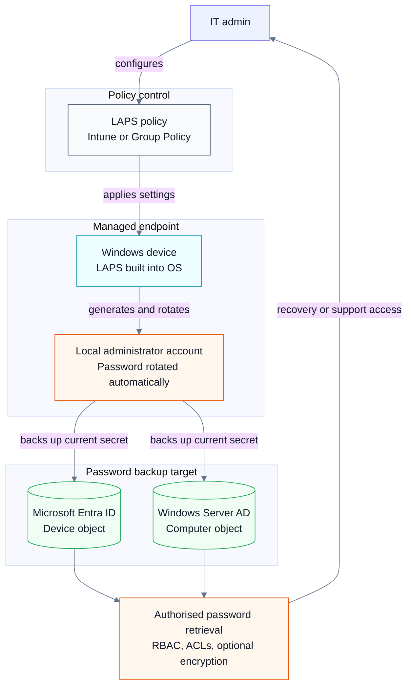

```mermaid
%%{init: {"theme":"base","themeVariables":{"fontFamily":"Segoe UI, Arial","background":"#ffffff","lineColor":"#64748b","primaryTextColor":"#111827"}}}%%
flowchart TD
    classDef actor fill:#eef2ff,stroke:#4f46e5,color:#111827
    classDef policy fill:#f8fafc,stroke:#475569,color:#111827
    classDef device fill:#ecfeff,stroke:#0891b2,color:#111827
    classDef directory fill:#f0fdf4,stroke:#16a34a,color:#111827
    classDef secure fill:#fff7ed,stroke:#ea580c,color:#111827

    admin["IT admin"]:::actor

    subgraph control["Policy control"]
        policy["LAPS policy<br/>Intune or Group Policy"]:::policy
    end

    subgraph endpoint["Managed endpoint"]
        device["Windows device<br/>LAPS built into OS"]:::device
        account["Local administrator account<br/>Password rotated automatically"]:::secure
    end

    subgraph storage["Password backup target"]
        entra[("Microsoft Entra ID<br/>Device object")]:::directory
        ad[("Windows Server AD<br/>Computer object")]:::directory
    end

    retrieval["Authorised password retrieval<br/>RBAC, ACLs, optional encryption"]:::secure

    admin -->|"configures"| policy
    policy -->|"applies settings"| device
    device -->|"generates and rotates"| account
    account -->|"backs up current secret"| entra
    account -->|"backs up current secret"| ad
    entra --> retrieval
    ad --> retrieval
    retrieval -->|"recovery or support access"| admin
```

