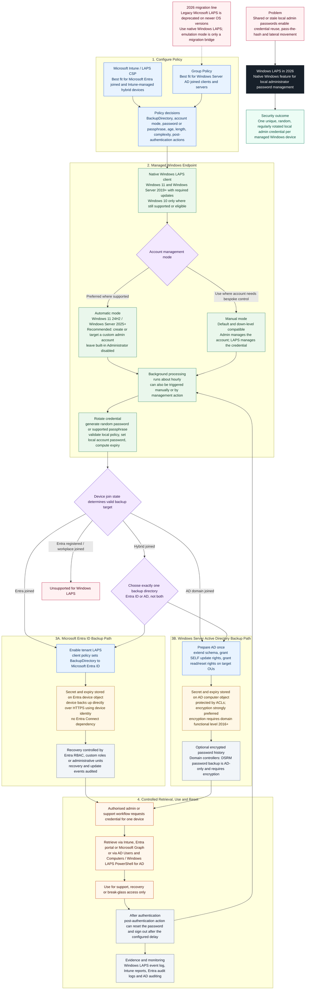

```mermaid
flowchart TB
    Problem["Problem<br/>Shared or stale local admin passwords enable credential reuse, pass-the-hash and lateral movement"]:::risk
    LAPS["Windows LAPS in 2026<br/>Native Windows feature for local administrator password management"]:::core
    Outcome["Security outcome<br/>One unique, random, regularly rotated local admin credential per managed Windows device"]:::safe

    Problem --> LAPS --> Outcome

    subgraph Configure["1. Configure Policy"]
        Intune["Microsoft Intune / LAPS CSP<br/>Best fit for Microsoft Entra joined and Intune-managed hybrid devices"]:::policy
        GPO["Group Policy<br/>Best fit for Windows Server AD joined clients and servers"]:::policy
        Policy["Policy decisions<br/>BackupDirectory, account mode, password or passphrase, age, length, complexity, post-authentication actions"]:::policy
    end

    Intune --> Policy
    GPO --> Policy

    subgraph Endpoint["2. Managed Windows Endpoint"]
        OS["Native Windows LAPS client<br/>Windows 11 and Windows Server 2019+ with required updates<br/>Windows 10 only where still supported or eligible"]:::device
        Mode{"Account management mode"}:::decision
        Auto["Automatic mode<br/>Windows 11 24H2 / Windows Server 2025+<br/>Recommended: create or target a custom admin account<br/>leave built-in Administrator disabled"]:::device
        Manual["Manual mode<br/>Default and down-level compatible<br/>Admin manages the account; LAPS manages the credential"]:::device
        Cycle["Background processing<br/>runs about hourly<br/>can also be triggered manually or by management action"]:::device
        Rotate["Rotate credential<br/>generate random password or supported passphrase<br/>validate local policy, set local account password, compute expiry"]:::device
    end

    Policy --> OS --> Mode
    Mode -->|"Preferred where supported"| Auto --> Cycle
    Mode -->|"Use where account needs bespoke control"| Manual --> Cycle
    Cycle --> Rotate

    Join{"Device join state determines valid backup target"}:::decision
    Rotate --> Join

    subgraph EntraPath["3A. Microsoft Entra ID Backup Path"]
        EntraSetup["Enable tenant LAPS<br/>client policy sets BackupDirectory to Microsoft Entra ID"]:::policy
        EntraStore["Secret and expiry stored on Entra device object<br/>device backs up directly over HTTPS using device identity<br/>no Entra Connect dependency"]:::store
        EntraProtect["Recovery controlled by Entra RBAC, custom roles or administrative units<br/>recovery and update events audited"]:::control
    end

    subgraph ADPath["3B. Windows Server Active Directory Backup Path"]
        ADPrep["Prepare AD once<br/>extend schema, grant SELF update rights, grant read/reset rights on target OUs"]:::policy
        ADStore["Secret and expiry stored on AD computer object<br/>protected by ACLs; encryption strongly preferred<br/>encryption requires domain functional level 2016+"]:::store
        ADExtra["Optional encrypted password history<br/>Domain controllers: DSRM password backup is AD-only and requires encryption"]:::control
    end

    Join -->|"Entra joined"| EntraSetup
    Join -->|"AD domain joined"| ADPrep
    Join -->|"Hybrid joined"| OneTarget{"Choose exactly one backup directory<br/>Entra ID or AD, not both"}:::decision
    OneTarget --> EntraSetup
    OneTarget --> ADPrep
    Join -->|"Entra registered / workplace joined"| Unsupported["Unsupported for Windows LAPS"]:::risk

    EntraSetup --> EntraStore --> EntraProtect
    ADPrep --> ADStore --> ADExtra

    subgraph Use["4. Controlled Retrieval, Use and Reset"]
        Request["Authorised admin or support workflow requests credential for one device"]:::admin
        Retrieve["Retrieve via Intune, Entra portal or Microsoft Graph<br/>or via AD Users and Computers / Windows LAPS PowerShell for AD"]:::admin
        UseOnce["Use for support, recovery or break-glass access only"]:::admin
        PostAuth["After authentication<br/>post-authentication action can reset the password and sign out after the configured delay"]:::control
        Evidence["Evidence and monitoring<br/>Windows LAPS event log, Intune reports, Entra audit logs and AD auditing"]:::control
    end

    EntraProtect --> Request
    ADExtra --> Request
    Request --> Retrieve --> UseOnce --> PostAuth --> Cycle
    PostAuth --> Evidence

    Legacy["2026 migration line<br/>Legacy Microsoft LAPS is deprecated on newer OS versions<br/>Use native Windows LAPS; emulation mode is only a migration bridge"]:::risk
    Legacy -.-> GPO

    classDef core fill:#17202a,stroke:#17202a,color:#ffffff;
    classDef risk fill:#fff1f2,stroke:#be123c,color:#4c0519;
    classDef safe fill:#ecfdf5,stroke:#047857,color:#064e3b;
    classDef policy fill:#e8f3ff,stroke:#2563eb,color:#0b2f5b;
    classDef device fill:#eaf7ec,stroke:#2f855a,color:#123b24;
    classDef decision fill:#f3e8ff,stroke:#805ad5,color:#2d164f;
    classDef store fill:#fff7e6,stroke:#b7791f,color:#4a2d00;
    classDef control fill:#f1f5f9,stroke:#64748b,color:#0f172a;
    classDef admin fill:#fff7ed,stroke:#c2410c,color:#431407;
```